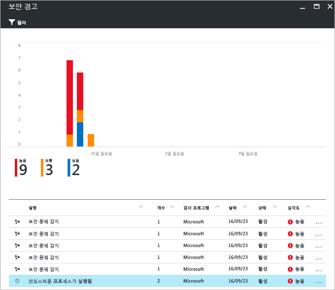
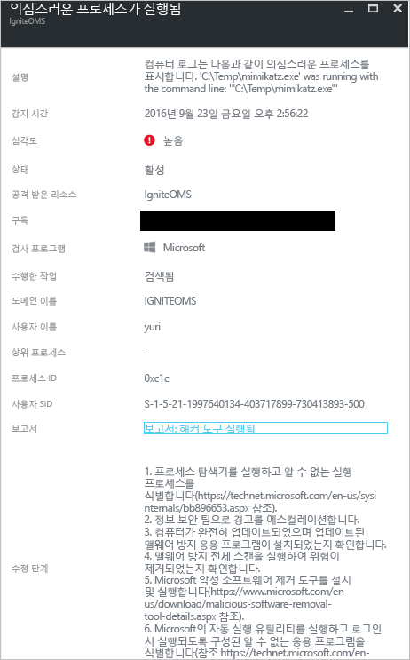

# Azure Security Center 위협 인텔리전스 보고서
이 문서에서는 Azure Security Center 위협 인텔리전스 보고서를 사용하여 보안 경고를 생성한 위협에 관한 자세한 정보를 확인하는 방식에 대해 설명합니다.

## 위협 인텔리전스 보고서란?
Security Center 위협 감지는 Azure 리소스, 네트워크 및 연결된 파트너 솔루션의 보안 정보를 모니터링함으로써 작동합니다. 위협을 식별하도록 종종 여러 소스의 정보를 상호 연결하는 이 정보를 분석합니다. 이 프로세스는 Security Center [감지 기능](security-center-detection-capabilities.md)의 일부입니다.

Security Center에서 위협을 식별하면 [보안 경고](security-center-managing-and-responding-alerts.md)를 트리거하며, 여기에는 수정 제안을 포함하여 특정 이벤트와 관련된 자세한 정보가 포함되어 있습니다. 인시던트 대응 팀이 위협을 조사하고 수정하도록 지원하기 위해 Security Center에는 아래와 같은 정보를 비롯하여 감지된 위협에 대한 정보가 포함된 위협 인텔리전스 보고서가 있습니다.

* 공격자의 ID 또는 연결(이 정보가 제공되는 경우)
* 공격자의 목표
* 현재 및 과거 공격 캠페인(이 정보가 제공되는 경우)
* 공격자의 전술, 도구 및 프로시저
* URL, 파일 해시 등 관련 IoC(보안 침해 지표)
* 피해자 유형(Azure 리소스가 위험한 상태에 있는지 결정하는 데 도움이 되는 산업적 유행 및 지리적 유행)
* 마이그레이션 및 수정 정보

> [!NOTE]
> 세부 수준이 맬웨어 활동 및 유행에 기반하기 때문에 특정 보고서의 정보 량은 다양하게 변합니다.
>
>

Security Center에는 세 가지 유형의 위협 보고서가 있는데 공격에 따라 달라질 수 있습니다. 제공되는 보고서는 다음과 같습니다.

* **그룹 활동 보고서** - 공격자 및 이들의 목표와 전술에 대해 자세히 설명합니다.
* **캠페인 보고서**: 특정 공격 캠페인의 세부 정보에 중점을 둡니다.
* **위협 요약 보고서**: 이전 두 보고서의 모든 항목을 포함하고 있습니다.

이러한 유형의 정보는 공격의 출처, 공격자의 동기 및 이 문제를 완화하기 위한 조치를 파악하기 위한 지속적인 조사가 있는 [인시던트 대응](security-center-incident-response.md) 프로세스에서 유용합니다.

## 어떻게 위협 인텔리전스 보고서에 액세스하는가?
**보안 경고** 타일을 확인하여 현재 경고를 검토할 수 있습니다. Azure Portal을 열고 다음 단계를 수행하여 각 경고에 대한 세부 정보를 확인합니다.

1. 보안 센터 대시보드에서 **보안 경고** 타일을 봅니다.
2. 해당 타일을 클릭하여 경고에 대한 자세한 정보를 포함한 **보안 경고** 블레이드를 연 다음 자세한 정보를 가져오려는 보안 경고를 클릭합니다.

    
3. 이 경우에 아래 그림에서 보여주듯이 **의심스러운 프로세스 실행** 블레이드에서 경고에 대한 세부 정보를 표시합니다.

    
4. 각 보안 경고에 제공되는 정보 량은 경고 유형에 따라 달라집니다. **보고서** 필드에는 위협 인텔리전스 보고서에 대한 링크가 있습니다. 해당 링크를 클릭하면 다른 브라우저 창에서 PDF 파일을 표시합니다.

   

여기서는 해당 보고서의 PDF 파일을 다운로드하여 감지된 보안 문제에 대해 자세히 파악하고 제공된 정보에 기반한 조치를 수행할 수 있습니다.

## 참고 항목
이 문서에서는 보안 경고에 대해 조사하는 중에 Azure Security Center 위협 인텔리전스 보고서를 사용 방법을 살펴보았습니다. Azure Security Center에 대한 자세한 내용은 다음을 참조하세요.

* [Azure Security Center FAQ](security-center-faq.md)로 설정합니다. 서비스 사용에 관한 질문과 대답을 찾습니다.
* [사고 대응에 Azure Security Center 활용](security-center-incident-response.md)
* [Azure Security Center 감지 기능](security-center-detection-capabilities.md)
* [Azure Security Center planning and operations guide](security-center-planning-and-operations-guide.md)로 설정합니다. 디자인 고려 사항을 계획하고 이해하여 Azure Security Center를 채택하는 방법을 알아봅니다.
* [Azure Security Center에서 보안 경고 관리 및 대응](security-center-managing-and-responding-alerts.md) 보안 경고를 관리하고 응답하는 방법을 알아봅니다.
* [Azure Security Center에서 보안 인시던트 처리](security-center-incident.md)
* [Azure 보안 블로그](https://blogs.msdn.com/b/azuresecurity/). Azure 보안 및 규정 준수에 관한 블로그 게시물을 찾습니다.
