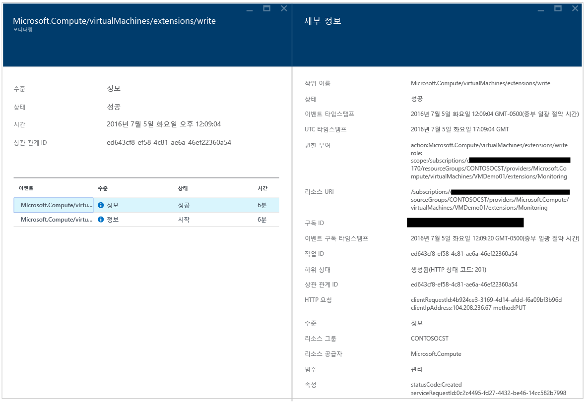
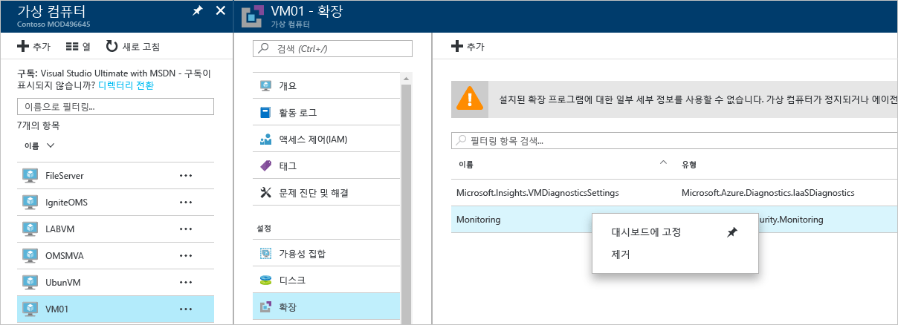

# Azure 보안 센터 문제 해결 가이드
이 가이드는 Azure Security Center를 사용 중인 정보 기술(IT) 전문가, 정보 보안 분석가 및 클라우드 관리자를 대상으로 하고 문제와 관련된 Security Center 문제를 해결해야 합니다.

## 문제 해결 가이드
이 가이드에서는 보안 센터 관련 문제를 해결하는 방법을 설명합니다. 보안 센터에서 수행되는 대부분의 문제 해결은 실패한 구성 요소에 대한 [감사 로그](https://azure.microsoft.com/updates/audit-logs-in-azure-preview-portal/) 기록을 먼저 확인하여 수행됩니다. 감사 로그를 통해 다음 사항을 확인할 수 있습니다.

* 수행된 작업
* 작업을 시작한 사람
* 작업이 발생한 시간
* 작업의 상태
* 작업을 조사하는 데 도움이 될 수 있는 기타 속성 값

감사 로그에는 리소스에서 수행된 모든 쓰기 작업(PUT, POST, DELETE)이 포함되지만 읽기 작업(GET)은 포함되지 않습니다.

## Windows에서 문제 해결 모니터링 에이전트 설치
보안 센터 모니터링 에이전트는 데이터 수집을 수행하는 데 사용됩니다. 데이터 수집을 활성화하고 에이전트가 대상 컴퓨터에 제대로 설치된 후 이러한 프로세스가 실행되어야 합니다.

* ASMAgentLauncher.exe - Azure 모니터링 에이전트 
* ASMMonitoringAgent.exe - Azure 보안 모니터링 확장
* ASMSoftwareScanner.exe – Azure 스캔 관리자

Azure 보안 모니터링 확장은 다양한 보안 관련 구성을 검색하고 가상 컴퓨터에서 보안 로그를 수집합니다. 스캔 관리자는 패치 스캐너로 사용됩니다.

설치가 성공적으로 수행되는 경우 대상 VM에 대한 감사 로그에 아래와 비슷한 항목이 표시됩니다.

*%systemdrive%\windowsazure\logs* (예: C:\WindowsAzure\Logs)에 있는 에이전트 로그를 참조하여 설치 프로세스에 대한 자세한 정보를 얻을 수도 있습니다.

> [!NOTE]
> Azure 보안 센터 에이전트가 오작동하는 경우 에이전트를 중지하고 시작하는 명령이 없기 때문에 대상 VM을 다시 시작해야 합니다.

데이터 수집에 여전히 문제가 있는 경우 다음 단계를 따라 에이전트를 제거할 수 있습니다.

1. **Azure Portal**에서 데이터 수집 문제가 있는 가상 컴퓨터를 선택하고 **확장**을 클릭합니다.
2. 마우스 오른쪽 단추로 **Microsoft.Azure.Security.Monitoring**클릭하고 **제거**를 클릭합니다.

Azure 보안 모니터링 확장은 몇 분 내에 자동으로 다시 설치됩니다.

## Linux에서 문제 해결 모니터링 에이전트 설치
Linux 시스템에 문제 해결 VM 에이전트를 설치할 때 확장이 /var/lib/waagent/에 다운로드되었는지 확인해야 합니다. 아래 명령을 실행하여 설치되었는지 확인할 수 있습니다.

`cat /var/log/waagent.log` 

문제 해결 목적으로 검토할 수 있는 다른 로그 파일은 다음과 같습니다. 

* /var/log/mdsd.err
* /var/log/azure/

작업 시스템에서 TCP 29130에 mdsd 프로세스에 대한 연결이 표시됩니다. 이는 mdsd 프로세스와 통신하는 syslog입니다. 아래 명령을 실행하여 이 동작을 확인할 수 있습니다.

`netstat -plantu | grep 29130`

## 제대로 작동하지 않는 끝점 보호 문제 해결

게스트 에이전트는 [Microsoft 맬웨어 방지 프로그램](../security/azure-security-antimalware.md) 확장에서 수행하는 모든 작업의 부모 프로세스입니다. 게스트 에이전트 프로세스가 실패하면 게스트 에이전트의 자식 프로세스로 실행되는 Microsoft 맬웨어 방지 프로그램도 실패할 수 있습니다.  이와 같은 경우 다음 옵션을 확인하는 것이 좋습니다.

- 대상 VM이 사용자 지정 이미지이고 VM 작성자가 게스트 에이전트를 설치하지 않은 경우.
- 대상이 Windows VM이 아니라 Linux VM이면 Linux VM에 Windows 버전의 맬웨어 방지 확장을 설치하는 작업이 실패합니다. Linux 게스트 에이전트는 OS 버전 및 필수 패키지에 대한 요구 사항이 있으며, 이러한 요구 사항이 충족되지 않으면 VM 에이전트가 작동하지 않습니다. 
- VM이 이전 버전의 게스트 에이전트를 사용하여 만들어진 경우. 이 경우 일부 오래된 에이전트는 자동으로 최신 버전으로 업데이트할 수 없으며 이로 인해 문제가 발생할 수 있습니다. 사용자 고유의 이미지를 만들 때에는 항상 최신 버전의 게스트 에이전트를 사용해야 합니다.
- 일부 타사 관리 소프트웨어는 게스트 에이전트를 사용하지 않도록 설정하거나 특정 파일 위치에 대한 액세스를 차단할 수 있습니다. VM에 타사 에이전트가 설치되어 있으면 해당 에이전트가 제외 목록에 있는지 확인합니다.
- 특정 방화벽 설정 또는 NSG(네트워크 보안 그룹)가 게스트 에이전트와 주고 받는 네트워크 트래픽을 차단할 수 있습니다.
- 특정 ACL(액세스 제어 목록)에서 디스크 액세스를 차단할 수 있습니다.
- 디스크 공간이 부족하여 게스트 에이전트가 제대로 작동하지 못할 수 있습니다. 

Microsoft 맬웨어 방지 프로그램 사용자 인터페이스는 기본적으로 사용하지 않도록 설정되며, 사용하도록 설정하는 방법에 대한 자세한 내용은 [배포 후 Azure Resource Manager에서 Microsoft 맬웨어 방지 프로그램 사용자 인터페이스를 사용하도록 설정](https://blogs.msdn.microsoft.com/azuresecurity/2016/03/09/enabling-microsoft-antimalware-user-interface-post-deployment/)을 참조하세요.

## 대시보드 로딩 문제 해결

Security Center 대시보드를 로드하는 문제가 있는 경우 Security Center에 구독을 등록하는 사용자(즉, 구독을 사용하여 Security Center를 연 첫 번째 사용자)와 데이터 수집을 켜려는 사용자가 구독의 *소유자* 또는 *참여자*인지 확인합니다. 또한 사용자는 이때부터 구독에서 *리더*를 사용하여 dashboard/alerts/recommendation/policy를 볼 수 있습니다.

## Microsoft 지원에 문의
이 문서에서 제공된 지침을 사용하여 몇 가지 문제를 식별할 수 있으며 그 외 문제는 보안 센터 공용 [포럼](https://social.msdn.microsoft.com/Forums/en-US/home?forum=AzureSecurityCenter)에 설명되어 있는 것을 찾을 수 있습니다. 그러나 추가로 문제 해결이 필요한 경우 아래와 같이 **Azure Portal**을 사용하여 새로운 지원 요청을 열 수 있습니다. 

## 참고 항목
이 문서에서는 Azure 보안 센터에서 보안 정책을 구성하는 방법을 배웠습니다. Azure 보안 센터에 대한 자세한 내용은 다음을 참조하세요.

* [Azure 보안 센터의 계획 및 운영 가이드](security-center-planning-and-operations-guide.md) — 디자인 고려 사항을 계획하고 이해하여 Azure 보안 센터를 채택하는 방법을 알아봅니다.
* [Azure 보안 센터에서 보안 상태 모니터링](security-center-monitoring.md) — Azure 리소스의 상태를 모니터링하는 방법을 알아봅니다.
* [Azure 보안 센터에서 보안 경고 관리 및 대응](security-center-managing-and-responding-alerts.md) — 보안 경고를 관리하고 대응하는 방법을 알아봅니다.
* [Azure 보안 센터를 사용하여 파트너 솔루션 모니터링](security-center-partner-solutions.md) — 파트너 솔루션의 상태를 모니터링하는 방법을 알아봅니다.
* [Azure 보안 센터 FAQ](security-center-faq.md) — 서비스 사용에 관한 질문과 대답을 찾습니다.
* [Azure 보안 블로그](http://blogs.msdn.com/b/azuresecurity/) — Azure 보안 및 규정 준수에 관한 블로그 게시물을 찾습니다.

