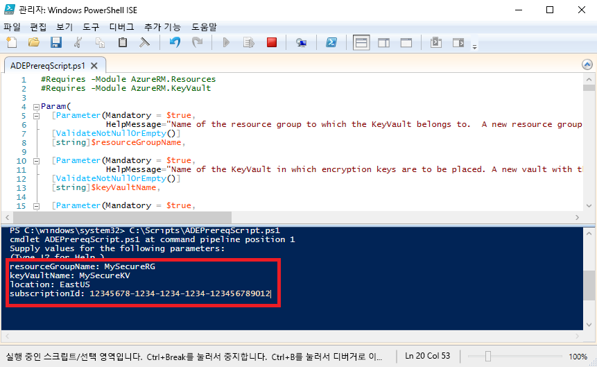

# <a name="quickstart-encrypt-a-windows-iaas-vm-with-azure-powershell"></a>빠른 시작: Azure PowerShell을 사용하여 Windows IaaS VM 암호화

Azure Disk Encryption을 사용하면 Windows 및 Linux IaaS 가상 머신 디스크를 암호화할 수 있습니다. 이 솔루션은 Azure Key Vault와 통합되어 디스크 암호화 키와 비밀을 제어하고 관리할 수 있습니다. Azure Disk Encryption을 사용하면 업계 표준 암호화 기술을 사용하여 미사용 VM을 안전하게 보호할 수 있습니다. 이 빠른 시작에서는 Windows Server 2016 VM을 만들고 OS 디스크를 암호화합니다.

Azure 구독이 아직 없는 경우 시작하기 전에 [체험 계정](https://azure.microsoft.com/free/?WT.mc_id=A261C142F)을 만듭니다.

## <a name="prerequisites"></a>필수 조건

- Windows PowerShell ISE
- [최신 버전의 Azure PowerShell](/powershell/azure/install-azurerm-ps)을 설치하거나 업데이트합니다.
    - AzureRM 모듈 버전은 6.0.0 이상이어야 합니다. `Get-Module AzureRM -ListAvailable | Select-Object -Property Name,Version,Path`
- [Azure Disk Encryption 필수 구성 요소 스크립트](https://raw.githubusercontent.com/Azure/azure-powershell/master/src/ResourceManager/Compute/Commands.Compute/Extension/AzureDiskEncryption/Scripts/AzureDiskEncryptionPreRequisiteSetup.ps1)의 복사본
    - 이 스크립트가 이미 있는 경우 최근에 변경된 새 복사본을 다운로드합니다. 
    - **CTRL-A**를 사용하여 모든 텍스트를 선택한 다음, **CTRL-C**를 사용하여 모든 텍스트를 메모장에 복사합니다.
    - 파일을 **ADEPrereqScript.ps1**로 저장합니다.


## <a name="sign-in-to-azure"></a>Azure에 로그인

1. 마우스 오른쪽 단추로 **Windows PowerShell ISE**를 클릭하고, **관리자 권한으로 실행**을 클릭합니다.
1. **관리자: Windows PowerShell ISE** 창에서 **보기**를 클릭하고 **스크립트 창 표시**를 클릭합니다.
1. 스크립트 창에서 다음 cmdlet을 입력합니다. 

     ```azurepowershell
      Connect-AzureRMAccount
     ```

1. **스크립트 실행**에 대한 녹색 화살표를 클릭하거나 F5 키를 사용합니다. 
2. 대화형 로그인을 사용하여 Azure 계정에 대한 연결을 완료합니다.
3. 다음 PowerShell 스크립트를 실행하는 데 사용하기 위해 반환되는 **구독 ID**를 복사합니다. 

## <a name="bkmk_PrereqScript"></a> Azure Disk Encryption 필수 구성 요소 스크립트 실행
 **ADEPrereqScript.ps1**은 리소스 그룹과 키 자격 증명 모음을 만들고, 키 자격 증명 모음 액세스 정책을 설정합니다. 또한 스크립트는 실수로 삭제되지 않도록 키 자격 증명 모음에 리소스 잠금을 만듭니다.  

1. **관리자: Windows PowerShell ISE** 창에서 **파일**을 클릭한 다음, **열기**를 클릭합니다. **ADEPrereqScript.ps1** 파일로 이동하고 해당 파일을 두 번 클릭합니다. 스크립트 창에서 스크립트가 열립니다.
2. **스크립트 실행**의 녹색 화살표를 클릭하거나 F5 키를 사용하여 스크립트를 실행합니다. 
3. 새 **리소스 그룹** 및 새 **키 자격 증명 모음**에 대한 이름을 입력합니다. 나중에 해당 리소스 그룹을 삭제하므로 이 빠른 시작에서 기존 리소스 그룹 또는 키 자격 증명 모음은 사용하지 마세요. 
4. **EastUS**와 같이 리소스를 만들려는 위치를 입력합니다. `Get-AzureRMLocation`을 사용하여 위치 목록을 가져옵니다.
5. **구독 ID**를 복사합니다. 구독 ID는 `Get-AzureRMSubscription`을 사용하여 가져올 수 있습니다.  
6. **스크립트 실행**에 대한 녹색 화살표를 클릭합니다. 
7. 나중에 사용하기 위해 반환된 **DiskEncryptionKeyVaultUrl** 및 **DiskEncryptionKeyVaultId**를 복사합니다.




## <a name="create-a-virtual-machine"></a>가상 머신 만들기 
이제 디스크를 암호화할 수 있도록 가상 머신을 만들어야 합니다. 이 스크립트는 8GB RAM과 30GB OS 디스크가 있는 Windows Server 2016 VM을 만듭니다. 

1. 스크립트를 **관리자: Windows PowerShell ISE** 스크립트 창에 복사하고 상위 세 개의 변수를 변경합니다. 리소스 그룹 및 위치는 [필수 구성 요소 스크립트](#bkmk_PrereqScript)에 사용한 것과 동일해야 합니다.  

   ```azurepowershell
    # Variables for common values
    $resourceGroup = "MySecureRG"
    $location = "EastUS"
    $vmName = "MySecureVM"
    
    # Create user object
    $cred = Get-Credential -Message "Enter a username and password for the virtual machine."
    
    # Create a resource group
    #New-AzureRmResourceGroup -Name $resourceGroup -Location $location
    
    # Create a subnet configuration
    $subnetConfig = New-AzureRmVirtualNetworkSubnetConfig -Name mySubnet -AddressPrefix 192.168.1.0/24
    
    # Create a virtual network
    $vnet = New-AzureRmVirtualNetwork -ResourceGroupName $resourceGroup -Location $location `
      -Name MYvNET -AddressPrefix 192.168.0.0/16 -Subnet $subnetConfig
    
    # Create a public IP address and specify a DNS name
    $pip = New-AzureRmPublicIpAddress -ResourceGroupName $resourceGroup -Location $location `
      -Name "mypublicdns$(Get-Random)" -AllocationMethod Static -IdleTimeoutInMinutes 4
    
    # Create an inbound network security group rule for port 3389
    $nsgRuleRDP = New-AzureRmNetworkSecurityRuleConfig -Name myNetworkSecurityGroupRuleRDP  -Protocol Tcp `
      -Direction Inbound -Priority 1000 -SourceAddressPrefix * -SourcePortRange * -DestinationAddressPrefix * `
      -DestinationPortRange 3389 -Access Allow
    
    # Create a network security group
    $nsg = New-AzureRmNetworkSecurityGroup -ResourceGroupName $resourceGroup -Location $location `
      -Name myNetworkSecurityGroup -SecurityRules $nsgRuleRDP
    
    # Create a virtual network card and associate with public IP address and NSG
    $nic = New-AzureRmNetworkInterface -Name myNic -ResourceGroupName $resourceGroup -Location $location `
      -SubnetId $vnet.Subnets[0].Id -PublicIpAddressId $pip.Id -NetworkSecurityGroupId $nsg.Id
    
    # Create a virtual machine configuration
    $vmConfig = New-AzureRmVMConfig -VMName $vmName -VMSize Standard_D2_v3 | `
    Set-AzureRmVMOperatingSystem -Windows -ComputerName $vmName -Credential $cred | `
    Set-AzureRmVMSourceImage -PublisherName MicrosoftWindowsServer -Offer WindowsServer -Skus 2016-Datacenter-smalldisk -Version latest | `
    Add-AzureRmVMNetworkInterface -Id $nic.Id
    
    # Create a virtual machine
    New-AzureRmVM -ResourceGroupName $resourceGroup -Location $location -VM $vmConfig
   ```

2. **스크립트 실행**에 대한 녹색 화살표를 클릭하여 VM을 빌드합니다.  


## <a name="encrypt-the-disk-of-the-vm"></a>VM 디스크 암호화
이제 키 자격 증명 모음 및 VM을 만들고 구성했으므로 **Set-AzureRmVmDiskEncryptionExtension** cmdlet을 사용하여 디스크를 암호화할 수 있습니다. 
 
1. 다음 cmdlet을 실행하여 VM의 디스크를 암호화합니다.

    ```azurepowershell
     Set-AzureRmVmDiskEncryptionExtension -ResourceGroupName "MySecureRG" -VMName "MySecureVM" `
     -DiskEncryptionKeyVaultId "<Returned by the prerequisites script>" -DiskEncryptionKeyVaultUrl "<Returned by the prerequisites script>"
     ```


1. 암호화가 완료되면 다음 cmdlet을 사용하여 디스크가 암호화되었는지 확인할 수 있습니다. 

     ```azurepowershell
     Get-AzureRmVmDiskEncryptionStatus -ResourceGroupName "MySecureRG" -VMName "MySecureVM"
     ```
    
    
## <a name="clean-up-resources"></a>리소스 정리
 **ADEPrereqScript.ps1**은 키 자격 증명 모음에 리소스 잠금을 만듭니다. 이 빠른 시작의 리소스를 정리하려면 먼저 리소스 잠금을 제거한 다음, 해당 리소스 그룹을 삭제해야 합니다. 

1. 키 자격 증명 모음에서 리소스 잠금을 제거합니다.

     ```azurepowershell
     $LockId =(Get-AzureRMResourceLock -ResourceGroupName "MySecureRG" -ResourceName "MySecureVault" -ResourceType "Microsoft.KeyVault/vaults").LockID 
     Remove-AzureRmResourceLock -LockID $LockId
      ```
    
2. 리소스 그룹을 제거합니다. 이렇게 하면 그룹의 모든 리소스도 삭제됩니다. 
     ```azurepowershell
      Remove-AzureRmResourceGroup -Name "MySecureRG"
      ```

## <a name="next-steps"></a>다음 단계
IaaS VM용 Azure Disk Encryption 필수 구성 요소에 대해 자세히 알아보려면 다음 문서로 계속 진행하세요.

> [!div class="nextstepaction"]
> [Azure Disk Encryption 필수 구성 요소](azure-security-disk-encryption-prerequisites.md)