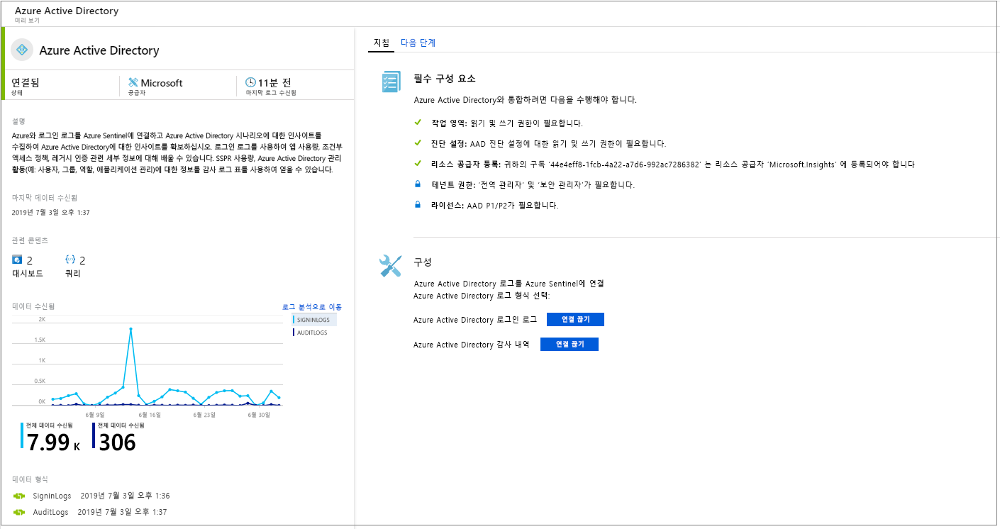
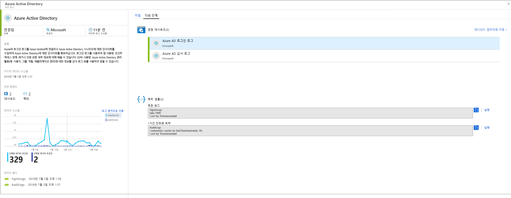

# 데이터 원본 연결

Azure Sentinel을 온보딩하려면 먼저 데이터 원본에 연결해야 합니다. Azure Sentinel에는 즉시 사용 가능하고 실시간 통합을 제공하는 Microsoft 솔루션(Microsoft Threat Protection 솔루션 포함) 및 Microsoft 365 원본(Office 365, Azure AD, Azure ATP 및 Microsoft Cloud App Security 등)에 대한 다양한 커넥터가 포함되어 있습니다. 또한 타사 솔루션에 대한 광범위한 보안 에코시스템에 기본 제공 커넥터도 제공됩니다. 일반적인 이벤트 형식, Syslog 또는 REST API를 사용하여 Azure Sentinel에 데이터 원본을 연결할 수도 있습니다.  

1. 메뉴에서 **데이터 커넥터**를 선택합니다. 이 페이지를 통해 Azure Sentinel에서 제공하는 커넥터의 전체 목록 및 해당 상태를 확인할 수 있습니다. 연결하려는 커넥터를 선택하고 **커넥터 페이지 열기**를 선택합니다. 

   

1. 특정 커넥터 페이지에서 모든 필수 구성 요소를 충족했는지 확인하고 지침을 따라 Azure Sentinel에 데이터를 연결합니다. 로그와 Azure Sentinel의 동기화를 시작하는 데 약간의 시간이 걸릴 수 있습니다. 연결한 후 **받은 데이터**에 데이터의 요약 및 데이터 형식의 연결 상태가 표시됩니다.

   
  
1. **다음 단계** 탭을 클릭하여 특정 데이터 형식에 대해 Azure Sentinel에서 제공하는 기본 제공 콘텐츠의 목록을 가져옵니다.

   
 

## 데이터 연결 메서드

Azure Sentinel에서는 다음 데이터 연결 방법이 지원됩니다.

- **서비스 간 통합**:  AWS 및 Microsoft 서비스와 같은 일부 서비스는 기본적으로 연결되어 있으며, 이러한 서비스는 기본 통합을 위한 Azure 토대를 활용합니다. 다음 솔루션은 클릭 몇 번으로 연결할 수 있습니다.
    - [Amazon Web Services - CloudTrail](connect-aws.md)
    - [Azure 활동](connect-azure-activity.md)
    - [Azure AD 감사 로그 및 로그인](connect-azure-active-directory.md)
    - [Azure AD ID 보호](connect-azure-ad-Identity-protection.md)
    - [Azure Advanced Threat Protection](connect-azure-atp.md)
    - [Azure Information Protection](connect-azure-information-protection.md)
    - [Azure Security Center](connect-azure-security-center.md)
    - [Cloud App Security](connect-cloud-app-security.md)
    - [도메인 이름 서버](connect-dns.md)
    - [Office 365](connect-office-365.md)
    - [Microsoft Defender ATP](connect-microsoft-defender-advanced-threat-protection.md)
    - [Microsoft 웹 애플리케이션 방화벽](connect-microsoft-waf.md)
    - [Windows 방화벽](connect-windows-firewall.md)
    - [Windows 보안 이벤트](connect-windows-security-events.md)

- **API를 통한 외부 솔루션**: 일부 데이터 원본은 연결된 데이터 원본에서 제공하는 API를 사용하여 연결됩니다. 일반적으로 대부분의 보안 기술은 이벤트 로그에 검색할 수 있는 API 세트를 제공합니다. 이러한 API는 Azure Sentinel에 연결되며, 특정 데이터 형식을 수집한 후 Azure Log Analytics로 보냅니다. API를 통해 연결되는 어플라이언스는 다음과 같습니다.
    - [Barracuda](connect-barracuda.md)
    - [Barracuda CloudGen Firewall](connect-barracuda-cloudgen-firewall.md)
    - [Citrix Analytics(보안)](connect-citrix-analytics.md)
    - [F5 BIG-IP](connect-f5-big-ip.md)
    - [Forcepoint DLP](connect-forcepoint-dlp.md)
    - [Squadra Technologies secRMM](connect-squadra-secrmm.md)
    - [Symantec ICDX](connect-symantec.md)
    - [Zimperium](connect-zimperium-mtd.md)

- **에이전트를 통한 외부 솔루션**: Azure Sentinel은 에이전트를 통해 Syslog 프로토콜을 사용하여 실시간 로그 스트리밍을 수행할 수 있는 다른 모든 데이터 원본에 연결할 수 있습니다.  대부분의 어플라이언스는 Syslog 프로토콜을 사용하여 로그 자체 및 로그에 대한 데이터를 포함하는 이벤트 메시지를 보냅니다. 로그의 형식은 다양하지만, 대부분의 어플라이언스는 로그 데이터를 위한 CEF(일반 이벤트 형식) 기반 형식을 지원합니다.  Log Analytics 에이전트를 기준으로 하는 Azure Sentinel 에이전트는 CEF 형식 로그를 Log Analytics에서 수집할 수 있는 형식으로 변환합니다. 어플라이언스 유형에 따라 에이전트가 어플라이언스에 직접 설치되거나 전용 Linux 서버에 설치됩니다. Linux용 에이전트는 UDP를 통해 Syslog 디먼에서 이벤트를 수신하지만, Linux 머신이 대량의 Syslog 이벤트를 수집할 것으로 예상대는 경우, TCP를 통해 Syslog 디먼에서 에이전트로, 에이전트에서 Log Analytics로 전송됩니다.
    - 방화벽, 프록시 및 엔드포인트:
        - [Check Point](connect-checkpoint.md)
        - [Cisco ASA](connect-cisco.md)
        - [ExtraHop Reveal(x)](connect-extrahop.md)
        - [F5](connect-f5.md)
        - [Forcepoint 제품](connect-forcepoint-casb-ngfw.md)
        - [Fortinet](connect-fortinet.md)
        - [Palo Alto Networks](connect-paloalto.md)
        - [One Identity Safeguard](connect-one-identity.md)
        - [기타 CEF 어플라이언스](connect-common-event-format.md)
        - [기타 Syslog 어플라이언스](connect-syslog.md)
        - [Trend Micro Deep Security](connect-trend-micro.md)
        - [Zscaler](connect-zscaler.md)
    - DLP 솔루션
    - [위협 인텔리전스 공급자](connect-threat-intelligence.md)
    - [DNS 컴퓨터](connect-dns.md) - 에이전트가 DNS 컴퓨터에 직접 설치됨
    - Linux 서버
    - 기타 클라우드
    
## 에이전트 연결 옵션

외부 어플라이언스를 Azure Sentinel에 연결하려면 어플라이언스와 Azure Sentinel 간의 통신을 지원하도록 에이전트를 전용 컴퓨터(VM 또는 온-프레미스)에 배포해야 합니다. 자동 또는 수동으로 에이전트를 배포할 수 있습니다. 자동 배포는 전용 컴퓨터가 Azure에서 만드는 새 VM인 경우에만 사용할 수 있습니다. 

또는 에이전트를 기존 Azure VM, 다른 클라우드의 VM 또는 온-프레미스 컴퓨터에서 수동으로 배포할 수 있습니다.

## Azure Sentinel 연결 옵션을 사용하여 데이터 형식 매핑

| **데이터 형식** | **연결 방법** | **데이터 커넥터?** | **설명** |
|------|---------|-------------|------|
| AWSCloudTrail | [AWS 연결](connect-aws.md) | V | |
| AzureActivity | [Azure 활동 연결](connect-azure-activity.md) 및 [활동 로그 개요](../azure-monitor/platform/platform-logs-overview.md)| V | |
| AuditLogs | [Azure AD 연결](connect-azure-active-directory.md)  | V | |
| SigninLogs | [Azure AD 연결](connect-azure-active-directory.md)  | V | |
| AzureFirewall |[Azure Diagnostics](../firewall/tutorial-diagnostics.md) | V | |
| InformationProtectionLogs_CL  | [Azure Information Protection 보고서](https://docs.microsoft.com/azure/information-protection/reports-aip) [Azure Information Protection 연결](connect-azure-information-protection.md)  | V | 일반적으로 데이터 형식 외에도 **InformationProtectionEvents** 함수를 사용합니다. 자세한 내용은 [보고서를 수정하고 사용자 지정 쿼리를 만드는 방법](https://docs.microsoft.com/azure/information-protection/reports-aip#how-to-modify-the-reports-and-create-custom-queries)을 참조하세요.|
| AzureNetworkAnalytics_CL  | [트래픽 분석 스키마](../network-watcher/traffic-analytics.md) [트래픽 분석](../network-watcher/traffic-analytics.md)  | | |
| CommonSecurityLog  | [CEF 연결](connect-common-event-format.md)  | V | |
| OfficeActivity | [Office 365 연결](connect-office-365.md) | V | |
| SecurityEvents | [Windows 보안 이벤트 연결](connect-windows-security-events.md)  | V | 안전하지 않은 프로토콜 통합 문서는 [안전하지 않은 프로토콜 통합 문서 설정](/azure/sentinel/quickstart-get-visibility#use-built-in-workbooks)을 참조하세요.  |
| syslog | [Syslog 연결](connect-syslog.md) | V | |
| Microsoft WAF(웹 애플리케이션 방화벽) - (AzureDiagnostics) |[Microsoft 웹 애플리케이션 방화벽 연결](connect-microsoft-waf.md) | V | |
| SymantecICDx_CL | [Symantec 연결](connect-symantec.md) | V | |
| ThreatIntelligenceIndicator  | [위협 인텔리전스 연결](connect-threat-intelligence.md)  | V | |
| VMConnection   ServiceMapComputer_CL  ServiceMapProcess_CL|  [Azure Monitor 서비스 맵](../azure-monitor/insights/service-map.md) [Azure Monitor VM 인사이트 온보딩](../azure-monitor/insights/vminsights-onboard.md)   [Azure Monitor VM 인사이트 사용](../azure-monitor/insights/vminsights-enable-overview.md)   [단일 VM 온보딩 사용](../azure-monitor/insights/vminsights-enable-single-vm.md)   [정책을 통해 온보딩 사용](../azure-monitor/insights/vminsights-enable-at-scale-policy.md)| X | VM 인사이트 통합 문서  |
| DnsEvents | [DNS 연결](connect-dns.md) | V | |
| W3CIISLog | [IIS 로그 연결](../azure-monitor/platform/data-sources-iis-logs.md)  | X | |
| WireData | [실시간 데이터 연결](../azure-monitor/insights/wire-data.md) | X | |
| WindowsFirewall | [Windows 방화벽 연결](connect-windows-firewall.md) | V | |
| AADIP SecurityAlert  | [Azure AD ID 보호 연결](connect-azure-ad-identity-protection.md)  | V | |
| AATP SecurityAlert  | [Azure ATP 연결](connect-azure-atp.md) | V | |
| ASC SecurityAlert  | [Azure Security Center 연결](connect-azure-security-center.md)  | V | |
| MCAS SecurityAlert  | [Microsoft Cloud App Security 연결](connect-cloud-app-security.md)  | V | |
| SecurityAlert | | | |
| Sysmon(이벤트) | [Sysmon 연결](https://azure.microsoft.com/blog/detecting-in-memory-attacks-with-sysmon-and-azure-security-center)  [Windows 이벤트 연결](../azure-monitor/platform/data-sources-windows-events.md)   [Sysmon Parser 가져오기](https://github.com/Azure/Azure-Sentinel/blob/master/Parsers/Sysmon/Sysmon-v10.42-Parser.txt)| X | Sysmon 컬렉션은 가상 머신에 기본적으로 설치되지 않습니다. Sysmon 에이전트를 설치하는 방법에 대한 자세한 내용은 [Sysmon](https://docs.microsoft.com/sysinternals/downloads/sysmon)을 참조하세요. |
| ConfigurationData  | [VM 인벤토리 자동화](../automation/automation-vm-inventory.md)| X | |
| ConfigurationChange  | [VM 추적 자동화](../automation/change-tracking.md) | X | |
| F5 BIG-IP | [F5 BIG-IP 연결](https://devcentral.f5.com/s/articles/Integrating-the-F5-BIGIP-with-Azure-Sentinel)  | X | |
| McasShadowItReporting  |  | X | |
| Barracuda_CL | [Barracuda 연결](connect-barracuda.md) | V | |

## 다음 단계

- Azure Sentinel을 시작하려면 Microsoft Azure에 대한 구독이 필요합니다. 구독이 없는 경우 [무료 평가판](https://azure.microsoft.com/free/)을 등록할 수 있습니다.
- [Azure Sentinel에 데이터를 등록](quickstart-onboard.md)하고 [데이터 및 잠재적 위협을 표시](quickstart-get-visibility.md)하는 방법에 대해 알아봅니다.
