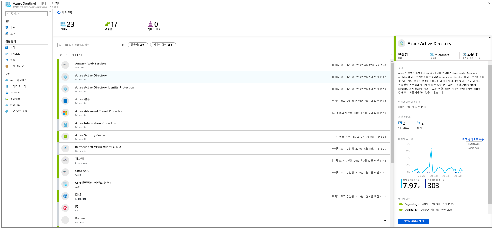
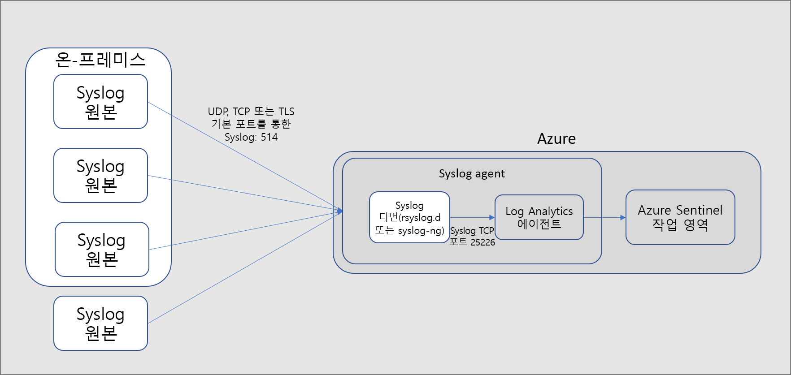
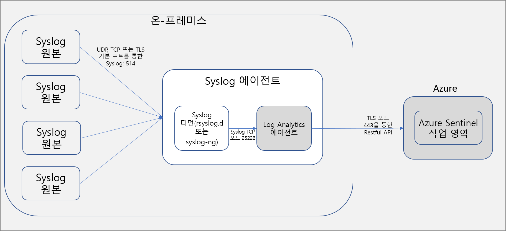

# 데이터 원본 연결

> [!IMPORTANT]
> Azure Sentinel은 현재 공개 미리 보기로 제공됩니다.
> 이 미리 보기 버전은 서비스 수준 계약 없이 제공되며 프로덕션 워크로드에는 사용하지 않는 것이 좋습니다. 특정 기능이 지원되지 않거나 기능이 제한될 수 있습니다. 자세한 내용은 [Microsoft Azure Preview에 대한 추가 사용 약관](https://azure.microsoft.com/support/legal/preview-supplemental-terms/)을 참조하세요.

Azure Sentinel을 온보딩하려면 먼저 데이터 원본에 연결해야 합니다. Azure Sentinel에는 즉시 사용 가능하고 실시간 통합을 제공하는 Microsoft 솔루션(Microsoft Threat Protection 솔루션 포함) 및 Microsoft 365 원본(Office 365, Azure AD, Azure ATP 및 Microsoft Cloud App Security 등)에 대한 다양한 커넥터가 포함되어 있습니다. 또한 타사 솔루션에 대한 광범위한 보안 에코시스템에 기본 제공 커넥터도 제공됩니다. 일반적인 이벤트 형식, Syslog 또는 REST API를 사용하여 Azure Sentinel에 데이터 원본을 연결할 수도 있습니다.  

## 데이터 연결 메서드

Azure Sentinel에서는 다음 데이터 연결 방법이 지원됩니다.

- **Microsoft 서비스**:  Microsoft 서비스는 기본적으로 연결되어 있으며, 기본 통합을 위한 Azure 토대를 활용합니다. 다음 솔루션은 클릭 몇 번으로 연결할 수 있습니다.
    - [Office 365](connect-office-365.md)
    - [Azure AD 감사 로그 및 로그인](connect-azure-active-directory.md)
    - [Azure 활동](connect-azure-activity.md)
    - [Azure AD ID 보호](connect-azure-ad-Identity-protection.md)
    - [Azure Security Center](connect-azure-security-center.md)
    - [Azure Information Protection](connect-azure-information-protection.md)
    - [Azure Advanced Threat Protection](connect-azure-atp.md)
    - [Cloud App Security](connect-cloud-app-security.md)
    - [Windows 보안 이벤트](connect-windows-security-events.md) 
    - [Windows 방화벽](connect-windows-firewall.md)

- **API를 통한 외부 솔루션**: 일부 데이터 원본은 연결된 데이터 원본에서 제공하는 API를 사용하여 연결됩니다. 일반적으로 대부분의 보안 기술은 이벤트 로그에 검색할 수 있는 API 세트를 제공합니다. 이러한 API는 Azure Sentinel에 연결되며, 특정 데이터 형식을 수집한 후 Azure Log Analytics로 보냅니다. API를 통해 연결되는 어플라이언스는 다음과 같습니다.
    - [Barracuda](connect-barracuda.md)
    - [Symantec](connect-symantec.md)
- **에이전트를 통한 외부 솔루션**: Azure Sentinel은 에이전트를 통해 Syslog 프로토콜을 사용하여 실시간 로그 스트리밍을 수행할 수 있는 다른 모든 데이터 원본에 연결할 수 있습니다.  대부분의 어플라이언스는 Syslog 프로토콜을 사용하여 로그 자체 및 로그에 대한 데이터를 포함하는 이벤트 메시지를 보냅니다. 로그의 형식은 다양하지만, 대부분의 어플라이언스는 CEF(일반 이벤트 형식) 표준을 지원합니다.  Microsoft Monitoring Agent를 기반으로 하는 Azure Sentinel 에이전트는 CEF 형식 로그를 Log Analytics에서 수집할 수 있는 형식으로 변환합니다. 어플라이언스 유형에 따라 에이전트가 어플라이언스에 직접 설치되거나 전용 Linux 서버에 설치됩니다. Linux용 에이전트는 UDP를 통해 Syslog 디먼에서 이벤트를 수신하지만, Linux 머신이 대량의 Syslog 이벤트를 수집해야 하는 경우 TCP를 통해 Syslog 디먼에서 에이전트로, 에이전트에서 Log Analytics로 전송됩니다.
    - 방화벽, 프록시 및 엔드포인트:
        - [F5](connect-f5.md)
        - [Check Point](connect-checkpoint.md)
        - [Cisco ASA](connect-cisco.md)
        - [Fortinet](connect-fortinet.md)
        - [Palo Alto](connect-paloalto.md)
        - [기타 CEF 어플라이언스](connect-common-event-format.md)
        - [기타 Syslog 어플라이언스](connect-syslog.md)
    - DLP 솔루션
    - [위협 인텔리전스 공급자](connect-threat-intelligence.md)
    - [DNS 컴퓨터](connect-dns.md) - 에이전트가 DNS 컴퓨터에 직접 설치됨
    - Linux 서버
    - 기타 클라우드
    
## 에이전트 연결 옵션

외부 어플라이언스를 Azure Sentinel에 연결하려면 어플라이언스와 Azure Sentinel 간의 통신을 지원하도록 에이전트를 전용 컴퓨터(VM 또는 온-프레미스)에 배포해야 합니다. 자동 또는 수동으로 에이전트를 배포할 수 있습니다. 자동 배포는 전용 컴퓨터가 Azure에서 만드는 새 VM인 경우에만 사용할 수 있습니다. 

또는 에이전트를 기존 Azure VM, 다른 클라우드의 VM 또는 온-프레미스 컴퓨터에서 수동으로 배포할 수 있습니다.

## 다음 단계

- Azure Sentinel을 시작하려면 Microsoft Azure에 대한 구독이 필요합니다. 구독이 없는 경우 [무료 평가판](https://azure.microsoft.com/free/)을 등록할 수 있습니다.
- [Azure Sentinel에 데이터를 등록](quickstart-onboard.md)하고 [데이터 및 잠재적 위협을 표시](quickstart-get-visibility.md)하는 방법에 대해 알아봅니다.
