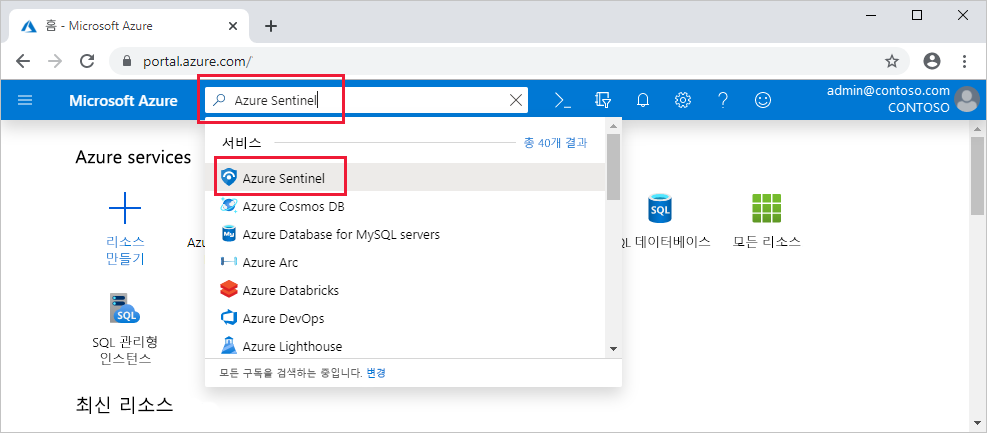

# Azure 등록 Sentinel 미리 보기

> [!IMPORTANT]
> Azure Sentinel은 현재 공개 미리 보기로 제공됩니다.
> 이 미리 보기 버전은 서비스 수준 계약 없이 제공되며 프로덕션 워크로드에는 사용하지 않는 것이 좋습니다. 특정 기능이 지원되지 않거나 기능이 제한될 수 있습니다. 자세한 내용은 [Microsoft Azure Preview에 대한 추가 사용 약관](https://azure.microsoft.com/support/legal/preview-supplemental-terms/)을 참조하세요.

이 빠른 시작에서는 알아봅니다 Azure Sentinel 온보드 하는 방법입니다. 

Azure 등록 Sentinel 먼저 하려면 Azure Sentinel 사용 하도록 설정 하 고 데이터 원본에 연결 합니다. Azure Sentinel 여러 상자 및 Microsoft Threat Protection 솔루션을 Office 365, Azure AD에서 Azure ATP를 포함 하 여 Microsoft 365 원본을 포함 하 여 실시간 통합을 사용할 수 있는 Microsoft 솔루션에 대 한 커넥터와 함께 제공 하 고 Microsoft Cloud App Security 및 더 합니다. 또한 타사 솔루션에 대한 광범위한 보안 에코시스템에 기본 제공 커넥터도 제공됩니다. 또한 일반적인 이벤트 형식으로 데이터 원본을 사용 하 여 Azure Sentinel 연결할 Syslog 또는 REST API를 사용할 수 있습니다.  

데이터 원본에 연결한 후에 데이터를 기반으로 하는 정보는 전문적 만든 대시보드를 갤러리에서 선택 합니다. 이러한 대시보드 요구 사항에 맞게 쉽게 사용자 지정할 수 있습니다.

## 전역 필수 구성 요소

- 계정이 없는 경우 활성 Azure 구독 만들기를 [무료 계정](https://azure.microsoft.com/free/?WT.mc_id=A261C142F) 시작 하기 전에 합니다.

- Log Analytics 작업 영역입니다. 자세한 방법 [Log Analytics 작업 영역 만들기](../log-analytics/log-analytics-quick-create-workspace.md)

-  Azure Sentinel 사용, Azure Sentinel 작업 영역 상주 하는 구독에 대 한 참가자 권한이 필요 합니다. 
- Azure Sentinel를 사용 하려면 작업 영역에 속하는 리소스 그룹 참가자 또는 뷰어 권한이 필요
- 특정 데이터 원본에 연결할 추가 권한이 필요할 수
 
## Azure Sentinel를 사용 하도록 설정 

1. Azure portal로 이동 합니다.
2. Azure Sentinel 만들어지면 구독 선택 되어 있는지 확인 합니다. 
3. Azure Sentinel 검색 합니다. 
   

1. **+추가**를 클릭합니다.
1. 사용 하거나 새로 만들 작업 영역을 선택 합니다. 둘 이상의 작업 영역에 Azure Sentinel를 실행할 수 있지만 데이터는 단일 작업 영역에 격리 되어 있습니다.

   

   >[!NOTE] 
   > - **작업 영역 위치** Azure Sentinel에 스트림 데이터를 모두 선택한 작업 영역의 지리적 위치에 저장 되도록 이해 해야 합니다.  
   > - Azure Security Center에서 만든 기본 작업 영역 목록에 표시 되지 않습니다. 에 Azure Sentinel을 설치할 수 없습니다.
   > - Azure Sentinel는 다음 지역 중 하나에 배포 되는 작업 영역에서 실행할 수 있습니다.  오스트레일리아 남동부, 캐나다 중부, 인도 중부, 미국 동부, 미국 동부 2 EUAP (카나리아), 일본 동부, 동남 아시아, 영국 남부, 유럽 서 부, 미국 서 부 2입니다.

6. 클릭 **Azure Sentinel 추가**합니다.
  

## 데이터 원본 연결

Azure Sentinel 서비스에 연결 하 고 Azure Sentinel 이벤트 및 로그를 전달 하 여 서비스 및 앱에 대 한 연결을 만듭니다. 컴퓨터 및 virtual machines에 대 한 로그를 수집 하 고 Azure Sentinel에 전달 하는 Azure Sentinel 에이전트를 설치할 수 있습니다. 방화벽 및 프록시에 대 한 Azure Sentinel는 Linux Syslog 서버를 활용합니다. 에이전트에 설치 되 고 에이전트를 수집 하는 로그 파일에서 Azure Sentinel 전달. 
 
1. 클릭 **데이터 컬렉션**합니다.
2. 연결할 수 있습니다 각 데이터 원본에 대 한 타일이 있습니다. 
예를 들어, 클릭 **Azure Active Directory**합니다. 이 데이터 원본에 연결 하는 경우 Azure Sentinel에 Azure AD에서 모든 로그를 스트리밍합니다. 어떤 유형의 로그를 가져오려면-wan을 선택할 수 있습니다 로그인 로그 및/또는 감사 로그 합니다.  
아래쪽에서 Azure Sentinel 권장 사항을 제공 설치 해야 대시보드 각 커넥터에 대 한 있습니다 수 즉시 가져올 흥미로운 insights 데이터 전반에 있도록 합니다.   설치 지침에 따라 또는 [관련 연결 설명서를 참조](connect-data-sources.md) 자세한 내용은 합니다. 데이터 커넥터에 대 한 정보를 참조 하세요 [Microsoft Connect 서비스](connect-data-sources.md)합니다.

데이터 원본의 연결 후 데이터 Azure Sentinel에 스트리밍을 시작 하 고 작업을 시작할 수 있도록 준비가 됩니다. 로그를 볼 수는 [기본 제공 대시보드와](quickstart-get-visibility.md) Log Analytics에서 쿼리 작성을 시작 하 고 [데이터를 조사](tutorial-investigate-cases.md)합니다.

## 다음 단계
이 문서에서는 Azure Sentinel를 데이터 원본 연결에 대해 알아보았습니다. Azure Sentinel에 대한 자세한 내용은 다음 문서를 참조하세요.
- 에 대해 알아봅니다 하는 방법 [데이터에 잠재적 위협을 파악](quickstart-get-visibility.md)합니다.
- 시작 [사용 하 여 Azure Sentinel 위협을 감지 하도록](tutorial-detect-threats.md)합니다.
- 데이터로 Stream [공통 오류 형식을 어플라이언스](connect-common-event-format.md) Azure Sentinel에 있습니다.
