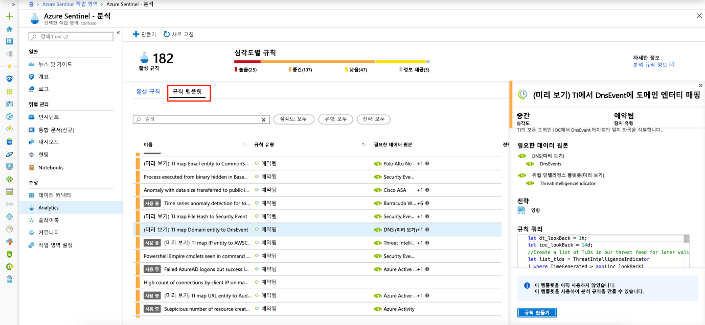

# 자습서: 기본으로 위협 감지

> [!IMPORTANT]
> 기본 위협 검색은 현재 공개 미리 보기로 제공 됩니다.
> 이 기능은 서비스 수준 계약 없이 제공 되며 프로덕션 워크 로드에는 권장 되지 않습니다.
> 자세한 내용은 [Microsoft Azure Preview에 대한 추가 사용 약관](https://azure.microsoft.com/support/legal/preview-supplemental-terms/)을 참조하세요.

 [데이터 원본](quickstart-onboard.md) 를 Azure 센티널에 연결한 후 의심 스러운 상황이 발생 하면이를 알려 주는 것이 좋습니다. 이 작업을 수행할 수 있도록 Azure 센티널은 기본 제공 되는 기본 제공 템플릿을 제공 합니다. 이러한 템플릿은 알려진 위협, 일반적인 공격 벡터 및 의심 스러운 활동 에스컬레이션 체인을 기반으로 Microsoft의 보안 전문가 및 분석가 팀에서 설계 되었습니다. 이러한 템플릿을 사용 하도록 설정 하면 사용자 환경에서 의심 스러운 활동을 자동으로 검색 합니다. 사용자의 요구에 따라 활동을 검색 하거나 필터링 하기 위해 많은 템플릿을 사용자 지정할 수 있습니다. 이러한 템플릿에서 생성 된 경고는 사용자 환경에서 할당 하 고 조사할 수 있는 인시던트를 만듭니다.

이 자습서는 Azure 센티널로 위협을 검색 하는 데 도움이 됩니다.

> [!div class="checklist"]
> * 기본 검색 사용
> * 위협 응답 자동화

## 기본 검색 정보

기본 제공되는 탐지를 모두 보려면 **Analytics**로 이동한 다음, **규칙 템플릿**으로 이동합니다. 이 탭에는 Azure Sentinel 기본 제공 규칙이 모두 포함됩니다.

   

다음 템플릿 유형을 사용할 수 있습니다.

- **Microsoft** 보안-microsoft 보안 템플릿은 다른 microsoft 보안 솔루션에서 생성 된 경고에서 실시간으로 Azure 센티널 인시던트를 자동으로 만듭니다. Microsoft 보안 규칙을 템플릿으로 사용 하 여 유사한 논리를 포함 하는 새 규칙을 만들 수 있습니다. 보안 규칙에 대 한 자세한 내용은 [Microsoft 보안 경고에서 인시던트 자동 생성](create-incidents-from-alerts.md)을 참조 하세요.
- **Fusion** 기반 fusion 기술 기반 Azure 센티널의 advanced 다단계 공격 감지는 확장 가능한 기계 학습 알고리즘을 사용 하 여 여러 제품에 대 한 여러 가지 낮은 충실도 경고 및 이벤트의 상관 관계를 높은 충실도 및 실행 가능한 인시던트에 연결할 수 있습니다. Fusion은 기본적으로 사용 하도록 설정 되어 있습니다. 논리는 숨겨져 있으므로이를 템플릿으로 사용 하 여 둘 이상의 규칙을 만들 수 없습니다.
- **Machine learning 동작 분석** -이러한 템플릿은 독점적인 Microsoft Machine learning 알고리즘을 기반으로 하므로 작동 방법 및 실행 되는 방식에 대 한 내부 논리를 확인할 수 없습니다. 논리는 숨겨져 있으므로이를 템플릿으로 사용 하 여 둘 이상의 규칙을 만들 수 없습니다.
-   **예약** 됨 – 예약 된 분석 규칙은 Microsoft 보안 전문가가 작성 한 예약 된 쿼리입니다. 쿼리 논리를 보고 변경할 수 있습니다. 예약 된 규칙을 템플릿으로 사용 하 여 유사한 논리를 포함 하는 새 규칙을 만들 수 있습니다.

## 기본 검색 사용

1. 기본 제공 템플릿을 사용 하려면 **규칙 만들기** 를 클릭 하 여 해당 템플릿을 기반으로 하는 새 활성 규칙을 만듭니다. 각 항목에는 자동으로 확인 되는 필수 데이터 원본 목록이 있으며이로 인해 **만들기 규칙이** 비활성화 될 수 있습니다.
  
   
 
1. 그러면 선택한 템플릿에 따라 규칙 만들기 마법사가 열립니다. 모든 세부 정보는 자동으로 채워지며, **예약 된 규칙** 또는 **Microsoft 보안 규칙**의 경우 조직에 더 잘 맞도록 논리를 사용자 지정 하거나 기본 제공 템플릿을 기반으로 하는 추가 규칙을 만들 수 있습니다. 규칙 만들기 마법사의 단계를 수행 하 고 템플릿을 기반으로 규칙 만들기를 완료 한 후에는 **활성 규칙** 탭에 새 규칙이 표시 됩니다.

마법사의 필드에 대 한 자세한 내용은 [자습서: 의심 스러운 위협을 검색 하는 사용자 지정 분석 규칙 만들기](tutorial-detect-threats-custom.md)를 참조 하세요.

## 다음 단계
이 자습서에서는 Azure 센티널을 사용 하 여 위협 감지를 시작 하는 방법을 배웠습니다. 

위협에 대 한 응답을 자동화 하는 방법을 알아보려면 [Azure 센티널에서 자동화 된 위협 응답을 설정](tutorial-respond-threats-playbook.md)합니다.

