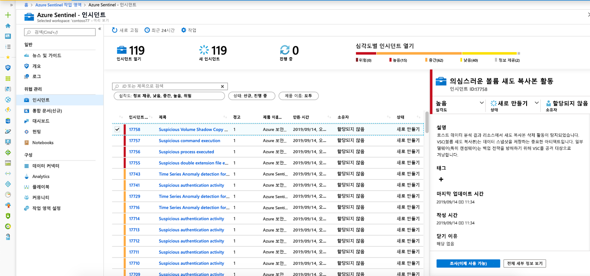
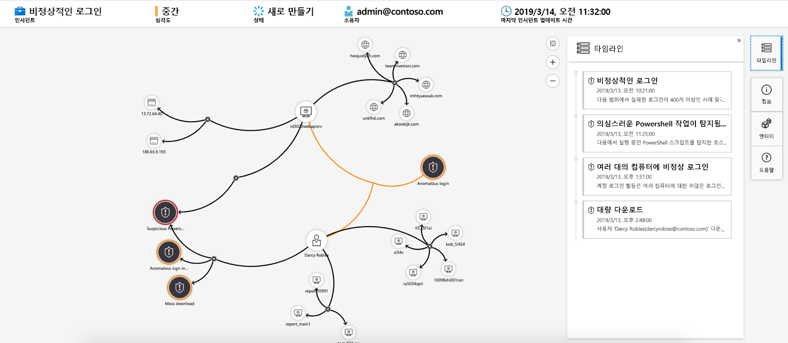

# 자습서: Azure 센티널을 사용 하 여 인시던트 조사

> [!IMPORTANT]
> 조사 그래프는 현재 공개 미리 보기로 제공 됩니다.
> 이 기능은 서비스 수준 계약 없이 제공 되며 프로덕션 워크 로드에는 권장 되지 않습니다.
> 자세한 내용은 [Microsoft Azure Preview에 대한 추가 사용 약관](https://azure.microsoft.com/support/legal/preview-supplemental-terms/)을 참조하세요.

이 자습서는 Azure 센티널로 인시던트를 조사 하는 데 도움이 됩니다. 데이터 원본을 Azure 센티널에 연결 하 고 나면 의심 스러운 상황이 발생 하면 알림이 표시 됩니다. 이 작업을 수행할 수 있도록 Azure 센티널을 사용 하면 사용자가 할당 하 고 조사할 수 있는 인시던트를 생성 하는 고급 경고 규칙을 만들 수 있습니다.

이 문서에서는 다음 내용을 설명합니다.
> [!div class="checklist"]
> * 인시던트 조사
> * 조사 그래프 사용
> * 위협에 대응

인시던트는 여러 경고를 포함할 수 있습니다. 특정 조사에 대 한 모든 관련 증거의 집계입니다. **분석** 페이지에서 만든 분석 규칙에 따라 인시던트가 생성 됩니다. 심각도 및 상태와 같은 경고와 관련 된 속성은 인시던트 수준에서 설정 됩니다. Azure 센티널에서 찾고 있는 위협 종류와이를 찾는 방법을 알 수 있게 되 면 인시던트를 조사 하 여 검색 된 위협을 모니터링할 수 있습니다.

## 선행 조건
분석 규칙을 설정할 때 엔터티 매핑 필드를 사용한 경우에만 인시던트를 조사할 수 있습니다. 조사 그래프에서 원본 인시던트에 엔터티를 포함 해야 합니다.

## 인시던트를 조사 하는 방법

1. **인시던트**를 선택 합니다. **인시던트** 페이지를 사용 하면 보유 한 인시던트 수, 열려 있는 수, **진행**중인 것으로 설정 된 수 및 닫힌 횟수를 알 수 있습니다. 각 인시던트에 대해 발생 한 시간 및 인시던트의 상태를 확인할 수 있습니다. 심각도를 확인 하 여 먼저 처리할 인시던트를 결정 합니다.

    

1. 상태 또는 심각도와 같이 필요에 따라 인시던트를 필터링 할 수 있습니다.

1. 조사를 시작 하려면 특정 인시던트를 선택 합니다. 오른쪽에서 심각도, 관련 엔터티 수,이 인시던트를 트리거한 원시 이벤트 및 인시던트의 고유 ID를 포함 하 여 인시던트에 대 한 자세한 정보를 볼 수 있습니다.

1. 인시던트의 경고 및 엔터티에 대 한 자세한 내용을 보려면 인시던트 페이지에서 **전체 세부 정보 보기** 를 선택 하 고 인시던트 정보를 요약 하는 관련 탭을 검토 합니다. **경고** 탭에서 경고 자체를 검토 합니다. 경고에 대 한 모든 관련 정보 (경고를 트리거한 쿼리, 쿼리당 반환 된 결과 수 및 경고에 대 한 플레이 북을 실행 하는 기능)를 볼 수 있습니다. 인시던트를 더 자세히 드릴 다운 하려면 **이벤트**수를 선택 합니다. 그러면 결과를 생성 한 쿼리와 Log Analytics 경고를 트리거한 이벤트가 열립니다. **엔터티** 탭에서 경고 규칙 정의의 일부로 매핑한 모든 엔터티를 볼 수 있습니다.

    

1. 인시던트를 적극적으로 조사 하는 경우에는 종료할 때까지 인시던트의 상태를 **진행** 중으로 설정 하는 것이 좋습니다.

1. 인시던트를 특정 사용자에 게 할당할 수 있습니다. 각 인시던트에 대해 **인시던트 소유자** 필드를 설정 하 여 소유자를 할당할 수 있습니다. 모든 인시던트는 할당 되지 않음으로 시작 합니다. 다른 분석가가 조사를 이해 하 고 문제를 해결할 수 있도록 주석을 추가할 수도 있습니다.

    

1. 조사 맵을 보려면 **조사** 를 선택 합니다.

## 조사 그래프를 사용 하 여 심층 조사

조사 그래프를 통해 분석가는 각 조사에 대해 적절 한 질문을 할 수 있습니다. 조사 그래프를 사용 하면 관련 된 데이터와 관련 된 엔터티를 상호 연결 하 여 잠재적인 보안 위협에 대 한 범위를 파악 하 고 근본 원인을 파악할 수 있습니다. 그래프에 표시 된 모든 엔터티를 선택 하 고 다른 확장 옵션 중에서 선택 하 여 더 자세히 알아보고 조사할 수 있습니다.  
  
조사 그래프는 다음을 제공 합니다.

- **원시 데이터의 시각적 컨텍스트**: 라이브 시각적 그래프는 원시 데이터에서 자동으로 추출 된 엔터티 관계를 표시 합니다. 이렇게 하면 다양 한 데이터 원본 간의 연결을 쉽게 볼 수 있습니다.

- **전체 조사 범위 검색**: 기본 제공 탐색 쿼리를 사용 하 여 조사 범위를 확장 하 여 위반의 전체 범위를 노출 합니다.

- **기본 제공 조사 단계**: 미리 정의 된 탐색 옵션을 사용 하 여 위협의 정면에서 적절 한 질문을 하 고 있는지 확인 합니다.

조사 그래프를 사용 하려면 다음을 수행 합니다.

1. 인시던트를 선택 하 고 **조사**를 선택 합니다. 그러면 조사 그래프로 이동 합니다. 그래프는 경고에 직접 연결 된 엔터티를 설명 하 고 각 리소스를 추가로 연결 합니다.

   > [!IMPORTANT] 
   > 분석 규칙을 설정할 때 엔터티 매핑 필드를 사용한 경우에만 인시던트를 조사할 수 있습니다. 조사 그래프에서 원본 인시던트에 엔터티를 포함 해야 합니다.

   

1. 엔터티를 선택 하면 해당 엔터티에 대 한 정보를 검토할 수 있는 **엔터티 창이 열립니다** .

    
  
1. 각 엔터티를 가리켜 조사를 확장 하 여 조사를 활용 위한 엔터티 유형별 보안 전문가 및 분석가가 디자인 한 질문 목록을 표시 합니다. 이러한 옵션 **탐색 쿼리**를 호출 합니다.

    

   예를 들어 컴퓨터에서 관련 경고를 요청할 수 있습니다. 탐색 쿼리를 선택 하면 결과 되며이 그래프에 다시 추가 됩니다. 이 예에서는 **관련 경고** 를 선택 하 여 그래프에 다음 경고를 반환 했습니다.

    

1. 각 탐색 쿼리에 대해 **이벤트\>** 를 선택 하 여 Log Analytics에 사용 되는 원시 이벤트 결과와 쿼리를 여는 옵션을 선택할 수 있습니다.

1. 인시던트를 이해 하기 위해 그래프는 병렬 타임 라인을 제공 합니다.

    

1. 타임 라인을 마우스로 가리켜 그래프에서 어떤 시점에 어떤 항목이 발생 했는지 확인 합니다.

    

## 다음 단계
이 자습서에서는 Azure 센티널을 사용 하 여 인시던트 조사를 시작 하는 방법을 배웠습니다. 자동화 된 플레이 북을 [사용 하 여 위협에 대응 하는 방법](tutorial-respond-threats-playbook.md)에 대 한 자습서를 계속 진행 합니다.
> [!div class="nextstepaction"]
> 위협에 [대응](tutorial-respond-threats-playbook.md) 하 여 위협에 대 한 응답을 자동화 합니다.

