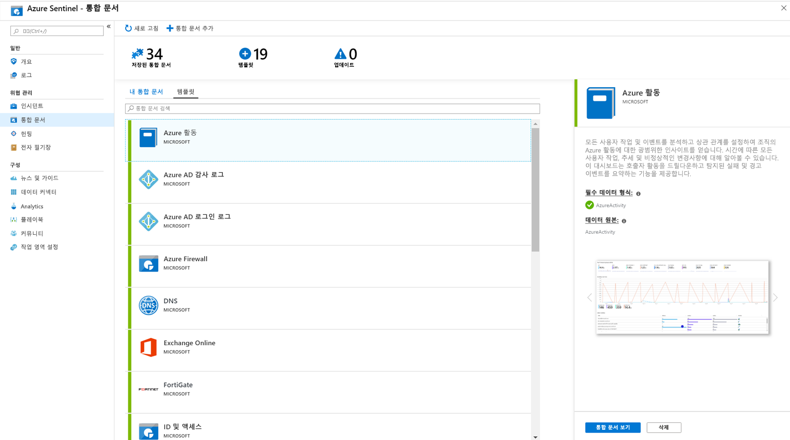

# 자습서: 데이터 시각화 및 모니터링

데이터  [원본을](quickstart-onboard.md) azure 센티널에 연결 하면 사용자 지정 대시보드를 만들 때 다양 한 기능을 제공 하는 Azure Monitor 통합 문서에 대 한 azure 센티널 채택을 사용 하 여 데이터를 시각화 하 고 모니터링할 수 있습니다. 통합 문서가 Azure 센티널에 다르게 표시 되는 반면 [Azure Monitor 통합 문서를 사용 하 여 대화형 보고서를 만드는](../azure-monitor/app/usage-workbooks.md)방법을 확인 하는 것이 유용할 수 있습니다. Azure Sentinel을 사용하면 데이터에 대한 사용자 지정 통합 문서를 만들 수 있으며 데이터 원본을 연결하는 즉시 데이터를 신속하게 파악할 수 있는 기본 제공 통합 문서 템플릿도 제공됩니다.

이 자습서는 Azure 센티널에서 데이터를 시각화 하는 데 도움이 됩니다.
> [!div class="checklist"]
> * 기본 제공 통합 문서 사용
> * 새 통합 문서 만들기

## 필수 조건

- Azure 센티널 작업 영역의 리소스 그룹에 대해 적어도 통합 문서 판독기 또는 통합 문서 참가자 권한이 있어야 합니다.

> [!NOTE]
> Azure 센티널에서 볼 수 있는 통합 문서는 Azure 센티널 작업 영역 리소스 그룹 내에 저장 되 고 생성 된 작업 영역에 의해 태그가 지정 됩니다.

## 기본 제공 통합 문서 사용

1. **통합** 문서로 이동한 다음 **템플릿** 을 선택 하 여 Azure 센티널 기본 제공 통합 문서의 전체 목록을 표시 합니다. 연결 된 데이터 형식과 관련 된 항목을 확인 하기 위해, 관련 데이터를 Azure 센티널에 이미 스트리밍하는 경우 각 통합 문서의 **필수 데이터 형식** 필드에는 녹색 확인 표시 옆의 데이터 형식이 나열 됩니다.
  통합 문서로 이동 
1. **통합 문서 보기** 를 클릭 하 여 데이터를 채운 템플릿을 확인 합니다.
  
1. 통합 문서를 편집 하려면 **저장**을 선택한 다음 템플릿에 대 한 json 파일을 저장할 위치를 선택 합니다. 

   > [!NOTE]
   > 그러면 관련 템플릿을 기반으로 Azure 리소스가 생성 되 고 데이터가 아닌 템플릿 Json 파일 자체를 저장 합니다.

1. **통합 문서 보기**를 선택 합니다. 그런 다음 맨 위에 있는 **편집** 단추를 클릭 합니다. 이제 통합 문서를 편집 하 고 필요에 따라 사용자 지정할 수 있습니다. 통합 문서를 사용자 지정 하는 방법에 대 한 자세한 내용은 [Azure Monitor 통합 문서를 사용 하 여 대화형 보고서를 만드는](../azure-monitor/app/usage-workbooks.md)방법을 참조 하세요.

1. 변경을 수행한 후 통합 문서를 저장할 수 있습니다. 

1. 또한 통합 문서를 복제할 수 있습니다. **편집** 을 선택한 다음 다른 이름으로 **저장**을 선택 하 여 동일한 구독 및 리소스 그룹의 다른 이름으로 저장 합니다. 이러한 통합 문서는 **내 통합 문서** 탭에 표시 됩니다.

## 새 통합 문서 만들기

1. **통합 문서로 이동한** 다음 **통합 문서 추가** 를 선택 하 여 처음부터 새 통합 문서를 만듭니다.
  통합 문서로 이동 

1. 통합 문서를 편집 하려면 **편집**을 선택한 다음 필요에 따라 텍스트, 쿼리 및 매개 변수를 추가 합니다. 통합 문서를 사용자 지정 하는 방법에 대 한 자세한 내용은 [Azure Monitor 통합 문서를 사용 하 여 대화형 보고서를 만드는](../azure-monitor/app/usage-workbooks.md)방법을 참조 하세요. 

1. 쿼리를 작성 하는 경우 **데이터 원본** 이 **Logs**로 설정 되 고, **리소스 형식이** **Log Analytics** 로 설정 되 고, 관련 작업 영역을 선택 합니다. 

1. 통합 문서를 만든 후 통합 문서를 저장 하 고 Azure 센티널 작업 영역의 구독 및 리소스 그룹 아래에 저장 합니다.

1. 조직의 다른 사용자가 통합 문서를 사용할 수 있도록 하려면 저장에서 **공유 보고서** **를** 선택 합니다. 이 통합 문서를 사용할 수 있도록 하려면 **내 보고서**를 선택 합니다.

1. 작업 영역의 통합 문서 간을 전환 하려면 모든 통합 문서의 위쪽 창에서 **열기** 를 선택 하면 됩니다. 오른쪽에 열리는 창에서 통합 문서 간을 전환 합니다.

   

## 통합 문서를 삭제 하는 방법

Azure 센티널 템플릿에서 만든 통합 문서를 삭제할 수 있습니다. 

사용자 지정 통합 문서를 삭제 하려면 통합 문서 페이지에서 삭제 하려는 저장 된 통합 문서를 선택 하 고 **삭제**를 선택 합니다. 그러면 저장 된 통합 문서가 제거 됩니다.

> [!NOTE]
> 이렇게 하면 리소스 뿐만 아니라 템플릿에 대 한 모든 변경 내용이 제거 됩니다. 원본 템플릿은 사용 가능한 상태로 유지 됩니다.

## 다음 단계

이 자습서에서는 Azure 센티널에서 데이터를 보는 방법에 대해 알아보았습니다.

위협에 대 한 응답을 자동화 하는 방법을 알아보려면 [Azure 센티널에서 자동화 된 위협 응답 설정](tutorial-respond-threats-playbook.md)을 참조 하세요.
