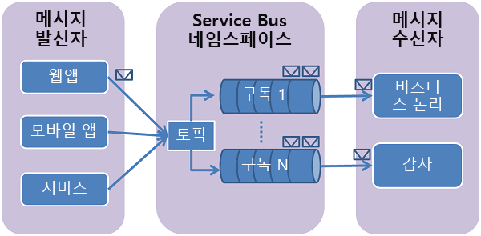

# <a name="how-to-use-service-bus-topics-and-subscriptions"></a>서비스 버스 토픽 및 구독을 사용하는 방법
[!INCLUDE [service-bus-selector-topics](../../includes/service-bus-selector-topics.md)]

이 가이드에서는 서비스 버스 토픽과 구독을 사용하는 방법을 보여 줍니다. 샘플은 Java로 작성되었으며 [Java용 Azure SDK][Azure SDK for Java]를 사용합니다. 여기서 다루는 시나리오에는 **토픽 및 구독 만들기**, **구독 필터 만들기**, **토픽에 메시지 보내기**, **구독에서 메시지 받기**, **토픽 및 구독 삭제** 등이 포함됩니다.

## <a name="what-are-service-bus-topics-and-subscriptions"></a>서비스 버스 토픽 및 구독 정의
서비스 버스 토픽 및 구독은 *게시/구독* 메시징 통신 모델을 지원합니다. 토픽 및 구독을 사용하는 경우 분산 응용 프로그램의 구성 요소가 서로 직접 통신하지 않고 중간자 역할을 하는 토픽을 통해 메시지를 교환합니다.



각 메시지가 단일 소비자에 의해 처리되는 서비스 버스 큐와 반대로, 토픽과 구독은 게시/구독 패턴을 사용하여 "일 대 다" 형태의 통신을 제공합니다. 하나의 토픽에 여러 구독을 등록할 수 있습니다. 토픽에 메시지를 전송하면 각 구독에서 독립적으로 처리할 수 있습니다.

토픽 구독은 토픽에 전송된 메시지의 복사본을 받는 가상 큐와 유사합니다. 선택적으로 구독별 토픽에 대한 필터 규칙을 등록할 수 있으며, 이렇게 하면 각 토픽 구독에서 받는 토픽 메시지를 필터링/제한할 수 있습니다.

서비스 버스 토픽 및 구독을 사용하면 다수의 사용자와 응용 프로그램에 대해 다수의 메시지를 처리하도록 확장할 수 있습니다.

## <a name="create-a-service-namespace"></a>서비스 네임스페이스 만들기
Azure에서 Service Bus 항목 및 구독을 사용하려면 먼저 응용 프로그램 내에서 Service Bus 리소스의 주소 지정을 위한 범위 컨테이너를 제공하는 네임스페이스를 만들어야 합니다.

네임스페이스를 만들려면

[!INCLUDE [service-bus-create-namespace-portal](../../includes/service-bus-create-namespace-portal.md)]

## <a name="configure-your-application-to-use-service-bus"></a>서비스 버스를 사용하도록 응용 프로그램 구성
이 샘플을 빌드하기 전에 [Java용 Azure SDK][Azure SDK for Java]를 설치했는지 확인하세요. Eclipse를 사용하는 경우 Azure SDK for Java를 포함하고 있는 [Eclipse용 Azure Toolkit][Azure Toolkit for Eclipse]를 설치할 수 있습니다. 그런 다음 **Java용 Microsoft Azure 라이브러리**를 프로젝트에 추가할 수 있습니다.


Java 파일 맨 위에 다음 `import` 문을 추가합니다.

```java
import com.microsoft.windowsazure.services.servicebus.*;
import com.microsoft.windowsazure.services.servicebus.models.*;
import com.microsoft.windowsazure.core.*;
import javax.xml.datatype.*;
```

Java용 Azure 라이브러리를 빌드 경로에 추가하고 프로젝트 배포 어셈블리에 포함합니다.

## <a name="create-a-topic"></a>토픽 만들기
**ServiceBusContract** 클래스를 통해 Service Bus 토픽에 대한 관리 작업을 수행할 수 있습니다. **ServiceBusContract** 개체는 관리에 필요한 SAS 토큰 사용 권한을 캡슐화하는 적합한 구성으로 생성되며, Azure와의 통신 지점은 **ServiceBusContract** 클래스뿐입니다.

**ServiceBusService** 클래스는 토픽을 만들고 열거 및 삭제하기 위한 메서드를 제공합니다. 다음 예제에서는 **ServiceBusService** 개체를 사용하여 `HowToSample` 네임스페이스로 `TestTopic`라는 토픽을 만드는 방법을 보여 줍니다.

```java
Configuration config =
    ServiceBusConfiguration.configureWithSASAuthentication(
      "HowToSample",
      "RootManageSharedAccessKey",
      "SAS_key_value",
      ".servicebus.windows.net"
      );

ServiceBusContract service = ServiceBusService.create(config);
TopicInfo topicInfo = new TopicInfo("TestTopic");
try  
{
    CreateTopicResult result = service.createTopic(topicInfo);
}
catch (ServiceException e) {
    System.out.print("ServiceException encountered: ");
    System.out.println(e.getMessage());
    System.exit(-1);
}
```

**TopicInfo**에는 토픽의 속성을 조정하는 데 사용할 수 있는 메서드가 있습니다. 예를 들어 토픽에 전송되는 메시지에 적용할 기본 TTL(Time-To-Live) 값을 설정할 수 있습니다. 다음 예제에서는 최대 크기가 5GB인 `TestTopic` 토픽을 만드는 방법을 보여 줍니다.

```java
long maxSizeInMegabytes = 5120;  
TopicInfo topicInfo = new TopicInfo("TestTopic");  
topicInfo.setMaxSizeInMegabytes(maxSizeInMegabytes);
CreateTopicResult result = service.createTopic(topicInfo);
```

**ServiceBusContract** 개체의 **listTopics** 메서드를 사용하여 서비스 네임스페이스 내에 지정된 이름의 토픽이 이미 있는지 확인할 수 있습니다.

## <a name="create-subscriptions"></a>구독 만들기
토픽에 대한 구독은 **ServiceBusService** 클래스로도 만들 수 있습니다. 구독에는 이름이 지정되며, 구독의 가상 큐에 전달되는 메시지 집합을 제한하는 선택적 필터가 있을 수 있습니다.

### <a name="create-a-subscription-with-the-default-matchall-filter"></a>기본(MatchAll) 필터를 사용하여 구독 만들기
**MatchAll** 필터는 새 구독을 만들 때 필터를 지정하지 않은 경우 사용되는 기본 필터입니다. **MatchAll** 필터를 사용하면 토픽에 게시된 모든 메시지가 구독의 가상 큐에 배치됩니다. 다음 예제에서는 "AllMessages"라는 구독을 만들고 기본 **MatchAll** 필터를 사용합니다.

```java
SubscriptionInfo subInfo = new SubscriptionInfo("AllMessages");
CreateSubscriptionResult result =
    service.createSubscription("TestTopic", subInfo);
```

### <a name="create-subscriptions-with-filters"></a>필터를 사용하여 구독 만들기
토픽으로 전송된 메시지 중 특정 토픽 구독 내에 표시되어야 하는 메시지의 범위를 지정하는 필터를 만들 수도 있습니다.

구독에서 지원하는 가장 유연한 유형의 필터는 SQL92 하위 집합을 구현하는 [SqlFilter][SqlFilter]입니다. SQL 필터는 토픽에 게시된 메시지의 속성에 적용됩니다. SQL 필터와 함께 사용할 수 있는 식에 대한 자세한 내용은 [SqlFilter.SqlExpression][SqlFilter.SqlExpression] 구문을 참조하세요.

다음 예제에서는 사용자 지정 **MessageNumber** 속성이 3보다 큰 메시지만 선택하는 [SqlFilter][SqlFilter] 개체를 사용하여 `HighMessages`(이)라는 구독을 만듭니다.

```java
// Create a "HighMessages" filtered subscription  
SubscriptionInfo subInfo = new SubscriptionInfo("HighMessages");
CreateSubscriptionResult result = service.createSubscription("TestTopic", subInfo);
RuleInfo ruleInfo = new RuleInfo("myRuleGT3");
ruleInfo = ruleInfo.withSqlExpressionFilter("MessageNumber > 3");
CreateRuleResult ruleResult = service.createRule("TestTopic", "HighMessages", ruleInfo);
// Delete the default rule, otherwise the new rule won't be invoked.
service.deleteRule("TestTopic", "HighMessages", "$Default");
```

마찬가지로, 다음 예제에서는 **MessageNumber** 속성이 3보다 작거나 같은 메시지만 선택하는 [SqlFilter][SqlFilter] 개체를 사용하여 `LowMessages`(이)라는 구독을 만듭니다.

```java
// Create a "LowMessages" filtered subscription
SubscriptionInfo subInfo = new SubscriptionInfo("LowMessages");
CreateSubscriptionResult result = service.createSubscription("TestTopic", subInfo);
RuleInfo ruleInfo = new RuleInfo("myRuleLE3");
ruleInfo = ruleInfo.withSqlExpressionFilter("MessageNumber <= 3");
CreateRuleResult ruleResult = service.createRule("TestTopic", "LowMessages", ruleInfo);
// Delete the default rule, otherwise the new rule won't be invoked.
service.deleteRule("TestTopic", "LowMessages", "$Default");
```

이제 `TestTopic`(으)로 메시지를 보내는 경우 `AllMessages` 구독을 구독하는 수신자에게는 항상 배달되고, `HighMessages` 및 `LowMessages` 구독을 구독하는 수신자에게는 메시지 내용에 따라 선택적으로 배달됩니다.

## <a name="send-messages-to-a-topic"></a>토픽에 메시지 보내기
Service Bus 토픽에 메시지를 보내기 위해 응용 프로그램은 **ServiceBusContract** 개체를 얻습니다. 다음 코드는 위에서 `HowToSample` 서비스 네임스페이스 내에서 이전에 만든 `TestTopic` 항목에 메시지를 보내는 방법을 보여 줍니다.

```java
BrokeredMessage message = new BrokeredMessage("MyMessage");
service.sendTopicMessage("TestTopic", message);
```

Service Bus 토픽으로 전송된 메시지는 [BrokeredMessage][BrokeredMessage] 클래스의 인스턴스입니다. [BrokeredMessage][BrokeredMessage]*개체에는 표준 메서드 집합(예:**setLabel**및**TimeToLive**), 응용 프로그램별 사용자 지정 속성을 저장하는 데 사용되는 사전 및 임의 응용 프로그램 데이터 본문이 있습니다. 응용 프로그램은 [BrokeredMessage][BrokeredMessage] 생성자에 직렬화된 개체를 전달하여 메시지 본문을 설정할 수 있으며, 적절한 **DataContractSerializer**가 개체를 직렬화하는 데 사용됩니다. 또는 **java.io.InputStream**을 제공할 수 있습니다.

다음 예제는 위의 코드 조각에서 얻은 `TestTopic` **MessageSender**에 테스트 메시지 5개를 보내는 방법을 보여 줍니다.
루프가 반복될 때마다 각 메시지의 **MessageNumber** 속성 값이 어떻게 달라지는지 확인합니다(메시지를 수신하는 구독 결정).

```java
for (int i=0; i<5; i++)  {
// Create message, passing a string message for the body
BrokeredMessage message = new BrokeredMessage("Test message " + i);
// Set some additional custom app-specific property
message.setProperty("MessageNumber", i);
// Send message to the topic
service.sendTopicMessage("TestTopic", message);
}
```

Service Bus 토픽은 [표준 계층](service-bus-premium-messaging.md)에서 256KB의 최대 메시지 크기를 [프리미엄 계층](service-bus-premium-messaging.md)에서 1MB를 지원합니다. 표준 및 사용자 지정 응용 프로그램 속성이 포함된 헤더의 최대 크기는 64KB입니다. 한 토픽에 저장되는 메시지 수에는 제한이 없지만 한 토픽에 저장되는 총 메시지 크기는 제한됩니다. 이 토픽 크기는 생성 시 정의되며 상한이 5GB입니다.

## <a name="how-to-receive-messages-from-a-subscription"></a>구독에서 메시지를 받는 방법
구독에서 메시지를 받으려면 **ServiceBusContract** 개체를 사용하세요. 받은 메시지는 **ReceiveAndDelete** 및 **PeekLock**의 두 가지 모드로 작동할 수 있습니다.

**ReceiveAndDelete** 모드를 사용하는 경우 수신은 1단계 작업입니다. 즉, Service Bus가 메시지에 대한 읽기 요청을 받으면 메시지를 이용되는 것으로 표시하고 응용 프로그램에 반환합니다. **ReceiveAndDelete** 모드는 가장 단순한 모델이며, 응용 프로그램이 실패 이벤트 시 메시지를 처리하지 않아도 안전한 시나리오에서 효과적입니다. 이해를 돕기 위해 소비자가 수신 요청을 실행한 후 처리하기 전에 크래시되는 시나리오를 고려해 보세요. 서비스 버스는 메시지를 이용되는 것으로 표시하기 때문에 응용 프로그램이 다시 시작되고 메시지 소비를 다시 시작할 경우 크래시 전에 소비된 메시지가 누락됩니다.

**PeekLock** 모드에서 수신은 2단계 작업이므로 메시지 누락이 허용되지 않는 응용 프로그램을 지원할 수 있습니다. 서비스 버스는 요청을 받으면 소비할 다음 메시지를 찾아서 다른 소비자가 수신할 수 없도록 잠근 후 응용 프로그램에 반환합니다. 응용 프로그램은 메시지 처리를 완료하거나 추가 처리를 위해 안전하게 저장한 후 수신된 메시지에 대해 **Delete**를 호출하여 수신 프로세스의 두 번째 단계를 완료합니다. Service Bus는 **Delete** 호출을 확인한 후 메시지를 이용되는 것으로 표시하고 토픽에서 제거합니다.

아래 예제에서는 **PeekLock** 모드(기본 모드 아님)를 사용하여 메시지를 받고 처리하는 방법을 보여 줍니다. 아래 예는 루프를 수행하고 "HighMessages" 구독 메시지를 처리한 후 추가 메시지가 없으면 종료됩니다(또는 새 메시지를 기다리도록 설정할 수 있음).

```java
try
{
    ReceiveMessageOptions opts = ReceiveMessageOptions.DEFAULT;
    opts.setReceiveMode(ReceiveMode.PEEK_LOCK);

    while(true)  {
        ReceiveSubscriptionMessageResult  resultSubMsg =
            service.receiveSubscriptionMessage("TestTopic", "HighMessages", opts);
        BrokeredMessage message = resultSubMsg.getValue();
        if (message != null && message.getMessageId() != null)
        {
            System.out.println("MessageID: " + message.getMessageId());
            // Display the topic message.
            System.out.print("From topic: ");
            byte[] b = new byte[200];
            String s = null;
            int numRead = message.getBody().read(b);
            while (-1 != numRead)
            {
                s = new String(b);
                s = s.trim();
                System.out.print(s);
                numRead = message.getBody().read(b);
            }
            System.out.println();
            System.out.println("Custom Property: " +
                message.getProperty("MessageNumber"));
            // Delete message.
            System.out.println("Deleting this message.");
            service.deleteMessage(message);
        }  
        else  
        {
            System.out.println("Finishing up - no more messages.");
            break;
            // Added to handle no more messages.
            // Could instead wait for more messages to be added.
        }
    }
}
catch (ServiceException e) {
    System.out.print("ServiceException encountered: ");
    System.out.println(e.getMessage());
    System.exit(-1);
}
catch (Exception e) {
    System.out.print("Generic exception encountered: ");
    System.out.println(e.getMessage());
    System.exit(-1);
}
```

## <a name="how-to-handle-application-crashes-and-unreadable-messages"></a>응용 프로그램 작동 중단 및 읽을 수 없는 메시지를 처리하는 방법
서비스 버스는 응용 프로그램 오류나 메시지 처리 문제를 정상적으로 복구하는 데 유용한 기능을 제공합니다. 어떤 이유로든 수신 응용 프로그램이 메시지를 처리할 수 없는 경우 받은 메시지에 대해 **deleteMessage** 메서드 대신 **unlockMessage** 메서드를 호출할 수 있습니다. 그러면 서비스 버스에서 토픽 내 메시지의 잠금을 해제하므로 동일한 소비 응용 프로그램이나 다른 소비 응용 프로그램에서 메시지를 다시 받을 수 있습니다.

토픽 내에서 잠긴 메시지와 연결된 제한 시간도 있으며, 응용 프로그램에서 잠금 제한 시간이 만료되기 전에 메시지를 처리하지 못하는 경우(예: 응용 프로그램이 크래시되는 경우) 서비스 버스가 메시지를 자동으로 잠금 해제하여 다시 받을 수 있게 합니다.

응용 프로그램이 메시지를 처리한 후 **deleteMessage** 요청이 실행되기 전에 크래시되는 경우 다시 시작될 때 메시지가 응용 프로그램에 다시 배달됩니다. 이를 **최소 한 번 이상 처리**라고 합니다. 즉, 각 메시지가 최소 한 번 이상 처리되지만 특정 상황에서는 동일한 메시지가 다시 배달될 수 있습니다. 중복 처리가 허용되지 않는 시나리오에서는 응용 프로그램 개발자가 중복 메시지 배달을 처리하는 논리를 응용 프로그램에 추가해야 합니다. 이 경우 대체로 배달 시도 간에 일정하게 유지되는 메시지의 **getMessageId** 메서드를 사용합니다.

## <a name="delete-topics-and-subscriptions"></a>토픽 및 구독 삭제
토픽 및 구독을 삭제하는 기본 방법은 **ServiceBusContract** 개체를 사용하는 것입니다. 토픽을 삭제하면 토픽에 등록된 모든 구독도 삭제됩니다. 구독을 개별적으로 삭제할 수도 있습니다.

```java
// Delete subscriptions
service.deleteSubscription("TestTopic", "AllMessages");
service.deleteSubscription("TestTopic", "HighMessages");
service.deleteSubscription("TestTopic", "LowMessages");

// Delete a topic
service.deleteTopic("TestTopic");
```

## <a name="next-steps"></a>다음 단계
지금까지 Service Bus 큐의 기본 사항에 대해 알아보았습니다. 자세한 내용은 [Service Bus 큐, 토픽 및 구독][Service Bus queues, topics, and subscriptions]을 참조하세요.

[Azure SDK for Java]: http://azure.microsoft.com/develop/java/
[Azure Toolkit for Eclipse]: ../azure-toolkit-for-eclipse.md
[Service Bus queues, topics, and subscriptions]: service-bus-queues-topics-subscriptions.md
[SqlFilter]: /dotnet/api/microsoft.servicebus.messaging.sqlfilter 
[SqlFilter.SqlExpression]: /dotnet/api/microsoft.servicebus.messaging.sqlfilter#Microsoft_ServiceBus_Messaging_SqlFilter_SqlExpression
[BrokeredMessage]: /dotnet/api/microsoft.servicebus.messaging.brokeredmessage

[0]: ./media/service-bus-java-how-to-use-topics-subscriptions/sb-queues-13.png
[2]: ./media/service-bus-java-how-to-use-topics-subscriptions/sb-queues-04.png
[3]: ./media/service-bus-java-how-to-use-topics-subscriptions/sb-queues-09.png

