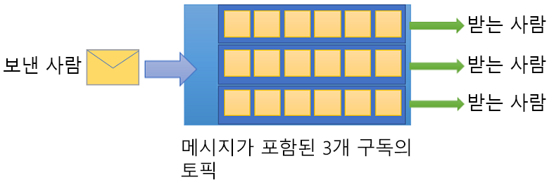

# Azure Service Bus란?

Microsoft Azure Service Bus는 완전히 관리되는 엔터프라이즈 통합 메시지 broker입니다. Service Bus는 응용 프로그램과 서비스를 서로 분리하는 데 가장 일반적으로 사용되며, 비동기 데이터 및 상태 전송에 대한 안정적이고 안전한 플랫폼입니다. 데이터는 *메시지*를 사용하여 서로 다른 응용 프로그램 및 서비스간에 전송됩니다. 메시지는 이진 형식으로 JSON, XML 또는 텍스트만 포함할 수 있습니다. 

몇 가지 일반적인 메시징 시나리오는 다음과 같습니다.

* 메시징: 주문, 저널 판매 및 구입 또는 인벤토리 이동과 같은 비즈니스 데이터를 전송합니다.
* 응용 프로그램 분리: 응용 프로그램 및 서비스의 안정성 및 확장성을 개선합니다(클라이언트 및 서비스는 동시에 온라인 상태일 필요가 없음).
* 토픽 및 구독: 게시자와 구독자 간의 1:*n* 관계를 활성화합니다.
* 메시지 세션: 메시지 순서 지정 또는 메시지 지연이 필요한 워크플로를 구현합니다.

## 네임스페이스

네임스페이스는 모든 메시징 구성 요소에 대한 영역 컨테이너입니다. 여러 큐 및 토픽은 단일 네임스페이스 내에 있을 수 있으며 네임스페이스는 종종 응용 프로그램 컨테이너로 사용됩니다.

## 큐

메시지는 *큐* 간에서 전송 및 수신됩니다. 큐를 사용하여 수신 응용 프로그램이 수신 및 처리할 수 있을 때까지 메시지를 저장할 수 있습니다.

큐의 메시지는 도착 시 순서가 지정되고 타임스탬프가 지정됩니다. 허용되면 메시지는 중복 저장소에 안전하게 보관됩니다. 메시지는 요청 시 메시지를 전송하는 *끌어오기* 모드에서 전송됩니다.

## 토픽

*토픽*을 사용하여 메시지를 보내고 받을 수도 있습니다. 큐는 종종 지점 간 통신에 사용되지만 토픽은 게시/구독 시나리오에서 유용합니다.

토픽은 여러 개의 독립 구독을 가질 수 있습니다. 토픽에 대한 구독자는 각 메시지의 복사본을 해당 토픽에 전송할 수 있습니다. 구독은 지속적으로 생성되지만 필요에 따라 만료 또는 자동 삭제되는 엔터티 이름이 지정됩니다.

일부 시나리오에서는 개별 구독에서 토픽에 전송하는 모든 메시지를 수신하지 않을 수도 있습니다. 이 경우 [규칙 및 필터](topic-filters.md)를 사용하여 선택적 [작업](topic-filters.md#actions)을 트리거하는 조건을 정의하고, 지정된 메시지를 필터링하고 메시지 속성을 설정 또는 수정할 수 있습니다.

## 고급 기능

또한 Service Bus에는 보다 복잡한 메시징 문제를 해결할 수 있는 고급 기능이 있습니다. 다음 섹션에서는 이러한 주요 기능을 설명합니다.

### 메시지 세션

Service Bus에서 FIFO(first-in, first-out) 보장을 실현하려면 세션을 사용합니다. [메시지 세션](message-sessions.md)을 사용하면 관련 메시지의 무제한 시퀀스를 공동으로 순서를 지정하여 처리할 수 있습니다. 

### 자동 전달

[자동 전달](service-bus-auto-forwarding.md) 기능을 통해 동일한 네임스페이스의 일부인 다른 큐 또는 토픽에 큐 또는 구독을 연결할 수 있습니다. 자동 전달을 사용하도록 설정하면 Service Bus가 자동으로 첫 번째 큐 또는 구독(원본)에 있는 메시지를 제거하고 두 번째 큐 또는 토픽(대상)에 넣습니다.

### 배달 못 한 편지

Service Bus는 수신자에게 배달할 수 없는 메시지 또는 처리하지 못한 메시지를 보관하도록 [DLQ](service-bus-dead-letter-queues.md)(배달 못 한 편지 큐)를 지원합니다. 그런 다음, DLQ에서 메시지를 제거하고 검사할 수 있습니다.

### 예약 배달

[지연 처리를 위해](message-sequencing.md#scheduled-messages) 큐 또는 토픽에 메시지를 제출할 수 있습니다. 특정 시간에 시스템에서 처리할 수 있게 되는 작업 예약을 예로 들 수 있습니다.

### 메시지 지연

큐 또는 구독 클라이언트가 처리하려는 메시지를 받았으나 응용 프로그램 내의 특수한 상황으로 인해 처리가 현재 가능하지 않을 경우 엔터티에는 [메시지의 검색을 나중으로 연기](message-deferral.md)하는 옵션이 있습니다. 메시지는 큐나 구독에 남아 있지만 따로 분리됩니다.

### 일괄 처리

[클라이언트 쪽 일괄 처리](service-bus-performance-improvements.md#client-side-batching)를 통해 큐 또는 토픽 클라이언트가 일정 시간 동안 메시지 전송을 연기할 수 있습니다. 클라이언트가 이 기간 동안 추가 메시지를 보내면 메시지를 단일 배치로 전송합니다. 

### 트랜잭션

[트랜잭션](service-bus-transactions.md) 그룹은 두 개 이상의 작업을 실행 범위로 그룹화합니다. Service Bus는 트랜잭션 범위 내에서 단일 메시징 엔터티(큐, 토픽, 구독)에 대한 그룹화 작업을 지원합니다.

### 필터링 및 작업

구독자는 토픽에서 수신할 메시지를 정의할 수 있습니다. 이러한 메시지는 하나 이상의 [명명된 구독 규칙](topic-filters.md)의 형태로 지정됩니다. 일치하는 각 규칙 조건에 대해 구독은 메시지의 복사본을 생성하며 일치하는 규칙마다 다르게 주석을 달 수 있습니다.

### 유휴 상태에서 자동 삭제

[유휴 상태에서 자동 삭제](/dotnet/api/microsoft.servicebus.messaging.queuedescription.autodeleteonidle)를 통해 큐가 자동으로 삭제된 후 유휴 간격을 지정할 수 있습니다. 최소 기간은 5분입니다.

### 중복 검색

클라이언트가 전송 작업의 결과에 대한 의문을 갖게 되는 오류가 발생하는 경우 [중복 검색](duplicate-detection.md)은 보낸 사람이 동일한 메시지를 다시 보낼 수 있도록 하고 큐 또는 토픽에서 중복된 복사본을 삭제하여 이러한 상황에 대한 의문을 해소합니다.

### SAS, RBAC 및 MSI

Service Bus는 [SAS](service-bus-sas.md)(공유 액세스 서명), [RBAC](service-bus-role-based-access-control.md)(역할 기반 액세스 제어) 및 [MSI](service-bus-managed-service-identity.md)(관리 서비스 ID)와 같은 보안 프로토콜을 지원합니다.

### 지리적 재해 복구

Azure 지역 또는 데이터 센터에서 가동 중단이 발생하는 경우 [지리적 재해 복구](service-bus-geo-dr.md)를 통해 데이터 처리는 다른 지역 또는 데이터 센터에서 작업을 계속할 수 있습니다.

### 보안

Service Bus는 표준 [AMQP 1.0](service-bus-amqp-overview.md) 및 [HTTP/REST](/rest/api/servicebus/) 프로토콜을 지원합니다.

## 클라이언트 라이브러리

Service Bus는 [.NET](https://github.com/Azure/azure-service-bus-dotnet/tree/master), [Java](https://github.com/Azure/azure-service-bus-java/tree/master), [JMS](https://github.com/Azure/azure-service-bus/tree/master/samples/Java/qpid-jms-client)에 대한 클라이언트 라이브러리를 지원합니다.

## 통합

Service Bus는 다음 Azure 서비스와 완벽하게 통합됩니다.

- [Event Grid](https://azure.microsoft.com/services/event-grid/) 
- [Logic Apps](https://azure.microsoft.com/services/logic-apps/) 
- [함수](https://azure.microsoft.com/services/functions/) 
- [Dynamics 365](https://dynamics.microsoft.com)
- [Stream Analytics](https://azure.microsoft.com/services/stream-analytics/)
 
## 다음 단계

Service Bus 메시징 사용을 시작하려면 다음 문서를 참조하세요.

* [Azure 메시징 서비스 비교](../event-grid/compare-messaging-services.md?toc=%2fazure%2fservice-bus-messaging%2ftoc.json&bc=%2fazure%2fservice-bus-messaging%2fbreadcrumb%2ftoc.json)
* Azure Service Bus [표준 및 프리미엄](https://azure.microsoft.com/pricing/details/service-bus/) 계층 및 해당 가격 책정에 대한 자세한 정보
* [Azure Service Bus 프리미엄 계층의 성능 및 대기 시간](https://blogs.msdn.microsoft.com/servicebus/2016/07/18/premium-messaging-how-fast-is-it/)
* [.NET](service-bus-quickstart-powershell.md), [Java](service-bus-quickstart-powershell.md) 또는 [JMS](service-bus-quickstart-powershell.md)에서 빠른 시작 시도
