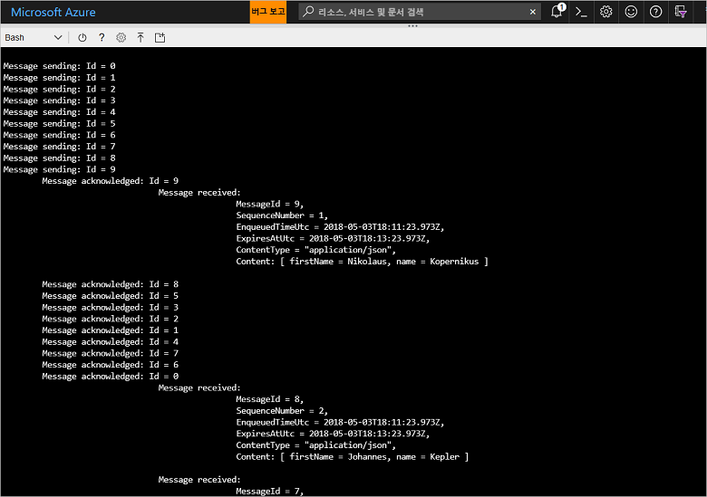

# <a name="quickstart-send-and-receive-messages-using-azure-cli-and-java"></a>빠른 시작: Azure CLI 및 Java를 사용하여 메시지 보내기 및 받기

Microsoft Azure Service Bus는 안전한 메시징과 안정성을 제공하는 엔터프라이즈 통합 메시지 broker입니다. 일반적으로 전형적인 Service Bus 시나리오에는 둘 이상의 응용 프로그램, 서비스 또는 프로세스를 서로 분리하고(응용 프로그램이 동시에 온라인 상태일 필요는 없음), 상태 또는 데이터 변경 내용을 전송하고, 응용 프로그램 간에 메시지를 보내는 작업이 포함됩니다. 

예를 들어 소매 회사는 보급 및 재고 업데이트를 위해 POS(판매 시점 관리) 데이터를 백오피스 또는 지역 유통 센터로 보낼 수 있습니다. 이 경우 클라이언트 응용 프로그램은 Service Bus 큐에서 메시지를 보내고 받습니다.


이 빠른 시작에서는 Azure CLI 및 Service Bus Java 라이브러리를 사용하여 Service Bus에서 메시지를 보내고 받는 방법에 대해 설명합니다. 마지막으로, 더 많은 기술적 세부 정보에 관심이 있으면 샘플 코드의 주요 요소에 대한 [설명을 참조](#understand-the-sample-code)할 수 있습니다.

Azure 구독이 아직 없는 경우 시작하기 전에 [무료 계정][]을 만들 수 있습니다.

[!INCLUDE [cloud-shell-try-it.md](../../includes/cloud-shell-try-it.md)]

## <a name="log-in-to-azure"></a>Azure에 로그인

Azure Portal의 오른쪽 위 모서리에 있는 메뉴에서 Cloud Shell 단추를 클릭하고, **환경 선택** 드롭다운에서 **Bash**를 선택합니다. 

## <a name="use-cli-to-create-resources"></a>CLI를 사용하여 리소스 만들기

Cloud Shell에서 다음 명령을 실행하여 Service Bus 리소스를 프로비전합니다. 모든 자리 표시자를 적절한 값으로 바꿔야 합니다.

```azurecli-interactive
# Create a resource group
az group create --name myResourceGroup --location eastus

# Create a Service Bus messaging namespace with a unique name
namespaceName=myNameSpace$RANDOM
az servicebus namespace create \
   --resource-group myResourceGroup \
   --name $namespaceName \
   --location eastus

# Create a Service Bus queue
az servicebus queue create --resource-group myResourceGroup \
   --namespace-name $namespaceName \
   --name myQueue

# Get the connection string for the namespace
connectionString=$(az servicebus namespace authorization-rule keys list \
   --resource-group myResourceGroup \
   --namespace-name  $namespaceName \
   --name RootManageSharedAccessKey \
   --query primaryConnectionString --output tsv)
```

마지막 명령이 실행되면 선택한 연결 문자열과 큐 이름을 복사하여 메모장과 같은 임시 위치에 붙여넣습니다. 이는 다음 단계에서 필요합니다.

## <a name="send-and-receive-messages"></a>메시지 보내기 및 받기

네임스페이스와 큐가 만들어지고 필요한 자격 증명이 있으면 메시지를 보내고 받을 준비가 됩니다. [이 GitHub 샘플 폴더](https://github.com/Azure/azure-service-bus/tree/master/samples/Java/quickstarts-and-tutorials/quickstart-java/src/main/java/samples/quickstart/SendAndReceiveMessages.java)에서 코드를 검사할 수 있습니다.

1. Cloud Shell이 열려 있는지 확인하고 Bash 프롬프트를 표시합니다.

2. 다음 명령을 실행하여 [Service Bus GitHub 리포지토리](https://github.com/Azure/azure-service-bus/)를 복제합니다.

   ```bash
   git clone https://github.com/Azure/azure-service-bus.git
   ```

2. 슬래시를 경로 구분 기호로 사용하여 현재 디렉터리를 샘플 폴더로 변경합니다.

   ```bash
   cd azure-service-bus/samples/Java/quickstarts-and-tutorials/quickstart-java 
   ```

3. 다음 명령을 실행하여 응용 프로그램을 빌드합니다.
   
   ```bash
   mvn clean package -DskipTests
   ```

4. 프로그램을 실행하려면 다음 명령을 실행합니다. bash 셸을 다시 시작하지 않으면 연결 문자열 값이 포함된 변수가 자동으로 바뀝니다.

   ```bash
   java -jar ./target/samples.quickstart-1.0.0-jar-with-dependencies.jar -c $connectionString -q myQueue
   ```

6. 큐로 보내는 10개의 메시지를 관찰합니다. 메시지 순서는 보장되지 않지만 페이로드 데이터와 함께 보내진 후 승인되고 받은 메시지를 확인할 수 있습니다.

   

## <a name="clean-up-resources"></a>리소스 정리

다음 명령을 실행하여 리소스 그룹, 네임스페이스 및 관련된 모든 리소스를 제거합니다.

```azurecli-interactive
az group delete --resource-group myResourceGroup
```

## <a name="understand-the-sample-code"></a>샘플 코드 이해

이 섹션에는 샘플 코드의 주요 섹션에 대한 자세한 내용이 포함되어 있습니다. [여기](https://github.com/Azure/azure-service-bus/blob/master/samples/Java/quickstarts-and-tutorials/quickstart-java/src/main/java/samples/quickstart/SendAndReceiveMessages.java)의 GitHub 리포지토리에 있는 코드를 찾아볼 수 있습니다.

### <a name="get-connection-string-and-queue"></a>연결 문자열 및 큐 가져오기

먼저, 다음 코드에서는 명령줄에서 인수로 프로그램에 전달되는 두 개의 문자열 변수를 선언합니다.

```java
String ConnectionString = null;
String QueueName = null;
```

이러한 값은 매개 변수를 통해 추가되고 `runApp()` 메서드에 할당됩니다.

```java
public static void main(String[] args) {
    SendAndReceiveMessages app = new SendAndReceiveMessages();
    try {
        app.runApp(args);
        app.run();
    } catch (Exception e) {
        System.out.printf("%s", e.toString());
    }
    System.exit(0);
}

public void runApp(String[] args) {
    try {
        // parse connection string from command line             
        Options options = new Options();
        options.addOption(new Option("c", true, "Connection string"));
        options.addOption(new Option("q", true, "Queue Name"));
        CommandLineParser clp = new DefaultParser();
        CommandLine cl = clp.parse(options, args);
        if (cl.getOptionValue("c") != null && cl.getOptionValue("q") != null) {
            ConnectionString = cl.getOptionValue("c");
            QueueName =  cl.getOptionValue("q");
        }
        else
        {
            HelpFormatter formatter = new HelpFormatter();
            formatter.printHelp("run jar with", "", options, "", true);
        }

    } catch (Exception e) {
        System.out.printf("%s", e.toString());
    }
}
```

### <a name="create-queue-clients-to-send-and-receive"></a>보내고 받을 큐 클라이언트 만들기

메시지를 보내고 받기 위해 `run()` 메서드에서 연결 문자열과 큐 이름에서 구성된 큐 클라이언트 인스턴스를 만듭니다. 이 코드에서는 송신 및 수신 각각에 대해 하나씩 두 개의 큐 클라이언트를 만듭니다.

```java
public void run() throws Exception {
// Create a QueueClient instance for receiving using the connection string builder
// We set the receive mode to "PeekLock", meaning the message is delivered
// under a lock and must be acknowledged ("completed") to be removed from the queue
QueueClient receiveClient = new QueueClient(new ConnectionStringBuilder(ConnectionString, QueueName), ReceiveMode.PEEKLOCK);
this.registerReceiver(receiveClient);

// Create a QueueClient instance for sending and then asynchronously send messages.
QueueClient sendClient = new QueueClient(new ConnectionStringBuilder(ConnectionString, QueueName), ReceiveMode.PEEKLOCK);
```

또한 `run()` 메서드에서 비동기 메시지 보내기 작업을 시작하고, 보내기 작업이 완료되면 보낸 사람을 닫습니다.

```java
this.sendMessagesAsync(sendClient).thenRunAsync(() -> sendClient.closeAsync());
``` 

### <a name="construct-and-send-messages"></a>메시지 구성 및 보내기

`sendMessagesAsync()` 메서드에서 10개 메시지로 구성된 집합을 만들고, 큐 클라이언트를 사용하여 이러한 메시지를 비동기적으로 보냅니다.

```java
CompletableFuture<Void> sendMessagesAsync(QueueClient sendClient) {
List<HashMap<String, String>> data =
        GSON.fromJson(
                "[" +
                        "{'name' = 'Einstein', 'firstName' = 'Albert'}," +
                        "{'name' = 'Heisenberg', 'firstName' = 'Werner'}," +
                        "{'name' = 'Curie', 'firstName' = 'Marie'}," +
                        "{'name' = 'Hawking', 'firstName' = 'Steven'}," +
                        "{'name' = 'Newton', 'firstName' = 'Isaac'}," +
                        "{'name' = 'Bohr', 'firstName' = 'Niels'}," +
                        "{'name' = 'Faraday', 'firstName' = 'Michael'}," +
                        "{'name' = 'Galilei', 'firstName' = 'Galileo'}," +
                        "{'name' = 'Kepler', 'firstName' = 'Johannes'}," +
                        "{'name' = 'Kopernikus', 'firstName' = 'Nikolaus'}" +
                        "]",
                new TypeToken<List<HashMap<String, String>>>() {}.getType());

List<CompletableFuture> tasks = new ArrayList<>();
for (int i = 0; i < data.size(); i++) {
    final String messageId = Integer.toString(i);
    Message message = new Message(GSON.toJson(data.get(i), Map.class).getBytes(UTF_8));
    message.setContentType("application/json");
    message.setLabel("Scientist");
    message.setMessageId(messageId);
    message.setTimeToLive(Duration.ofMinutes(2));
    System.out.printf("\nMessage sending: Id = %s", message.getMessageId());
    tasks.add(
            sendClient.sendAsync(message).thenRunAsync(() -> {
                System.out.printf("\n\tMessage acknowledged: Id = %s", message.getMessageId());
            }));
}
return CompletableFuture.allOf(tasks.toArray(new CompletableFuture<?>[tasks.size()]));
```

### <a name="receive-messages"></a>메시지 받기

`registerReceiver()` 메서드에서 `RegisterMessageHandler` 콜백을 등록하고 일부 메시지 처리기 옵션도 설정합니다.

```java
void registerReceiver(QueueClient queueClient) throws Exception {
    // register the RegisterMessageHandler callback
    queueClient.registerMessageHandler(new IMessageHandler() {
                           // callback invoked when the message handler loop has obtained a message
                           public CompletableFuture<Void> onMessageAsync(IMessage message) {
                               // receives message is passed to callback
                               if (message.getLabel() != null &&
                                       message.getContentType() != null &&
                                       message.getLabel().contentEquals("Scientist") &&
                                       message.getContentType().contentEquals("application/json")) {
                                    byte[] body = message.getBody();
                                   Map scientist = GSON.fromJson(new String(body, UTF_8), Map.class);

                                   System.out.printf(
                                           "\n\t\t\t\tMessage received: \n\t\t\t\t\t\tMessageId = %s, \n\t\t\t\t\t\tSequenceNumber = %s, \n\t\t\t\t\t\tEnqueuedTimeUtc = %s," +
                                                   "\n\t\t\t\t\t\tExpiresAtUtc = %s, \n\t\t\t\t\t\tContentType = \"%s\",  \n\t\t\t\t\t\tContent: [ firstName = %s, name = %s ]\n",
                                           message.getMessageId(),
                                           message.getSequenceNumber(),
                                           message.getEnqueuedTimeUtc(),
                                           message.getExpiresAtUtc(),
                                           message.getContentType(),
                                           scientist != null ? scientist.get("firstName") : "",
                                           scientist != null ? scientist.get("name") : "");
                               }
                               return CompletableFuture.completedFuture(null);
                           }

                           // callback invoked when the message handler has an exception to report
                           public void notifyException(Throwable throwable, ExceptionPhase exceptionPhase) {
                               System.out.printf(exceptionPhase + "-" + throwable.getMessage());
                           }
                       },
    // 1 concurrent call, messages are auto-completed, auto-renew duration
    new MessageHandlerOptions(1, true, Duration.ofMinutes(1)));

}
```

## <a name="next-steps"></a>다음 단계

이 문서에서는 큐에서 메시지를 보내고 받는 데 필요한 Service Bus 네임스페이스 및 기타 리소스를 만들었습니다. 메시지를 보내고 받기 위한 코드를 작성하는 방법에 대해 자세히 알아보려면 Service Bus에 대한 다음 자습서로 계속 진행하세요.

> [!div class="nextstepaction"]
> [CLI 및 Java를 사용하여 재고 업데이트](./service-bus-tutorial-topics-subscriptions-cli.md)

[무료 계정]: https://azure.microsoft.com/free/?ref=microsoft.com&utm_source=microsoft.com&utm_medium=docs&utm_campaign=visualstudio
[fully qualified domain name]: https://wikipedia.org/wiki/Fully_qualified_domain_name
[Install Azure CLI 2.0]: /cli/azure/install-azure-cli
[az group create]: /cli/azure/group#az_group_create