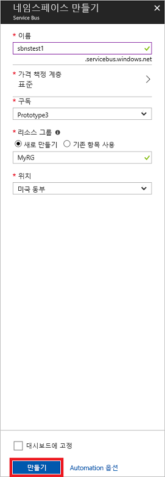

# <a name="quickstart-send-and-receive-messages-using-the-azure-portal-and-net"></a>빠른 시작: Azure Portal 및 .NET을 사용하여 메시지 보내기 및 받기

Microsoft Azure Service Bus는 안전한 메시징과 완벽한 안정성을 제공하는 엔터프라이즈 통합 메시지 broker입니다. 일반적으로 전형적인 Service Bus 시나리오에는 둘 이상의 응용 프로그램, 서비스 또는 프로세스를 서로 분리하고 상태 또는 데이터 변경 내용을 전송하는 작업이 포함됩니다. 이러한 시나리오에는 다른 응용 프로그램 또는 서비스에서 여러 일괄 작업을 예약하거나 주문 처리를 트리거하는 작업이 포함될 수 있습니다. 예를 들어 소매 회사는 보급 및 재고 업데이트를 위해 POS(판매 시점 관리) 데이터를 백오피스 또는 지역 유통 센터로 보낼 수 있습니다. 이 시나리오에서 클라이언트 응용 프로그램은 Service Bus 큐에서 메시지를 보내고 받습니다.  


이 빠른 시작에서는 [Azure Portal][Azure portal]을 사용하여 메시징 네임스페이스 및 해당 네임스페이스 내에 큐를 만들고 네임스페이스에서 권한 부여 자격 증명을 얻은 다음, Service Bus 큐에서 메시지를 보내고 받는 방법을 보여 줍니다. 그런 다음, [.NET 표준 라이브러리](https://www.nuget.org/packages/Microsoft.Azure.ServiceBus)를 사용하여 이 큐에서 메시지를 보내고 받는 방법을 보여 줍니다.

Azure 구독이 아직 없는 경우 시작하기 전에 [무료 계정][]을 만들 수 있습니다.

## <a name="prerequisites"></a>필수 조건

이 자습서를 완료하려면 다음을 설치했어야 합니다.

- [Visual Studio 2017 업데이트 3(버전 15.3, 26730.01)](http://www.visualstudio.com/vs) 이상
- [NET Core SDK](https://www.microsoft.com/net/download/windows) 버전 2.0 이상

## <a name="log-on-to-the-azure-portal"></a>Azure Portal에 로그인

먼저 [Azure Portal][Azure portal]로 이동하고 Azure 구독을 사용하여 로그온합니다. 첫 번째 단계는 **메시징** 유형의 Service Bus 네임스페이스를 만드는 것입니다.

## <a name="create-a-service-bus-namespace"></a>Service Bus 네임스페이스 만들기

Service Bus 메시징 네임스페이스는 [정규화된 도메인 이름][]으로 참조되는 고유한 범위 지정 컨테이너를 제공하며, 하나 이상의 큐, 토픽 및 구독을 만듭니다. 다음 예제에서는 새 또는 기존 [리소스 그룹](/azure/azure-resource-manager/resource-group-portal)에 Service Bus 메시징 네임스페이스를 만듭니다.

1. 포털의 왼쪽 탐색 창에서 **+ 리소스 만들기**, **엔터프라이즈 통합** 및 **Service Bus**를 차례로 클릭합니다.
2. **네임스페이스 만들기** 대화 상자에서 네임스페이스 이름을 입력합니다. 시스템에서 사용 가능한 이름인지 즉시 확인합니다.
3. 네임스페이스 이름을 사용할 수 있는지 확인한 후 가격 책정 계층(표준 또는 프리미엄)을 선택합니다.
4. **구독** 필드에서 네임스페이스를 만들 Azure 구독을 선택합니다.
5. **리소스 그룹** 필드에서 네임스페이스가 있는 기존 리소스 그룹을 선택하거나 새로 만듭니다.      
6. **위치**에서 네임스페이스가 호스트되어야 하는 국가 또는 지역을 선택합니다.
7. **만들기**를 클릭합니다. 이제 시스템이 네임스페이스를 만들고 사용하도록 설정합니다. 시스템이 계정에 대한 리소스를 프로비전하는 동안 몇 분 정도 기다려야 할 수도 있습니다.



### <a name="obtain-the-management-credentials"></a>관리 자격 증명 얻기

새 네임 스페이스를 만들면 네임스페이스의 모든 측면에 대한 모든 권한을 부여하는 기본 및 보조 키의 연결된 쌍을 포함한 초기 SAS(공유 액세스 서명) 규칙이 자동으로 생성됩니다. 초기 규칙을 복사하려면 다음 단계를 수행합니다. 

1.  **모든 리소스**를 클릭한 다음 새로 만든 네임스페이스 이름을 클릭합니다.
2. 네임스페이스 창에서 **공유 액세스 정책**을 클릭합니다.
3. **공유 액세스 정책** 화면에서 **RootManageSharedAccessKey**를 클릭합니다.
4. **정책: RootManageSharedAccessKey** 창에서 **기본 연결 문자열** 옆의 **복사** 단추를 클릭하여 나중에 사용할 수 있도록 연결 문자열을 클립보드에 복사합니다. 메모장이나 기타 다른 위치에 임시로 이 값을 붙여 넣습니다. 

    ![connection-string][connection-string]
5. 이전 단계를 반복하여 나중에 사용할 수 있도록 **기본 키** 값을 복사하여 임시 위치에 붙여넣습니다.

## <a name="create-a-queue"></a>큐 만들기

Service Bus 큐를 만들려면 해당 토픽을 만들 네임스페이스를 지정합니다. 다음 예제에서는 포털에서 큐를 만드는 방법을 보여 줍니다.

1. 포털의 왼쪽 탐색 창에서 **Service Bus**(**Service Bus**가 표시되지 않으면 **더 많은 서비스** 클릭)를 클릭합니다.
2. 큐를 만들려는 네임스페이스를 클릭합니다.
3. 네임스페이스 창에서 **큐**를 클릭한 다음 **큐** 창에서 **+ 큐**를 클릭합니다.
4. **큐 이름**을 입력하고 다른 값을 기본값으로 유지합니다.
5. 창 아래에서 **만들기**를 클릭합니다.
6. 큐 이름을 적어 둡니다.

## <a name="send-and-receive-messages"></a>메시지 보내기 및 받기

네임스페이스와 큐가 프로비전되고 필요한 자격 증명이 있으면 메시지를 보내고 받을 준비가 됩니다. [이 GitHub 샘플 폴더](https://github.com/Azure/azure-service-bus/tree/master/samples/Java/quickstarts-and-tutorials/quickstart-jms)에서 코드를 검사할 수 있습니다.

코드를 실행하려면 다음을 수행합니다.

1. 다음 명령을 실행하여 [Service Bus GitHub 리포지토리](https://github.com/Azure/azure-service-bus/)를 복제합니다.

   ```shell
   git clone https://github.com/Azure/azure-service-bus.git
   ```

3. 다음 샘플 폴더로 이동합니다. `azure-service-bus\samples\DotNet\GettingStarted\BasicSendReceiveQuickStart\BasicSendReceiveQuickStart`

4. [관리 자격 증명 얻기](#obtain-the-management-credentials) 섹션에서 가져온 연결 문자열과 큐 이름을 복사합니다.

5.  명령 프롬프트에서 다음 명령을 입력합니다.

   ```shell
   dotnet build
   ```

6.  `bin\Debug\netcoreapp2.0` 폴더로 이동합니다.

7.  다음 명령을 입력하여 프로그램을 실행합니다. `myConnectionString`을 앞에서 가져온 값으로 바꾸고, `myQueueName`을 만든 큐의 이름으로 바꿔야 합니다.

   ```shell
   dotnet BasicSendReceiveQuickStart.dll -ConnectionString "myConnectionString" -QueueName "myQueueName"
   ``` 

8. 큐에 보낸 10개 메시지를 관찰한 후에 큐에서 받습니다.

   

## <a name="clean-up-resources"></a>리소스 정리

포털을 사용하여 리소스 그룹, 네임스페이스 및 큐를 제거할 수 있습니다.

## <a name="understand-the-sample-code"></a>샘플 코드 이해

이 섹션에는 샘플 코드의 기능에 대한 자세한 내용이 포함되어 있습니다. 

### <a name="get-connection-string-and-queue"></a>연결 문자열 및 큐 가져오기

연결 문자열과 큐 이름은 명령줄 인수로 `Main()` 메서드에 전달됩니다. `Main()`은 다음과 같이 이러한 값을 보유할 두 개의 문자열 변수를 선언합니다.

```csharp
static void Main(string[] args)
{
    string ServiceBusConnectionString = "";
    string QueueName = "";

    for (int i = 0; i < args.Length; i++)
    {
        var p = new Program();
        if (args[i] == "-ConnectionString")
        {
            Console.WriteLine($"ConnectionString: {args[i+1]}");
            ServiceBusConnectionString = args[i + 1]; 
        }
        else if(args[i] == "-QueueName")
        {
            Console.WriteLine($"QueueName: {args[i+1]}");
            QueueName = args[i + 1];
        }                
    }

    if (ServiceBusConnectionString != "" && QueueName != "")
        MainAsync(ServiceBusConnectionString, QueueName).GetAwaiter().GetResult();
    else
    {
        Console.WriteLine("Specify -Connectionstring and -QueueName to execute the example.");
        Console.ReadKey();
    }                            
}
```
 
그런 다음, `Main()` 메서드에서 `MainAsync()` 비동기 메시지 루프를 시작합니다.

### <a name="message-loop"></a>메시지 루프

MainAsync() 메서드는 명령줄 인수를 사용하여 큐 클라이언트를 만들고, `RegisterOnMessageHandlerAndReceiveMessages()`라는 수신 메시지 처리기를 호출하고, 메시지 집합을 보냅니다.

```csharp
static async Task MainAsync(string ServiceBusConnectionString, string QueueName)
{
    const int numberOfMessages = 10;
    queueClient = new QueueClient(ServiceBusConnectionString, QueueName);

    Console.WriteLine("======================================================");
    Console.WriteLine("Press any key to exit after receiving all the messages.");
    Console.WriteLine("======================================================");

    // Register QueueClient's MessageHandler and receive messages in a loop
    RegisterOnMessageHandlerAndReceiveMessages();

    // Send Messages
    await SendMessagesAsync(numberOfMessages);

    Console.ReadKey();

    await queueClient.CloseAsync();
}
```

`RegisterOnMessageHandlerAndReceiveMessages()` 메서드는 단순히 몇 가지 메시지 처리기 옵션을 설정한 다음, 큐 클라이언트의 `RegisterMessageHandler()` 메서드를 호출하여 수신을 시작합니다.

```csharp
static void RegisterOnMessageHandlerAndReceiveMessages()
{
    // Configure the MessageHandler Options in terms of exception handling, number of concurrent messages to deliver etc.
    var messageHandlerOptions = new MessageHandlerOptions(ExceptionReceivedHandler)
    {
        // Maximum number of Concurrent calls to the callback `ProcessMessagesAsync`, set to 1 for simplicity.
        // Set it according to how many messages the application wants to process in parallel.
        MaxConcurrentCalls = 1,

        // Indicates whether MessagePump should automatically complete the messages after returning from User Callback.
        // False below indicates the Complete will be handled by the User Callback as in `ProcessMessagesAsync` below.
        AutoComplete = false
    };

    // Register the function that will process messages
    queueClient.RegisterMessageHandler(ProcessMessagesAsync, messageHandlerOptions);
} 
```

### <a name="send-messages"></a>메시지 보내기

메시지 만들기 및 보내기 작업은 `SendMessagesAsync()` 메서드에서 수행됩니다.

```csharp
static async Task SendMessagesAsync(int numberOfMessagesToSend)
{
    try
    {
        for (var i = 0; i < numberOfMessagesToSend; i++)
        {
            // Create a new message to send to the queue
            string messageBody = $"Message {i}";
            var message = new Message(Encoding.UTF8.GetBytes(messageBody));

            // Write the body of the message to the console
            Console.WriteLine($"Sending message: {messageBody}");

            // Send the message to the queue
            await queueClient.SendAsync(message);
        }
    }
    catch (Exception exception)
    {
        Console.WriteLine($"{DateTime.Now} :: Exception: {exception.Message}");
    }
}
```

### <a name="process-messages"></a>메시지 처리

`ProcessMessagesAsync()` 메서드는 메시지 수신의 승인, 처리 및 완료를 수행합니다.

```csharp
static async Task ProcessMessagesAsync(Message message, CancellationToken token)
{
    // Process the message
    Console.WriteLine($"Received message: SequenceNumber:{message.SystemProperties.SequenceNumber} Body:{Encoding.UTF8.GetString(message.Body)}");

    // Complete the message so that it is not received again.
    await queueClient.CompleteAsync(message.SystemProperties.LockToken);
}
```

## <a name="next-steps"></a>다음 단계

이 문서에서는 큐에서 메시지를 보내고 받는 데 필요한 Service Bus 네임스페이스 및 기타 리소스를 만들었습니다. 메시지를 보내고 받기 위한 코드를 작성하는 방법에 대해 자세히 알아보려면 Service Bus에 대한 다음 자습서로 계속 진행하세요.

> [!div class="nextstepaction"]
> [Azure Portal을 사용하여 재고 업데이트](./service-bus-tutorial-topics-subscriptions-portal.md)


[무료 계정]: https://azure.microsoft.com/free/?ref=microsoft.com&utm_source=microsoft.com&utm_medium=docs&utm_campaign=visualstudio
[정규화된 도메인 이름]: https://wikipedia.org/wiki/Fully_qualified_domain_name
[Azure portal]: https://portal.azure.com/

[connection-string]: ./media/service-bus-quickstart-portal/connection-string.png
[service-bus-flow]: ./media/service-bus-quickstart-portal/service-bus-flow.png
