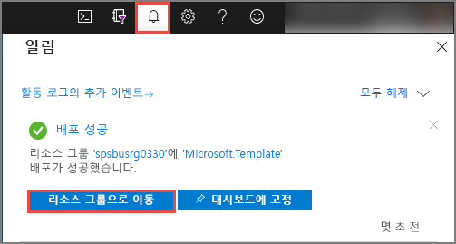
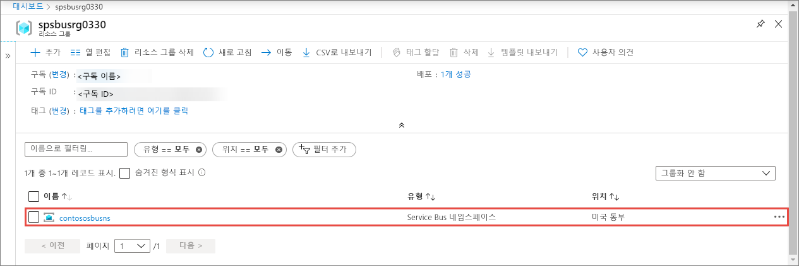
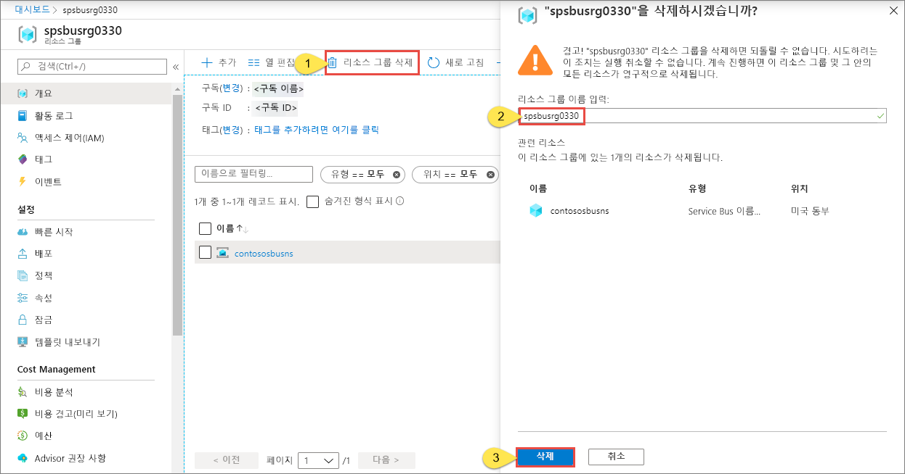

# 빠른 시작: Azure Resource Manager 템플릿을 사용하여 Service Bus 네임스페이스 및 큐 만들기

이 문서에서는 해당 네임스페이스 내에 Service Bus 네임스페이스 및 큐를 만드는 Azure Resource Manager 템플릿을 사용하는 방법을 보여 줍니다. 이 문서는 어떤 리소스를 배포할지 지정하는 방법 및 배포를 실행할 때 지정되는 매개 변수를 정의하는 방법을 설명합니다. 배포를 위해 이 템플릿을 사용하거나 요구 사항에 맞게 사용자 지정을 할 수 있습니다.

[!INCLUDE [About Azure Resource Manager](../../includes/resource-manager-quickstart-introduction.md)]

Azure 구독이 아직 없는 경우 시작하기 전에 [체험](https://azure.microsoft.com/free/) 계정을 만듭니다.

## 사전 요구 사항

None

## Service Bus 네임스페이스 및 큐 만들기

### 템플릿 검토

이 빠른 시작에 사용되는 템플릿은 [Azure 빠른 시작 템플릿](https://azure.microsoft.com/resources/templates/201-servicebus-create-queue)에서 나온 것입니다.

:::code language="json" source="~/quickstart-templates/201-servicebus-create-queue/azuredeploy.json" range="1-75" highlight="31-63":::

템플릿에 정의된 리소스는 다음과 같습니다.

- [**Microsoft.ServiceBus/namespaces**](/azure/templates/microsoft.servicebus/namespaces)
- [**Microsoft.ServiceBus/namespaces/queues**](/azure/templates/microsoft.servicebus/namespaces/queues)

> [!NOTE]
> 다음 Azure Resource Manager 템플릿은 다운로드하여 배포할 수 있습니다.
>
> * [큐 및 권한 부여 규칙이 있는 Service Bus 네임스페이스 만들기](service-bus-resource-manager-namespace-auth-rule.md)
> * [토픽 및 구독이 있는 Service Bus 네임스페이스 만들기](service-bus-resource-manager-namespace-topic.md)
> * [Service Bus 네임스페이스 만들기](service-bus-resource-manager-namespace.md)
> * [토픽, 구독 및 규칙이 있는 Service Bus 네임스페이스 만들기](service-bus-resource-manager-namespace-topic-with-rule.md)

[Azure 빠른 시작 템플릿](https://azure.microsoft.com/resources/templates/?resourceType=Microsoft.Servicebus&pageNumber=1&sort=Popular)에서 추가 템플릿을 찾을 수 있습니다.

### 템플릿 배포

이 템플릿으로 큐가 있는 Service Bus 네임스페이스를 배포합니다.

[Service Bus 큐](service-bus-queues-topics-subscriptions.md#queues)는 하나 이상의 경쟁 소비자에게 FIFO(선입선출) 메시지 배달을 제공합니다.

배포를 자동으로 실행하려면 다음 단추를 클릭합니다. 나중에 쉽게 정리할 수 있도록 배포에 대한 새 리소스 그룹을 만듭니다.

## 배포 확인

1. 배포 상태를 확인하려면 맨 위에 있는 **알림**을 선택합니다. 배포가 성공할 때까지 기다립니다. 그런 다음, 알림 메시지에서 **리소스 그룹으로 이동**을 선택하여 Service Bus 네임스페이스가 포함된 리소스 그룹의 페이지로 이동합니다. 

    
2. 리소스 목록에 Service Bus 네임스페이스가 표시되는지 확인합니다. 

    
3. 목록에서 네임스페이스를 선택하여 **Service Bus 네임스페이스** 페이지를 표시합니다. 

## 리소스 정리

1. Azure Portal에서 리소스 그룹의 **리소스 그룹** 페이지로 이동합니다.
2. 도구 모음에서 **리소스 그룹 삭제**를 선택합니다. 
3. 리소스 그룹의 이름을 입력하고 **삭제**를 선택합니다. 

    

## 다음 단계

네임스페이스/큐에 대한 권한 부여 규칙을 만드는 방법을 보여주는 다음 토픽을 참조하세요.

[Azure Resource Manager 템플릿을 사용하여 네임스페이스 및 큐에 대한 Service Bus 권한 부여 규칙 만들기](service-bus-resource-manager-namespace-auth-rule.md)

다음 문서를 검토하여 이러한 리소스를 관리하는 방법을 알아보세요.

* [PowerShell을 사용하여 Service Bus 관리](service-bus-manage-with-ps.md)
* [Service Bus 탐색기로 Service Bus 리소스 관리](https://github.com/paolosalvatori/ServiceBusExplorer/releases)

[Authoring Azure Resource Manager templates]: ../azure-resource-manager/templates/template-syntax.md
[Service Bus namespace and queue template]: https://github.com/Azure/azure-quickstart-templates/blob/master/201-servicebus-create-queue/
[Azure Quickstart Templates]: https://azure.microsoft.com/documentation/templates/?term=service+bus
[Learn more about Service Bus queues]: service-bus-queues-topics-subscriptions.md
[Using Azure PowerShell with Azure Resource Manager]: ../azure-resource-manager/powershell-azure-resource-manager.md
[Using the Azure CLI for Mac, Linux, and Windows with Azure Resource Management]: ../azure-resource-manager/xplat-cli-azure-resource-manager.md
