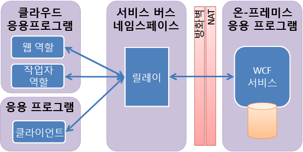

<properties
	pageTitle="Service Bus Relay 개요 | Microsoft Azure"
	description="서비스 버스 릴레이 개요"
	services="service-bus-relay"
	documentationCenter=".net"
	authors="sethmanheim"
	manager="timlt"
	editor=""/>

<tags
	ms.service="service-bus-relay"
	ms.workload="na"
	ms.tgt_pltfrm="na"
	ms.devlang="multiple"
	ms.topic="get-started-article"
	ms.date="09/01/2016"
	ms.author="sethm"/>

# Service Bus Relay 개요

Service Bus의 주요 구성 요소는 Azure 데이터 센터와 고유한 온-프레미스 엔터프라이즈 환경 모두에서 실행되는 하이브리드 응용 프로그램을 빌드할 수 있도록 하는 중앙(하지만 부하 분산이 잘 된) *릴레이* 서비스입니다. Service Bus Relay는 다양한 전송 프로토콜 및 웹 서비스 표준을 지원합니다. 여기에는 SOAP, WS-*, 및 REST가 포함됩니다. 릴레이 서비스는 방화벽 연결을 열거나 회사 네트워크 인프라를 주입식으로 변경하지 않고도 회사 엔터프라이즈 네트워크 내에 있는 WCF(Windows Communication Foundation) 서비스를 공용 클라우드에 안전하게 노출할 수 있게 함으로써 이 작업을 도와줍니다.

릴레이 서비스는 기존의 단방향 메시징, 요청/응답 메시징, 및 피어투피어 메시징을 지원합니다. 또한 인터넷에서 이벤트 배포를 지원하여 향상된 지점간 효율성을 위한 양방향 소켓 통신과 게시/구독 시나리오를 가능하게 합니다.

릴레이된 메시징 패턴에서는 온-프레미스 서비스가 아웃바운드 포트를 통해 릴레이 서비스에 연결하고 특정 랑데부 주소와 연결된 통신에 사용할 양방향 소켓을 만듭니다. 그러면 클라이언트는 랑데부 주소를 대상으로 하는 릴레이 서비스에 메시지를 전송하여 온-프레미스 서비스와 통신할 수 있습니다. 그 후 릴레이 서비스는 이미 존재하는 양방향 소켓을 통해 온-프레미스 서비스에 메시지를 “릴레이”합니다. 클라이언트는 온-프레미스 서비스에 대한 직접 연결이 필요 없고, 서비스가 상주하는 위치를 알 필요가 없고, 온-프레미스 서비스는 방화벽에 열려 있는 인바운드 포트가 필요 없습니다.

WCF “릴레이” 바인딩 모음을 사용하여 온-프레미스 서비스와 릴레이 서비스 사이의 연결을 시작합니다. 내부적으로, 릴레이 바인딩은 클라우드에서 서비스 버스와 통합하는 WCF 채널 구성 요소를 생성하도록 설계된 새로운 전송 바인딩 요소에 매핑합니다.

## 다음 단계

Service Bus Relay에 대한 자세한 내용은 다음 항목을 참조하세요.

- [Azure 서비스 버스 아키텍처 개요](../service-bus/service-bus-fundamentals-hybrid-solutions.md)
- [Service Bus Relay 서비스를 사용하는 방법](../service-bus-relay/service-bus-dotnet-how-to-use-relay.md)

 

<!---HONumber=AcomDC_0928_2016-->