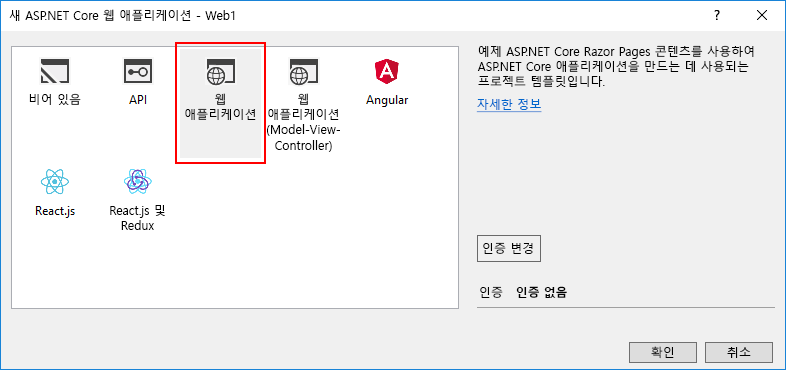
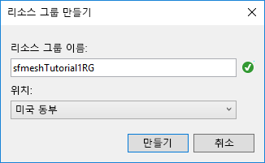

# <a name="quickstart-create-and-deploy-a-web-app-to-azure-service-fabric-mesh"></a>빠른 시작: 웹앱 만들기 및 Azure Service Fabric Mesh에 배포

Azure Service Fabric Mesh는 개발자가 가상 머신, 저장소 또는 네트워킹을 관리하지 않고 마이크로 서비스 응용 프로그램을 배포할 수 있는 완전히 관리되는 서비스입니다.

이 빠른 시작에서는 ASP.NET Core 웹앱으로 구성된 새 Service Fabric Mesh 응용 프로그램을 만들어 로컬 개발 클러스터에서 실행한 다음, Azure에서 실행되도록 게시합니다.

Azure 구독이 필요합니다. Azure 구독이 아직 없는 경우, 시작하기 전에 [체험 계정을 만들어](https://azure.microsoft.com/free/) 체험 Azure 구독을 쉽게 만들 수 있습니다. [개발자 환경도 설정](service-fabric-mesh-howto-setup-developer-environment-sdk.md)해야 합니다.

[!INCLUDE [preview note](./includes/include-preview-note.md)]

## <a name="create-a-service-fabric-mesh-project"></a>Service Fabric Mesh 프로젝트 만들기

Visual Studio를 열고 **파일** > **새로 만들기** > **프로젝트...** 를 선택합니다.

**새 프로젝트** 대화 상자의 맨 위에 있는 **검색** 상자에 `mesh`를 입력합니다. **Service Fabric Mesh 응용 프로그램** 템플릿을 선택합니다. 템플릿이 표시되지 않는 경우, [개발 환경 설정](service-fabric-mesh-howto-setup-developer-environment-sdk.md)에 설명된 대로 Mesh SDK 및 VS 도구 미리 보기를 설치했는지 확인합니다. 

**이름** 상자에 **ServiceFabricMesh1**을 입력하고, **위치** 상자에서 프로젝트의 파일이 저장될 위치의 폴더 경로를 설정합니다.

**솔루션 디렉터리 만들기**가 선택되어 있는지 확인하고 **확인**을 클릭하여 Service Fabric Mesh 프로젝트를 만듭니다.


### <a name="create-a-service"></a>서비스 만들기

**확인**을 클릭하면 **새 Service Fabric 서비스** 대화 상자가 나타납니다. **ASP.NET Core** 프로젝트 형식을 선택하고, **컨테이너 OS**가 **Windows**로 설정되었는지 확인한 다음, **확인**을 클릭하여 ASP.NET Core 프로젝트를 만듭니다. 


**새 ASP.NET Core 웹 응용 프로그램** 대화 상자가 나타납니다. **웹 응용 프로그램**을 선택하고 **확인**을 클릭합니다.



Visual Studio에서 Service Fabric Mesh 응용 프로그램 프로젝트와 ASP.NET Core 프로젝트를 만듭니다.

## <a name="build-and-publish-to-your-local-cluster"></a>빌드 및 로컬 클러스터에 게시

Docker 이미지는 프로젝트가 로드되는 즉시 자동으로 빌드되고 로컬 클러스터에 게시됩니다. 이 프로세스는 시간이 약간 걸릴 수 있습니다. 필요한 경우, **출력** 창 드롭다운에서 **Service Fabric 도구** 항목을 선택하여 **출력** 창에서 Service Fabric 도구의 진행 상황을 모니터링할 수 있습니다. Docker 이미지를 배포하는 동안 계속 작업할 수 있습니다.

프로젝트가 생성된 후 **F5** 키를 클릭하여 로컬에서 서비스를 디버그합니다. 로컬 배포가 완료되었으며 Visual Studio에서 프로젝트를 실행하는 경우, 브라우저 창이 열리고 샘플 웹 페이지가 표시됩니다.

배포된 서비스 검색을 마쳤으면 Visual Studio에서 **Shift+F5**를 눌러 프로젝트 디버그를 중지합니다.

## <a name="publish-to-azure"></a>Azure에 게시

Service Fabric Mesh 프로젝트를 Azure에 게시하려면 Visual Studio에서 **Service Fabric Mesh 프로젝트**를 마우스 오른쪽 단추로 클릭하고 **게시...** 를 선택합니다.


**Service Fabric 응용 프로그램 게시** 대화 상자가 표시됩니다.


Azure 계정과 구독을 선택합니다. **위치**를 선택합니다. 이 문서에서는 **미국 동부**를 사용합니다.

**리소스 그룹**에서 **\<새 리소스 그룹 만들기...>** 를 선택합니다. **리소스 그룹 만들기** 대화 상자가 나타납니다. **리소스 그룹 이름** 및 **위치**를 설정합니다.  이 빠른 시작에서는 **미국 동부** 위치를 사용하고 그룹 이름을 **sfmeshTutorial1RG**로 지정합니다. 조직에 동일한 구독을 사용하는 여러 사람이 있는 경우, 고유한 리소스 그룹 이름을 선택합니다.  **만들기**를 클릭하여 리소스 그룹을 만들고 게시 대화 상자로 돌아갑니다.



**Service Fabric 응용 프로그램 게시** 대화 상자로 돌아간 다음, **Azure Container Registry**에서 **\<새 컨테이너 레지스트리 만들기...>** 를 선택합니다. **컨테이너 레지스트리 만들기** 대화 상자에서 **컨테이너 레지스트리 이름**에 대해 고유한 이름을 사용합니다. **위치**를 지정합니다. 이 빠른 시작에서는 **미국 동부**를 사용합니다. 이전 단계에서 만든 **리소스 그룹**(예: **sfmeshTutorial1RG**)을 드롭다운에서 선택합니다. **SKU**를 **기본**으로 설정하고 **만들기**를 클릭하여 게시 대화 상자로 돌아갑니다.


게시 대화 상자에서 **게시** 단추를 클릭하여 Service Fabric Mesh 응용 프로그램을 Azure에 배포합니다.

처음으로 Azure에 게시하는 경우, Docker 이미지가 ACR(Azure Container Registry)에 게시되며, 이미지 크기에 따라 시간이 걸립니다. 이후에 동일한 프로젝트를 게시할 때는 속도가 더 빠릅니다. Visual Studio **출력** 창 드롭다운에서 **Service Fabric 도구**를 선택하면 배포 진행 상황을 모니터링할 수 있습니다. 배포가 완료되면 **Service Fabric 도구** 출력에 응용 프로그램의 IP 주소 및 포트가 URL 형태로 표시됩니다.

```json
Packaging Application...
Building Images...
Web1 -> C:\Code\ServiceFabricMesh1\Web1\bin\Any CPU\Release\netcoreapp2.0\Web1.dll
Uploading the images to Azure Container Registry...
Deploying application to remote endpoint...
The application was deployed successfully and it can be accessed at http://...
```

웹 브라우저를 열고 URL로 이동하여 Azure에서 실행되는 웹 사이트를 확인합니다.


## <a name="clean-up-resources"></a>리소스 정리

더 이상 필요하지 않은 경우, 이 빠른 시작을 위해 만든 리소스를 모두 삭제합니다. ACR 및 Service Fabric Mesh 서비스 리소스를 둘 다 호스트할 새 리소스 그룹을 만들었으므로 이 리소스 그룹을 안전하게 삭제할 수 있으며, 연결된 모든 리소스를 이 방법으로 쉽게 삭제할 수 있습니다.

```azurecli
az group delete --resource-group sfmeshTutorial1RG
```

```powershell
Connect-AzureRmAccount
Remove-AzureRmResourceGroup -Name sfmeshTutorial1RG
```

또는 [Azure Portal](https://portal.azure.com)에서 리소스 그룹을 삭제할 수 있습니다.

## <a name="next-steps"></a>다음 단계

Service Fabric Mesh 응용 프로그램을 만들고 배포하는 방법을 자세히 알아보려면 자습서를 계속 진행합니다.
> [!div class="nextstepaction"]
> [다중 서비스 웹 응용 프로그램 만들기, 디버그 및 Service Fabric Mesh에 배포](service-fabric-mesh-tutorial-create-dotnetcore.md)