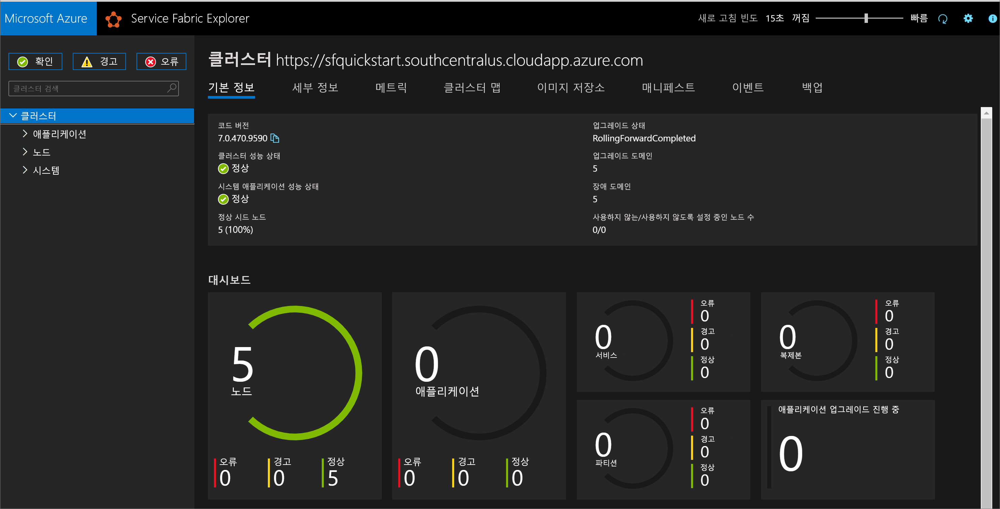
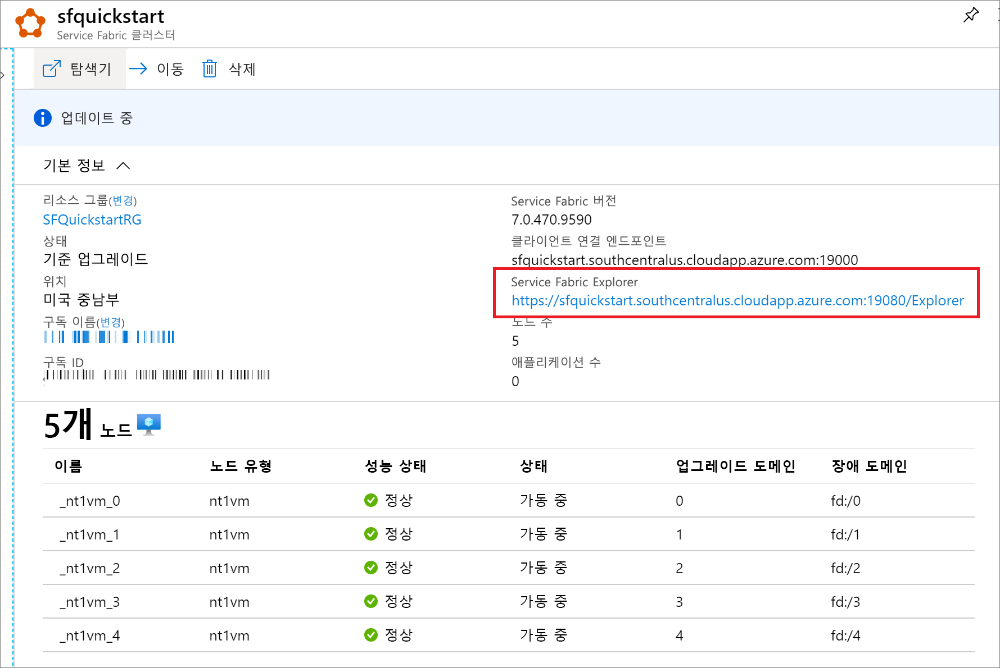

# <a name="quickstart-create-a-service-fabric-cluster-using-arm-template"></a>빠른 시작: ARM 템플릿을 사용하여 Service Fabric 클러스터 만들기

Azure Service Fabric은 손쉽게 패키지하고 배포하며 확장 가능하고 안정성이 뛰어난 마이크로 서비스 및 컨테이너를 관리하도록 배포된 시스템 플랫폼입니다. Service Fabric *클러스터*는 네트워크로 연결된 가상 머신 세트로, 여기에 마이크로서비스를 배포하여 관리하게 됩니다. 이 문서에서는 ARM 템플릿(Azure Resource Manager 템플릿)을 사용하여 Azure에 Service Fabric 테스트 클러스터를 배포하는 방법을 설명합니다.

[!INCLUDE [About Azure Resource Manager](../../includes/resource-manager-quickstart-introduction.md)]

5개 노드로 구성된 이 Windows 클러스터는 자체 서명된 인증서로 보호되므로 프로덕션 워크로드가 아닌 교육용으로만 사용됩니다. Azure PowerShell을 사용하여 템플릿을 배포하겠습니다. Azure PowerShell 외에도 Azure Portal, Azure CLI 및 REST API를 사용할 수 있습니다. 다른 배포 방법을 알아보려면 [템플릿 배포](../azure-resource-manager/templates/deploy-portal.md)를 참조하세요.

환경이 필수 구성 요소를 충족하고 ARM 템플릿 사용에 익숙한 경우 **Azure에 배포** 단추를 선택합니다. 그러면 Azure Portal에서 템플릿이 열립니다.

[](https://portal.azure.com/#create/Microsoft.Template/uri/https%3A%2F%2Fraw.githubusercontent.com%2FAzure%2Fazure-quickstart-templates%2Fmaster%2Fservice-fabric-secure-cluster-5-node-1-nodetype%2Fazuredeploy.json)

## <a name="prerequisites"></a>필수 구성 요소

Azure 구독이 아직 없는 경우 시작하기 전에 [체험](https://azure.microsoft.com/free/) 계정을 만듭니다.

### <a name="install-service-fabric-sdk-and-powershell-modules"></a>Service Fabric SDK 및 PowerShell 모듈 설치

이 빠른 시작을 완료하려면 다음이 필요합니다.

* [Service Fabric SDK 및 PowerShell 모듈](service-fabric-get-started.md)을 설치합니다.

* [Azure PowerShell](https://docs.microsoft.com/powershell/azure/install-Az-ps)을 설치합니다.

### <a name="download-the-sample-template-and-certificate-helper-script"></a>샘플 템플릿과 인증서 도우미 스크립트 다운로드

[Azure Resource Manager 빠른 시작 템플릿](https://github.com/Azure/azure-quickstart-templates) 리포지토리를 복제하거나 다운로드합니다. 또는 우리가 사용할 다음 파일을 *service-fabric-secure-cluster-5-node-1-nodetype* 폴더에 로컬로 복사합니다.

* [New-ServiceFabricClusterCertificate.ps1](https://raw.githubusercontent.com/Azure/azure-quickstart-templates/master/service-fabric-secure-cluster-5-node-1-nodetype/New-ServiceFabricClusterCertificate.ps1)
* [azuredeploy.json](https://raw.githubusercontent.com/Azure/azure-quickstart-templates/master/service-fabric-secure-cluster-5-node-1-nodetype/azuredeploy.json)
* [azuredeploy.parameters.json](https://raw.githubusercontent.com/Azure/azure-quickstart-templates/master/service-fabric-secure-cluster-5-node-1-nodetype/azuredeploy.parameters.json)

### <a name="sign-in-to-azure"></a>Azure에 로그인

Azure에 로그인하고 Service Fabric 클러스터를 만드는 데 사용할 구독을 지정합니다.

```powershell
# Sign in to your Azure account
Login-AzAccount -SubscriptionId "<subscription ID>"
```

### <a name="create-a-self-signed-certificate-stored-in-key-vault"></a>Key Vault에 저장되는 자체 서명된 인증서를 만듭니다.

Service Fabric은 X.509 인증서를 사용하여 [클러스터를 보호](./service-fabric-cluster-security.md)하고 애플리케이션 보안 기능을 제공하며, [Key Vault](../key-vault/general/overview.md)를 사용하여 이러한 인증서를 관리합니다. 성공적으로 클러스터를 만들려면 클러스터 인증서를 사용하여 노드 간 통신을 설정해야 합니다. 이 빠른 시작 테스트 클러스터를 만드는 목적을 달성하기 위해, 클러스터 인증용 자체 서명된 인증서를 만들겠습니다. 프로덕션 워크로드를 사용하려면 올바르게 구성된 Windows Server 인증서 서비스 또는 승인된 CA(인증 기관) 중 한 곳에서 발급한 인증서를 사용해야 합니다.

```powershell
# Designate unique (within cloudapp.azure.com) names for your resources
$resourceGroupName = "SFQuickstartRG"
$keyVaultName = "SFQuickstartKV"

# Create a new resource group for your Key Vault and Service Fabric cluster
New-AzResourceGroup -Name $resourceGroupName -Location SouthCentralUS

# Create a Key Vault enabled for deployment
New-AzKeyVault -VaultName $KeyVaultName -ResourceGroupName $resourceGroupName -Location SouthCentralUS -EnabledForDeployment

# Generate a certificate and upload it to Key Vault
.\New-ServiceFabricClusterCertificate.ps1
```

이 스크립트는 다음 정보를 묻습니다. 아래 예제의 값에서 *CertDNSName* 및 *KeyVaultName*을 꼭 수정하세요.

* **암호:** Password!1
* **CertDNSName:** *sfquickstart*.southcentralus.cloudapp.azure.com
* **KeyVaultName:** *SFQuickstartKV*
* **KeyVaultSecretName:** clustercert

완료되면 스크립트에서 템플릿 배포에 필요한 매개 변수 값을 제공합니다. 이러한 값은 클러스터 템플릿을 배포할 때 필요하므로 다음 변수에 반드시 저장해 두세요.

```powershell
$sourceVaultId = "<Source Vault Resource Id>"
$certUrlValue = "<Certificate URL>"
$certThumbprint = "<Certificate Thumbprint>"
```

## <a name="review-the-template"></a>템플릿 검토

이 빠른 시작에서 사용되는 템플릿은 [Azure 빠른 시작 템플릿](https://azure.microsoft.com/resources/templates/service-fabric-secure-cluster-5-node-1-nodetype/)에서 나온 것입니다. 이 문서의 템플릿이 너무 길어서 여기에 표시할 수 없습니다. 템플릿을 보려면 [azuredeploy.json](https://raw.githubusercontent.com/Azure/azure-quickstart-templates/master/service-fabric-secure-cluster-5-node-1-nodetype/azuredeploy.json) 파일을 참조하세요.

템플릿에 여러 Azure 리소스가 정의되어 있습니다.

* [Microsoft.Storage/storageAccounts](/azure/templates/microsoft.storage/storageaccounts)
* [Microsoft.Network/virtualNetworks](/azure/templates/microsoft.network/virtualnetworks)
* [Microsoft.Network/publicIPAddresses](/azure/templates/microsoft.network/publicipaddresses)
* [Microsoft.Network/loadBalancers](/azure/templates/microsoft.network/loadbalancers)
* [Microsoft.Compute/virtualMachineScaleSets](/azure/templates/microsoft.compute/virtualmachinescalesets)
* [Microsoft.ServiceFabric/clusters](/azure/templates/microsoft.servicefabric/clusters)

Azure Service Fabric에 관련된 더 많은 템플릿을 찾으려면 [Azure 빠른 시작 템플릿](https://azure.microsoft.com/resources/templates/?sort=Popular&term=service+fabric)을 참조하세요.

### <a name="customize-the-parameters-file"></a>매개 변수 파일 사용자 지정

*azuredeploy.parameters.json* 파일을 열고 매개 변수 값이 다음과 같이 되도록 편집합니다.

* **clusterName**은 클러스터 인증서를 만들 때 *CertDNSName*으로 입력한 값과 일치합니다.
* **adminUserName**은 기본 *GEN-UNIQUE* 토큰이 아닌 다른 값입니다.
* **adminPassword**는 기본 *GEN-PASSWORD* 토큰이 아닌 다른 값입니다.
* **certificateThumbprint**, **sourceVaultResourceId** 및 **certificateUrlValue**는 모두 빈 문자열(`""`)입니다.

예를 들면 다음과 같습니다.

```json
{
  "$schema": "https://schema.management.azure.com/schemas/2019-04-01/deploymentParameters.json#",
  "contentVersion": "1.0.0.0",
  "parameters": {
    "clusterName": {
      "value": "sfquickstart"
    },
    "adminUsername": {
      "value": "testadm"
    },
    "adminPassword": {
      "value": "Password#1234"
    },
    "certificateThumbprint": {
      "value": ""
    },
    "sourceVaultResourceId": {
      "value": ""
    },
    "certificateUrlValue": {
      "value": ""
    }
  }
}
```

## <a name="deploy-the-template"></a>템플릿 배포

ARM 템플릿 및 매개 변수 파일의 경로를 변수에 저장한 다음, 템플릿을 배포합니다.

```powershell
$templateFilePath = "<full path to azuredeploy.json>"
$parameterFilePath = "<full path to azuredeploy.parameters.json>"

New-AzResourceGroupDeployment `
    -ResourceGroupName $resourceGroupName `
    -TemplateFile $templateFilePath `
    -TemplateParameterFile $parameterFilePath `
    -CertificateThumbprint $certThumbprint `
    -CertificateUrlValue $certUrlValue `
    -SourceVaultResourceId $sourceVaultId `
    -Verbose
```

## <a name="review-deployed-resources"></a>배포된 리소스 검토

배포가 완료되면 출력에서 `managementEndpoint` 값을 찾고 웹 브라우저에서 주소를 열어 [Service Fabric Explorer](./service-fabric-visualizing-your-cluster.md)에서 클러스터를 확인합니다.



Azure Portal의 서비스 탐색기 리소스 블레이드에서 Service Fabric Explorer 엔드포인트를 찾을 수도 있습니다.



## <a name="clean-up-resources"></a>리소스 정리

더 이상 필요 없으면 리소스 그룹을 삭제합니다. 그러면 리소스 그룹의 리소스가 삭제됩니다.

```powershell
$resourceGroupName = Read-Host -Prompt "Enter the Resource Group name"
Remove-AzResourceGroup -Name $resourceGroupName
Write-Host "Press [ENTER] to continue..."
```

## <a name="next-steps"></a>다음 단계

사용자 지정 Azure Service Fabric 클러스터 템플릿을 만드는 방법에 대한 자세한 내용은 다음을 참조하세요.

> [!div class="nextstepaction"]
> [Service Fabric 클러스터 Resource Manager 템플릿 만들기](service-fabric-cluster-creation-create-template.md)
