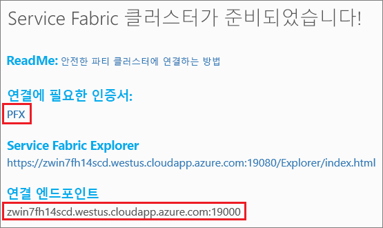

# <a name="quickstart-deploy-windows-containers-to-service-fabric"></a>빠른 시작: Windows 컨테이너를 Service Fabric에 배포

Azure Service Fabric은 확장성 있고 안정성이 뛰어난 마이크로 서비스 및 컨테이너를 배포 및 관리하기 위한 분산 시스템 플랫폼입니다.

Service Fabric 클러스터의 Windows 컨테이너에서 기존 응용 프로그램을 실행하더라도 응용 프로그램을 변경할 필요가 없습니다. 이 빠른 시작에서는 Service Fabric 응용 프로그램에서 미리 작성된 Docker 컨테이너 이미지를 배포하는 방법을 보여줍니다. 완료하면 Windows Server 2016 Nano 서버 및 IIS 컨테이너를 실행하게 됩니다. 이 빠른 시작에서는 Windows 컨테이너 배포에 대해 설명합니다. [이 빠른 시작](service-fabric-quickstart-containers-linux.md)을 참고하여 Linux 컨테이너를 배포합니다.

![IIS default web page][iis-default]

이 빠른 시작에서 다음을 수행하는 방법을 알아봅니다.

* Docker 이미지 컨테이너 패키징
* 통신 구성
* Service Fabric 응용 프로그램 빌드 및 패키징
* Azure에 컨테이너 응용 프로그램 배포

## <a name="prerequisites"></a>필수 조건

* Azure 구속([체험 계정](https://azure.microsoft.com/free/?WT.mc_id=A261C142F)을 만들 수 있음)
* 다음을 실행하는 개발 컴퓨터
  * Visual Studio 2015 또는 Visual Studio 2017.
  * [Service Fabric SDK 및 도구](service-fabric-get-started.md)

## <a name="package-a-docker-image-container-with-visual-studio"></a>Visual Studio에서 Docker 이미지 컨테이너 패키징

Service Fabric SDK 및 도구는 컨테이너를 Service Fabric 클러스터에 배포할 수 있는 서비스 템플릿을 제공합니다.

"관리자" 권한으로 Visual Studio를 시작합니다.  **파일** > **새로 만들기** > **프로젝트**를 선택합니다.

**Service Fabric 응용 프로그램**을 선택하고 "MyFirstContainer"라는 이름을 지정하고 **확인**을 클릭합니다.

**호스트된 컨테이너 및 응용 프로그램** 템플릿에서 **컨테이너**를 선택합니다.

**이미지 이름**에 [Windows Server Nano Server 및 IIS 기본 이미지](https://hub.docker.com/r/microsoft/iis/)인 "microsoft/iis:nanoserver"를 입력합니다.

포트 80의 서비스로 들어오는 요청이 컨테이너의 포트 80에 매핑되도록 컨테이너 포트와 호스트 포트 간 매핑을 구성합니다.  **컨테이너 포트**를 "80"으로, **호스트 포트**를 "80"으로 설정합니다.  

"MyContainerService" 서비스 이름을 지정하고 **확인**을 클릭합니다.

![새 서비스 대화 상자][new-service]

## <a name="specify-the-os-build-for-your-container-image"></a>컨테이너 이미지에 대한 OS 빌드 지정
특정 버전의 Windows Server를 사용하여 빌드한 컨테이너는 다른 버전의 Windows Server를 실행하는 호스트에서 실행되지 않을 수 있습니다. 예를 들어 Windows Server 버전 1709를 사용하여 빌드한 컨테이너는 Windows Server 2016을 실행하는 호스트에서 실행되지 않습니다. 자세히 알아보려면 [Windows Server 컨테이너 OS 및 호스트 OS 호환성](service-fabric-get-started-containers.md#windows-server-container-os-and-host-os-compatibility)을 참조하세요. 

Service Fabric 런타임 버전 6.1 이상을 사용하여 컨테이너당 여러 OS 이미지를 지정하고 각각을 배포되어야 하는 OS의 빌드 버전으로 태그 지정할 수 있습니다. 이렇게 하면 응용 프로그램이 서로 다른 버전의 Windows OS를 실행하는 호스트에서 실행되는지 확인할 수 있습니다. 자세히 알아보려면 [OS 빌드 관련 컨테이너 이미지 지정](service-fabric-get-started-containers.md#specify-os-build-specific-container-images)을 참조하세요. 

Microsoft는 다른 버전의 Windows Server에서 빌드한 IIS 버전에 대한 서로 다른 이미지를 게시합니다. Service Fabric이 응용 프로그램을 배포하는 클러스터 노드에서 실행 중인 Windows Server의 버전과 호환되는 컨테이너를 배포하는지 확인하려면 *ApplicationManifest.xml* 파일에 다음 줄을 추가합니다. Windows Server 2016에 대한 빌드 버전은 14393이며 Windows Server 버전 1709의 빌드 버전은 16299입니다. 

```xml
    <ContainerHostPolicies CodePackageRef="Code"> 
      <ImageOverrides> 
        ...
          <Image Name="microsoft/iis:nanoserverDefault" /> 
          <Image Name= "microsoft/iis:nanoserver" Os="14393" /> 
          <Image Name="microsoft/iis:windowsservercore-1709" Os="16299" /> 
      </ImageOverrides> 
    </ContainerHostPolicies> 
```

서비스 매니페스트는 nanoserver, `microsoft/iis:nanoserver`에 대한 하나의 이미지만을 계속해서 지정합니다. 

## <a name="create-a-cluster"></a>클러스터 만들기

애플리케이션을 Azure의 클러스터에 배포하려면 Party 클러스터에 조인할 수 있습니다. Party 클러스터는 평가판으로, Azure에서 호스트되고 Service Fabric 팀이 실행하는 제한 시간 Service Fabric 클러스터입니다. 여기서 누구나 응용 프로그램을 배포하고 플랫폼에 대해 알아볼 수 있습니다.  클러스터는 노드-노드뿐만 아니라 클라이언트-노드 보안에도 단일 자체 서명 인증서를 사용합니다. 파티 클러스터가 컨테이너를 지원합니다. 자체 클러스터를 설정하고 사용하려는 경우 컨테이너를 지원하는 SKU에서 클러스터가 실행되어야 합니다(예: 컨테이너가 있는 Windows Server 2016 데이터 센터).

[Windows 클러스터에 로그인하고 조인](https://aka.ms/tryservicefabric)합니다. **PFX** 링크를 클릭하여 PFX 인증서를 컴퓨터에 다운로드합니다. **보안 Party 클러스터에 연결하는 방법** 링크를 클릭하고 인증서 암호를 복사합니다. 인증서, 인증서 암호 및 **연결 엔드포인트** 값은 다음 단계에서 사용됩니다.



> [!Note]
> 시간당 사용 가능한 Party 클러스터의 수가 제한되어 있습니다. Party 클러스터에 등록하려고 할 때 오류가 발생하면, 일정 기간 동안 기다린 후 다시 시도하거나, [.NET 응용 프로그램 배포](https://docs.microsoft.com/azure/service-fabric/service-fabric-tutorial-deploy-app-to-party-cluster#deploy-the-sample-application) 자습서에서 이러한 단계를 수행하여 Azure 구독에 Service Fabric 클러스터를 만들고 이 클러스터에 응용 프로그램을 배포할 수 있습니다. Visual Studio를 통해 만들어진 클러스터는 컨테이너를 지원합니다. 클러스터에 애플리케이션을 배포하고 유효성을 확인한 후에는 이 빠른 시작의 [Service Fabric 애플리케이션 및 서비스 매니페스트의 전체 예제](#complete-example-service-fabric-application-and-service-manifests)로 건너뛸 수 있습니다.
>

Windows 컴퓨터에서 *CurrentUser\My* 인증서 저장소에 PFX를 설치합니다.

```powershell
PS C:\mycertificates> Import-PfxCertificate -FilePath .\party-cluster-873689604-client-cert.pfx -CertStoreLocation Cert:\CurrentUser\My -Password (ConvertTo-SecureString 873689604 -AsPlainText -Force)


  PSParentPath: Microsoft.PowerShell.Security\Certificate::CurrentUser\My

Thumbprint                                Subject
----------                                -------
3B138D84C077C292579BA35E4410634E164075CD  CN=zwin7fh14scd.westus.cloudapp.azure.com
```

다음 단계를 위해 지문을 기억합니다.

## <a name="deploy-the-application-to-azure-using-visual-studio"></a>Visual Studio를 사용하여 Azure에 응용 프로그램 배포

응용 프로그램이 준비되면 Visual Studio에서 클러스터에 직접 배포할 수 있습니다.

솔루션 탐색기에서 **MyFirstContainer**를 마우스 오른쪽 단추로 클릭하고 **게시**를 선택합니다. [게시] 대화 상자가 나타납니다.

파티 클러스터 페이지의 **연결 엔드포인트**를 **연결 엔드포인트** 필드에 복사합니다. 예: `zwin7fh14scd.westus.cloudapp.azure.com:19000` **고급 연결 매개 변수**를 클릭하고 연결 매개 변수 정보를 확인합니다.  *FindValue* 및 *ServerCertThumbprint* 값은 이전 단계에서 설치한 인증서의 지문과 일치해야 합니다.

![[게시] 대화 상자](./media/service-fabric-quickstart-containers/publish-app.png)

**게시**를 클릭합니다.

클러스터의 각 응용 프로그램에는 고유한 이름이 있어야 합니다.  Party 클러스터가 공용 공유 환경이지만 기존 응용 프로그램과 충돌이 발생할 수 있습니다.  이름이 충돌하는 경우 Visual Studio 프로젝트의 이름을 바꾸고 다시 배포합니다.

브라우저를 열고 Party 클러스터 페이지에 지정된 **연결 엔드포인트**로 이동합니다. 필요에 따라 URL에 `http://` 스키마 식별자를 앞쪽에 추가하고 `:80` 포트를 추가할 수 있습니다. 예: http://zwin7fh14scd.westus.cloudapp.azure.com:80 IIS 기본 웹 페이지가 표시됩니다. ![IIS 기본 웹 페이지][iis-default]

## <a name="next-steps"></a>다음 단계

이 빠른 시작에서는 다음을 수행하는 방법을 알아보았습니다.

* Docker 이미지 컨테이너 패키징
* 통신 구성
* Service Fabric 응용 프로그램 빌드 및 패키징
* Azure에 컨테이너 응용 프로그램 배포

Service Fabric에서 Windows 컨테이너 작업에 대해 자세히 알아보려면 Windows 컨테이너 앱에 대한 자습서를 계속 진행합니다.

> [!div class="nextstepaction"]
> [Windows 컨테이너 앱 만들기](./service-fabric-host-app-in-a-container.md)

[iis-default]: ./media/service-fabric-quickstart-containers/iis-default.png
[publish-dialog]: ./media/service-fabric-quickstart-containers/publish-dialog.png
[new-service]: ./media/service-fabric-quickstart-containers/NewService.png
