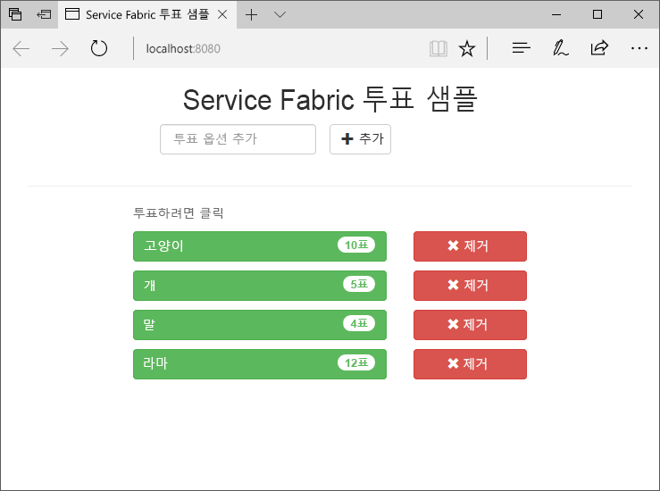
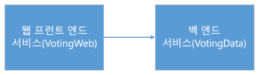
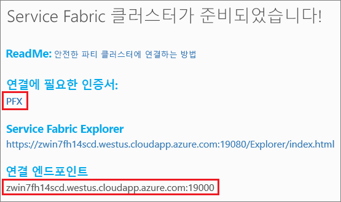
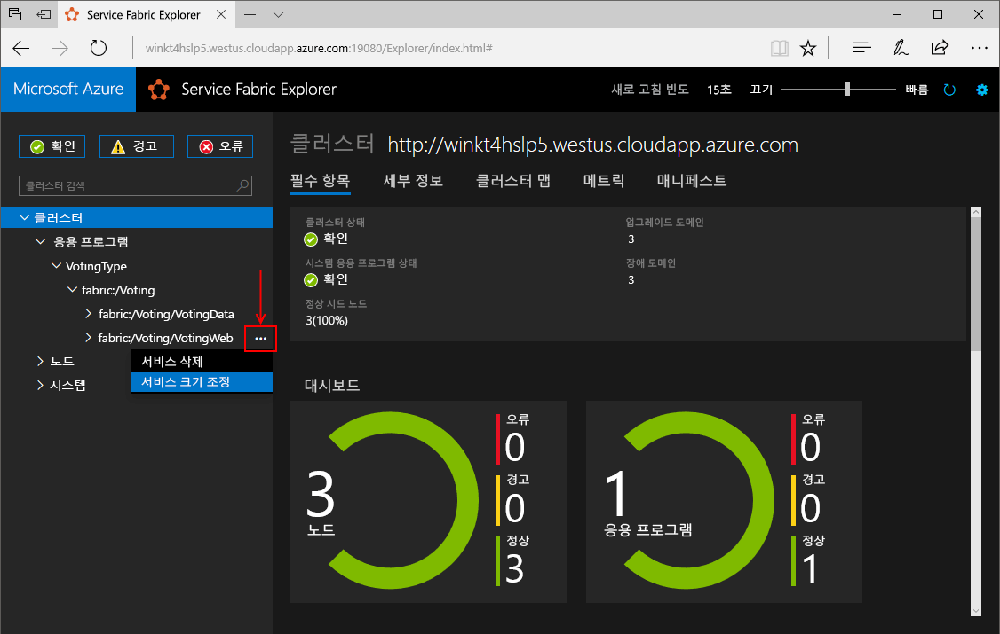
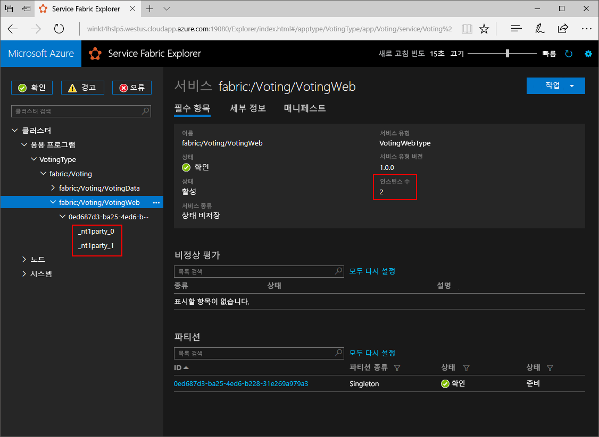
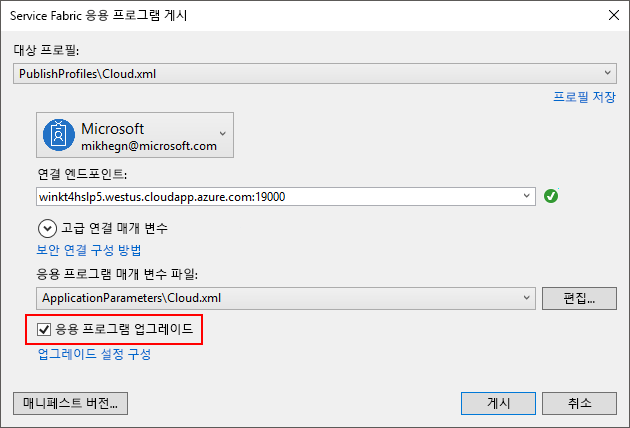
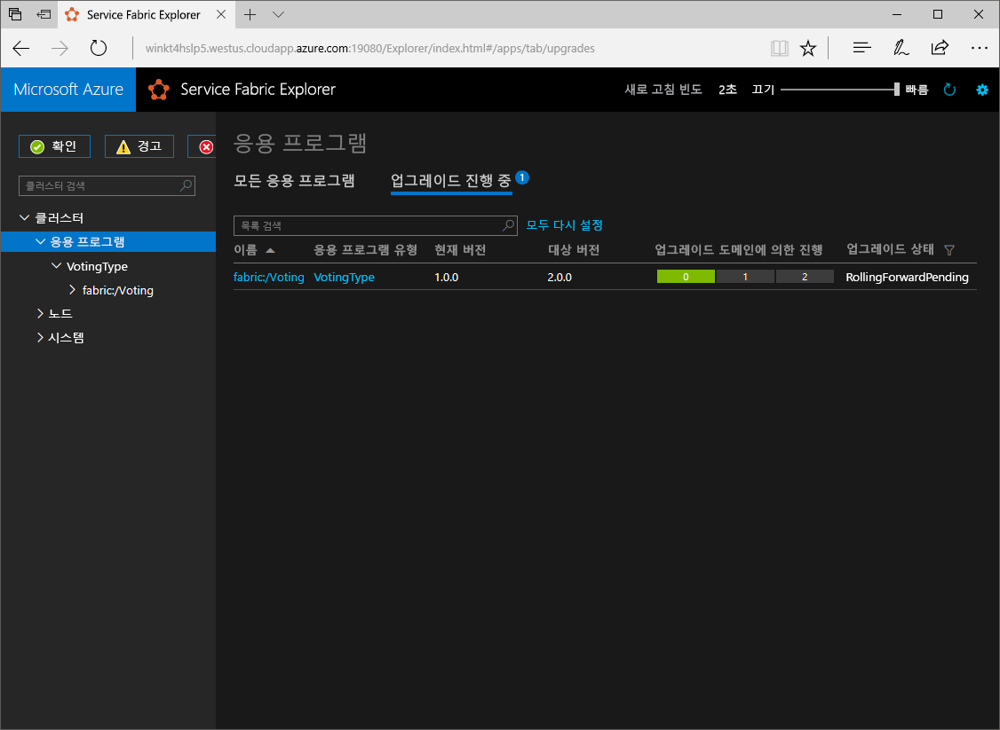

# <a name="quickstart-deploy-a-net-reliable-services-application-to-service-fabric"></a>빠른 시작: Service Fabric에 .NET 안정적인 서비스 애플리케이션 배포

Azure Service Fabric은 확장성 있고 안정성이 뛰어난 마이크로 서비스 및 컨테이너를 배포 및 관리하기 위한 분산 시스템 플랫폼입니다.

이 빠른 시작에서는 Service Fabric에 첫 번째 .NET 애플리케이션을 배포하는 방법을 보여 줍니다. 완료하면 투표 결과를 클러스터의 상태 저장 백 엔드 서비스에 저장하는 ASP.NET Core 웹 프런트 엔드가 있는 투표 애플리케이션이 생깁니다.



이 애플리케이션을 사용하여 다음 방법에 대해 알아봅니다.

* .NET 및 Service Fabric을 사용하여 애플리케이션 만들기
* 웹 프런트 엔드로 ASP.NET core 사용
* 상태 저장 서비스에 애플리케이션 데이터 저장
* 로컬에서 애플리케이션 디버그
* Azure에서 애플리케이션을 클러스터에 배포
* 애플리케이션을 여러 노드에 걸쳐 스케일 아웃
* 애플리케이션 롤링 업그레이드 수행

## <a name="prerequisites"></a>필수 조건

이 빠른 시작을 완료하려면 다음이 필요합니다.

1. **Azure 개발**과 **ASP.NET 및 웹 개발** 워크로드가 있는 [Visual Studio 2017 설치](https://www.visualstudio.com/)
2. [Git 설치](https://git-scm.com/)
3. [Microsoft Azure Service Fabric SDK 설치](https://www.microsoft.com/web/handlers/webpi.ashx?command=getinstallerredirect&appid=MicrosoftAzure-ServiceFabric-CoreSDK)
4. 다음 명령을 실행하여 Visual Studio에서 로컬 Service Fabric 클러스터에 배포하도록 합니다.
    ```powershell
    Set-ExecutionPolicy -ExecutionPolicy Unrestricted -Force -Scope CurrentUser
    ```

>[!NOTE]
> 이 빠른 시작의 샘플 애플리케이션은 Windows 7에서 제공되지 않는 기능을 사용합니다.
>

## <a name="download-the-sample"></a>샘플 다운로드

명령 창에서 다음 명령을 실행하여 로컬 컴퓨터에 샘플 앱 리포지토리를 복제합니다.

```git
git clone https://github.com/Azure-Samples/service-fabric-dotnet-quickstart
```

## <a name="run-the-application-locally"></a>로컬에서 애플리케이션 실행

시작 메뉴에서 Visual Studio 아이콘을 마우스 오른쪽 단추로 클릭하고 **관리자 권한으로 실행**을 선택합니다. 디버거를 서비스에 연결하려면 관리자 권한으로 Visual Studio를 실행해야 합니다.

복제한 리포지토리에서 **Voting.sln** Visual Studio 솔루션을 엽니다.

기본적으로 응답 애플리케이션은 포트 8080에서 수신하도록 설정됩니다.  애플리케이션 포트는 */VotingWeb/PackageRoot/ServiceManifest.xml* 파일에서 설정됩니다.  **엔드포인트** 요소의 **포트** 특성을 업데이트하여 응용 프로그램 포트를 변경할 수 있습니다.  애플리케이션을 로컬로 배포하고 실행하려면 애플리케이션 포트가 열려 있고 컴퓨터에서 사용 가능해야 합니다.  애플리케이션 포트를 변경하는 경우 이 문서 전체에서 "8080"을 새 애플리케이션 포트 값으로 대체합니다.

애플리케이션을 배포하려면 **F5** 키를 누릅니다.

> [!NOTE]
> 처음으로 애플리케이션을 실행하고 배포할 때 Visual Studio는 디버깅을 위해 로컬 클러스터를 만듭니다. 이 작업에는 다소 시간이 걸릴 수 있습니다. Visual Studio 출력 창에 클러스터 생성 상태가 표시됩니다.  출력에서 “애플리케이션 URL이 설정되지 않았거나 HTTP/HTTPS URL이 아니므로 애플리케이션에 대한 브라우저가 열리지 않습니다.”라는 메시지가 표시됩니다.  메시지가 오류를 나타내지 않지만 브라우저가 자동으로 시작되지 않습니다.

배포가 완료되면 브라우저를 시작하고 애플리케이션의 웹 프런트 엔드인 이 페이지(`http://localhost:8080`)를 엽니다.


이제 투표 옵션 집합을 추가하고 투표 하기를 시작할 수 있습니다. 애플리케이션이 실행되고 모든 데이터가 Service Fabric 클러스터에 저장되며 별도의 데이터베이스가 필요하지 않습니다.

## <a name="walk-through-the-voting-sample-application"></a>투표 애플리케이션 예제 연습

투표 애플리케이션은 두 가지 서비스로 구성됩니다.

* 웹 프런트 엔드 서비스(VotingWeb) - ASP.NET Core 웹 프런트 엔드 서비스로, 웹 페이지를 제공하며 백 엔드 서비스와 통신하기 위한 Web API를 공개합니다.
* 백 엔드 서비스(VotingData) - ASP.NET Core 웹 서비스로, 투표 결과를 디스크에 보관된 신뢰할 수 있는 사전에 저장하기 위한 API를 공개합니다.



애플리케이션에 투표하는 경우 다음 이벤트가 발생합니다.

1. JavaScript가 투표 요청을 웹 프런트 엔드 서비스의 Web API에 HTTP PUT 요청으로 보냅니다.

2. 웹 프런트 엔드 서비스는 프록시를 사용하여 HTTP PUT 요청을 찾아 백 엔드 서비스에 전달합니다.

3. 백 엔드 서비스는 들어오는 요청을 받고 업데이트된 결과를, 클러스터 내의 여러 노드에 복제되고 디스크에 보관된 신뢰할 수 있는 사전에 저장합니다. 애플리케이션의 모든 데이터가 클러스터에 저장되므로 데이터베이스가 필요하지 않습니다.

## <a name="debug-in-visual-studio"></a>Visual Studio에서 디버그

애플리케이션은 정상적으로 실행되지만 디버거를 사용하여 애플리케이션의 주요 부분이 어떻게 작동하는지 확인할 수 있습니다. Visual Studio에서 애플리케이션을 디버깅할 때 로컬 Service Fabric 개발 클러스터를 사용합니다. 사용자 시나리오에 대해 디버깅 환경을 조정하는 옵션이 있습니다. 이 애플리케이션에서는 신뢰할 수 있는 사전을 사용하여 데이터가 백 엔드 서비스에 저장됩니다. Visual Studio는 디버거를 중지하는 경우 기본값에 대해 애플리케이션을 제거합니다. 애플리케이션을 제거하면 백 엔드 서비스의 데이터도 제거됩니다. 디버깅 세션 간에 데이터를 유지하려면 **애플리케이션 디버그 모드**를 Visual Studio에서 **Voting** 프로젝트의 속성으로 변경할 수 있습니다.

코드에서 수행되는 작업을 살펴보려면 다음 단계를 완료합니다.

1. **/VotingWeb/Controllers/VotesController.cs** 파일을 열고, 웹 API의 **Put** 메서드(69번 줄)에서 중단점을 설정합니다. 이 파일은 Visual Studio의 솔루션 탐색기에서 검색할 수 있습니다.

2. **/VotingData/Controllers/VoteDataController.cs** 파일을 열고, 이 웹 API의 **Put** 메서드(54번 줄)에서 중단점을 설정합니다.

3. 브라우저로 돌아가서 투표 옵션을 클릭하거나 새 투표 옵션을 추가합니다. 웹 프런트 엔드의 API 컨트롤러에서 첫 번째 중단점에 도달합니다.
    * 여기서 브라우저의 JavaScript가 프런트 엔드 서비스의 Web API 컨트롤러에 요청을 보냅니다.

    

    * 먼저 백 엔드 서비스 **(1)** 에 대해 ReverseProxy에 대한 URL을 구성합니다.
    * 그런 다음 ReverseProxy **(2)** 에 HTTP PUT 요청을 보냅니다.
    * 마지막으로 백 엔드 서비스로부터 클라이언트 **(3)** 에 응답을 반환합니다.

4. 계속하려면 **F5** 키를 누릅니다.
    - 브라우저에서 메시지가 표시되면 ServiceFabricAllowedUsers 그룹에 디버그 모드에 대한 읽기 및 실행 권한을 부여합니다.
    - 이제 백 엔드 서비스의 중단점에 있습니다.

    

    * 메서드의 첫 번째 줄 **(1)** 에서는 `StateManager`가 신뢰할 수 있는 사전 `counts`를 가져오거나 추가합니다.
    * 신뢰할 수 있는 사전에 있는 값과의 모든 상호 작용에는 트랜잭션이 필요하며 using 문 **(2)** 으로 트랜잭션이 만들어집니다.
    * 트랜잭션에서는 투표 옵션에 대한 관련 키 값을 업데이트하고 작업을 커밋합니다 **(3)**. 커밋 메서드가 반환되면 사전에 데이터가 업데이트되고 클러스터의 다른 노드에 복제됩니다. 이제 데이터는 클러스터에 안전하게 저장되며 백 엔드 서비스는 데이터를 계속 제공하면서 다른 노드로 장애 조치할 수 있습니다.
5. 계속하려면 **F5** 키를 누릅니다.

디버깅 세션을 중지하려면 **Shift+F5** 키를 누릅니다.

## <a name="deploy-the-application-to-azure"></a>Azure에 애플리케이션 배포

애플리케이션을 Azure에 배포하려면 애플리케이션을 실행하는 Service Fabric 클러스터가 필요합니다.

### <a name="join-a-party-cluster"></a>Party 클러스터 조인

Party 클러스터는 평가판으로, Azure에서 호스트되고 Service Fabric 팀이 실행하는 제한 시간 Service Fabric 클러스터입니다. 여기서 누구나 애플리케이션을 배포하고 플랫폼에 대해 알아볼 수 있습니다. 클러스터는 노드-노드뿐만 아니라 클라이언트-노드 보안에도 단일 자체 서명 인증서를 사용합니다.

[Windows 클러스터에 로그인하고 조인](https://aka.ms/tryservicefabric)합니다. **PFX** 링크를 클릭하여 PFX 인증서를 컴퓨터에 다운로드합니다. **보안 Party 클러스터에 연결하는 방법** 링크를 클릭하고 인증서 암호를 복사합니다. 인증서, 인증서 암호 및 **연결 엔드포인트** 값은 다음 단계에서 사용됩니다.



> [!Note]
> 시간당 사용 가능한 Party 클러스터의 수가 제한되어 있습니다. Party 클러스터에 등록하려고 할 때 오류가 발생하면, 일정 기간 동안 기다린 후 다시 시도하거나, [.NET 애플리케이션 배포](https://docs.microsoft.com/azure/service-fabric/service-fabric-tutorial-deploy-app-to-party-cluster#deploy-the-sample-application) 자습서에서 이러한 단계를 수행하여 Azure 구독에 Service Fabric 클러스터를 만들고 이 클러스터에 애플리케이션을 배포할 수 있습니다. Azure 구독이 아직 없는 경우 [체험 계정](https://azure.microsoft.com/free/?WT.mc_id=A261C142F)을 만들 수 있습니다. 클러스터에 애플리케이션을 배포하고 확인한 후에는 이 빠른 시작의 [클러스터에서 애플리케이션 및 서비스 크기 조정](#scale-applications-and-services-in-a-cluster)으로 건너뛸 수 있습니다.
>

Windows 컴퓨터에서 *CurrentUser\My* 인증서 저장소에 PFX를 설치합니다.

```powershell
PS C:\mycertificates> Import-PfxCertificate -FilePath .\party-cluster-873689604-client-cert.pfx -CertStoreLocation Cert:\CurrentUser\My -Password (ConvertTo-SecureString 873689604 -AsPlainText -Force)


   PSParentPath: Microsoft.PowerShell.Security\Certificate::CurrentUser\My

Thumbprint                                Subject
----------                                -------
3B138D84C077C292579BA35E4410634E164075CD  CN=zwin7fh14scd.westus.cloudapp.azure.com
```

다음 단계를 위해 지문을 기억합니다.

> [!Note]
> 기본적으로 웹 프런트 엔드 서비스는 들어오는 트래픽에 대해 포트 8080에서 수신 대기하도록 구성됩니다. 포트 8080은 Party 클러스터에서 열립니다.  애플리케이션 포트를 변경해야 하는 경우 Party 클러스터에서 열려 있는 포트 중 하나를 변경합니다.
>

### <a name="deploy-the-application-using-visual-studio"></a>Visual Studio를 사용하여 애플리케이션 배포

애플리케이션이 준비되면 Visual Studio에서 클러스터에 직접 배포할 수 있습니다.

1. 솔루션 탐색기에서 **Voting**을 마우스 오른쪽 단추로 클릭하고 **게시**를 선택합니다. [게시] 대화 상자가 나타납니다.

2. 파티 클러스터 페이지의 **연결 엔드포인트**를 **연결 엔드포인트** 필드에 복사합니다. 예: `zwin7fh14scd.westus.cloudapp.azure.com:19000` **고급 연결 매개 변수**를 클릭하고, *FindValue* 및 *ServerCertThumbprint* 값이 이전 단계에서 설치한 인증서의 지문과 일치하는지 확인합니다.

    ![[게시] 대화 상자](./media/service-fabric-quickstart-dotnet/publish-app.png)

    클러스터의 각 응용 프로그램에는 고유한 이름이 있어야 합니다.  Party 클러스터가 공용 공유 환경이지만 기존 애플리케이션과 충돌이 발생할 수 있습니다.  이름이 충돌하는 경우 Visual Studio 프로젝트의 이름을 바꾸고 다시 배포합니다.

3. **게시**를 클릭합니다.

4. 브라우저를 열고 클러스터 주소에 ‘:8080’을 뒤에 붙여 입력하여 클러스터로 애플리케이션을 가져옵니다(예: `http://zwin7fh14scd.westus.cloudapp.azure.com:8080`). 이제 Azure의 클러스터에서 실행 중인 애플리케이션이 표시됩니다.

    

## <a name="scale-applications-and-services-in-a-cluster"></a>클러스터에서 애플리케이션 및 서비스 크기 조정

Service Fabric 서비스는 해당 서비스에 대한 로드 변동량을 수용하도록 클러스터 간에 쉽게 크기를 조정할 수 있습니다. 클러스터에서 실행되는 인스턴스 수를 변경하여 서비스 크기를 조정합니다. 서비스의 크기를 조정하는 여러 가지 방법이 있으며 PowerShell 또는 Service Fabric CLI(sfctl)의 스크립트 또는 명령을 사용할 수 있습니다. 이 예제에서는 Service Fabric Explorer를 사용합니다.

Service Fabric Explorer는 모든 Service Fabric 클러스터에서 실행되고 클러스터 HTTP 관리 포트(19080)로 이동하여 브라우저에서 액세스할 수 있습니다(예: `http://zwin7fh14scd.westus.cloudapp.azure.com:19080`).

위치를 신뢰할 수 없다는 브라우저 경고가 표시될 수 있습니다. 이는 인증서가 자체 서명되었기 때문입니다. 경고를 무시하고 진행하도록 선택할 수 있습니다.
1. 브라우저에서 메시지가 나타나면 설치된 인증서를 선택하여 연결합니다. 목록에서 선택한 파티 클러스터 인증서는 액세스하려는 파티 클러스터와 일치해야 합니다. 예: win243uja6w62r.westus.cloudapp.azure.com.
2. 브라우저에서 메시지가 표시되면 CryptoAPI 개인 키에 이 세션에 대한 액세스 권한을 부여합니다.

웹 프런트 엔드 서비스의 크기를 조정하려면 다음 단계를 수행합니다.

1. 클러스터에서 Service Fabric Explorer를 엽니다(예: `http://zwin7fh14scd.westus.cloudapp.azure.com:19080`).

2. 트리 뷰에서 **애플리케이션**->**VotingType**->**fabric:/Voting**을 확장합니다. 트리 뷰에서 **fabric:/Voting/VotingWeb** 노드 옆에 있는 줄임표(...)를 클릭하고 **Scale Service**를 선택합니다.

    

    이제 웹 프런트 엔드 서비스의 인스턴스 수를 조정하도록 선택할 수 있습니다.

3. 이 수를 **2**로 변경하고 **Scale Service**를 클릭합니다.
4. 트리 뷰에서 **fabric:/Voting/VotingWeb** 노드를 클릭하고 파티션 노드(GUID로 표현됨)를 확장합니다.

    

    지연 후에 서비스에 두 인스턴스가 있는 것을 볼 수 있습니다.  트리 뷰에서 인스턴스가 실행하는 노드를 볼 수 있습니다.

이 간단한 관리 작업으로 사용자 로드를 처리하는 프런트 엔드 서비스에 사용 가능한 리소스를 두 배로 증가시킬 수 있습니다. 서비스를 안정적으로 실행하기 위해 서비스의 여러 인스턴스가 필요하지 않다는 것을 이해하는 것이 중요합니다. 서비스가 실패하면 Service Fabric은 클러스터에서 새 서비스 인스턴스가 실행되는지 확인합니다.

## <a name="perform-a-rolling-application-upgrade"></a>애플리케이션 롤링 업그레이드 수행

새 업데이트를 애플리케이션에 배포할 때는 Service Fabric이 안전한 방식으로 업데이트를 공개합니다. 롤링 업그레이드를 사용하면 업그레이드하는 동안 가동 중지 시간이 없으며 오류가 발생하면 자동화된 롤백을 수행합니다.

애플리케이션을 업그레이드하려면 다음을 수행합니다.

1. Visual Studio에서 **/VotingWeb/Views/Home/Index.cshtml** 파일을 엽니다.
2. 텍스트를 추가하거나 업데이트하여 페이지의 제목을 변경합니다. 예를 들어 제목을 “Service Fabric Voting 샘플 v2”로 변경합니다.
3. 파일을 저장합니다.
4. 솔루션 탐색기에서 **Voting**을 마우스 오른쪽 단추로 클릭하고 **게시**를 선택합니다. [게시] 대화 상자가 나타납니다.
5. **매니페스트 버전** 단추를 클릭하여 서비스 및 응용 프로그램의 버전을 변경합니다.
6. **VotingWebPkg** 아래에서 **Code** 요소의 버전을, 예를 들어 “2.0.0”으로 변경하고 **저장**을 클릭합니다.

    ![[버전 변경] 대화 상자](./media/service-fabric-quickstart-dotnet/change-version.png)
7. **Service Fabric 응용 프로그램 게시** 대화 상자에서 [응용 프로그램 업그레이드] 확인란을 선택하고 **게시**를 클릭합니다.

    

    업그레이드가 실행되는 동안 응용 프로그램을 계속 사용할 수 있습니다. 클러스터에서 실행되는 서비스에는 두 인스턴스가 있으므로 일부 요청은 애플리케이션의 업그레이드된 버전을 가질 수 있는 반면 일부는 이전 버전을 가질 수 있습니다.

8. 브라우저를 열고 포트 19080에서 클러스터 주소로 이동합니다(예: `http://zwin7fh14scd.westus.cloudapp.azure.com:19080`).
9. 트리 뷰의 **애플리케이션** 노드를 클릭한 후 오른쪽 창에서 **Upgrades in Progress(진행 중인 업그레이드)** 를 클릭합니다. 업그레이드가 클러스터에서 업그레이드 도메인을 어떻게 통과하고 다음으로 진행하기 전에 각 도메인 상태가 정상인지 확인하게 됩니다. 도메인 상태가 확인되면 진행률 표시줄에 업그레이드 도메인이 녹색으로 표시됩니다.
    

    Service Fabric에서는 클러스터의 각 노드에서 서비스를 업그레이드 한 후 2분 대기함으로써 안전하게 업그레이드합니다. 전체 업데이트에는 약 8분이 소요될 것으로 예상됩니다.

## <a name="next-steps"></a>다음 단계

이 빠른 시작에서는 다음을 수행하는 방법을 알아보았습니다.

* .NET 및 Service Fabric을 사용하여 애플리케이션 만들기
* 웹 프런트 엔드로 ASP.NET core 사용
* 상태 저장 서비스에 애플리케이션 데이터 저장
* 로컬에서 애플리케이션 디버그
* Azure에서 애플리케이션을 클러스터에 배포
* 애플리케이션을 여러 노드에 걸쳐 스케일 아웃
* 애플리케이션 롤링 업그레이드 수행

Service Fabric 및 .NET에 대해 자세히 알아보기 위해 다음 자습서를 살펴보겠습니다.
> [!div class="nextstepaction"]
> [Service Fabric에서 .NET 응용 프로그램](service-fabric-tutorial-create-dotnet-app.md)
