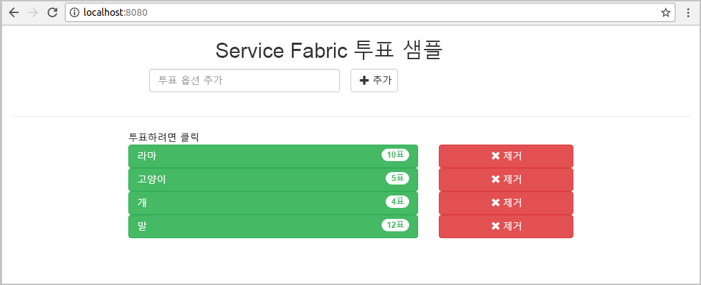
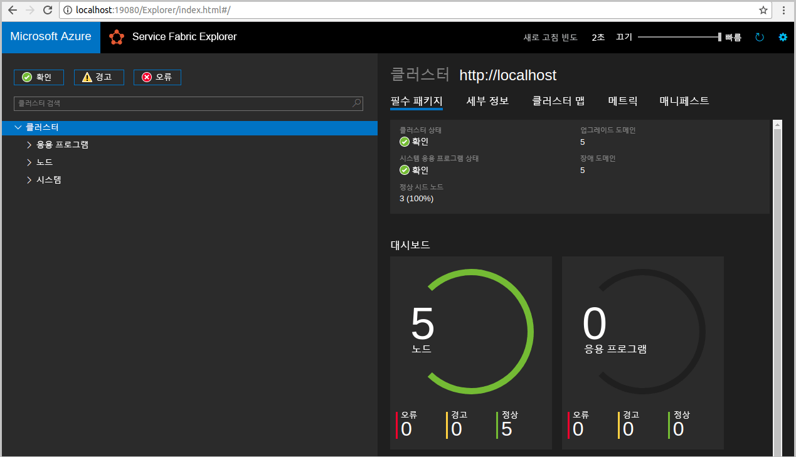
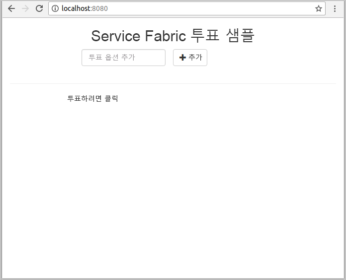
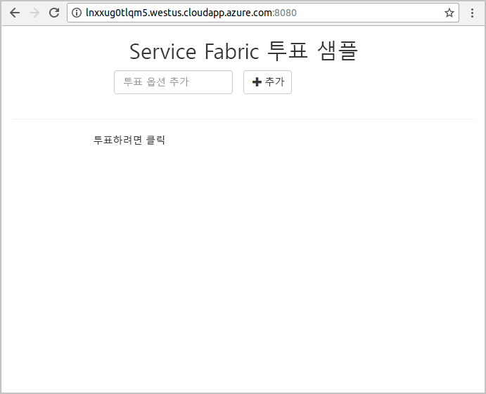
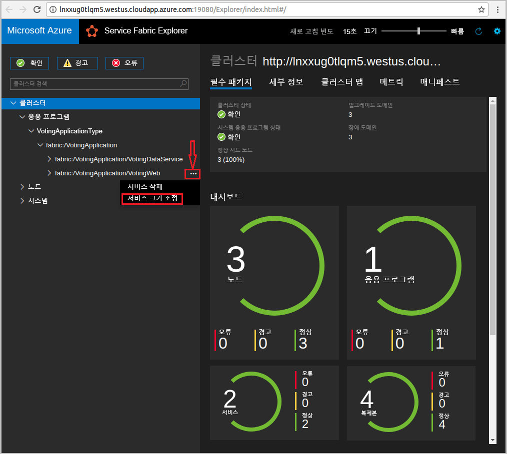

# <a name="quickstart-deploy-a-java-reliable-services-application-to-service-fabric"></a>빠른 시작: Service Fabric에 Java 안정적인 서비스 응용 프로그램 배포

Azure Service Fabric은 마이크로 서비스 및 컨테이너를 배포 및 관리하기 위한 분산 시스템 플랫폼입니다.

이 빠른 시작은 Linux 개발자 컴퓨터에서 Eclipse IDE를 사용하여 Microsoft Azure Service Fabric에 첫 번째 Java 응용 프로그램을 배포하는 방법을 보여줍니다. 완료하면 투표 결과를 클러스터의 상태 저장 백 엔드 서비스에 저장하는 Java 웹 프런트 엔드가 있는 투표 응용 프로그램이 생깁니다.



이 빠른 시작에서 다음을 수행하는 방법을 알아봅니다.

* Eclipse를 Service Fabric Java 응용 프로그램을 위한 도구로 사용
* 로컬 클러스터에 응용 프로그램 배포
* Azure에서 응용 프로그램을 클러스터에 배포
* 응용 프로그램을 여러 노드에 걸쳐 스케일 아웃

## <a name="prerequisites"></a>필수 조건

이 빠른 시작을 완료하려면 다음이 필요합니다.

1. [Service Fabric SDK 및 Service Fabric 명령줄 인터페이스 (CLI) 설치](https://docs.microsoft.com/azure/service-fabric/service-fabric-get-started-linux#installation-methods)
2. [Git 설치](https://git-scm.com/)
3. [Eclipse 설치](https://www.eclipse.org/downloads/)
4. Eclipse 플러그 인을 설치하기 위한 선택적 단계를 수행하여 [Java 환경 설정](https://docs.microsoft.com/azure/service-fabric/service-fabric-get-started-linux#set-up-java-development)

## <a name="download-the-sample"></a>샘플 다운로드

명령 창에서 다음 명령을 실행하여 로컬 컴퓨터에 샘플 앱 리포지토리를 복제합니다.

```git
git clone https://github.com/Azure-Samples/service-fabric-java-quickstart.git
```

## <a name="run-the-application-locally"></a>로컬에서 응용 프로그램 실행

1. 다음 명령을 실행하여 클러스터를 만듭니다.

    ```bash
    sudo /opt/microsoft/sdk/servicefabric/common/clustersetup/devclustersetup.sh
    ```
    로컬 클러스터를 시작하는 데 몇 시간이 걸립니다. 클러스터가 완전히 작동 중인지 확인하려면 **http://localhost:19080**에서 Service Fabric Explorer에 액세스합니다. 5개의 정상 노드는 로컬 클러스터가 작동되어 실행 중임을 나타냅니다.

    

2. Eclipse를 엽니다.
3. 파일 -> 가져오기 -> Gradle-> 기존 Gradle 프로젝트를 클릭하고 마법사를 따릅니다.
4. Directory를 클릭하고 Github에서 복제한 `service-fabric-java-quickstart` 폴더에서 `Voting` 디렉터리를 선택합니다. Finish를 클릭합니다. 

    

5. 이제 Eclipse용 Package Explorer에 `Voting` 프로젝트가 있습니다.
6. 프로젝트를 마우스 오른쪽 단추로 클릭하고 **Service Fabric** 드롭다운 아래에서 **Publish Application...** 을 클릭합니다. **PublishProfiles/Local.json**을 Target Profile로 선택하고 Publish를 클릭합니다.

    

7. 즐겨찾는 웹 브라우저를 열고 **http://localhost:8080**에 액세스하여 응용 프로그램에 액세스합니다.

    

이제 투표 옵션 집합을 추가하고 투표 하기를 시작할 수 있습니다. 응용 프로그램이 실행되고 모든 데이터가 Service Fabric 클러스터에 저장되며 별도의 데이터베이스가 필요하지 않습니다.

## <a name="deploy-the-application-to-azure"></a>Azure에 응용 프로그램 배포

### <a name="set-up-your-azure-service-fabric-cluster"></a>Azure Service Fabric Cluster 설정

응용 프로그램을 Azure의 클러스터에 배포하려면 고유한 클러스터를 만듭니다.

파티 클러스터는 Azure에서 호스팅되는 시간이 제한된 체험용 Service Fabric 클러스터이며 Service Fabric 팀에서 운영합니다. 파티 클러스터를 사용하여 응용 프로그램을 배포하고 플랫폼에 대해 알아볼 수 있습니다. 클러스터는 노드-노드 및 클라이언트-노드 보안에 단일 자체 서명 인증서를 사용합니다.

[Linux 클러스터](http://aka.ms/tryservicefabric)에 로그인하고 조인합니다. **PFX** 링크를 클릭하여 PFX 인증서를 컴퓨터에 다운로드합니다. **추가 정보** 링크를 클릭하여 인증서 암호 및 다양한 환경에서 인증서를 사용하도록 구성하는 방법에 대한 지침을 찾습니다. **시작** 페이지와 **추가 정보** 페이지를 모두 열어두고 다음 단계에서 일부 지침을 사용합니다.

> [!Note]
> 시간당 사용 가능한 파티 클러스터의 수는 제한되어 있습니다. 파티 클러스터에 등록하려고 할 때 오류가 발생하면, 일정 기간 동안 기다린 후 다시 시도하거나, [Azure에서 Service Fabric 클러스터 만들기](service-fabric-tutorial-create-vnet-and-linux-cluster.md)의 단계에 따라 구독에 클러스터를 만들 수 있습니다.
>
> Spring Boot 서비스는 들어오는 트래픽에 대해 포트 8080에서 수신 대기하도록 구성됩니다. 클러스터에 대해 포트가 열려 있는지 확인합니다. Party 클러스터를 사용하는 경우 이 포트가 열려 있습니다.
>

Service Fabric은 클러스터 및 해당 응용 프로그램을 관리하는 데 사용할 수 있는 몇 가지 도구를 제공합니다.

* Service Fabric Explorer, 브라우저 기반 도구입니다.
* Service Fabric CLI(명령줄 인터페이스), Azure CLI 2.0을 기반으로 실행됩니다.
* PowerShell 명령

이 빠른 시작에서는 Service Fabric CLI 및 Service Fabric Explorer를 사용합니다.

CLI를 사용하려면 다운로드한 PFX 파일을 기반으로 PEM 파일을 만들어야 합니다. 파일을 변환하려면 다음 명령을 사용합니다. (파티 클러스터의 경우 **추가 정보** 페이지의 지침에서 PFX 파일에 해당하는 명령을 복사할 수 있습니다.)

    ```bash
    openssl pkcs12 -in party-cluster-1486790479-client-cert.pfx -out party-cluster-1486790479-client-cert.pem -nodes -passin pass:1486790479
    ```

Service Fabric Explorer를 사용하려면 파티 클러스터 웹 사이트에서 다운로드한 인증서 PFX 파일을 인증서 저장소(Windows 또는 Mac) 또는 브라우저 자체(Ubuntu)로 가져와야 합니다. PFX 개인 키 암호가 필요하며 **추가 정보** 페이지에서 얻을 수 있습니다.

가장 편리한 방법을 사용하여 시스템에서 인증서를 가져옵니다. 예: 

* Windows: PFX 파일을 두 번 클릭하고 프롬프트에 따라 개인 저장소 `Certificates - Current User\Personal\Certificates`에 인증서를 설치합니다. 또는 **추가 정보** 지침의 PowerShell 명령을 사용할 수 있습니다.
* Mac: PFX 파일을 두 번 클릭하고 프롬프트에 따라 키 집합에 인증서를 설치합니다.
* Ubuntu: Mozilla Firefox는 Ubuntu 16.04의 기본 브라우저입니다. 인증서를 Firefox로 가져 오려면 브라우저의 오른쪽 위 모서리에 있는 메뉴 단추를 클릭한 다음 **옵션**을 클릭합니다. **기본 설정** 페이지에서 검색 상자를 사용하여 "인증서"를 검색합니다. **인증서 보기**를 클릭하고 **Your Certificates**(인증서) 탭을 선택하고 **가져오기**를 클릭하여 프롬프트에 따라 인증서를 가져옵니다.

   

### <a name="add-certificate-information-to-your-application"></a>응용 프로그램에 인증서 정보 추가

인증서 지문은 Service Fabric 프로그래밍 모델을 사용하므로 응용 프로그램에 추가해야 합니다.

1. 보안 클러스터에서 실행할 때 인증서의 지문이 `Voting/VotingApplication/ApplicationManifest.xml` 파일에 있어야 합니다. 다음 명령을 실행하여 인증서의 지문을 추출합니다.

    ```bash
    openssl x509 -in [CERTIFICATE_PEM_FILE] -fingerprint -noout
    ```

2. `Voting/VotingApplication/ApplicationManifest.xml` 파일에서 **ApplicationManifest** 태그 아래에 다음 코드 조각을 추가합니다. **X509FindValue**는 이전 단계의 지문이어야 합니다(세미콜론 없음). 

    ```xml
    <Certificates>
        <SecretsCertificate X509FindType="FindByThumbprint" X509FindValue="0A00AA0AAAA0AAA00A000000A0AA00A0AAAA00" />
    </Certificates>
    ```

### <a name="deploy-the-application-using-eclipse"></a>Eclipse를 사용하여 응용 프로그램 배포

응용 프로그램과 클러스터가 준비되면 Eclipse에서 클러스터에 직접 배포할 수 있습니다.

1. **PublishProfiles** 디렉터리 아래에서 **Cloud.json** 파일을 열고 `ConnectionIPOrURL`과 `ConnectionPort` 필드에 정보를 적절히 입력합니다. 예제가 제공됩니다.

    ```bash
    {
         "ClusterConnectionParameters":
         {
            "ConnectionIPOrURL": "lnxxug0tlqm5.westus.cloudapp.azure.com",
            "ConnectionPort": "19080",
            "ClientKey": "[path_to_your_pem_file_on_local_machine]",
            "ClientCert": "[path_to_your_pem_file_on_local_machine]"
         }
    }
    ```

2. 프로젝트를 마우스 오른쪽 단추로 클릭하고 **Service Fabric** 드롭다운 아래에서 **Publish Application...** 을 클릭합니다. **PublishProfiles/Cloud.json**을 Target Profile로 선택하고 Publish를 클릭합니다.

    

3. 웹 브라우저를 열고 **http://\<ConnectionIPOrURL>:8080**에 액세스하여 응용 프로그램에 액세스합니다.

    

## <a name="scale-applications-and-services-in-a-cluster"></a>클러스터에서 응용 프로그램 및 서비스 크기 조정

서비스는 해당 서비스에 대한 로드 변동량을 수용하도록 클러스터 간에 쉽게 크기를 조정할 수 있습니다. 클러스터에서 실행되는 인스턴스 수를 변경하여 서비스 크기를 조정합니다. 서비스의 크기를 조정하는 여러 가지 방법이 있으며 예를 들어, Service Fabric CLI(sfctl)의 스크립트 또는 명령을 사용할 수 있습니다. 다음 단계에서는 Service Fabric Explorer를 사용합니다.

Service Fabric Explorer는 모든 Service Fabric 클러스터에서 실행되고 클러스터 HTTP 관리 포트(19080)로 이동하여 브라우저에서 액세스할 수 있습니다(예: `http://lnxxug0tlqm5.westus.cloudapp.azure.com:19080`).

웹 프런트 엔드 서비스의 크기를 조정하려면 다음을 수행합니다.

1. 클러스터에서 Service Fabric Explorer를 엽니다. 예: `https://lnxxug0tlqm5.westus.cloudapp.azure.com:19080`
2. 트리 뷰에서 **fabric:/Voting/VotingWeb** 노드 옆에 있는 줄임표(...)를 클릭하고 **Scale Service**를 선택합니다.

    

    이제 웹 프런트 엔드 서비스의 인스턴스 수를 조정하도록 선택할 수 있습니다.

3. 이 수를 **2**로 변경하고 **Scale Service**를 클릭합니다.
4. 트리 뷰에서 **fabric:/Voting/VotingWeb** 노드를 클릭하고 파티션 노드(GUID로 표현됨)를 확장합니다.

    

    이제 두 개의 인스턴스가 있는 서비스를 인스턴스가 실행되는 노드를 볼 수 있는 트리 뷰에서 볼 수 있습니다.

이 간단한 관리 작업을 통해 프런트 엔드 서비스에서 사용 가능한 리소스를 두 배로 늘려서 사용자 부하를 처리했습니다. 서비스를 안정적으로 실행하기 위해 여러 인스턴스가 필요하지 않다는 것을 이해하는 것이 중요합니다. 서비스가 실패하면 Service Fabric은 클러스터에서 새 서비스 인스턴스가 실행되는지 확인합니다.

## <a name="next-steps"></a>다음 단계

이 빠른 시작에서는 다음을 수행하는 방법을 알아보았습니다.

* Eclipse를 Service Fabric Java 응용 프로그램을 위한 도구로 사용
* 로컬 클러스터에 Java 응용 프로그램 배포
* Azure에서 Java 응용 프로그램을 클러스터에 배포
* 응용 프로그램을 여러 노드에 걸쳐 스케일 아웃

Service Fabric에서 Java 앱 작업에 대해 자세히 알아보려면 Java 앱에 대한 자습서를 계속 진행하십시오.

> [!div class="nextstepaction"]
> [Java 앱 배포](./service-fabric-tutorial-create-java-app.md)