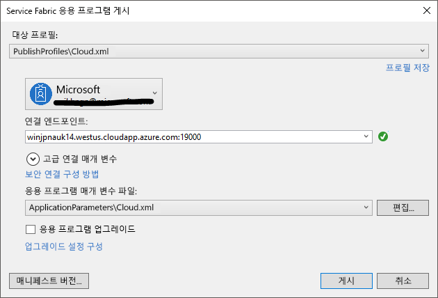

# <a name="tutorial-deploy-a-service-fabric-application-to-a-cluster-in-azure"></a>자습서: Azure의 클러스터에 Service Fabric 애플리케이션 배포

이 자습서는 시리즈의 2부입니다. 이 자습서는 Azure의 새 클러스터에 Azure Service Fabric 애플리케이션을 배포하는 방법을 보여줍니다.

이 자습서에서는 다음 방법에 대해 알아봅니다.
> [!div class="checklist"]
> * 클러스터 만들기
> * Visual Studio를 사용하여 원격 클러스터에 애플리케이션 배포

이 자습서 시리즈에서는 다음 방법에 대해 알아봅니다.
> [!div class="checklist"]
> * [.NET Service Fabric 애플리케이션 빌드](service-fabric-tutorial-create-dotnet-app.md)
> * 애플리케이션을 원격 클러스터에 배포
> * [ASP.NET Core 프런트 엔드 서비스에 HTTPS 엔드포인트 추가](service-fabric-tutorial-dotnet-app-enable-https-endpoint.md)
> * [Azure Pipelines를 사용하여 CI/CD 구성](service-fabric-tutorial-deploy-app-with-cicd-vsts.md)
> * [애플리케이션에 대한 모니터링 및 진단 설정](service-fabric-tutorial-monitoring-aspnet.md)

## <a name="prerequisites"></a>필수 조건

이 자습서를 시작하기 전에:

* Azure 구독이 아직 없는 경우 [체험 계정](https://azure.microsoft.com/free/?WT.mc_id=A261C142F)을 만듭니다.
* [Visual Studio 2019를 설치](https://www.visualstudio.com/)하고 **Azure 개발**과 **ASP.NET 및 웹 개발** 워크로드를 설치합니다.
* [Service Fabric SDK를 설치](service-fabric-get-started.md)합니다.

## <a name="download-the-voting-sample-application"></a>투표 애플리케이션 샘플 다운로드

[이 자습서 시리즈의 1부](service-fabric-tutorial-create-dotnet-app.md)에서 투표 애플리케이션 샘플을 빌드하지 않은 경우 다운로드할 수 있습니다. 명령 창에서 다음 코드를 실행하여 로컬 머신에 샘플 애플리케이션 리포지토리를 복제합니다.

```git
git clone https://github.com/Azure-Samples/service-fabric-dotnet-quickstart 
```

관리자로 실행하는 Visual Studio에서 애플리케이션을 열고, 애플리케이션을 빌드합니다.

## <a name="create-a-cluster"></a>클러스터 만들기

이제 해당 애플리케이션이 준비되면 Service Fabric 클러스터를 만든 다음, 클러스터에 애플리케이션을 배포합니다. [Service Fabric 클러스터](https://docs.microsoft.com/azure/service-fabric/service-fabric-deploy-anywhere): 마이크로 서비스가 배포되고 관리되는 네트워크로 연결된 가상 또는 실제 컴퓨터 집합입니다.

이 자습서에서는 Visual Studio IDE에서 새로운 3개의 노드 테스트 클러스터를 만든 다음, 해당 클러스터에 애플리케이션을 게시합니다. 프로덕션 클러스터 만들기에 대한 정보는 [클러스터 자습서 만들기 및 관리](service-fabric-tutorial-create-vnet-and-windows-cluster.md)를 참조하세요. [PowerShell](./scripts/service-fabric-powershell-create-secure-cluster-cert.md) 또는 [Azure CLI](./scripts/cli-create-cluster.md) 스크립트를 사용하거나 [Azure Resource Manager 템플릿](service-fabric-tutorial-create-vnet-and-windows-cluster.md)에서 [Azure Portal](https://portal.azure.com)을 통해 이전에 만든 기존 클러스터에 애플리케이션을 배포할 수도 있습니다.

> [!NOTE]
> 투표 애플리케이션 및 다른 여러 애플리케이션에서 Service Fabric 역방향 프록시를 사용하여 서비스 간에 통신합니다. Visual Studio에서 만든 클러스터는 기본적으로 역방향 프록시를 사용하도록 설정됩니다. 기존 클러스터에 배포하는 경우 투표 애플리케이션을 작동하도록 하려면 [클러스터에서 역방향 프록시를 사용하도록 설정](service-fabric-reverseproxy-setup.md)해야 합니다.


### <a name="find-the-votingweb-service-endpoint"></a>VotingWeb 서비스 엔드포인트 찾기

투표 애플리케이션의 프런트 엔드 웹 서비스는 특정 포트에서 수신합니다([이 자습서 시리즈의 1부](service-fabric-tutorial-create-dotnet-app.md)의 단계를 따른 경우 8080). 애플리케이션이 Azure에서 클러스터를 배포하는 경우 클러스터와 애플리케이션 모두 Azure 부하 분산 장치 뒤에서 실행됩니다. 규칙을 사용하여 Azure 부하 분산 장치에서 애플리케이션 포트를 열어야 합니다. 규칙은 부하 분산 장치를 통해 웹 서비스로 인바운드 트래픽을 보냅니다. 포트는 **Endpoint** 요소의 **VotingWeb/PackageRoot/ServiceManifest.xml** 파일에 있습니다. 

```xml
<Endpoint Protocol="http" Name="ServiceEndpoint" Type="Input" Port="8080" />
```

이후 단계에서 필요한 서비스 엔드포인트를 기록해 둡니다.  기존 클러스터에 배포하는 경우 [PowerShell 스크립트](./scripts/service-fabric-powershell-open-port-in-load-balancer.md)를 사용하거나 [Azure Portal](https://portal.azure.com)에서 이 클러스터에 대한 부하 분산 장치를 통해 Azure 부하 분산 장치에서 부하 분산 규칙 및 프로브를 만들어 이 포트를 엽니다.

### <a name="create-a-test-cluster-in-azure"></a>Azure에서 테스트 클러스터 만들기
솔루션 탐색기에서 **투표**를 마우스 오른쪽 단추로 클릭하고 **게시**를 선택합니다.

**연결 엔드포인트**에서 **새 클러스터 만들기**를 선택합니다.  기존 클러스터에 배포하는 경우 목록에서 클러스터 엔드포인트를 선택합니다.  Service Fabric 클러스터 만들기 대화 상자가 열립니다.

**클러스터** 탭에서 **클러스터 이름**(예: "mytestcluster")을 입력하고, 구독을 선택하고, 클러스터에 대한 지역을 선택하고(예: 미국 중남부), 클러스터 노드의 수를 입력하고(테스트 클러스터에 대해 3개의 노드 권장), 리소스 그룹을 입력합니다(예: "mytestclustergroup"). **다음**을 클릭합니다.


**인증서** 탭에서 클러스터 인증서에 대한 암호 및 출력 경로를 입력합니다. 자체 서명된 인증서가 PFX 파일로 만들어지고 지정된 출력 경로에 저장됩니다.  인증서는 노드-노드 및 클라이언트-노드 보안에 사용됩니다.  자체 서명된 인증서를 프로덕션 클러스터에 대해서는 사용하지 마세요.  이 인증서는 클러스터를 사용하여 인증하고 애플리케이션을 배포하기 위해 Visual Studio에서 사용됩니다. **인증서 가져오기**를 선택하여 컴퓨터의 CurrentUser\내 인증서 저장소에 PFX를 설치합니다.  **다음**을 클릭합니다.


**VM 세부 정보** 탭에서 클러스터 관리자 계정에 대한 **사용자 이름** 및 **암호**를 입력합니다.  클러스터 노드에 대해 **가상 머신 이미지**를 각 클러스터 노드에 대해 **가상 머신 크기**를 각각 선택합니다.  **고급** 탭을 클릭합니다.


**포트**에서 이전 단계의 VotingWeb 서비스 엔드포인트를 입력합니다(예: 8080).  클러스터가 만들어지면 이러한 애플리케이션 포트는 클러스터에 트래픽을 전달하도록 Azure 부하 분산 장치에서 열립니다.  **만들기**를 클릭하여 클러스터를 만듭니다. 몇 분 정도 소요됩니다.


## <a name="publish-the-application-to-the-cluster"></a>애플리케이션을 클러스터에 게시

새 클러스터가 준비되면 Visual Studio에서 직접 투표 애플리케이션을 배포할 수 있습니다.

솔루션 탐색기에서 **투표**를 마우스 오른쪽 단추로 클릭하고 **게시**를 선택합니다. **게시** 대화 상자가 나타납니다.

**연결 엔드포인트**에서 이전 단계에서 만든 클러스터의 엔드포인트를 선택합니다.  예를 들어 "mytestcluster.southcentral.cloudapp.azure.com:19000"입니다. **고급 연결 매개 변수**를 선택하는 경우 인증서 정보는 자동으로 채워집니다.  


**게시**를 선택합니다.

애플리케이션이 배포되면 브라우저를 열고 **:8080** 앞에 클러스터 주소를 입력합니다. 또는 구성된 다른 포트가 있는 경우 해당 포트를 입력합니다. 예는 `http://mytestcluster.southcentral.cloudapp.azure.com:8080`입니다. Azure의 클러스터에서 애플리케이션이 실행 중인 것이 보입니다. 투표 웹 페이지에서 투표 옵션 및 이러한 옵션 중 하나 이상에 대한 투표를 추가하거나 삭제합니다.


## <a name="next-steps"></a>다음 단계
자습서의 이 부분에서는 다음 방법에 대해 알아봅니다.

> [!div class="checklist"]
> * 클러스터 만들기
> * Visual Studio를 사용하여 원격 클러스터에 애플리케이션 배포

다음 자습서를 진행합니다.
> [!div class="nextstepaction"]
> [HTTPS 사용](service-fabric-tutorial-dotnet-app-enable-https-endpoint.md)
