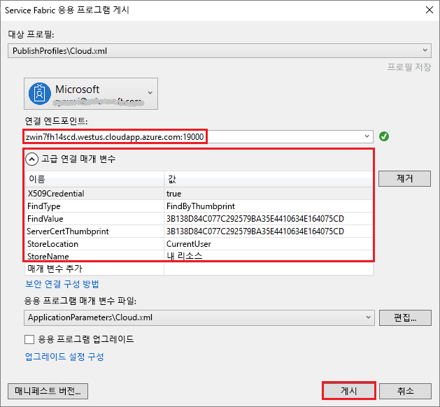

# <a name="tutorial-deploy-a-service-fabric-application-to-a-cluster-in-azure"></a>자습서: Azure의 클러스터에 Service Fabric 응용 프로그램 배포

이 자습서는 시리즈의 2부입니다. 이 자습서는 Azure의 새 클러스터에 Azure Service Fabric 응용 프로그램을 배포하는 방법을 보여줍니다.

이 자습서에서는 다음 방법에 대해 알아봅니다.
> [!div class="checklist"]
> * Party 클러스터 만들기
> * Visual Studio를 사용하여 원격 클러스터에 응용 프로그램을 배포합니다.

이 자습서 시리즈에서는 다음 방법에 대해 알아봅니다.
> [!div class="checklist"]
> * [.NET Service Fabric 응용 프로그램 빌드](service-fabric-tutorial-create-dotnet-app.md)
> * 응용 프로그램을 원격 클러스터에 배포
> * [ASP.NET Core 프런트 엔드 서비스에 HTTPS 엔드포인트 추가](service-fabric-tutorial-dotnet-app-enable-https-endpoint.md)
> * [Azure Pipelines를 사용하여 CI/CD 구성](service-fabric-tutorial-deploy-app-with-cicd-vsts.md)
> * [응용 프로그램에 대한 모니터링 및 진단 설정](service-fabric-tutorial-monitoring-aspnet.md)

## <a name="prerequisites"></a>필수 조건

이 자습서를 시작하기 전에:

* Azure 구독이 아직 없는 경우 [체험 계정](https://azure.microsoft.com/free/?WT.mc_id=A261C142F)을 만듭니다.
* [Visual Studio 2017을 설치](https://www.visualstudio.com/)하고 **Azure 개발**과 **ASP.NET 및 웹 개발** 워크로드를 설치합니다.
* [Service Fabric SDK를 설치](service-fabric-get-started.md)합니다.

## <a name="download-the-voting-sample-application"></a>투표 응용 프로그램 샘플 다운로드

[이 자습서 시리즈의 1부](service-fabric-tutorial-create-dotnet-app.md)에서 투표 응용 프로그램 샘플을 빌드하지 않은 경우 다운로드할 수 있습니다. 명령 창에서 다음 코드를 실행하여 로컬 머신에 샘플 앱 리포지토리를 복제합니다.

```git
git clone https://github.com/Azure-Samples/service-fabric-dotnet-quickstart 
```

## <a name="publish-to-a-service-fabric-cluster"></a>Service Fabric 클러스터에 게시

응용 프로그램이 준비되면 Visual Studio에서 클러스터에 직접 배포할 수 있습니다. [Service Fabric 클러스터](https://docs.microsoft.com/azure/service-fabric/service-fabric-deploy-anywhere): 마이크로 서비스가 배포되고 관리되는 네트워크로 연결된 가상 또는 실제 컴퓨터 집합입니다.

이 자습서에는 Visual Studio를 사용하여 Service Fabric 클러스터에 투표 응용 프로그램을 배포하는 두 가지 옵션이 있습니다.

* 평가판(Party) 클러스터에 배포합니다. 
* 기존 클러스터를 구독에 게시합니다. [Azure Portal](https://portal.azure.com)을 통해, [PowerShell](./scripts/service-fabric-powershell-create-secure-cluster-cert.md) 또는 [Azure CLI](./scripts/cli-create-cluster.md) 스크립트를 사용하여 또는 [Azure Resource Manager 템플릿](service-fabric-tutorial-create-vnet-and-windows-cluster.md)에서 Service Fabric 클러스터를 만들 수 있습니다.

> [!NOTE]
> 대부분의 서비스에서 역방향 프록시를 사용하여 서로 통신합니다. Visual Studio 및 Party 클러스터에서 만든 클러스터는 기본적으로 역방향 프록시를 사용하도록 설정됩니다. 기존 클러스터를 사용하는 경우 [클러스터에서 역방향 프록시를 사용하도록 설정](service-fabric-reverseproxy-setup.md)해야 합니다.


### <a name="find-the-voting-web-service-endpoint-for-your-azure-subscription"></a>Azure 구독에 대한 투표 웹 서비스 엔드포인트 찾기

자신의 Azure 구독에 투표 응용 프로그램을 게시하려면 프런트 엔드 웹 서비스의 엔드포인트를 찾습니다. 파티 클러스터를 사용하는 경우 자동으로 열리는 투표 샘플을 사용하여 포트 8080에 연결합니다. 파티 클러스터의 부하 분산 장치에서 구성할 필요는 없습니다.

프런트 엔드 웹 서비스는 특정 포트에 대해 수신 대기합니다. 응용 프로그램이 Azure에서 클러스터를 배포하는 경우 클러스터와 응용 프로그램 모두 Azure 부하 분산 장치 뒤에서 실행됩니다. 클러스터에 대한 Azure 부하 분산 장치에서 규칙을 사용하여 응용 프로그램 포트를 열어야 합니다. 열린 포트는 웹 서비스로 인바운드 트래픽을 보냅니다. 포트는 **Endpoint** 요소의 **VotingWeb/PackageRoot/ServiceManifest.xml** 파일에 있습니다. 예제는 포트 8080입니다.

```xml
<Endpoint Protocol="http" Name="ServiceEndpoint" Type="Input" Port="8080" />
```

Azure 구독의 경우 [PowerShell 스크립트](./scripts/service-fabric-powershell-open-port-in-load-balancer.md)를 통해 Azure의 부하 분산 규칙을 사용하거나 [Azure Portal](https://portal.azure.com)에서 이 클러스터의 부하 분산 장치를 통해 이 포트를 엽니다.

### <a name="join-a-party-cluster"></a>파티 클러스터 조인

> [!NOTE]
>  Azure 구독 내에서 자신의 클러스터에 응용 프로그램을 게시하려면 [Visual Studio를 사용하여 응용 프로그램 게시](#publish-the-application-by-using-visual-studio) 섹션으로 이동하세요. 

파티 클러스터는 Azure에서 호스팅되는 시간이 제한된 체험용 Service Fabric 클러스터이며 Service Fabric 팀에서 운영합니다. 누구든지 응용 프로그램을 배포하고 플랫폼에 대해 알아볼 수 있습니다. 클러스터는 노드-노드 및 클라이언트-노드 보안에 단일 자체 서명 인증서를 사용합니다.

[Windows 클러스터에 로그인하고 조인](http://aka.ms/tryservicefabric)합니다. PFX 인증서를 머신에 다운로드하려면 **PFX** 링크를 선택합니다. **보안 파티 클러스터에 연결하는 방법** 링크를 선택하고 인증서 암호를 복사합니다. 인증서, 인증서 암호 및 **연결 엔드포인트** 값은 다음 단계에서 사용됩니다.


> [!Note]
> 시간당 사용 가능한 파티 클러스터의 수는 제한되어 있습니다. 파티 클러스터에 등록하려고 할 때 오류가 발생하면 잠시 기다렸다가 다시 시도하세요. 또는 [.NET 앱 배포](https://docs.microsoft.com/azure/service-fabric/service-fabric-tutorial-deploy-app-to-party-cluster#deploy-the-sample-application) 자습서의 단계에 따라 Azure 구독에서 Service Fabric 클러스터를 만들고 거기에 응용 프로그램을 배포하세요. Azure 구독이 아직 없는 경우 [체험 계정](https://azure.microsoft.com/free/?WT.mc_id=A261C142F)을 만들 수 있습니다.
>

Windows 머신에서 **CurrentUser\My** 인증서 저장소에 PFX를 설치합니다.

```powershell
PS C:\mycertificates> Import-PfxCertificate -FilePath .\party-cluster-873689604-client-cert.pfx -CertStoreLocation Cert:\CurrentUser\My -Password (ConvertTo-SecureString 873689604 -AsPlainText -Force)


   PSParentPath: Microsoft.PowerShell.Security\Certificate::CurrentUser\My

Thumbprint                                Subject
----------                                -------
3B138D84C077C292579BA35E4410634E164075CD  CN=zwin7fh14scd.westus.cloudapp.azure.com
```

그 다음 단계를 위해 지문을 기억합니다.

> [!Note]
> 기본적으로 웹 프런트 엔드 서비스는 들어오는 트래픽에 대해 포트 8080에서 수신 대기하도록 구성됩니다. 포트 8080은 파티 클러스터에서 열립니다. 응용 프로그램 포트를 변경해야 하는 경우 파티 클러스터에서 열려 있는 포트 중 하나를 변경합니다.
>

### <a name="publish-the-application-by-using-visual-studio"></a>Visual Studio를 사용하여 응용 프로그램 게시

응용 프로그램이 준비되면 Visual Studio에서 클러스터에 직접 배포할 수 있습니다.

1. 솔루션 탐색기에서 **Voting**을 마우스 오른쪽 단추로 클릭합니다. **게시**를 선택합니다. **게시** 대화 상자가 나타납니다.

2. 파티 클러스터 페이지 또는 Azure 구독의 **연결 엔드포인트**를 **연결 엔드포인트** 필드에 복사합니다. 예는 `zwin7fh14scd.westus.cloudapp.azure.com:19000`입니다. **고급 연결 매개 변수**를 선택합니다.  **FindValue** 및 **ServerCertThumbprint** 값이 Party 클러스터 또는 Azure 구독과 일치하는 인증서에 대해 이전 단계에서 설치한 인증서의 지문과 일치하는지 확인합니다.

    

    클러스터의 각 응용 프로그램에는 고유한 이름이 있어야 합니다. 파티 클러스터는 공용, 공유 환경이지만 기존 응용 프로그램과 충돌이 발생할 수 있습니다. 이름이 충돌하는 경우 Visual Studio 프로젝트의 이름을 바꾸고 다시 배포합니다.

3. **게시**를 선택합니다.

4. 클러스터의 투표 응용 프로그램으로 이동하려면 브라우저를 열고 **:8080** 앞에 클러스터 주소를 입력합니다. 또는 구성된 다른 포트가 있는 경우 해당 포트를 입력합니다. 예는 `http://zwin7fh14scd.westus.cloudapp.azure.com:8080`입니다. Azure의 클러스터에서 응용 프로그램이 실행 중인 것이 보입니다. 투표 웹 페이지에서 투표 옵션 및 이러한 옵션 중 하나 이상에 대한 투표를 추가하거나 삭제합니다.

    


## <a name="next-steps"></a>다음 단계

다음 자습서를 진행합니다.
> [!div class="nextstepaction"]
> [HTTPS 사용](service-fabric-tutorial-dotnet-app-enable-https-endpoint.md)
