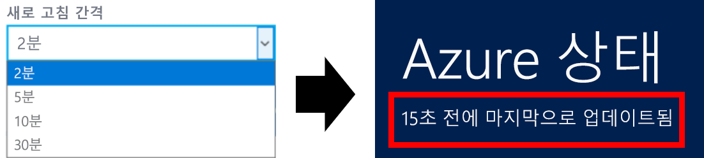

# Azure 상태 개요

[Azure 상태](https://status.azure.com/status/)는 Azure 서비스 및 지역의 상태에 대한 글로벌 보기를 제공합니다. Azure 상태를 사용하여 서비스 가용성에 대한 최신 정보를 얻을 수 있습니다. Azure 상태는 모든 사용자에게 제공되어 서비스 상태를 보고하는 모든 서비스와 광범위한 영향을 주는 인시던트를 보여 줍니다. 그러나 현재 Azure 사용자인 경우 [Azure Service Health](https://aka.ms/azureservicehealth)에서 맞춤형 환경을 사용하는 것이 좋습니다. Azure Service Health에는 모든 가동 중단, 향후 계획된 유지 관리 작업 및 서비스 추천 사항이 포함되어 있습니다.

## Azure 상태 업데이트

Azure 상태 페이지는 Azure 서비스의 상태가 변경될 때마다 실시간으로 업데이트됩니다. Azure 상태 페이지를 열어 두면 페이지가 새 데이터로 새로 고쳐지는 속도를 제어할 수 있습니다. 맨 위에서 페이지가 업데이트된 마지막 시간을 확인할 수 있습니다.

## Azure 상태 기록

Azure 상태 페이지는 항상 최신 상태 정보를 표시하지만 [Azure 상태 기록 페이지](https://status.azure.com/status/history/)를 사용하여 이전 이벤트를 볼 수 있습니다.

여기에서 이전의 근본 원인, 완화 및 Azure에 대한 다음 단계를 포함하여 과거 최대 90일의 이벤트를 확인할 수 있습니다.

## RSS 피드

Azure 상태는 또한 구독할 수 있는 Azure 서비스의 상태에 대한 변경 내용의 [RSS 피드](https://status.azure.com/status/feed/)를 제공합니다.

## 다음 단계

* [Service Health](./service-health-overview.md)를 사용하여 Azure 상태로 더욱 개인 설정된 보기를 가져오는 방법을 알아봅니다.
* [Resource Health](./resource-health-overview.md)를 사용하여 특정 Azure 리소스의 상태로 더욱 세부적인 보기를 가져오는 방법을 알아봅니다.
