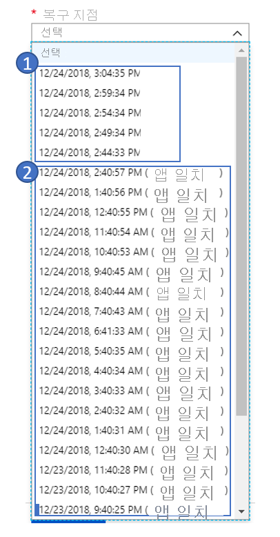

# 일반적인 질문: Azure 간 복제

이 문서에서는 Azure Site Recovery를 사용하여 Azure VM의 재해 복구(DR)를 다른 Azure 지역에 배포할 때 발생하는 일반적인 질문에 대한 답변을 제공합니다. 이 문서를 읽은 후 질문이 있으면 [Azure Recovery Services 포럼](https://social.msdn.microsoft.com/Forums/azure/home?forum=hypervrecovmgr)에 게시해 주세요.

## 일반

### Site Recovery 비용은 어떻게 책정하는가요?
[Azure Site Recovery 가격](https://azure.microsoft.com/blog/know-exactly-how-much-it-will-cost-for-enabling-dr-to-your-azure-vm/) 세부 정보를 검토하세요.
### Azure Site Recovery의 무료 계층은 어떻게 작동하나요?
Azure Site Recovery로 보호되는 모든 인스턴스는 처음 31일 동안 무료로 보호됩니다. 32일째 되는 날부터 인스턴스 보호에 대해 위 요금으로 청구됩니다.
### 처음 31일 동안 다른 Azure 요금이 발생하나요?
예, Azure Site Recovery는 보호된 인스턴스에 대해 처음 31일 동안 무료로 사용할 수 있지만 Azure Storage, 스토리지 트랜잭션 및 데이터 전송에 대해서는 요금이 발생할 수 있습니다. 복구된 가상 머신도 Azure Compute 요금이 발생할 수 있습니다. 가격 책정에 대한 자세한 내용은 [여기](https://azure.microsoft.com/pricing/details/site-recovery)를 참조하세요.

### Azure VM에서 Site Recovery를 구성하기 위한 모범 사례는 무엇입니까?
1. [Azure 간 아키텍처 이해](azure-to-azure-architecture.md)
2. [지원되는 구성 및 지원되지 않는 구성 검토](azure-to-azure-support-matrix.md)
3. [Azure VM에 대한 재해 복구 설정](azure-to-azure-how-to-enable-replication.md)
4. [테스트 장애 조치 실행](azure-to-azure-tutorial-dr-drill.md)
5. [주 지역에 대한 장애 조치 및 장애 복구](azure-to-azure-tutorial-failover-failback.md)

### 어떻게는 용량 보장 대상 지역의 Azure Vm에 대 한 되나요?
Azure 용량 관리 팀은 충분 한 인프라 용량 계획을 사용 하 여 Azure Site Recovery (ASR) 팀은 작업, Vm 재해에 대 한 ASR로 보호 되도록 하기 위해 복구를 성공적으로 배포할 재해 복구 (DR) 지역에서 때마다 ASR 장애 조치 작업이 시작 됩니다.

## 복제

### Azure 디스크 암호화를 통해 지원되는 VM을 복제할 수 있나요?
예, 복제할 수 있습니다. [Azure 디스크 암호화 사용 가상 머신을 다른 Azure 지역에 복제](azure-to-azure-how-to-enable-replication-ade-vms.md) 문서를 참조하세요. 현재 Azure Site Recovery에서는 Windows OS를 실행 중이며 Azure Active Directory(Azure AD) 앱으로 암호화가 가능한 Azure VM만 지원됩니다.

### VM을 다른 구독에 복제할 수 있나요?
예, Azure VM을 동일한 Azure AD 테넌트의 다른 구독에 복제할 수 있습니다.
[구독](https://azure.microsoft.com/blog/cross-subscription-dr) 간에 DR을 구성하는 것은 간단합니다. 복제 시 다른 구독을 선택하면 됩니다.

### 영역이 고정된 Azure VM을 다른 지역에 복제할 수 있나요?
예, [영역이 고정된 VM](https://azure.microsoft.com/blog/disaster-recovery-of-zone-pinned-azure-virtual-machines-to-another-region)을 다른 지역에 복제할 수 있습니다.

### 디스크를 제외할 수 있나요?

예, PowerShell을 사용하여 보호 시 디스크를 제외할 수 있습니다. 자세한 내용은 참조 하세요. [문서](azure-to-azure-exclude-disks.md)

### Azure에 얼마나 자주 복제할 수 있나요?
Azure VM을 다른 Azure 지역에 복제할 때는 복제가 계속 진행됩니다. 자세한 내용은 [Azure 간 복제 아키텍처](https://docs.microsoft.com/azure/site-recovery/azure-to-azure-architecture#replication-process)를 참조하세요.

### 한 지역 내에서 가상 머신을 복제할 수 있나요? VM을 마이그레이션하는 데 필요합니다.
Azure 간 DR 솔루션을 사용하여 지역 내에서 VM을 복제할 수는 없습니다.

### VM을 다른 Azure 지역에 복제할 수 있나요?
Site Recovery를 사용하면 동일한 지리적 클러스터 내의 두 지역 간에 VM을 복제 및 복구할 수 있습니다. 지리적 클러스터는 데이터 대기 시간 및 주권에 유의하여 정의됩니다. 자세한 내용은 Site Recovery [지역 지원 행렬](https://docs.microsoft.com/azure/site-recovery/azure-to-azure-support-matrix#region-support)을 참조하세요.

### Site Recovery에 인터넷 연결이 필요한가요?

아니요, Site Recovery에는 인터넷 연결이 필요하지 않습니다. [이 문서](https://docs.microsoft.com/azure/site-recovery/azure-to-azure-about-networking#outbound-connectivity-for-ip-address-ranges)에 설명된 대로 Site Recovery URL과 IP 범위에 액세스해야 합니다.

### 계층별로 별도의 리소스 그룹이 있는 애플리케이션을 복제할 수 있습니까?
예, 애플리케이션을 복제하고 재해 복구 구성을 별도의 리소스 그룹에 유지할 수도 있습니다.
예를 들어 각 계층 앱, 데이터베이스 및 웹이 별도의 리소스 그룹에 있는 애플리케이션이 있다면 [복제 마법사](https://docs.microsoft.com/azure/site-recovery/azure-to-azure-how-to-enable-replication#enable-replication)를 세 번 클릭해야 모든 계층이 보호됩니다. ASR은 이러한 세 계층을 세 개의 리소스 그룹에 복제합니다.

## 복제 정책

### 복제 정책은 무엇인가요?
복구 지점의 보존 기록 및 앱 일치 스냅숏 빈도에 대한 설정을 정의합니다. 기본적으로 Azure Site Recovery는 다음 기본 설정을 사용하여 새 복제 정책을 만듭니다.

* 복구 지점의 보존 기록의 경우 24시간으로 설정합니다.
* 앱 일치 스냅숏 빈도의 경우 60분으로 설정합니다.

[자세히 알아보기](https://docs.microsoft.com/azure/site-recovery/azure-to-azure-tutorial-enable-replication#configure-replication-settings).

### 크래시 일치 복구 지점은 무엇인가요?
크래시 일치 복구 지점은 스냅숏을 만들 때 서버에서 VM이 손상되었거나 전원 코드가 빠졌을 때 디스크에 기록된 데이터를 나타냅니다. 스냅숏을 만들 때 메모리에 있던 내용이 포함되지 않습니다.

현재 대부분의 애플리케이션은 크래시 일치 스냅숏을 제대로 복구할 수 있습니다. 크래시 일치 복구 지점은 데이터베이스가 없는 운영 체제와 파일 서버, DHCP 서버, 인쇄 서버 등의 애플리케이션에 일반적으로 적합합니다.

### 충돌 일치 복구 지점 생성 빈도는 어느 정도인가요?
Site Recovery는 5분 마다 크래시 일치 복구 지점을 만듭니다.

### 애플리케이션 일치 복구 지점은 무엇인가요?
애플리케이션 일치 복구 지점은 애플리케이션 일치 스냅숏에서 만들어집니다. 애플리케이션 일치 복구 지점은 크래시 일치 스냅숏과 동일한 데이터를 캡처하고 메모리에 있는 모든 데이터와 처리 중인 모든 트랜잭션을 추가합니다.
추가 콘텐츠로 인해, 애플리케이션 일관성이 있는 스냅숏은 가장 복잡하며 가장 오랜 시간이 걸립니다. 애플리케이션 일치 복구 지점은 데이터베이스 운영 체제와 SQL 서버 등의 애플리케이션에 권장됩니다.

### 애플리케이션 일치 복구 지점이 애플리케이션 성능에 미치는 영향은 무엇입니까?
애플리케이션 일치 복구 지점은 메모리와 프로세스의 모든 데이터를 캡처하므로 애플리케이션을 수신 거부하기 위해 Windows에 VSS 같은 프레임워크가 필요합니다. 워크로드가 이미 바쁘게 진행되고 있는 상태에서 이 작업이 매우 자주 수행될 경우 성능이 저하될 수 있습니다. 일반적으로 데이터베이스 이외 워크로드의 경우 앱 일치 복구 지점에 낮은 빈도를 사용하지 않는 것이 좋고, 데이터베이스 워크로드에도 1시간이면 충분합니다.

### 애플리케이션 일치 복구 지점 생성의 최소 빈도는 어느 정도인가요?
Site Recovery는 1 시간 동안에서 최소 빈도 사용 하 여 프로그램 응용 프로그램 일치 복구 지점을 만듭니다 수 있습니다.

### 복구 지점은 어떻게 생성 및 저장되나요?
Site Recovery에서 복구 지점을 생성하는 방법을 이해하기 위해 복구 지점 보존 창은 24시간, 앱 일치 빈도 스냅숏은 1시간인 복제 정책을 예로 들어 살펴 보겠습니다.

Site Recovery는 5분 마다 크래시 일치 복구 지점을 만듭니다. 사용자는 이 빈도를 변경할 수 없습니다. 따라서 마지막 1시간 동안 사용자가 선택할 수 있는 크래시 일치 지점 12개와 앱 일치 지점 1개를 만듭니다. 시간이 지남에 따라 Site Recovery는 마지막 1시간 이전에 만든 모든 복구 지점을 정리하여 시간당 한 개의 복구 지점만 저장합니다.

다음 스크린샷은 예제를 보여줍니다. 스크린샷:

1. 마지막 1시간 내에는 5분 빈도 간격으로 만든 복구 지점이 있습니다.
2. 마지막 1시간 이전에는 Site Recovery는 1개의 복구 지점만 유지합니다.

   

### 복구할 수 있는 가장 오랜 복구 지점은 어떻게 되나요?
사용할 수 있는 가장 오래된 복구 지점은 72시간입니다.

### 24시간 복제 정책을 설정했고 문제가 있어 Site Recovery에서 24시간을 초과하는 지난 복구 지점을 생성하지 못하는 경우 어떻게 되나요? 이전 복구 지점이 손실되나요?
아니요, Site Recovery는 이전 복구 지점을 모두 유지합니다. 복구 지점 보존 기간에 따라, 이 경우 24시간 동안 새 요소가 생성된 경우에만 Site Recovery가 오래된 지점을 바꿉니다. 이 경우 몇 가지 문제로 인해 새로 생성된 복구 지점이 없으므로 보존 기간에 도달하면 모든 이전 지점이 그대로 유지됩니다.

### VM에서 복제를 사용하도록 설정한 후 복제 정책을 변경하려면 어떻게 할까요?
**Site Recovery 자격 증명 모음** > **Site Recovery 인프라** > **복제 정책**으로 이동합니다. 편집할 정책을 선택하고 변경 내용을 저장합니다. 변경 내용은 모든 기존 복제에도 적용됩니다.

### 모든 복구 지점이 VM의 전체 복사본인가요, 아니면 차등 복사본인가요?
생성되는 첫 번째 복구 지점에 전체 복사본이 있습니다. 모든 연속 복구 지점에는 델타 변경 내용이 있습니다.

### 복구 지점의 보존 기간을 늘리면 스토리지 비용도 증가하나요?
예. 보존 기간을 24시간에서 72시간으로 늘리면 Site Recovery에서 추가 48시간의 복구 지점을 저장합니다. 추가된 시간에 대해 스토리지 요금이 부과됩니다. 예를 들어 단일 복구 지점에 10GB의 델타 변경 내용이 있고 GB당 비용이 매월 $0.16인 경우 매월 $1.6 * 48의 추가 요금이 부과됩니다.

## 다중 VM 일관성

### 다중 VM 일관성은 무엇인가요?
복구 지점이 모든 복제된 가상 머신에서 일관되는지 확인하는 것을 의미합니다.
Site Recovery는 “다중 VM 일관성” 옵션을 제공하며, 이 옵션을 선택하는 경우 복제 그룹을 만들어 그룹의 일부인 모든 머신을 함께 복제합니다.
모든 가상 머신은 장애 조치 시 크래시 일치와 앱 일치 복구 지점을 공유합니다.
자습서를 통해 [다중 VM 일관성을 사용하도록 설정](https://docs.microsoft.com/azure/site-recovery/azure-to-azure-tutorial-enable-replication#enable-replication)합니다.

### 다중 VM 일관성 복제 그룹 내에서 단일 가상 머신을 장애 조치(failover)할 수 있나요?
"다중 VM 일관성" 옵션을 선택하면 애플리케이션은 한 그룹 내의 모든 가상 머신에서 종속성을 가지게 됩니다. 따라서 단일 가상 머신 장애 조치는 허용되지 않습니다.

### 다중 VM 일관성 복제 그룹의 일부분으로 얼마나 많은 가상 머신을 복제할 수 있나요?
복제 그룹에서 16개의 가상 머신을 함께 복제할 수 있습니다.

### 다중 VM 일관성을 언제 사용하도록 설정해야 하나요?
CPU를 많이 사용하기 때문에 다중 VM 일관성을 사용하도록 설정하면 워크로드 성능에 영향을 줄 수 있습니다. 머신이 동일한 워크로드를 실행 중이며 다중 머신에서 일관성이 필요한 경우에만 사용해야 합니다. 예를 들어 한 애플리케이션에서 두 개의 SQL Server 인스턴스와 두 개의 웹 서버를 사용하는 경우 SQL Server 인스턴스에 대해서만 다중 VM 일관성이 있어야 합니다.

## 장애 조치(failover)

### 어떻게는 용량 보장 대상 지역의 Azure Vm에 대 한 되나요?
Azure 용량 관리 팀은 충분 한 인프라 용량 계획을 사용 하 여 Azure Site Recovery (ASR) 팀은 작업, Vm 재해에 대 한 ASR로 보호 되도록 하기 위해 복구를 성공적으로 배포할 재해 복구 (DR) 지역에서 때마다 ASR 장애 조치 작업이 시작 됩니다.

### 장애 조치(failover)는 자동입니까?

자동이 아닙니다. 포털에서 클릭 한 번으로 장애 조치(failover)를 시작하거나 [PowerShell](azure-to-azure-powershell.md)을 사용하여 장애 조치(failover)를 트리거할 수 있습니다.

### 장애 조치(failover) 후 공용 IP 주소를 유지할 수 있나요?

프로덕션 애플리케이션의 공용 IP 주소는 *장애 조치(failover) 시 유지할 수 없습니다*. 장애 조치(failover) 프로세스의 일부로 포함된 워크로드에는 대상 지역에서 사용 가능한 Azure 공용 IP 리소스를 할당해야 합니다. 수동으로 이 단계를 수행하거나 복구 계획을 통해 자동화할 수 있습니다. 복구 계획을 사용하여 공용 IP 주소를 할당하려면 [장애 조치(failover) 후 공용 IP 주소 설정](https://docs.microsoft.com/azure/site-recovery/concepts-public-ip-address-with-site-recovery#public-ip-address-assignment-using-recovery-plan)을 참조하세요.  

### 장애 조치(failover) 중 사설 IP 주소를 유지할 수 있나요?
예, 사설 IP 주소를 유지할 수 있습니다. 기본적으로 Azure VM에 대한 DR을 사용하도록 설정하면 Site Recovery는 원본 리소스 설정에 따라 대상 리소스를 만듭니다. 고정 IP 주소를 사용하여 구성된 Azure VM의 경우 Site Recovery는 대상 VM에 동일한 IP 주소(사용 중이 아닌 경우)를 프로비전하려고 시도합니다. 다른 조건에서 사설 IP 주소를 유지하려면 [장애 조치(failover) 중 IP 주소 유지](site-recovery-retain-ip-azure-vm-failover.md)를 참조하세요.

### 장애 조치(failover) 후 서버에는 원본 VM과 동일한 IP 주소가 없습니다. 새 IP 주소가 할당되는 이유는 무엇인가요?

Site Recovery는 장애 조치(failover) 시 IP 주소를 제공하려고 시도합니다. 다른 가상 머신에서 해당 IP 주소를 가져가는 경우 Site Recovery는 대상으로 사용 가능한 다음 IP 주소를 설정합니다.
Site Recovery가 주소 지정을 처리하는 방법에 대한 자세한 내용은 [가상 네트워크에 대한 네트워크 매핑 및 IP 주소 설정](https://docs.microsoft.com/azure/site-recovery/azure-to-azure-network-mapping#set-up-ip-addressing-for-target-vms)을 참조하세요.

### **최신(가장 낮은 RPO)** 복구 지점은 무엇인가요?
**최신(가장 낮은 RPO)** 옵션을 사용하면 먼저 Site Recovery 서비스로 보낸 모든 데이터를 처리한 다음, 해당 복구 지점에 장애 조치하기 전에 각 VM에 대한 복구 지점을 만듭니다. 이 옵션은 장애 조치(failover) 후에 생성된 VM은 장애 조치(failover)가 트리거되었을 때 Site Recovery로 복제된 모든 데이터를 보유하므로 가장 낮은 RPO(복구 지점 목표)를 제공합니다.

### **최신(가장 낮은 RPO)** 복구 지점이 장애 조치(failover) RTO에 영향을 주나요?
예. Site Recovery는 장애 조치 전에 모든 보류 중인 데이터를 처리하므로, 이 옵션은 다른 옵션에 비해 복구 시간 목표(RTO)가 더 높습니다.

### 복구 지점에서 **가장 최근 처리됨** 옵션은 무엇을 의미하나요?
**가장 최근 처리됨** 옵션은 계획 내의 모든 VM을 Site Recovery에서 처리한 최신 복구 지점으로 장애 조치합니다. 특정 VM에 대한 최신 복구 지점을 보려면 VM 설정에서 **최신 복구 지점**을 선택하세요. 이 옵션은 처리되지 않은 데이터를 처리하는 데 시간이 투입되지 않으므로 낮은 RTO를 제공합니다.

### 두 개의 Azure 지역 간에 복제하는 경우 주 지역에서 예기치 않은 중단이 발생하면 어떻게 되나요?
중단 후에 장애 조치(failover)를 트리거할 수 있습니다. Site Recovery는 주 지역에서의 연결이 없어도 장애 조치(failover)를 수행할 수 있습니다.

### 가상 머신 장애 조치(failover)의 RTO는 어떻게 되나요?
Site Recovery의 [RTO는 2시간](https://azure.microsoft.com/support/legal/sla/site-recovery/v1_2/)입니다. 그러나 대부분의 경우 Site Recovery는 몇 분 내에 가상 머신을 장애 조치(failover)합니다. VM이 작동할 때까지 걸린 시간이 표시되는 장애 조치(failover) 작업으로 이동하여 RTO를 계산할 수 있습니다. 복구 계획 RTO의 경우에는 아래 섹션을 참조하세요.

## 복구 계획

### 복구 플랜은 무엇인가요?
Site Recovery의 복구 플랜은 VM의 장애 조치(failover) 복구를 조정합니다. 복구 플랜을 통해 복구가 일관성 있게 정확하고, 반복 가능하며, 자동화되도록 유지할 수 있습니다. 복구 플랜은 사용자의 다음 요구 사항을 처리합니다.

- 함께 장애 조치(failover)되는 가상 머신의 그룹 정의
- 애플리케이션이 정확하게 작동하도록 가상 머신 간의 종속성 정의
- 가상 머신 장애 조치(failover) 이외의 작업도 수행할 수 있도록 사용자 지정 수동 작업과 함께 복구 자동화

[자세히 알아봅니다](site-recovery-create-recovery-plans.md) .

### 복구 플랜에서 순서를 지정하려면 어떻게 하나요?

복구 플랜에서 여러 개의 그룹을 만들어 순서를 지정할 수 있습니다. 모든 그룹을 한 번에 장애 조치합니다. 함께 장애 조치된 동일한 그룹의 일부인 VM은 다른 그룹 다음에 옵니다. 복구 계획을 사용하여 애플리케이션을 모델링하는 방법을 알아보려면 [복구 계획](recovery-plan-overview.md#model-apps)을 참조하세요.

### 복구 플랜의 RTO를 확인하려면 어떻게 할까요?
복구 플랜의 RTO를 확인하려면 복구 플랜을 테스트 장애 조치(failover)를 수행하고 **Site Recovery 작업**으로 이동합니다.
다음 예제에서 SAPTestRecoveryPlan이라는 작업은 모든 가상 머신을 장애 조치하고 지정된 작업을 수행하는 데 8분 59초가 소요되었습니다.

### 복구 플랜에 자동화 Runbook을 추가할 수 있나요?
예, Azure Automation Runbook을 복구 플랜에 통합할 수 있습니다. [자세히 알아보기](site-recovery-runbook-automation.md).

## 다시 보호 및 장애 복구

### 주 지역에서 재해 복구 지역으로 장애 조치(failover)를 수행한 후에는 DR 지역의 VM이 자동으로 보호되나요?
아니요. Azure VM을 한 지역에서 다른 지역으로 [장애 조치(failover)](https://docs.microsoft.com/azure/site-recovery/azure-to-azure-tutorial-failover-failback)할 경우 VM은 DR 지역에서 보호되지 않는 상태로 부팅됩니다. VM을 주 지역으로 장애 복구(failback)하려면 보조 지역에서 VM을 [다시 보호](https://docs.microsoft.com/azure/site-recovery/azure-to-azure-how-to-reprotect)해야 합니다.

### 다시 보호 시 Site Recovery에서 보조 지역의 전체 데이터를 주 지역에 복제하나요?
상황에 따라 다릅니다. 예를 들어 원본 지역 VM이 있는 경우 원본 디스크와 대상 디스크 사이의 변경 내용만 동기화됩니다. Site Recovery는 디스크를 비교하여 차등을 계산한 다음, 데이터를 전송합니다. 이 프로세스는 일반적으로 몇 시간 정도 걸립니다. 다시 보호 중 발생하는 작업에 대한 자세한 내용은 [주 지역으로 장애 조치 된 Azure VM 다시 보호]( https://docs.microsoft.com/azure/site-recovery/azure-to-azure-how-to-reprotect#what-happens-during-reprotection)를 참조하세요.

### 장애 복구(failback)하는 데 시간이 얼마나 걸리나요?
다시 보호 후 장애 복구에 대한 시간은 일반적으로 주 지역에서 보조 지역으로 장애 조치(failover)를 수행하는 시간과 비슷합니다.

## 용량

### 어떻게이 용량 보장 대상 지역의 Azure Vm에 대 한?
Azure 용량 관리 팀은 충분 한 인프라 용량 계획을 사용 하 여 Azure Site Recovery (ASR) 팀은 작업, Vm 재해에 대 한 ASR로 보호 되도록 하기 위해 복구를 성공적으로 배포할 재해 복구 (DR) 지역에서 때마다 ASR 장애 조치 작업이 시작 됩니다.

### Reserved Instances를 사용 하 여 Site Recovery가 작동 하나요?
예를 구입할 수 있습니다 [이더라도 인스턴스가](https://azure.microsoft.com/pricing/reserved-vm-instances/) DR 지역 및 ASR 장애 조치 작업에서는 사용 하 여 해당 합니다.   추가 구성은 고객 으로부터 필요 하지 않습니다.

## 보안
### 복제 데이터가 Site Recovery 서비스로 전송되나요?
아니요, Site Recovery는 복제된 데이터를 가로채지 않으며 가상 머신에서 실행되는 항목에 대한 정보가 없습니다. 복제 오케스트레이션 및 장애 조치(failover)에 필요한 메타데이터만 Site Recovery 서비스로 전송됩니다.  
Site Recovery는 ISO 27001:2013, 27018, HIPAA, DPA 인증을 받았으며, SOC2 및 FedRAMP JAB 평가를 수행하는 중입니다.

### Site Recovery는 복제를 암호화합니까?
예, 전송 중 암호화 및 [Azure의 암호화](https://docs.microsoft.com/azure/storage/storage-service-encryption)가 모두 지원됩니다.

## 다음 단계
* 지원 요구 사항을 [검토](azure-to-azure-support-matrix.md)합니다.
* Azure 간 복제를[설정](azure-to-azure-tutorial-enable-replication.md)합니다.
