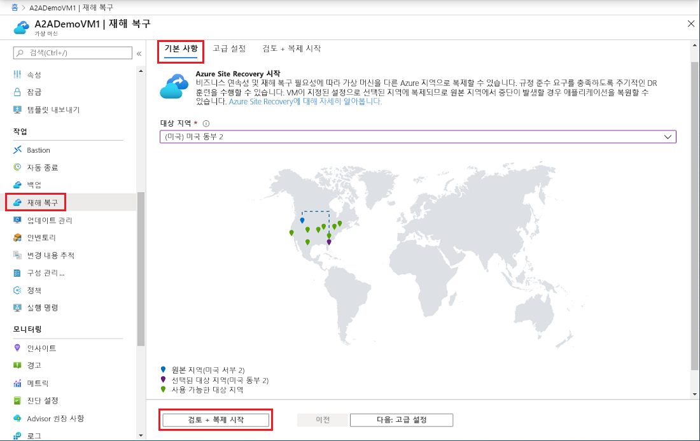
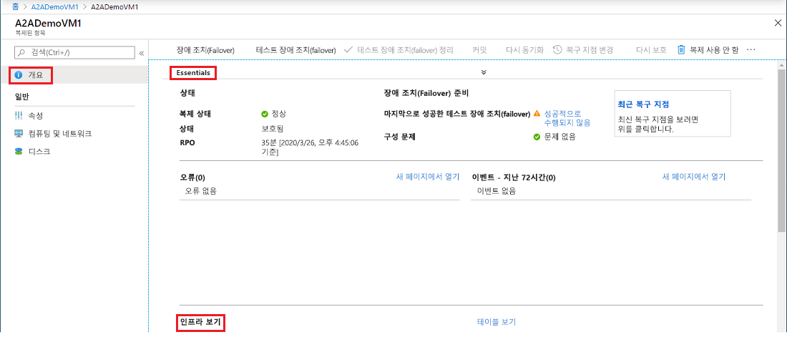
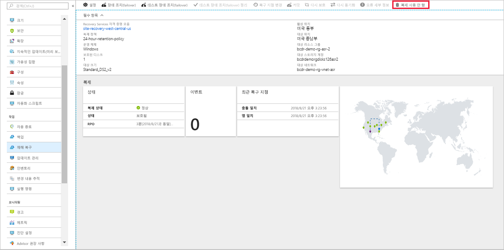

# 보조 Azure 지역에 Azure VM의 재해 복구 설정        

[Azure Site Recovery](site-recovery-overview.md) 서비스는 계획된 정전 및 계획되지 않은 정전 중 비즈니스 앱 작동을 유지하여 BCDR(비즈니스 연속성 및 재해 복구) 전략에 기여합니다. Site Recovery는 복제, 장애 조치(failover), 복구를 포함하여 온-프레미스 컴퓨터 및 Azure VM(Virtual Machines)의 재해 복구를 오케스트레이션합니다.

이 빠른 시작에서는 다른 Azure 지역으로 복제하여 Azure VM에 대한 재해 복구를 설정하는 방법을 설명합니다.

Azure 구독이 아직 없는 경우 시작하기 전에 [체험 계정](https://azure.microsoft.com/free/?WT.mc_id=A261C142F)을 만듭니다.

> [!NOTE]
> 이 문서는 새 사용자를 위한 빠른 연습으로 사용됩니다. 여기서는 기본 옵션과 최소 사용자 지정을 포함하는 가장 간단한 경로를 사용합니다.  보다 자세한 연습을 보려면 [자습서](azure-to-azure-tutorial-enable-replication.md)를 확인하세요.

## Azure에 로그인

Azure Portal ( https://portal.azure.com ) 에 로그인합니다.

## Azure VM에 대해 복제 사용

1. Azure Portal에서 **가상 머신**를 클릭한 다음 복제할 VM을 선택합니다.
2. **작업**에서 **재해 복구**를 클릭합니다.
3. **재해 복구 구성** > **대상 지역**에서 복제할 대상 지역을 선택합니다.
4. 이 빠른 시작에서는 다른 기본 설정을 그대로 적용합니다.
5. **복제 활성화**를 클릭합니다. VM에 대해 복제를 활성화하는 작업이 시작됩니다.

    

## 설정 확인

복제 작업이 완료되면 복제 상태를 확인하고, 복제 설정을 수정하고, 배포를 테스트할 수 있습니다.

1. **작업**에서 **재해 복구**를 클릭합니다.
2. 복제 상태, 생성된 복구 지점, 원본 및 대상 지역을 지도에서 확인할 수 있습니다.

   

## 리소스 정리

복제를 비활성화하면 주 지역의 VM이 복제를 중지합니다.

- 원본 복제 설정이 자동으로 정리됩니다. 복제의 일부로 VM에 설치되는 Site Recovery 확장은 제거되지 않았으며 수동으로 제거해야 합니다. 
- VM에 대한 Site Recovery 청구는 중지됩니다.

다음과 같이 복제를 중지합니다.

1. VM을 선택합니다.
2. **재해 복구**에서 **복제 사용 안 함**을 클릭합니다.

   

## 다음 단계

이 빠른 시작에서는 단일 VM을 보조 지역에 복제합니다. 이제 복구 계획을 사용하여 여러 Azure VM 복제를 시도해 보세요.

> [!div class="nextstepaction"]
> [Azure VM에 대해 재해 복구 구성](azure-to-azure-tutorial-enable-replication.md)
