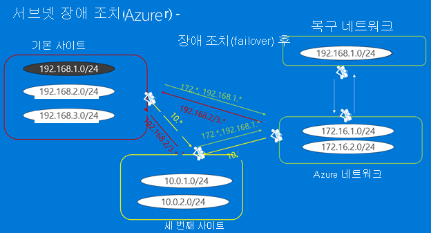

# 장애 조치(failover) 후 연결할 IP 주소 설정

이 문서에서는 Azure로의 복제 및 장애 조치에 [Azure Site Recovery](site-recovery-overview.md)를 사용한 후 Azure VM에 연결하기 위한 네트워킹 요구 사항을 설명합니다.

이 문서에서는 다음에 대해 알아봅니다.

> [!div class="checklist"]
> * 사용할 수 있는 연결 방법
> * 복제된 Azure VM에 다른 IP 주소를 사용하는 방법
> * 장애 조치 후 Azure VM에 대해 IP 주소를 유지하는 방법

## 복제본 VM에 연결

복제 및 장애 조치(failover) 전략을 계획할 경우 주요 질문 중 하나는 장애 조치(failover) 후에 Azure VM에 어떻게 연결하는가입니다. 복제본 Azure VM에 대한 네트워크 전략을 설계할 때 몇 가지 선택 항목이 있습니다.

- **다른 IP 주소 사용**: 복제된 Azure VM 네트워크에 다른 IP 주소 범위를 사용하도록 선택할 수 있습니다. 이 시나리오에서 VM은 장애 조치(failover) 후에 새 IP 주소를 갖게 되며 DNS 업데이트가 필요합니다.
- **동일한 IP 주소 유지**: 기본 온-프레미스 사이트에 있는 것과 동일한 IP 주소 범위를 장애 조치(failover) 후 Azure 네트워크에 대해 사용할 수도 있습니다. 동일한 IP 주소를 유지하면 장애 조치(failover) 후 네트워크 관련 문제가 줄어들어 복구가 간소화됩니다. 그러나 Azure에 복제하는 경우 장애 조치 후에 경로를 IP 주소의 새 위치로 업데이트해야 합니다.

## IP 주소 유지

Site Recovery는 Azure에 장애 조치할 경우 서브넷 장애 조치를 사용하여 고정 IP 주소를 유지하는 기능을 제공합니다.

- 서브넷 장애 조치를 사용하는 경우 특정 서브넷은 사이트 1 또는 사이트 2에 있으며 두 사이트에 동시에 존재하지는 않습니다.
- 장애 조치(failover) 시 IP 주소 공간을 유지 관리하기 위해 라우터 인프라에 대해 프로그래밍 방식으로 정렬하여 한 사이트에서 다른 사이트로 서브넷을 이동할 수 있습니다.
- 장애 조치(failover) 중에 서브넷은 연결되어 있는 보호된 VM과 함께 이동합니다. 주요 단점은 오류 발생 시 전체 서브넷을 이동해야 한다는 점입니다.

### 장애 조치 예제

가상의 회사인 Woodgrove Bank를 사용하여 Azure로 장애 조치하는 예제를 살펴보겠습니다.

- Woodgrove Bank는 온-프레미스 사이트에서 해당 비즈니스 앱을 호스트합니다. Azure에서 Mobile Apps를 호스트합니다.
- 온-프레미스 가장자리 네트워크와 Azure 가상 네트워크 사이에는 VPN 사이트 간 연결이 있습니다. VPN 연결로 인해 Azure의 가상 네트워크가 온-프레미스 네트워크의 확장으로 나타납니다.
- Woodgrove는 Site Recovery를 사용하여 온-프레미스 워크로드를 Azure로 복제하려고 합니다.
  - Woodgrove는 하드 코드된 IP 주소에 종속된 앱이 있으므로 Azure로 장애 조치한 이후 해당 앱의 IP 주소를 유지해야 합니다.
  - Azure에서 실행되는 리소느는 172.16.1.0/24, 172.16.2.0/24 범위의 IP 주소를 사용합니다.

**장애 조치 전 인프라**

Woodgrove가 IP 주소를 유지하는 동시에 해당 VM을 Azure로 복제할 수 있으려면 회사는 다음을 수행해야 합니다.

1. 온-프레미스 컴퓨터의 장애 조치 후 Azure VM을 만들 Azure 가상 네트워크를 만듭니다. 애플리케이션이 원활하게 장애 조치(failover)할 수 있도록 온-프레미스 네트워크를 확장해야 합니다.
2. 장애 조치 전에 Site Recovery의 컴퓨터 속성에서 동일한 IP 주소를 할당합니다. 장애 조치 후 Site Recovery는 이 주소를 Azure VM에 할당합니다.
3. 장애 조치를 실행하고 동일한 IP 주소로 Azure VM을 만든 후에는 [Vnet 간 연결](../vpn-gateway/vpn-gateway-howto-vnet-vnet-resource-manager-portal.md)을 사용하여 네트워크에 연결합니다. 이 작업은 스크립팅될 수 있습니다.
4. 192.168.1.0/24가 이제 Azure로 이동했음을 반영하기 위해 경로를 수정해야 합니다.

**장애 조치 후 인프라**

#### 사이트 간 연결 

장애 조치 후에는 Vnet 간 연결 외에도 Woodgrove가 사이트 간 VPN 연결을 설정할 수 있습니다.
- 사이트 간 연결을 설정하는 경우 Azure 네트워크에서는 IP 주소 범위가 온-프레미스 IP 주소 범위와 다른 경우 온-프레미스 위치(로컬-네트워크)에 트래픽을 라우팅할 수 있습니다. 이는 Azure는 확대 서브넷을 지원하지 않기 때문입니다. 따라서 온-프레미스에 서브넷 192.168.1.0/24가 있는 경우 Azure 네트워크에 로컬 네트워크 192.168.1.0/24를 추가할 수 없습니다. 이렇게 예측하는 이유는 Azure가 서브넷에 활성 VM이 없고 해당 서브넷이 재해 복구용으로만 만들어진다는 것을 모르기 때문입니다.
- Azure 네트워크 외부에서 네트워크 트래픽을 제대로 라우팅할 수 있으려면 네트워크 및 로컬 네트워크의 서브넷이 충돌하지 않아야 합니다.

## 새 IP 주소 할당

이 [블로그 게시물](https://azure.microsoft.com/blog/2014/09/04/networking-infrastructure-setup-for-microsoft-azure-as-a-disaster-recovery-site/)은 장애 조치(failover) 후 IP 주소를 유지할 필요가 없을 때 Azure 네트워킹 인프라를 설정하는 방법을 설명합니다. 애플리케이션 설명으로 시작하여 온-프레미스 및 Azure의 네트워킹을 설정하는 방법을 찾고, 장애 조치(failover)를 실행하는 방법에 대한 정보로 마무리합니다.

## 다음 단계
[장애 조치 실행](site-recovery-failover.md)
