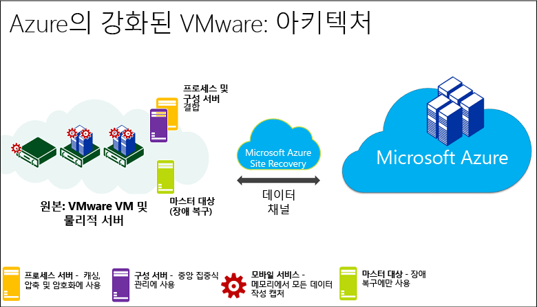
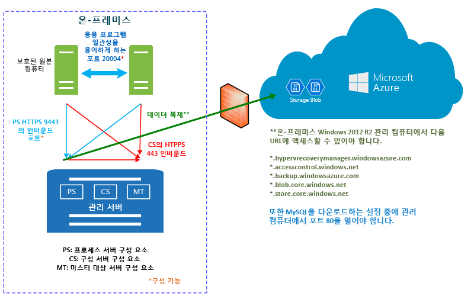

# Site Recovery에서 Azure에 대한 VMware 복제가 작동하는 방식

이 문서에서는 Azure Portal에서 [Azure Site Recovery](site-recovery-overview.md) 서비스를 사용하여 온-프레미스 VMware 가상 컴퓨터 및 Windows/Linux 실제 서버를 Azure에 복제할 때 포함된 구성 요소 및 프로세스를 설명합니다.

물리적 온-프레미스 서버를 Azure에 복제할 때 VMware VM 복제와 동일한 구성 요소와 프로세스를 사용합니다. 단, 다음과 같은 차이점이 있습니다.

- VMware VM 대신 구성 서버에 대한 물리적 서버를 사용할 수 있습니다.
- 장애 복구를 위해 온-프레미스 VMware 인프라가 필요합니다. 실제 컴퓨터로 장애 복구를 수행할 수 없습니다.

이 문서의 하단에서 의견을 게시하거나 [Azure Recovery Services 포럼](https://social.msdn.microsoft.com/forums/azure/home?forum=hypervrecovmgr)에서 질문하세요.

## 아키텍처 구성 요소

VMware VM 및 실제 서버를 Azure에 복제하는 경우 여러 가지 구성 요소가 관련됩니다.

**구성 요소** | **위치** | **세부 정보**
--- | --- | ---
**Azure** | Azure에서 Azure 계정, Azure Storage 계정 및 Azure 네트워크가 필요합니다. | 복제된 데이터를 저장소 계정에 저장하고 온-프레미스 사이트에서 장애 조치가 발생한 경우 복제된 데이터를 사용하여 Azure VM을 만듭니다. Azure VM을 만들 때 Azure 가상 네트워크에 연결합니다.
**구성 서버** | 구성 서버, 프로세스 서버, 마스터 대상 서버를 포함하여 배포에 필요한 모든 온-프레미스 구성 요소를 실행하는 단일 온-프레미스 관리 서버(VMWare VM) | 구성 서버 구성 요소는 온-프레미스와 Azure 간의 통신을 조정하여 데이터 복제를 관리합니다.
 **프로세스 서버**:  | 기본적으로 구성 서버에 설치합니다. | 복제 게이트웨이의 역할을 합니다. 복제 데이터를 수신하고 캐싱, 압축 및 암호화를 사용하여 최적화하며 복제 데이터를 Azure Storage로 전송합니다.   또한 프로세스 서버는 보호되는 컴퓨터에서 모바일 서비스의 푸시 설치를 처리하며 VMware VM의 자동 복구를 수행합니다.   배포가 늘어나면 프로세스 서버로 실행하는 별도의 추가 전용 서버를 추가하여 증가하는 복제 트래픽을 처리할 수 있습니다.
 **마스터 대상 서버** | 기본적으로 온-프레미스 구성 서버에 설치합니다. | Azure에서 장애 복구 중에 복제 데이터를 처리합니다.   장애 복구 트래픽 볼륨이 높은 경우 장애 복구를 위해 별도 마스터 대상 서버를 배포할 수 있습니다.
**VMware 서버** | VMware VM은 vSphere ESXi 서버에서 호스트되며 호스트를 관리하는 vCenter 서버를 사용하는 것이 좋습니다. | VMware 서버를 사용자의 Recovery Services 자격 증명 모음에 추가합니다.
**복제된 컴퓨터** | 복제하려는 각 VMware VM에 모바일 서비스가 설치됩니다. 각 컴퓨터에 수동으로 설치되거나 프로세스 서버에서 강제 설치로 설치될 수 있습니다.

[지원 매트릭스](site-recovery-support-matrix-to-azure.md)에서 이러한 구성 요소에 대한 배포 필수 구성 요소 및 요구 사항을 알아봅니다.

**그림 1: VMware에서 Azure 구성 요소로**

## 복제 프로세스

1. Azure 구성 요소 및 Recovery Services 자격 증명 모음을 포함하여 배포를 설정합니다. 자격 증명 모음에서 복제 원본 및 대상을 지정하고 구성 서버를 설정하며 VMware 서버를 추가하고 복제 정책을 만들고 모바일 서비스를 배포하고 복제를 사용하도록 설정하며 테스트 장애 조치를 실행합니다.
2.  컴퓨터는 복제 정책에 따라 복제를 시작하고 데이터의 초기 복사본은 Azure Storage로 복제됩니다.
4. Azure에 대한 델타 변경 내용의 복제는 초기 복제가 완료된 후에 시작됩니다. .hrl 파일에는 컴퓨터에 대한 추적된 변경 내용이 유지됩니다.
    - 컴퓨터를 복제하는 작업은 복제 관리를 위해 HTTPS 443 인바운드 포트에 대한 구성 서버와 통신합니다.
    - 컴퓨터를 복제하는 작업은 복제 데이터를 HTTPS 9443 인바운드 포트(구성될 수 있음)에 대한 프로세스 서버로 전달합니다.
    - 구성 서버는 HTTPS 443 아웃바운드 포트를 통해 Azure를 사용하는 복제 관리를 오케스트레이션합니다.
    - 프로세스 서버가 원본 컴퓨터에서 데이터를 수신하고 이를 최적화 및 암호화하며 443 아웃바운드 포트를 통해 Azure Storage로 전송합니다.
    - 다중 VM 일관성을 사용하도록 설정하면 복제 그룹의 컴퓨터는 20004 포트를 통해 서로 통신하게 됩니다. 다중 VM은 장애 조치 시(failover) 크래시 일관성 및 앱 일관성 복구 지점을 공유하는 복제 그룹에 여러 컴퓨터를 그룹화하는 경우 사용됩니다. 이 기능은 컴퓨터가 동일한 워크로드를 실행하고 일관성을 유지해야 할 경우에 유용합니다.
5. 트래픽은 인터넷을 통해 Azure Storage 공용 끝점에 복제됩니다. Azure ExpressRoute [공용 피어링](../expressroute/expressroute-circuit-peerings.md#public-peering)을 사용할 수도 있습니다. 온-프레미스 사이트에서 Azure로의 사이트 간 VPN을 통한 트래픽 복제는 지원되지 않습니다.

**그림 2: VMware에서 Azure 복제로**

## 장애 조치 및 장애 복구 프로세스

1. 예상대로 작동하는 테스트 장애 조치(failover)를 확인한 후에 필요에 따라 Azure에 계획되지 않은 장애 조치(failover)를 실행할 수 있습니다. 계획된 장애 조치는 지원되지 않습니다.
2. 단일 컴퓨터에 장애 조치를 수행하거나 [복구 계획](site-recovery-create-recovery-plans.md)을 만들어서 여러 VM의 장애 조치를 실행할 수 있습니다.
3. 장애 조치를 실행하면 Azure에 복제본 VM이 만들어집니다. 복제본 Azure VM에서 워크로드에 액세스하려면 장애 조치를 커밋합니다.
4. 기본 온-프레미스 사이트를 다시 사용할 수 있는 경우 장애 복구를 수행할 수 있습니다. 장애 복구 인프라를 설정하고 보조 사이트에서 기본 사이트에 컴퓨터를 복제하기 시작하며 보조 사이트에서 계획되지 않은 장애 조치를 실행합니다. 이 장애 조치를 커밋한 후에 데이터가 다시 온-프레미스로 돌아오면 Azure에 다시 복제를 사용하도록 설정해야 합니다. [자세히 알아보기](site-recovery-failback-azure-to-vmware.md)

몇 가지 장애 복구 요구 사항이 있습니다.

- **Azure에서 임시 프로세스 서버**: 장애 조치 후 Azure에서 장애 복구하려면 Azure에서 복제를 처리하기 위해 프로세스 서버로 구성된 Azure VM을 설정해야 합니다. 장애 복구를 완료한 후 이 VM을 삭제할 수 있습니다.
- **VPN 연결**: 장애 복구를 수행하려면 Azure 네트워크에서 온-프레미스 사이트로 VPN 연결(또는 Azure Express 경로) 설정이 필요합니다.
- **별도의 온-프레미스 마스터 대상 서버**: 온-프레미스 마스터 대상 서버는 장애 복구를 처리합니다. 마스터 대상 서버는 기본적으로 관리 서버에 설치되지만 대량의 트래픽 볼륨을 장애 복구하는 경우 이 목적으로 별도의 온-프레미스 마스터 대상 서버를 설정해야 합니다.
- **장애 복구 정책**: 온-프레미스 사이트에 다시 복제하려면 장애 복구 정책이 필요합니다. 이 정책은 복제 정책을 만들 때 자동으로 생성됩니다.
- **VMware 인프라**: 온-프레미스 VMware VM으로 장애 복구(failback)해야 합니다. 즉, 온-프레미스 물리적 서버를 Azure로 복제하는 경우에도 온-프레미스 VMware 인프라가 필요합니다.

**그림 3: VMware/물리적 장애 복구**

## 다음 단계

[지원 매트릭스](site-recovery-support-matrix-to-azure.md)를 검토합니다.

