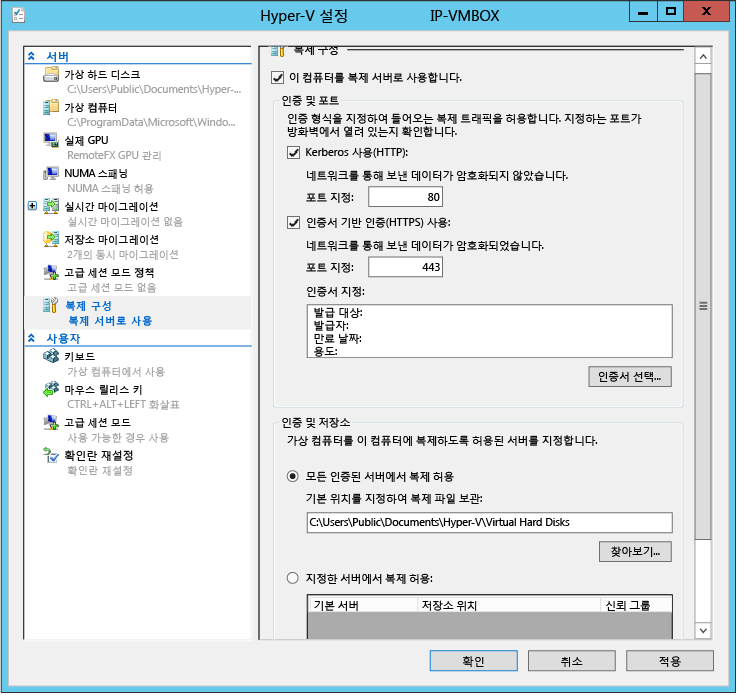

<properties
	pageTitle="Hyper-V 복제를 위한 용량 계획"
	description="이 문서는 Azure 사이트 복구를 위한 용량 플래너 도구를 사용하는 방법에 대해 설명하며 Hyper-V 복제를 위한 용량 계획에 대한 리소스가 포함되어 있습니다."
	services="site-recovery"
	documentationCenter="na"
	authors="csilauraa"
	manager="jwhit"
	editor="tysonn" />
<tags
	ms.service="site-recovery"
	ms.devlang="na"
	ms.topic="get-started-article"
	ms.tgt_pltfrm="na"
	ms.workload="infrastructure-services"
	ms.date="08/05/2015"
	ms.author="lauraa" />

# Hyper-V 복제를 위한 용량 계획

Azure 사이트 복구는 두 개의 온-프레미스 VMM 사이트 간 또는 온-프레미스 VMM 서버와 Azure 저장소 간의 복제를 위해 Hyper-V 복제본을 사용합니다. 이 문서는 Azure 사이트 복구(ASR) - Hyper-V 복제본 도구에 대해 용량 플래너를 사용하는 방법을 단계별로 안내합니다. ASR - Hyper-V 복제본 도구용 용량 플래너는 Hyper-V 복제본을 성공적으로 배포하고 두 사이트 사이에서 네트워크 연결성을 검증하는 데 필요한 서버, 저장소, 네트워크 인프라를 설계할 수 있도록 IT 관리자를 안내합니다.

## 시스템 요구 사항
- 운영 체제: Windows Server® 2012 또는 Windows Server® 2012 R2
- 메모리: 20MB(최소)
- CPU: 5% 오버헤드(최소)
- 디스크 공간: 5MB(최소)

## 학습 단계
- 1단계: 기본 사이트 준비
- 2단계: 복구 사이트가 온-프레미스인 경우 복구 사이트 준비
- 3단계: 용량 플래너 도구 실행
- 4단계: 결과 해석

## 1단계: 기본 사이트 준비
1. 복제를 위해 사용해야 하는 모든 Hyper-V 가상 컴퓨터와 해당되는 기본 Hyper-V 호스트/클러스터 목록을 만듭니다.
2. 기본 Hyper-V 호스트와 클러스터를 다음 중 하나로 그룹화합니다.

  - Windows Server® 2012 독립 실행형 서버
  - Windows Server® 2012 클러스터
  - Windows Server® 2012 R2 독립 실행형 서버
  - Windows Server® 2012 R2 클러스터

3. 용량 플래너 도구를 독립 실행형 서버 그룹당 한 번, 각 클러스터에 대해 한 번 실행해야 합니다.
4. 모든 기본 호스트 및 클러스터에서 WMI에 대해 원격 액세스를 활성화합니다. 올바른 방화벽 규칙 및 사용자 권한 집합이 설정되어 있는지 확인합니다.

        netsh firewall set service RemoteAdmin enable

5. 기본 호스트에서 성능 모니터링을 활성화합니다.

  - **고급 보안** 스냅인과 함께 **Windows 방화벽**을 열고 다음 인바운드 규칙을 사용합니다.
    - COM+ 네트워크 액세스(DCOM-In)
    - 원격 이벤트 로그 관리 그룹 내 모든 규칙

## 2단계: 복구 사이트 준비
Azure를 복구 사이트로 사용하고 있거나 온-프레미스 복구 사이트가 아직 준비되지 않은 경우에는 이 섹션을 건너뛰어도 됩니다. 하지만 건너뛰면 두 사이트 사이에 사용 가능한 대역폭을 측정하지 못할 수도 있습니다.

1. 인증 방법 식별

	a. Kerberos: 기본 및 복구 Hyper-V 호스트가 모두 동일한 도메인에 있거나 상호 신뢰할 수 있는 도메인에 있는 경우에 사용됩니다.

	b. 인증서: 기본 및 복구 Hyper-V 호스트가 다른 도메인에 있는 경우 사용됩니다. makecert를 사용하여 인증서를 생성할 수 있습니다. 이 기법을 사용하여 인증서를 배포하는 데 필요한 단계에 대한 정보는 [Hyper-V 복제본 인증서 기반 인증 - makecert](http://blogs.technet.com/b/virtualization/archive/2013/04/13/hyper-v-replica-certificate-based-authentication-makecert.aspx) 블로그 게시물을 참조하십시오.

2. 복구 사이트로부터 **단일** 복구 Hyper-V 호스트/클러스터를 식별합니다.

	a. 이 복구 호스트/클러스터를 사용하여 더미 가상 컴퓨터를 복제하고 기본과 보조 사이트 사이에서 사용 가능한 대역폭을 예측합니다.

	b. **권장**: 테스트 실행에 단일 복구 Hyper-V 호스트를 사용합니다.

### 단일 Hyper-V 호스트를 복구 서버로 준비합니다.
1. Hyper-V 관리자에서 **작업** 창에 있는 **Hyper-V 설정**을 클릭합니다.
2. **Hyper-V 설정** 대화 상자에서 **복제 구성**을 클릭합니다.
3. 세부 정보 창에서 **이 컴퓨터를 복제 서버로 사용**을 선택합니다.
4. **인증 및 포트** 섹션에서 이전에 선택한 인증 방법을 선택합니다. 인증 방법에 대해 사용할 포트를 지정합니다(기본 포트는 HTTP를 통한 kerberos의 경우에는 80, HTTPS를 통한 인증서 기반 인증의 경우는 443).
5. 인증서 기반 인증을 사용하는 경우 **인증서 선택**을 클릭하고 인증서 정보를 제공합니다.
6. **인증 및 저장소** 섹션에서 인증된 **모든** (기본) 서버가 복제 데이터를 이 복제본 서버로 보낼 수 있도록 지정합니다.
7. **OK** 또는 **적용**을 클릭합니다.

8. netsh http show servicestate 명령을 실행하여 https 수신기가 실행되고 있는지 확인합니다.
9. 방화벽 포트 열기:

        Port 443 (certificae-based authentication):
          Enable-Netfirewallrule -displayname "Hyper-V Replica HTTPS Listener (TCP-In)"

        Port 80 (Kerberos):
          Enable-Netfirewallrule -displayname "Hyper-V Replica HTTP Listener (TCP-In)"

### 단일 Hyper-V 클러스터를 복구 대상으로 준비합니다.
독립 실행형 Hyper-V 호스트를 이미 복구 서버로 준비했다면 이 섹션을 건너뛰어도 됩니다.

1. Hyper-V 복제본 broker 구성:

	a. **서버 관리자**에서 **장애 조치 클러스터 관리자**를 엽니다.

	b. 왼쪽 창에서 클러스터에 연결하고 클러스터 이름이 강조 표시되는 동안 **작업** 창에 있는 **역할 구성**을 클릭합니다. 그러면 **고가용성 마법사**가 열립니다.

	c. **역할 선택** 화면에서 **Hyper-V 복제본 Broker**를 선택합니다.

	d. 클러스터에 대한 연결점으로 사용할 **NetBIOS 이름** 및 **IP 주소**를 제공하여 마법사를 완료합니다(클라이언트 액세스 지점이라고 불림). **Hyper-V 복제본 Broker**가 구성되어 클라이언트 액세스 지점 이름이 생성됩니다. 클라이언트 액세스 지점 이름을 메모해두십시오. 나중에 복제본을 구성하는 데 사용할 것입니다.

	e. Hyper-V 복제본 Broker 역할이 성공적으로 온라인 상태가 되었는지, 모든 클러스터 노드 사이에서 장애 조치할 수 있는지 확인합니다. 이렇게 하려면 해당 역할을 마우스 오른쪽 단추로 클릭하고 **이동**을 가리킨 다음 **노드 선택**을 클릭합니다. 노드 > **OK**를 선택합니다.

	f. 인증서 기반 인증을 사용하는 경우 각 클러스터 노드와 Hyper-V 복제본 Broker의 클라이언트 액세스 지점 모두에 인증서가 설치되었는지 확인합니다.

2. 복제본 설정 구성:

	a. **서버 관리자**에서 **장애 조치 클러스터 관리자**를 엽니다.
	
	b. 왼쪽 창에서 클러스터에 연결하고 클러스터 이름이 강조 표시되는 동안 **세부 정보** 창의 **이동** 카테고리에서 **역할**을 클릭합니다.
	
	c. 해당 역할을 마우스 오른쪽 단추로 클릭한 다음 **복제 설정**을 선택합니다.
	
	d. **세부 정보** 창에서 **이 컴퓨터를 복제 서버로 사용**을 선택합니다.

	e. **인증 및 포트** 섹션에서 이전에 선택한 인증 방법을 선택합니다. 인증 방법에 대해 사용할 포트를 지정합니다(기본 포트는 HTTP를 통한 kerberos의 경우에는 80, HTTPS를 통한 인증서 기반 인증의 경우는 443).

	f. 인증서 기반 인증을 사용하는 경우 **인증서 선택**을 클릭하고 요청한 인증서 정보를 제공합니다.

	g. **인증 및 저장소** 섹션에서 인증된 **모든** (기본) 서버가 복제 데이터를 이 복제본 서버로 보내거나 고유한 기본 서버로부터 데이터에 대한 승인을 제한합니다. 각각을 개별적으로 지정하지 않고 특정 도메인으로부터 서버에 대한 승인을 제한하도록 와일드카드 문자를 사용할 수 있습니다(예:*.contoso.com).

	h. 모든 복구 Hyper-V 호스트에서 방화벽 포트 열기: 포트 443(인증서 인증): Get-ClusterNode | ForEach-Object {Invoke-command -computername \\$\_.name -scriptblock {Enable-Netfirewallrule -displayname "Hyper-V Replica HTTPS Listener (TCP-In)"}}

          Port 80 (Kerberos auth):
              Get-ClusterNode | ForEach-Object {Invoke-command -computername \$\_.name -scriptblock {Enable-Netfirewallrule -displayname "Hyper-V Replica HTTP Listener (TCP-In)"}}

## 3단계: 용량 플래너 도구 실행
1. 용량 플래너 도구를 다운로드합니다.
2. 기본 서버 중 하나로부터 도구를 실행합니다(또는 기본 클러스터로부터 노드 중 하나). .exe 파일을 마우스 오른쪽 단추로 클릭한 다음 **관리자 권한으로 실행**을 선택합니다.
3. 원하는 경우 **라이선스 약관**을 수락하고 **다음**을 클릭합니다.
4. **메트릭 수집 소요 시간**을 선택합니다. 가장 대표적인 데이터가 수집되도록 프로덕션 시간 중에 도구를 실행하는 것이 좋습니다. 메트릭 수집을 위한 권장 소요 시간은 30분입니다. 네트워크 연결의 유효성만 검사하는 경우에는 1분을 소요 시간으로 선택할 수 있습니다.

5. 그림에서와 같이 **기본 사이트 세부 정보**를 지정하고 **다음**을 클릭합니다.

	독립 실행형 호스트의 경우에는 서버 이름이나 FQDN을 입력합니다.

	기본 호스트가 클러스터의 일부라면 다음 중 하나의 FQDN을 입력할 수 있습니다.

	a. Hyper-V 복제본 Broker 클라이언트 액세스 지점(CAP)

	b. 클러스터 이름

	c. 클러스터의 모든 노드

  

6. **복제본 사이트 세부 정보**를 입력합니다(온-프레미스 사이트에서 온-프레미스 사이트로의 복제만)

  Azure에 대한 복제를 사용하고자 하거나 복구 서버로 Hyper-V 호스트나 클러스터를 준비하지 않은 경우(2단계 설명처럼) 복제본 사이트와 관련된 테스트를 건너뛰십시오.

  **복제본 사이트** 세부 정보를 지정하고 **다음**을 클릭합니다.

i 독립 실행형 호스트의 경우 서버 이름이나 FQDN을 입력합니다.

ii. 기본 호스트가 클러스터의 일부라면 다음 중 하나의 FQDN을 입력할 수 있습니다.

a. Hyper-V 복제본 Broker 클라이언트 액세스 지점(CAP)

b. 클러스터 이름

c. 클러스터의 모든 노드

   

7. **확장된 복제본 사이트**와 관련된 테스트는 건너뜁니다. 이들은 ASR에서 지원되지 않습니다.
8. 프로필을 작성할 가상 컴퓨터를 선택합니다. 도구는 **기본 사이트 세부 정보**에 지정된 클러스터 또는 독립 실행형 서버에 연결하며, 실행 중인 가상 컴퓨터를 열거합니다. 메트릭을 수집하려는 가상 디스크 및 가상 컴퓨터를 선택합니다.

다음 가상 컴퓨터는 열거 또는 표시되지 않습니다.

- 이미 복제에 사용되고 있는 가상 컴퓨터
- 실행되지 않는 가상 컴퓨터

9. **네트워크 정보**(이것은 온-프레미스 사이트와 온-프레미스 사이트 간 복제 시,그리고 복제본 사이트 세부 정보가 제공되는 경우에만 적용 가능).

요청된 네트워크 정보를 지정하고 **다음**을 클릭합니다.

- 예상된 WAN 대역폭
- 인증에 사용할 인증서(선택 사항): 인증서 기반의 인증을 사용하고자 한다면 이 페이지에 필요한 인증서를 제공해야 합니다.

   

10. 다음 화면 집합에서 **다음**을 클릭하여 도구를 시작합니다.

11. 도구의 실행이 완료되면 **보고서 보기**를 클릭하여 출력을 검토합니다.

    기본 보고서 위치:

    %systemdrive%\\Users\\Public\\Documents\\Capacity Planner

    로그 위치:

    %systemdrive%\\Users\\Public\\Documents\\CapacityPlanner

## 4단계: 결과 해석
다음 두 시나리오 중 하나 아래에 나열되지 않은 메트릭은 무시해도 됩니다. 이 시나리오와 관련이 없기 때문입니다.

### 온-프레미스 사이트와 온-프레미스 사이트 간 복제
  - 기본 호스트의 계산, 메모리에서 복제의 영향
  - 기본, 복구 호스트의 저장소 디스크 공간, IOPS에 대한 복제의 영향
  - 델타 복제(Mbps)에 필요한 총 대역폭
  - 기본 호스트와 복구 호스트(Mbps) 사이에 관찰된 네트워크 대역폭
  - 두 호스트/클러스터 사이에서 활성 병렬 전송의 이상적인 개수에 대한 제안

### 온-프레미스 사이트에서 Azure로 복제
  - 기본 호스트의 계산, 메모리에서 복제의 영향
  - 기본 호스트의 저장소 디스크 공간, IOPS에 대한 복제의 영향
  - 델타 복제(Mbps)에 필요한 총 대역폭

더 자세한 지침은 [Hyper-V 복제본을 위한 용량 플래너 다운로드 페이지](http://go.microsoft.com/?linkid=9876170)를 참조하십시오.

## 기타 리소스
다음 리소스가 Hyper-v 복제를 위한 용량 계획을 지원합니다.

- [업데이트: Hyper-V 복제본용 용량 플래너](http://go.microsoft.com/fwlink/?LinkId=510891)—이 블로그 게시물은 이 새로운 도구에 대한 개요를 제공합니다.

- [Hyper-V 복제본을 위한 용량 플래너](http://go.microsoft.com/fwlink/?LinkId=510892)—이 도구의 최신 버전을 다운로드합니다.

- [안내 실습](http://go.microsoft.com/fwlink/?LinkId=510893)—Keith Mayer의 TechNet 블로그에서 이 도구를 사용한 용량 계획을 실제로 보여줍니다.

- [성능 및 크기 조정 테스트 - 온-프레미스 사이](https://msdn.microsoft.com/library/azure/dn760892.aspx)—온-프레미스에서 온-프레미스로의 배포에 대한 복제 테스트 결과를 읽습니다.

## 다음 단계

ASR의 배포를 시작하려면:

- [온-프레미스 VMM 사이트와 Azure 간 보호 설정](site-recovery-vmm-to-azure.md)
- [온-프레미스 Hyper-V 사이트와 Azure 간 보호 설정](site-recovery-hyper-v-site-to-azure)
- [2개의 온-프레미스 VMM 사이트 간 보호 설정](site-recovery-vmm-to-vmm)
- [SAN으로 2개의 온-프레미스 VMM 사이트 간 보호 설정](site-recovery-vmm-san)
- [단일 VMM 서버로 보호 설정](site-recovery-single-vmm)
 

<!---HONumber=August15_HO7-->