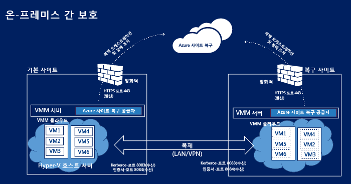
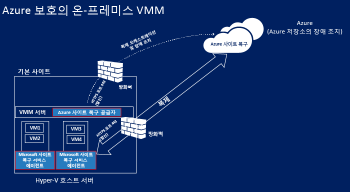
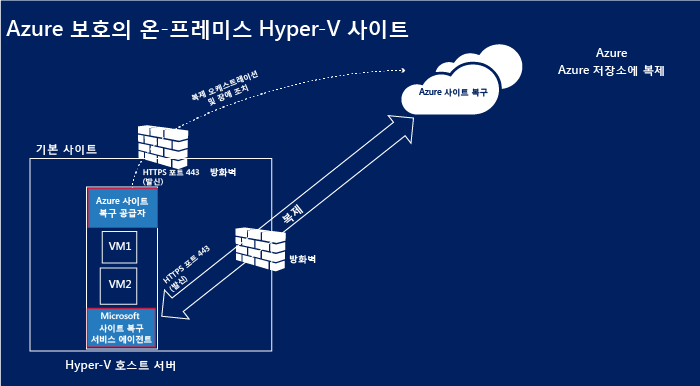
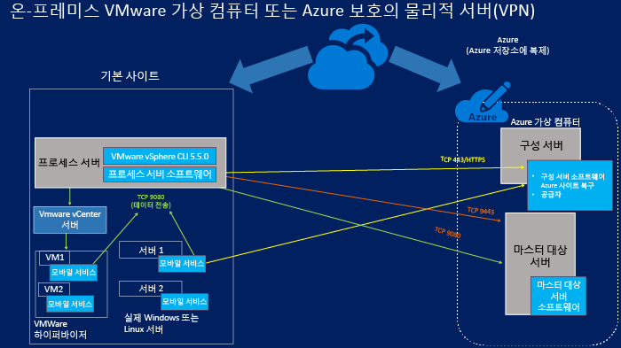
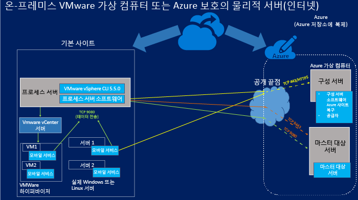

<properties
	pageTitle="사이트 복구 구성 요소" 
	description="이 문서는 사이트 복구 구성 요소의 개요 및 관리 방법을 제공합니다." 
	services="site-recovery"
	documentationCenter=""
	authors="rayne-wiselman"
	manager="jwhit"
	editor=""/>

<tags
	ms.service="site-recovery"
	ms.workload="backup-recovery"
	ms.tgt_pltfrm="na"
	ms.devlang="na"
	ms.topic="get-started-article"
	ms.date="07/09/2015"
	ms.author="raynew"/>

# 사이트 복구 구성 요소

Azure Site Recovery는 가상 컴퓨터와 물리적 서버의 복제, 장애 조치(Failover) 및 복구를 오케스트레이션하여 BCDR(비즈니스 연속성 및 재해 복구) 전략에 기여합니다. 컴퓨터는 Azure 또는 보조 온-프레미스 데이터 센터로 복제될 수 있습니다. [개요 읽기](site-recovery-overview.md).

이 문서는 서버와 가상 컴퓨터에 설치되는 사이트 복구 구성 요소를 요약 및 설명합니다.

이 문서에 대한 문의 사항은 [Azure 복구 서비스 포럼](https://social.msdn.microsoft.com/forums/azure/home?forum=hypervrecovmgr)에 게시할 수 있습니다.

## 개요

사이트 복구 구성 요소는 보호 시나리오에 따라 약간씩 달라집니다.

### VMM이 설치된 두 데이터 센터 간 보호

**시나리오** | **설명** | **필수 구성 요소** | **세부 정보**
--- | --- | --- | ---
두 데이터 센터 간에 가상 컴퓨터를 복제하기 위하여 Azure Site Recovery를 배포합니다. | 
각 데이터 센터에는 VMM 서버가 있습니다.

각 VMM 서버에는 보호하려는 가상 컴퓨터와 하나 이상의 Hyper-V 호스트 서버를 포함하는 사설 클라우드가 있습니다.
 | Azure Site Recovery 공급자는 VMM 서버 양쪽에 설치됩니다. | 
Hyper-V 호스트 서버나 보호된 가상 컴퓨터에는 구성 요소가 설치되지 않습니다.

VMM 서버의 Azure Site Recovery 공급자는 HTTPS 443을 통해 사이트 복구 서비스와 통신하여 보호를 오케스트레이션합니다.

복제는 Kerberos를 사용하여 인터넷을 통해 기본 및 보조 Hyper-V 호스트 서버 사이에서 발생하고 8083 및 8084 포트에서 인증서를 인증합니다.

### VMM이 설치된 데이터 센터와 Azure 간 보호

**시나리오** | **설명** | **필수 구성 요소** | **세부 정보**
--- | --- | --- | ---
데이터 센터와 Azure 간에 가상 컴퓨터를 복제하기 위하여 Azure Site Recovery를 배포합니다. | 
온-프레미스 데이터 센터에는 보호하려는 가상 컴퓨터와 하나 이상의 Hyper-V 호스트 서버를 포함하는 사설 클라우드가 있는 VMM 서버가 있습니다.
 | 
Azure Site Recovery 공급자는 VMM 서버에 설치됩니다.

Microsoft 복구 서비스 에이전트는 원본 Hyper-V 호스트 서버에 설치됩니다.
 | 
보호된 가상 컴퓨터에는 구성 요소가 설치되지 않습니다.

VMM 서버의 Azure Site Recovery 공급자는 HTTPS 443을 통해 사이트 복구 서비스와 통신하고 보호를 오케스트레이션합니다.

복제는 HTTPS 443을 통해 원본 Hyper-V 호스트 서버를 실행하는 Microsoft 복구 서비스 에이전트와 Azure 사이에서 발생합니다.

###  Hyper-V 사이트와 Azure 간 보호

**시나리오** | **설명** | **필수 구성 요소** | **세부 정보**
--- | --- | --- | ---
데이터 센터와 Azure 간에 가상 컴퓨터를 복제하기 위하여 Azure Site Recovery를 배포합니다. | 
온-프레미스 데이터 센터에는 보호하려는 가상 컴퓨터와 하나 이상의 Hyper-V 호스트 서버가 있습니다.

구성 과정에서 이들 Hyper-V 호스트 서버를 하나 이상 포함하는 Hyper-V 사이트를 정의합니다.
 | 
Hyper-V 호스트 서버에 Microsoft 복구 서비스 에이전트와 Azure Site Recovery 공급자를 설치하기 위해 단일 구성 요소 설치를 실행합니다.
 | 
배포에는 VMM 서버가 포함되지 않습니다.

보호된 가상 컴퓨터에는 구성 요소가 설치되지 않습니다.

 Hyper-V 서버의 Azure Site Recovery 공급자는 HTTPS 443을 통해 사이트 복구 서비스와 통신하고 보호를 오케스트레이션합니다.

복제는 HTTPS 443을 통해 Hyper-V 호스트 서버를 실행하는 Microsoft 복구 서비스 에이전트와 Azure 사이에서 발생합니다.

### 온-프레미스 물리적 서버 또는 VMware 가상 컴퓨터 및 Azure 간의 보호 

이 시나리오에서 복제는 두 가지 방법으로 발생할 수 있습니다.

- VPN 연결을 통해(Azure Express 경로 또는 사이트 간 VPN을 사용하여)
- 인터넷 보안 연결을 통해

#### VPN 사이트 간 연결(또는 Express 경로)을 통해

온-프레미스 서버의 통신은 구성 및 마스터 대상 가상 컴퓨터가 연결되어 있는 Azure 가상 네트워크의 내부 포트로 전달됩니다.

#### 인터넷을 통해

온-프레미스 서버의 모든 통신은 구성 서버 가상 컴퓨터와 마스터 대상 서버 가상 컴퓨터에 대해 Azure 클라우드 서비스 상의 매핑된 공용 끝점으로 전달됩니다. 끝점은 가상 컴퓨터를 배포할 때 동적으로 생성됩니다.

#### 포트

**구성 요소** | **포트** | **세부 정보** 
--- | --- | --- | ---
**프로세스 서버** |9080 | 보호된 컴퓨터는 TCP 9080을 통해 프로세스 서버로 복제용 데이터를 보냅니다.
**구성 서버** | HTTPS/443 | 보호된 컴퓨터에서 실행되는 모바일 서비스는 복제 메타데이터를 443 포트의 구성 서버로 보냅니다.
 | HTTPS/443 | 구성 서버는 컴퓨터 보호를 조정하고 오케스트레이션합니다. 프로세스 서버는 관리 및 제어 정보를 수신하기 위하여 매핑된 공용 끝점 또는 443 포트의 구성 서버와 통신합니다. 
 | 9443 | 장애 복구 방향에서 vContinuum 도구는 9443 포트(다이어그램에 표시되지 않음)의 구성 서버에 제어 및 메타데이터를 요청합니다.
 | 5986 | PowerShell 사용한 원격 관리는 5986 포트(다이어그램에 표시 되지 않음)를 사용합니다.
 | 3389 | 3389 포트를 사용한 구성 서버에 대한 RDP 연결(다이어그램에 표시 되지 않음)
**마스터 대상 서버** | 80 | 프로세스 사이트는 9080 포트를 통해 마스터 대상 서버에 복제 트래픽에 대한 통신을 보냅니다.
 | HTTP/443 | 프로세스 서버는 HTTP 또는 443(VPN) 포트를 통해 마스터 대상 서버에 데이터를 복제합니다.
 | HTTP/443 | 프로세스 서버는 HTTP 또는 443(VPN) 포트를 통해 마스터 대상 서버에 데이터를 복제합니다.
**방화벽 규칙** | | 
모바일 서비스의 푸시 설치가 제대로 작동하려면 보호된 컴퓨터의 방화벽에서 파일 및 프린터 공유를 Windows Management Instrumentation을 허용해야 합니다.

보호하려는 컴퓨터의 방화벽 규칙이 구성 서버에 도달하도록 허용해야 합니다.

장애 조치(Failover) 후 인터넷으로 Azure 가상 컴퓨터에 연결하려면 컴퓨터의 방화벽 규칙에서 인터넷을 통한 원격 데스크톱 연결을 허용해야 합니다. Azure의 장애 복구한 Linux 컴퓨터를 연결하려면 SSH(보안 셸) 서비스가 시스템에서 자동으로 시작되도록 설정해야 하고 방화벽 규칙은 SSH 연결을 허용해야 합니다.

## 사이트 복구 구성 요소

**구성 요소** | **세부 정보** | **설치** | **배포 시나리오**
--- | --- | --- | ---
**VMM용 Azure Site Recovery 공급자** | VMM 서버와 사이트 복구 서비스 간의 통신을 처리합니다. | VMM 서버에 설치됩니다. | 두 개의 VMM 사이트 간에 또는 VMM 사이트와 Azure 간에 보호를 설정할 때 사용됩니다.
**Hyper-V를 위한 Azure Site Recovery 공급자** | VMM이 배포되지 않는 경우 Hyper-V 호스트와 사이트 복구 서비스 간의 통신을 처리합니다. | Hyper-V 호스트 서버에 설치됩니다. | Hyper-V 사이트와 Azure 간의 보호를 설정할 때 사용됩니다.   
**Microsoft 복구 서비스 에이전트** | Hyper-V 호스트 서버와 사이트 복구 서비스 간의 통신을 처리합니다. | Hyper-V 호스트 서버에 설치됩니다. | 
Hyper-V 사이트와 Azure 간의 보호를 설정할 때 사용됩니다.

Hyper-V 용 Azure Site Recovery 공급자와 Microsoft 복구 서비스 에이전트를 모두 포함하는 단일 공급자를 다운로드합니다.

**프로세스 서버/장애 복구 프로세스 서버** | 
Azure의 마스터 대상 서버로 데이터를 보내기 전에 보호된 VMware 컴퓨터나 Windows/Linux 물리적 서버의 데이터를 최적화합니다.

VMware 가상 컴퓨터 또는 물리적 서버의 모바일 서비스의 푸시 설치를 실행합니다.

VMware 가상 컴퓨터의 자동 검색을 수행합니다.
 
장애 복구 프로세스 서버: 복제 전에 최적화하는 데이터의 첫 번째 지점만 장애 복구 프로세스 서버에 적용할 수 있습니다.
 | 
Windows Server 2012 R2 이상을 실행하는 온-프레미스 서버에 설치됩니다.

장애 복구 프로세스 서버: 표준 A4 크기 Azure 가상 컴퓨터에서 실행됩니다.
 | 
온-프레미스 물리적 서버 또는 VMware 가상 컴퓨터와 Azure 간의 보호를 설정할 때 사용됩니다.

장애 복구 프로세스 서버: Azure에서 온-프레미스로 장애 복구에 사용됩니다.

**모바일 서비스** | 보호된 컴퓨터에서 변경 내용을 파악하여 Azure로 복제를 위해 온-프레미스 프로세스 서버로 통신합니다. | 온-프레미스 VMware 가상 컴퓨터에 설치되거나 보호하려는 물리적 서버에 설치됩니다.| 온-프레미스 물리적 서버 또는 VMware 가상 컴퓨터와 Azure 간의 보호를 설정할 때 사용됩니다.
**마스터 대상 서버/장애 조치 마스터 대상 서버** | 
Azure 저장소 계정으로 Blob 저장소에 만든 연결된 VHD를 사용하여 보호된 컴퓨터에서 복제된 데이터를 유지합니다.

장애 조치 마스터 대상 서버: Azure의 장애 조치된 가상 컴퓨터의 복제 데이터를 유지합니다. 데이터는 장애 조치를 위해 역방향 복제를 사용하는 경우 선택된 데이터 보관소에서 생성된 VMDK에 유지됩니다.
 | 
Windows Server 2012 R2 갤러리 이미지(Windows 컴퓨터를 보호하기 위해)에 기반한 Windows 서버로 또는 OpenLogic CentOS 6.6 갤러리 이미지(Linux 컴퓨터를 보호하기 위해)에 기반한 Linux 서버로 Azure 가상 컴퓨터로 설치됩니다.

표준 A3 및 표준 D14의 두 가지 크기 조정 옵션을 사용할 수 있습니다.

장애 조치 마스터 대상 서버: VMware 가상 컴퓨터에서 실행됩니다. 컴퓨터 장애 조치를 취할 동일한 호스트에서 프로비저닝됩니다.
| 
온-프레미스 물리적 서버 또는 VMware 가상 컴퓨터와 Azure 간의 보호를 설정할 때 사용됩니다.

장애 마스터 대상 서버: Azure에서 온-프레미스로 장애를 복구한 가상 컴퓨터의 장애 복구에 사용됩니다.

**구성 서버** | 
Azure에서 보호된 컴퓨터, 프로세스 서버 및 마스터 대상 서버 간의 통신을 조정합니다.

장애가 발생하는 경우 복제를 설정하고 Azure에서 복제를 조정합니다.
 | 사이트 복구와 같이 Azure 구독에 포함된 Azure 표준 A3 가상 컴퓨터에 설치됩니다. | 온-프레미스 물리적 서버 또는 VMware 가상 컴퓨터와 Azure 간의 보호를 설정할 때 사용됩니다.

## 구성 요소 배포를 위한 계획

### Azure Site Recovery 공급자

공급자는 VMM 서버에서 실행되거나 배포에 VMM 서버가 없으면 Hyper-V 호스트 서버에서 실행되거나 구성 서버에서 실행됩니다. 암호화된 HTTPS 연결로 인터넷을 통해 사이트 복구 서비스에 연결합니다. 다음 사항에 유의하세요.

- 공급자를 사이트 복구에 연결하기 위해 특정 방화벽 예외를 추가할 필요가 없습니다.
- 공급자가 실행되는 서버를 프록시 서버를 사용하여 인터넷에 연결하려면 기존 프록시 설정을 사용하거나 사용자 지정 프록시를 지정할 수 있습니다.
- 프록시는 방화벽에 다음 주소를 허용해야 합니다.

	-  **.accesscontrol.windows.net
-  .backup.windowsazure.com
	-  **.blob.core.windows.net
-  **.store.core.windows.net
	
- 방화벽에 IP 주소 기반 규칙이 있는 경우 구성 서버로부터 [Azure 데이터 센터 IP 범위](https://www.microsoft.com/download/details.aspx?id=41653)에 지정된 IP 주소로의 통신과 HTTPS(443) 통신을 허용해야 합니다. 사용하려는 Azure 지역 및 미국 서부의 IP 주소 범위를 허용 목록에 추가해야 합니다.
- VMM으로 사이트 복구를 배포하고 사용자 지정 프록시를 사용하는 경우 VMM RunAs 계정 (DRAProxyAccount)이 사이트 복구 포털 내 사용자 지정 프록시 설정에서 지정한 프록시 자격 증명을 사용하여 자동으로 생성됩니다. 이 계정이 성공적으로 인증될 수 있도록 프록시 서버를 설정해야 합니다.
- Hyper-V 호스트 서버에 설치된 공급자가 프록시 서버에 보낸 프록시 트래픽을 사용하는 경우 HTTP를 통해 보내야 합니다.

### Microsoft 복구 서비스 에이전트

에이전트는 암호화된 HTTPS 연결로 인터넷을 통해 사이트 복구 서비스에 연결합니다. 방확벽 예외 지정은 필요하지 없습니다.

### VMware 또는 물리적 서버 보호 구성 요소

#### 마스터 대상 서버

- 마스터 대상 서버는 Azure 표준 A4 또는 D14 가상 컴퓨터일 수 있습니다.
- 표준 A4 마스터 대상을 사용하는 경우 각 가상 컴퓨터에 16개의 데이터 디스크(데이터 디스크당 최대 1023GB)를 추가할 수 있습니다.
- 표준 D14 마스터 대상을 사용하는 경우 각 가상 컴퓨터에 32개의 데이터 디스크(데이터 디스크당 최대 1023GB)를 추가할 수 있습니다.
- 표준 D14 크기의 마스터 대상 서버는 15개 이상의 디스크가 연결된 서버를 보호하려는 경우에만 필요합니다. 다른 모든 구성에 대해서는 표준 A4 크기 마스터 대상 서버를 배포할 수 있습니다.
- 마스터 대상 서버에 연결된 디스크 중 하나는 보존 드라이브로 예약됩니다. Azure Site Recovery를 통해 보존 창을 정의하고 보호된 컴퓨터를 해당 창 내의 복구 지점까지 복구할 수 있습니다. 보존 드라이브는 이 기간 동안 디스크 변경 내용의 업무 일지를 유지 관리합니다. 이렇게 하면 복제에 사용할 수 있는 최대 디스크가 A4에서는 15로 D14에서는 31로 감소됩니다.

#### 프로세스 서버 

- 프로세스 서버는 디스크 기반 캐시를 사용합니다. 캐시에 사용 가능한 공간이 C:/에 충분한지 확인합니다. 캐시 크기 조정은 보호 중인 컴퓨터의 데이터 변경 속도에 영향을 받습니다. 일반적으로 중간 크기 배포의 경우 600GB의 캐시 디렉터리 크기를 사용하는 것이 좋습니다.
- 보호된 컴퓨터의 데이터 변경 속도가 기존 프로세스 서버의 용량을 초과할 경우 추가 프로세스 서버를 배포해야 합니다.
- 배포 크기를 조정하려면 프로세스 서버와 마스터 대상 서버를 여러 개 추가합니다. 기존 마스터 대상 서버에서 사용 가능한 디스크가 부족할 경우 두 번째 마스터 대상 서버를 배포해야 합니다.
-  프로세스 서버와 마스터 대상 서버는 일 대 일 매핑이 필요하지 않습니다. 첫 번째 프로세스 서버를 두 번째 마스터 대상 서버와 함께 배포할 수 있습니다.

#### 구성 서버

- 구성 서버는 Azure Site Recovery Windows Server 2012 R2 갤러리 이미지를 기반으로 하는 표준 A3 가상 컴퓨터이며 구성 서버 구독에 만들어집니다. 새 클라우드 서비스에 예약된 공용 IP 주소를 사용하는 첫 번째 인스턴스로 만들어집니다.
- 설치 경로는 영문자만 가능합니다.

#### 모바일 서비스

VMware 가상 컴퓨터 또는 물리적 서버에 설치합니다. 컴퓨터와 서버는 다음 요구 사항을 반드시 충족해야 합니다.

- **Windows 서버**:
	-  64비트 운영 체제: Windows Server 2012 R2, Windows Server 2012 또는 SP1 이상을 설치한 Windows Server 2008 R2.
	-  호스트 이름, 마운트 지점, 장치 이름, Windows 시스템 경로(영어만 사용, 예: C:\\Windows)
	-  C:\\ 드라이브에 운영 체제.
	-  기본 디스크만 지원됩니다. 동적 디스크는 지원되지 않습니다.

- **Linux 서버**:
	- 지원되는 64비트 운영 체제: Centos 6.4, 6.5, 6.6; Red Hat 호환 커널 또는 UEK3(Unbreakable Enterprise Kernel Release 3)을 실행하는 Oracle Enterprise Linux 6.4, 6.5, SUSE Linux Enterprise Server 11 SP3.
	- 보호된 컴퓨터의 /etc/hosts 파일은 로컬 호스트 이름을 모든 NIC와 연관된 IP 주소에 매핑하는 항목을 포함해야 합니다.
	- 호스트 이름, 마운트 지점, 장치 이름 및 Linux 시스템 경로와 파일 이름(예: /etc/; /usr)에는 영어만 사용해야 합니다.
	-  지원되는 저장소: 파일 시스템: EXT3, ETX4, ReiserFS, XFS/Multipath 소프트웨어 장치 매퍼(다중 경로)/볼륨 관리자: LVM2. HP CCISS 컨트롤러 저장소가 있는 물리적 서버는 지원되지 않습니다.

이들 구성 요소에 대한 자세한 계획 정보는 [이 문서](site-recovery-vmware-to-azure.md)의 용량 계획 섹션을 참고하세요.

## 구성 요소를 최신으로 유지

**구성 요소** | **업데이트 방법** 
--- | --- 

**VMM용 Azure Site Recovery 공급자**

**Azure 복구 서비스 에이전트**
 | 

**최초 설치**: 빠른 시작 페이지에서 최신 버전을 다운로드합니다.

**진행 중**: 사이트 복구 내 대시보드에서 최신(및 이전) 버전을 다운로드할 수 있습니다. 또는 Microsoft 업데이트를 사용하도록 선택하면 공급자 및 에이전트 최신 버전이 서버에 자동으로 설치됩니다.

**프로세스 서버**

**구성 서버**

**마스터 대상 서버**
 | 사이트 복구 대시보드에서 업데이트를 확인합니다. 
**모바일 서비스** | 
보호하려는 각 컴퓨터에 최신 모바일 서비스 업데이트가 설치되도록 합니다:

최신 업데이트를 다운로드할 수 있습니다:

[Windows](http://download.microsoft.com/download/7/C/7/7C70CA53-2D8E-4FE0-BD85-8F7A7A8FA163/Microsoft-ASR_UA_8.3.0.0_Windows_GA_03Jul2015_release.exe)

[RHELP6-64](http://download.microsoft.com/download/B/4/5/B45D1C8A-C287-4339-B60A-70F2C7EB6CFE/Microsoft-ASR_UA_8.3.0.0_RHEL6-64_GA_03Jul2015_release.tar.gz)

[OL6-64](http://download.microsoft.com/download/9/4/8/948A2D75-FC47-4DED-B2D7-DA4E28B9E339/Microsoft-ASR_UA_8.3.0.0_OL6-64_GA_03Jul2015_release.tar.gz)

[SLES11-SP3-64](http://download.microsoft.com/download/6/A/2/6A22BFCD-E978-41C5-957E-DACEBD43B353/Microsoft-ASR_UA_8.3.0.0_SLES11-SP3-64_GA_03Jul2015_release.tar.gz)

또는 프로세스 서버가 최신인지 확인한 후 프로세스 서버의 C:\\pushinstallsvc\\repository 폴더에서 최신 버전의 모바일 서비스를 다운로드할 수 있습니다.
  

## 다음 단계

배포 시나리오를 위한 구성 요소 구성 시작 [자세히 알아봅니다](site-recovery-overview.md).

<!---HONumber=August15_HO6-->