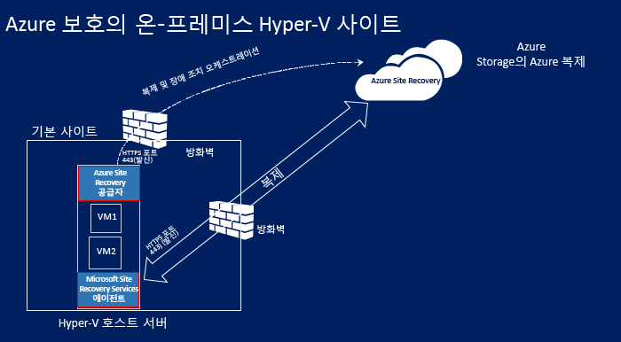
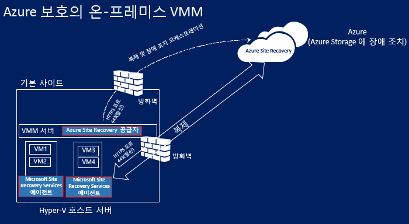
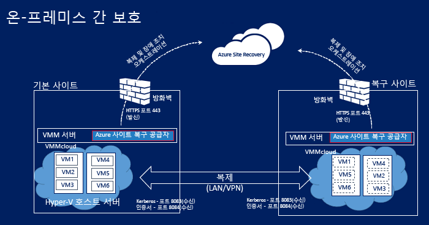
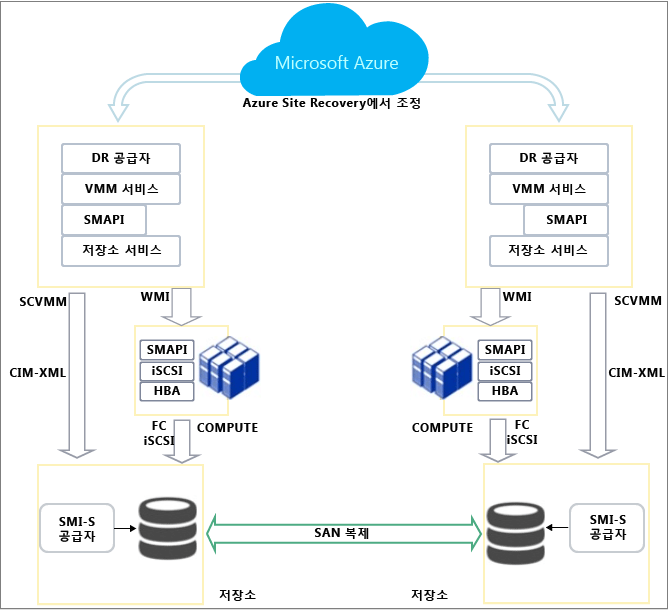
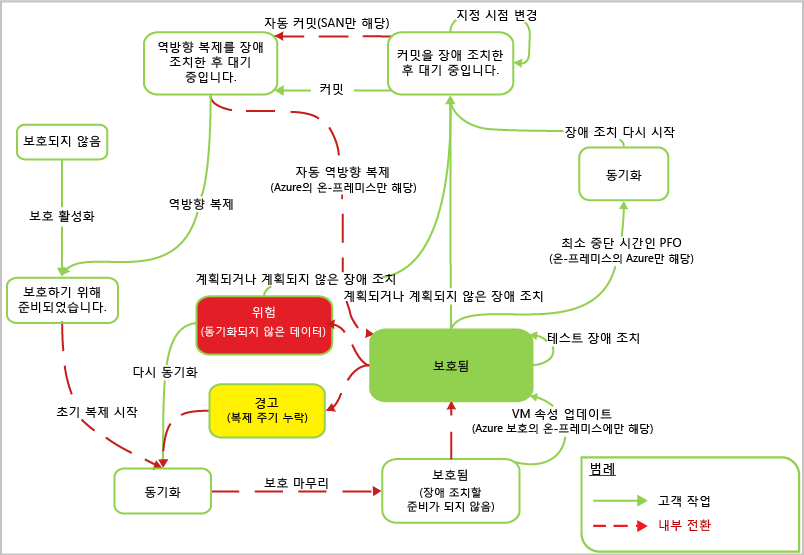

# Azure Site Recovery 작동 방식
Azure Site Recovery 서비스 아키텍처와 이를 작동하게 하는 구성 요소를 이해하려면 이 문서를 참조하세요.

이 문서의 하단 또는 [Azure 복구 서비스 포럼](https://social.msdn.microsoft.com/forums/azure/home?forum=hypervrecovmgr)에서 의견이나 질문을 게시합니다.

## 개요
계획되거나 계획되지 않은 중단 중에 워크로드 및 데이터를 실행하고 사용 가능하게 유지하며 가능한 신속히 정상적인 작업 조건으로 복구하는 BCDR(비즈니스 연속성 및 재해 복구) 전략이 필요합니다. 

Site Recovery는 BCDR 전략에 기여하는 Azure 서비스로 클라우드(Azure) 또는 보조 데이터 센터에 대한 온-프레미스 물리적 서버 및 가상 컴퓨터의 복제를 조정합니다. 기본 위치에서 중단이 발생하면 보조 위치로 장애 조치하여 앱과 워크로드를 가용 상태로 유지합니다. 기본 위치가 정상 작업 상태로 돌아오면 다시 기본 위치로 돌아갑니다. [Site Recovery란?](site-recovery-overview.md)에서 개요를 참조하세요.

## Azure 포털에서 Site Recovery
Azure는 리소스를 만들고 작업하기 위한 두 가지 [배포 모델](../resource-manager-deployment-model.md) 로 Azure Resource Manager 모델과 클래식 서비스 관리 모델을 제공합니다. 또한 Azure에는 두 가지 포털이 있는데, 하나는 클래식 배포 모델을 지원하는 [Azure 클래식 포털](https://manage.windowsazure.com/)이고 다른 하나는 두 가지 배포 모델을 모두 지원하는 [Azure Portal](https://portal.azure.com)입니다.

* Site Recovery는 클래식 포털과 Azure 포털 모두에서 지원됩니다.
* Azure 클래식 포털에서 기존 서비스 관리 모델을 사용하여 Site Recovery를 지원할 수 있습니다.
* Azure Portal에서 기존 모델 또는 리소스 모델 배포를 지원할 수 있습니다. 

이 문서의 정보는 클래식 및 Azure 포털 배포 모두에 적용됩니다. 테이블은 모든 차이점을 요약합니다.

| **복제** | **Azure 포털** | **클래식 포털** |
| --- | --- | --- |
| **Azure에 대한 VMware VM 복제** |배포 프로세스를 간소화합니다.   VM을 클래식 또는 Resource Manager 기반 저장소에 장애 조치합니다.   클래식 또는 Resource Manager 기반 저장소에 복제합니다.   장애 조치 후에 Azure VM을 연결하기 위한 클래식 또는 Resource Manager 네트워크를 사용합니다.   LRS 또는 GRS 저장소를 사용합니다. |클래식 저장소에만 장애 조치합니다.   장애 조치 후에 VM에 연결하는 데 클래식 네트워크를 사용합니다.   GRS 저장소를 사용합니다. |
| **Azure로 Hyper-V VM 복제(VMM 없이)** |배포 프로세스를 간소화합니다.   VM을 클래식 또는 Resource Manager 기반 저장소에 장애 조치합니다.   클래식 또는 Resource Manager 기반 저장소에 복제합니다.   장애 조치 후에 Azure VM을 연결하기 위한 클래식 또는 Resource Manager 네트워크를 사용합니다. | |
| **Azure로 Hyper-V VM 복제(VMM 포함)** |배포 프로세스를 간소화합니다.   VM을 클래식 또는 Resource Manager 기반 저장소에 장애 조치합니다.   클래식 또는 Resource Manager 기반 저장소에 복제합니다.   장애 조치 후에 Azure VM을 연결하기 위한 클래식 또는 Resource Manager 네트워크를 사용합니다.   네트워크 매핑을 설정해야 합니다. |클래식 저장소에만 장애 조치합니다.   장애 조치 후에 VM에 연결하는 데 클래식 네트워크를 사용합니다. |
| **보조 사이트로 Hyper-V VM 복제(VMM 포함)** |배포 프로세스를 간소화합니다.   VM을 클래식 또는 Resource Manager 기반 저장소에 장애 조치합니다.   클래식 또는 Resource Manager 기반 저장소에 복제합니다.   장애 조치 후에 Azure VM을 연결하기 위한 클래식 또는 Resource Manager 네트워크를 사용합니다.   네트워크 매핑을 설정해야 합니다. |클래식 저장소에만 장애 조치합니다.   장애 조치 후에 VM에 연결하는 데 클래식 네트워크를 사용합니다.   저장소 매핑을 설정할 수 있습니다.    SAN 복제는 지원되지 않습니다. |

## 배포 시나리오
다양한 시나리오에서 복제를 오케스트레이션하기 위해 사이트 복구를 배포할 수 있습니다.

* **VMware VM 복제**: Azure Storage 또는 보조 데이터 센터에 온-프레미스 VMware 가상 컴퓨터를 복제할 수 있습니다.
* **물리적 컴퓨터 복제**: Azure Storage 또는 보조 데이터 센터에 Windows 또는 Linux를 실행하는 물리적 컴퓨터를 복제할 수 있습니다. 물리적 컴퓨터를 복제하기 위한 프로세스는 VMware VM을 복제하기 위한 프로세스와 거의 동일합니다.
* **Hyper-V VM 복제**: Hyper-V VM이 System Center VMM 클라우드에서 관리되는 경우 Azure 또는 보조 데이터 센터에 VM을 복제할 수 있습니다. 호스트가 VMM에 의해 관리되지 않는 경우 Azure로만 복제할 수 있습니다. VMM에 의해 관리되지 않는 Hyper-V VM을 Azure Storage로 복제할 수 있습니다.
* **VM 마이그레이션**: Site Recovery를 사용하여 지역 간에 [Azure IaaS VM을 마이그레이션](site-recovery-migrate-azure-to-azure.md)하거나 Azure IaaS VM에 [AWS Windows 인스턴스를 마이그레이션](site-recovery-migrate-aws-to-azure.md)할 수 있습니다. 전체 복제는 현재 지원되지 않습니다. 마이그레이션(장애 조치)에 복제할 수 있지만 다시 장애 복구할 수 없습니다. 

사이트 복구는 이러한 VM 및 물리적 서버에서 실행 중인 대부분의 앱을 복제할 수 있습니다. 지원되는 앱의 전체 요약은 [Azure Site Recovery로 어떤 워크로드를 보호할 수 있습니까?](site-recovery-workload.md)

## Azure에 VMWare 가상 컴퓨터 복제

| **구성 요소** | **세부 정보** |
| --- | --- |
| **Azure** |**계정**: Azure 계정이 필요합니다.   **저장소**: 복제된 데이터를 저장하려면 Azure Storage 계정이 필요합니다. 기존 계정 또는 Resource Manager 저장소 계정을 사용할 수 있습니다. Azure 포털에서 배포할 경우 계정은 LRS 또는 GRS일 수 있습니다. 복제된 데이터는 Azure 저장소에 저장되고 장애 조치(Failover) 발생 시 Azure VM이 작동합니다.   **네트워크**: 장애 조치 시 만든 경우 Azure VM에서 연결할 Azure 가상 네트워크가 필요합니다. Azure Portal의 클래식 서비스 관리자 모델 또는 Resource Manager 모델에서 만든 네트워크일 수 있습니다. |
| **온-프레미스 구성 서버** |구성 서버 및 기타 Site Recovery 구성 요소를 실행하는 온-프레미스 Windows Server 2012 R2 컴퓨터가 필요합니다.   항상 사용 가능한 VMware VM이어야 합니다.   서버에서 구성 요소는 다음과 같습니다.   **구성 서버**: 온-프레미스 환경과 Azure 간의 통신을 조정하여 데이터 복제 및 복구를 관리합니다.   **프로세스 서버**:복제 게이트웨이 역할을 합니다. 보호된 원본 컴퓨터에서 복제 데이터를 수신하고 캐싱, 압축 및 암호화를 사용하여 최적화하며 데이터를 Azure 저장소로 전송합니다. 또한 보호되는 컴퓨터에서 모바일 서비스의 푸시 설치를 처리하며 VMware VM의 자동 복구를 수행합니다. 배포가 늘어나면 프로세스 서버로 실행하는 별도의 추가 전용 서버를 추가하여 증가하는 복제 트래픽을 처리할 수 있습니다.   **마스터 대상 서버**: Azure에서 장애 복구(failback) 중에 복제 데이터를 처리합니다. |
| **온-프레미스 가상화 서버** |하나 이상의 vSphere 호스트입니다. 또한 호스트를 관리하려면 vCenter 서버를 사용하는 것이 좋습니다. |
| **복제할 VM** |Azure로 복제하려는 각 VMware VM에는 모바일 서비스 구성 요소를 설치해야 합니다. 이 서비스는 컴퓨터에 기록된 데이터를 캡처하고 프로세스 서버에 전달합니다. 이 구성 요소는 수동으로 설치되거나 푸시되고 컴퓨터에 대해 복제를 사용하는 경우 프로세스 서버에서 자동으로 설치됩니다. |

* [자세히 알아봅니다](site-recovery-vmware-to-azure.md#azure-prerequisites) .
* [자세히 알아봅니다](site-recovery-failback-azure-to-vmware.md) .

## 물리적 서버를 Azure에 복제

| **구성 요소** | **세부 정보** |
| --- | --- |
| **Azure** |**계정**: Azure 계정이 필요합니다.   **저장소**: 복제된 데이터를 저장하려면 Azure Storage 계정이 필요합니다. 기존 계정 또는 Resource Manager 저장소 계정을 사용할 수 있습니다. Azure 포털에서 배포할 경우 계정은 LRS 또는 GRS일 수 있습니다. 복제된 데이터는 Azure 저장소에 저장되고 장애 조치(Failover) 발생 시 Azure VM이 작동합니다.   **네트워크**: 장애 조치 시 만든 경우 Azure VM에서 연결할 Azure 가상 네트워크가 필요합니다. Azure Portal의 클래식 서비스 관리자 모델 또는 Resource Manager 모델에서 만든 네트워크일 수 있습니다. |
| **온-프레미스 구성 서버** |구성 서버 및 기타 Site Recovery 구성 요소를 실행하는 온-프레미스 Windows Server 2012 R2 컴퓨터가 필요합니다.   가상 또는 실제 서버일 수 있습니다.   서버에서 구성 요소는 다음과 같습니다.   **구성 서버**: 온-프레미스 환경과 Azure 간의 통신을 조정하여 데이터 복제 및 복구를 관리합니다.   **프로세스 서버**:복제 게이트웨이 역할을 합니다. 보호된 원본 컴퓨터에서 복제 데이터를 수신하고 캐싱, 압축 및 암호화를 사용하여 최적화하며 데이터를 Azure 저장소로 전송합니다. 또한 보호되는 컴퓨터에서 모바일 서비스의 푸시 설치를 처리하며 VMware VM의 자동 복구를 수행합니다. 배포가 늘어나면 프로세스 서버로 실행하는 별도의 추가 전용 서버를 추가하여 증가하는 복제 트래픽을 처리할 수 있습니다.   **마스터 대상 서버**: Azure에서 장애 복구(failback) 중에 복제 데이터를 처리합니다. |
| **복제할 컴퓨터** |Azure로 복제하려는 각 물리적 Windows/Linux에는 모바일 서비스 구성 요소를 설치해야 합니다. 이 서비스는 컴퓨터에 기록된 데이터를 캡처하고 프로세스 서버에 전달합니다. 이 구성 요소는 수동으로 설치되거나 푸시되고 컴퓨터에 대해 복제를 사용하는 경우 프로세스 서버에서 자동으로 설치됩니다. |
| **장애 복구** |물리적 서버간 장애 복구는 지원되지 않습니다. 즉, 물리적 서버를 Azure로 장애 조치한 다음 장애 복구하려면 VMware VM에 장애 복구해야 합니다. 실제 서버로 장애 복구할 수 없습니다. 장애 복구할 Azure VM이 필요하고 구성 서버를 VMware VM으로 배포하지 않은 경우 별도 마스터 대상 서버를 VMware VM으로 설정해야 합니다. 마스터 대상 서버가 VMware 저장소와 상호 작용하고 연결되어 VMware VM에 디스크를 복원하기 때문에 필요합니다. |

* [자세히 알아봅니다](site-recovery-vmware-to-azure.md#azure-prerequisites) .
* [자세히 알아봅니다](site-recovery-failback-azure-to-vmware.md) .

## Azure에 VMM에서 관리하지 않는 Hyper-V VM 복제

| **구성 요소** | **세부 정보** |
| --- | --- |
| **Azure** |**계정**: Azure 계정이 필요합니다.   **저장소**: 복제된 데이터를 저장하려면 Azure Storage 계정이 필요합니다. 기존 계정 또는 Resource Manager 저장소 계정을 사용할 수 있습니다. 계정은 GRS이어야 합니다. 복제된 데이터는 Azure 저장소에 저장되고 장애 조치(Failover) 발생 시 Azure VM이 작동합니다.   **네트워크**: 장애 조치 시 만든 경우 Azure VM에서 연결할 Azure 가상 네트워크가 필요합니다. |
| **Hyper-V 호스트/VM** |하나 이상의 Hyper-V 호스트가 하나 이상의 VM을 실행합니다.   Site Recovery 공급자와 Recovery Services 에이전트는 배포하는 동안 각 호스트에 설치됩니다. |

* [자세히 알아봅니다](site-recovery-hyper-v-site-to-azure.md#azure-prerequisites) .
* [자세히 알아봅니다](site-recovery-hyper-v-site-to-azure-classic.md#azure-prerequisites) .

## Azure에 VMM에서 관리하는 Hyper-V VM 복제

| **구성 요소** | **세부 정보** |
| --- | --- |
| **Azure** |**계정**: Azure 계정이 필요합니다.   **저장소**: 복제된 데이터를 저장하려면 Azure Storage 계정이 필요합니다. 기존 계정 또는 Resource Manager 저장소 계정을 사용할 수 있습니다. 계정은 GRS이어야 합니다. 복제된 데이터는 Azure 저장소에 저장되고 장애 조치(Failover) 발생 시 Azure VM이 작동합니다.   **네트워크**: 장애 조치 시 만든 경우 Azure VM에서 연결할 Azure 가상 네트워크가 필요합니다. |
| **VMM 서버** |하나 이상의 사설 클라우드가 있는 하나 이상의 온-프레미스 VMM 서버가 필요합니다. Site Recovery 공급자는 배포하는 동안 각 서버에 설치됩니다. |
| **Hyper-V 호스트/VM** |하나 이상의 Hyper-V 호스트가 하나 이상의 VM을 실행합니다.   Recovery Services 에이전트는 배포하는 동안 각 호스트에 설치됩니다. |

* [자세히 알아봅니다](site-recovery-vmm-to-azure.md#azure-requirements) .
* [자세히 알아봅니다](site-recovery-vmm-to-azure-classic.md#before-you-start) .

## 보조 사이트에 VMWare 가상 컴퓨터 또는 물리적 서버 복제

| **구성 요소** | **세부 정보** |
| --- | --- |
| **Azure** |**계정**: InMage Scout를 사용하여 이 시나리오를 배포합니다. 이를 가져오려면 Azure 계정이 필요합니다.   Site Recovery 자격 증명 모음을 만든 후에 InMage Scout를 다운로드하고 최신 업데이트를 설치하여 배포를 설정합니다. |
| **기본 사이트** |**프로세스 서버**: 캐싱, 압축 및 데이터 최적화를 처리하도록 기본 사이트의 프로세스 서버 구성 요소를 설정합니다. 또한 보호하려는 컴퓨터에 대해 통합 에이전트의 푸시 설치를 처리합니다.   **VMware ESX/ESXi 및 vCenter**: VMware EXS/ESXi 하이퍼바이저 및 선택적으로 VMware vCenter 서버가 필요합니다.   **VM** |
| **보조 사이트** |**구성 서버**: 구성 서버는 사용자가 설치하는 최초의 구성 요소이며, 관리 웹 사이트나 vContinuum 콘솔을 사용하여 배포를 관리, 구성 및 모니터링하기 위해 보조 사이트에 설치됩니다. 배포에는 단일 구성 서버만이 있으며 Windows Server 2012 R2를 실행하는 컴퓨터에 설치되어야 합니다.   **vContinuum 서버(보조 사이트)**: 구성 서버와 동일한 위치에 설치됩니다. 보호되는 환경을 관리 및 모니터링하기 위한 콘솔을 제공합니다. 기본 설치에서는 vContinuum 서버가 최초의 마스터 대상 서버이며 통합 에이전트가 여기에 설치되어 있습니다.   **마스터 대상 서버**: 마스터 대상 서버는 복제된 데이터를 보유합니다. 프로세스 서버로부터 데이터를 수신하고 보조 사이트에 복제본 컴퓨터를 만들며 데이터 보존 지점을 유지합니다. 필요한 마스터 대상 서버의 수는 보호하는 컴퓨터의 수에 따라 다릅니다. 기본 사이트로 다시 장애 복구할 경우 해당 기본 사이트에도 마스터 대상 서버가 필요합니다. |

VMware VM 또는 물리적 서버를 보조 사이트에 복제하려면 Azure Site Recovery 구독에 포함된 InMage Scout를 다운로드합니다. Azure Portal 또는 Azure 클래식 포털에서 다운로드할 수 있습니다.

각 사이트(구성, 프로세스, 마스터 대상)에 구성 요소 서버를 설정하고 복제할 컴퓨터에 통합 에이전트를 설치합니다. 초기 복제 후 각 컴퓨터에서 에이전트는 델타 복제 변경을 프로세스 서버로 보냅니다. 프로세스 서버가 데이터를 최적화하고 보조 사이트의 마스터 대상 서버로 보냅니다. 구성 서버는 복제 프로세스를 관리합니다.

## 보조 사이트에 VMM에서 관리하는 Hyper-V VM 복제

| **구성 요소** | **세부 정보** |
| --- | --- |
| **Azure** |**계정**: Azure 계정이 필요합니다. |
| **VMM 서버** |VMM 서버는 기본 사이트에서 1개, 보조 사이트에서 1개를 사용하는 것이 좋습니다. 각 서버에는 하나 이상의 사설 클라우드가 필요합니다.   배포 중에 VMM 서버에 Azure Site Recovery 공급자를 설치합니다. |
| **Hyper-V 호스트/VM** |하나 이상의 Hyper-V 호스트가 기본 및 보조 사이트의 VMM 클라우드에서 실행합니다.   각 호스트에는 복제할 하나 이상의 VM이 있어야 합니다.  . Recovery Services 에이전트는 배포하는 동안 각 호스트에 설치됩니다. |

* [자세히 알아봅니다](site-recovery-vmm-to-vmm.md#azure-prerequisites) .
* [자세히 알아봅니다](site-recovery-vmm-to-vmm-classic.md#before-you-start) .

## SAN 복제를 사용하여 보조 사이트에 VMM에서 관리하는 Hyper-V VM 복제

클래식 포털을 사용하는 SAN 복제를 사용하여 보조 사이트에 VMM 클라우드에서 관리하는 Hyper-V VM을 복제할 수 있습니다. 이 시나리오는 현재 Azure Portal에서 지원되지 않습니다.

| **구성 요소** | **세부 정보** |
| --- | --- |
| **Azure** |**계정**: Azure 계정이 필요합니다. |
| **VMM 서버** |VMM 서버는 기본 사이트에서 1개, 보조 사이트에서 1개를 사용하는 것이 좋습니다. 각 서버에는 하나 이상의 사설 클라우드가 필요합니다.   배포 중에 VMM 서버에 Azure Site Recovery 공급자를 설치합니다. |
| **SAN** |기본 VMM 서버에서 관리하며 지원되는 SAN 어레이입니다.   SAN에서는 보조 사이트에서 다른 SAN 배열을 사용하여 네트워크 인프라를 공유해야 합니다. |
| **Hyper-V 호스트/VM** |하나 이상의 Hyper-V 호스트가 기본 및 보조 사이트의 VMM 클라우드에서 실행합니다.   각 호스트에는 복제할 하나 이상의 VM이 있어야 합니다.  . Recovery Services 에이전트는 배포하는 동안 각 호스트에 설치됩니다. |

이 시나리오에서는 사이트 복구 배포 중에 VMM 서버에 Azure Site Recovery 공급자를 설치합니다. 공급자는 인터넷을 통해 사이트 복구 서비스에서의 복제를 조정 및 오케스트레이션합니다. 동기 SAN 복제를 통해 기본 저장소와 보조 저장소 어레이 간에 데이터가 복제됩니다.

[자세히 알아봅니다](site-recovery-vmm-san.md#before-you-start) .

## Hyper-V 보호 수명 주기
이 워크플로에서는 Hyper-V 가상 컴퓨터에서의 보호, 복제 및 장애 조치 프로세스를 보여 줍니다.

1. **보호 사용**: 사이트 복구 자격 증명 모음을 설정하고, VMM 클라우드나 Hyper-V 사이트용 복제 설정을 구성하며 VM에 보호를 사용합니다. **보호 사용**이라는 작업이 시작되며 **작업** 탭에서 모니터링할 수 있습니다. 이 작업은 해당 컴퓨터가 전제 조건에 부합하는지 확인한 다음, 사용자가 구성한 설정으로 Azure에 대한 복제를 설정하는 [CreateReplicationRelationship](https://msdn.microsoft.com/library/hh850036.aspx) 메서드를 호출합니다. **보호 사용** 작업도 [StartReplication](https://msdn.microsoft.com/library/hh850303.aspx) 메서드를 호출하여 전체 VM 복제를 초기화합니다.
2. **초기 복제**: 모두 Azure나 보조 데이터센터에 복제될 때까지 가상 컴퓨터 스냅숏을 만들고 가상 하드 디스크를 하나씩 복제합니다. 이 작업의 완료 시간은 VM 크기 및 네트워크 대역폭 및 초기 복제 방법에 따라 결정됩니다. 초기 복제 진행 중에 디스크가 변경될 경우, 디스크와 동일한 폴더에 있는 Hyper-V 복제 로그(.hrl)를 통해 Hyper-V 복제본 복제 추적자가 이러한 변경 내용을 추적합니다. 각 디스크에는 보조 저장소로 전송되는 .hrl 파일이 연결되어 있습니다. 초기 복제 진행 중에는 스냅숏과 로그 파일이 디스크 리소스를 사용합니다. 초기 복제가 완료되면 VM 스냅숏이 삭제되고 로그의 델타 디스크 변경 내용이 동기화 및 병합됩니다.
3. **보호 완료**: 초기 복제가 완료된 후는 **보호 완료** 작업이 네트워크와 기타 복제 후 설정을 구성하여 가상 컴퓨터가 보호됩니다. Azure에 복제할 경우 장애 조치를 위해 가상 컴퓨터에 대한 설정을 조정해야 할 수 있습니다. 이 시점에서 테스트 장애 조치(Failover)를 실행하여 모든 것이 예상대로 작동하는지 확인할 수 있습니다.
4. **복제**: 초기 복제 후에는 복제 설정에 따라 델타 동기화가 시작됩니다.
   * **복제 실패**: 델타 복제에 실패했고 전체 복제에는 대역폭이나 시간이 많이 소모될 경우 다시 동기화가 발생합니다. 예를 들어 .hrl 파일이 디스크 크기에 50%에 달한다면 VM이 다시 동기화되도록 표시됩니다. 다시 동기화는 원본 및 대상 가상 컴퓨터 디스크의 체크섬을 계산하고 델타만 전송하므로 보내는 데이터 크기가 최소화됩니다. 다시 동기화가 완료되면 델타 복제가 다시 시작됩니다. 기본적으로 다시 동기화는 업무 시간 이외에 실행되도록 예약되나 수동으로 가상 컴퓨터를 다시 동기화할 수 있습니다.
   * **복제 오류**: 복제 오류가 발생한 경우 기본 제공 재시도가 있습니다. 복구할 수 없는 오류(예: 인증 또는 권한 오류)가 발생했거나 복제 컴퓨터가 잘못된 상태인 경우 재시도를 수행하지 않습니다. 복구할 수 없는 오류(예: 네트워크 오류, 디스크 용량/메모리 부족)의 경우 재시도 간의 간격을 늘려가며 재시도를 수행합니다(예: 1, 2, 4, 8, 10분 후 30분마다).
5. **계획된/계획되지 않은 장애 조치**: 필요한 경우 계획된 또는 계획되지 않은 장애 조치를 실행할 수 있습니다. 계획된 장애 조치를 실행할 경우 데이터 손실을 방지하기 위해 원본 VM이 종료됩니다. 복제본 VM이 만들어진 후에는 커밋 대기 중 상태에 배치됩니다. 커밋이 자동인 SAN으로 복제하는 경우가 아니라면, 커밋해야 장애 조치가 완료됩니다. 기본 사이트가 가동되어 실행 중이면 장애 복구를 실행할 수 있습니다. Azure에 복제한 경우 역방향 복제가 자동 실행됩니다. 그렇지 않은 경우 사용자가 역방향 복제를 수동으로 시작합니다.

## 다음 단계
[배포 준비](site-recovery-best-practices.md)

<!--HONumber=Oct16_HO2-->

