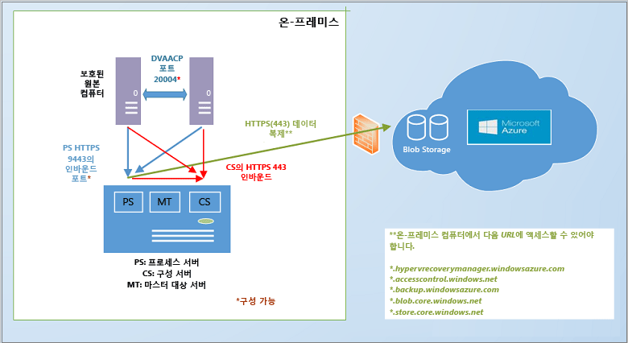

<properties
	pageTitle="Site Recovery의 작동 방식 | Microsoft Azure"
	description="이 문서는 사이트 복구 아키텍처의 개요를 제공합니다."
	services="site-recovery"
	documentationCenter=""
	authors="rayne-wiselman"
	manager="jwhit"
	editor=""/>

<tags
	ms.service="site-recovery"
	ms.workload="backup-recovery"
	ms.tgt_pltfrm="na"
	ms.devlang="na"
	ms.topic="get-started-article"
	ms.date="03/27/2016"
	ms.author="raynew"/>

# Azure Site Recovery 작동 방식

Azure Site Recovery 서비스의 기본 아키텍처와 이를 작동하게 하는 구성 요소에 대해서는 이 문서를 읽어보세요.

이 문서의 하단 또는 [Azure 복구 서비스 포럼](https://social.msdn.microsoft.com/forums/azure/home?forum=hypervrecovmgr)에서 의견이나 질문을 게시합니다.

## 개요

조직에서는 계획된 중단 또는 불의의 중지 시간에 앱, 워크로드 및 데이터를 가용 상태로 유지하고 가능한 신속히 일반 작업 상태로 복귀하기 위한 비즈니스 연속성 및 재해 복구(BCDR) 전략이 필요합니다.

사이트 복구는 온-프레미스 물리적 서버와 가상 컴퓨터를 클라우드(Azure) 또는 보조 사이트에 복제하는 것을 오케스트레이션하여 BCDR(비즈니스 연속성 및 재해 복구) 전략에 기여하는 Azure 서비스입니다. 기본 위치에서 중단이 발생하면 보조 사이트로 장애 조치하여 앱과 워크로드를 가용 상태로 유지합니다. 기본 위치가 정상 작업 상태로 돌아오면 다시 기본 위치로 돌아갑니다.

다양한 시나리오에서 복제를 오케스트레이션하기 위해 사이트 복구를 배포할 수 있습니다.

- **VMware 가상 컴퓨터 복제**: [Azure](site-recovery-vmware-to-azure-classic.md) 또는 [보조 데이터 센터](site-recovery-vmware-to-vmware.md)에 온-프레미스 VMware 가상 컴퓨터를 보호할 수 있습니다.
- **물리적 컴퓨터 복제**: [Azure](site-recovery-vmware-to-azure-classic.md) 또는 [보조 데이터 센터](site-recovery-vmware-to-vmware.md)에 Windows 또는 Linux를 실행하는 물리적 컴퓨터를 복제할 수 있습니다.
- **System Center VMM 클라우드에서 관리되는 Hyper-V VM 복제**: [Azure](site-recovery-vmm-to-azure.md) 또는 [보조 데이터 센터](site-recovery-vmm-to-vmm.md)에 VMM 클라우드의 온-프레미스 Hyper-V 가상 컴퓨터를 복제할 수 있습니다. 
- **Hyper-V VM 복제(VMM 없음)**: VMM에 의해 관리되지 않는 Hyper-V VM을 [Azure](site-recovery-hyper-v-site-to-azure.md)로 복제할 수 있습니다.
- **VM 마이그레이션**: 사이트 복구를 사용하여 하위 지역 간에 [Azure IaaS VM을 마이그레이션](site-recovery-migrate-azure-to-azure.md)하거나 Azure IaaS VM에 [AWS Windows 인스턴스를 마이그레이션](site-recovery-migrate-aws-to-azure.md)할 수 있습니다. 이러한 VM을 장애 조치(failover)할 수 있지만 장애 복구(failback)할 수 없는 것으로 현재 마이그레이션만 지원됩니다.

사이트 복구는 이러한 VM 및 물리적 서버에서 실행 중인 대부분의 앱을 복제할 수 있습니다. 지원되는 앱의 전체 요약은 [Azure Site Recovery로 어떤 워크로드를 보호할 수 있습니까?](site-recovery-workload.md)에서 제공합니다.

## Azure에 온-프레미스 VMware 가상 컴퓨터/물리적 서버 복제

현재 두 개의 서로 다른 아키텍처를 VMware VM 또는 물리적 Windows/Linux 서버를 Azure에 복제하는 데 사용할 수 있습니다.

- [레거시 아키텍처](site-recovery-vmware-to-azure-classic-legacy.md): 새 배포에 이 아키텍처를 사용하지 않아야 합니다. 
- [향상된 아키텍처](site-recovery-vmware-to-azure-classic.md): 최신 아키텍처이며 모든 새 배포에 사용해야 합니다. 기존 아키텍처를 사용하여 이 시나리오를 이미 배포한 경우 향상된 배포를 위한 [마이그레이션에 대해 알아보세요](site-recovery-vmware-to-azure-classic-legacy.md#migrate-to-the-enhanced-deployment).

향상된 배포에서 모든 사이트 복구 구성 요소와 함께 온-프레미스 관리 서버를 설정해야 합니다. 보호하려는 각 컴퓨터에서 모바일 서비스를 자동으로 푸시(또는 수동 설치)합니다. 초기 복제 후 컴퓨터의 모바일 서비스는 델타 복제 데이터를 Azure 저장소에 보내기 전에 데이터를 최적화하는 프로세스 서버로 보냅니다.

 

### 온-프레미스
온-프레미스에서 다음 항목이 필요합니다.

- **관리 서버**: 관리 서버 역할을 하는 Windows Server 2012 R2 컴퓨터가 필요합니다. 이 서버에서 단일 설치 파일로 이러한 모든 사이트 복구 구성 요소를 설치합니다.

	- **구성 서버 구성 요소**: 온-프레미스 환경과 Azure 간의 통신을 조정하여 데이터 복제 및 복구를 관리합니다.
	- **프로세스 서버 구성 요소**: 복제 게이트웨이 역할을 합니다. 보호된 원본 컴퓨터에서 복제 데이터를 수신하고 캐싱, 압축 및 암호화를 사용하여 최적화하며 데이터를 Azure 저장소로 전송합니다. 또한 보호되는 컴퓨터에서 모바일 서비스의 푸시 설치를 처리하며 VMware VM의 자동 복구를 수행합니다. 배포가 늘어나면 프로세스 서버로 실행하는 별도의 추가 전용 서버를 추가하여 증가하는 복제 트래픽을 처리할 수 있습니다.
	- **마스터 대상 서버 구성 요소**: Azure에서 장애 복구(failback) 중에 복제 데이터를 처리합니다. 
- **VMware ESX/ESXi 호스트 및 vCenter 서버**: VMware VM을 실행하는 하나 이상의 ESX/ESXi 호스트 서버가 필요합니다. 호스트를 관리하는 vCenter 서버를 배포하는 것이 좋습니다. **참고:** **VMware로 장애 복구(failback)해야 하는 물리적 서버를 복제하는 경우도** 해당합니다. 물리적 서버를 복제하면 Azure로 장애 조치할 때 Azure VM으로 실행됩니다. VMware VM으로 온-프레미스에 장애 복구합니다. 
	
- **VM/물리적 서버**: Azure로 복제하려는 각 컴퓨터에 모바일 서비스 구성 요소를 설치해야 합니다. 이 서비스는 컴퓨터에 기록된 데이터를 캡처하고 프로세스 서버에 전달합니다. 이 구성 요소는 수동으로 설치되거나 푸시되고 컴퓨터에 대해 복제를 사용하는 경우 프로세스 서버에서 자동으로 설치됩니다.

### Azure

Azure 인프라에 필요한 사항은 다음과 같습니다. - **Azure 계정**: Microsoft Azure 계정이 필요합니다. - **Azure 저장소**: 복제된 데이터를 저장하려면 Azure 저장소 계정이 있어야 합니다. 복제된 데이터는 Azure 저장소에 저장되고 장애 조치(Failover) 발생 시 Azure VM이 작동합니다. - **Azure 네트워크**: 장애 조치 발생 시 Azure VM을 연결할 Azure 가상 네트워크가 필요합니다.
	
	
### 장애 복구

온-프레미스로 장애 복구는 물리적 서버를 장애 복구한 경우에도 항상 VMware VM으로 이루어집니다. 다음 항목이 필요합니다.

- **Azure에서 임시 프로세스 서버**: 장애 조치 후 Azure에서 장애 복구하려면 Azure에서 복제를 처리하기 위해 프로세스 서버로 구성된 Azure VM을 설정해야 합니다. 장애 복구를 완료한 후 이 VM을 삭제할 수 있습니다.
- **VPN 연결**: 장애 복구를 수행하려면 Azure 네트워크에서 온-프레미스 사이트로 VPN 연결(또는 Azure Express 경로) 설정이 필요합니다.
- **별도의 온-프레미스 마스터 대상 서버**: 온-프레미스 마스터 대상 서버는 장애 복구를 처리합니다. 마스터 대상 서버는 기본적으로 관리 서버에 설치되지만 대량의 트래픽 볼륨을 장애 복구하는 경우 이 목적으로 별도의 온-프레미스 마스터 대상 서버를 설정해야 합니다. 

향상된 배포 요구 사항에 대해 [알아봅니다](site-recovery-vmware-to-azure-classic.md#before-you-start-deployment). 향상된 배포를 위한 장애 복구에 대해 [알아봅니다](site-recovery-failback-azure-to-vmware-classic.md).

## VMM 클라우드의 Hyper-V VM을 Azure로 복제

사이트 복구 배포 중에 이 시나리오를 배포하려면 VMM 서버에 Azure Site Recovery 공급자를 설치합니다. 공급자는 인터넷을 통해 사이트 복구 서비스에서의 복제를 조정 및 오케스트레이션합니다. Azure 복구 서비스 에이전트는 사이트 복구를 배포하는 동안 Hyper-V 호스트 서버에 설치되고 HTTPS 443을 통해 서버와 Azure 저장소 사이에서 데이터가 복제됩니다. 공급자 및 에이전트로부터의 통신은 모두 보호 및 암호화됩니다. Azure 저장소에 복제된 데이터도 암호화됩니다.

- 온-프레미스: 
	- **VMM 서버**: 하나 이상의 VMM 서버가 하나 이상의 VMM 사설 클라우드로 설정됩니다. 서버는 System Center 2012 R2에서 실행되고 인터넷에 연결되어 있어야 합니다. 장애 조치 후 Azure VM이 네트워크에 연결되어 있는지 확인하려는 경우 네트워크 매핑을 설정해야 합니다. 이 작업을 수행하려면 원본 VM을 VMM VM 네트워크에 연결해야 합니다. 해당 VM 네트워크는 클라우드와 연결된 논리 네트워크에 연결되어야 합니다.
	- **Hyper-V 서버**: VMM 클라우드에 하나 이상의 Hyper-V 호스트 서버가 있습니다. Hyper-V 호스트는 Windows Server 2012 R2를 실행해야 합니다.
	- **보호된 컴퓨터**: 원본 Hyper-V 호스트 서버에는 보호하려는 하나 이상의 VM이 있어야 합니다.
	
- Azure:
	- **Azure 계정**: Microsoft Azure 계정이 있어야 합니다.
	- **Azure 저장소**: 복제된 데이터를 저장하려면 Azure 저장소 계정이 있어야 합니다. 복제된 데이터는 Azure 저장소에 저장되고 장애 조치(Failover) 발생 시 Azure VM이 작동합니다.
	- **Azure 네트워크**: 장애 조치 후 Azure VM이 네트워크에 연결되도록 네트워크 매핑을 설정하려면 Azure 네트워크가 설정되어야 합니다.

	

정확한 [배포 요구 사항](site-recovery-vmm-to-azure.md#before-you-start)에 대해 알아봅니다.

## 보조 사이트에 VMWare 가상 컴퓨터 또는 물리적 서버 복제

VMware VMS 또는 Windows/Linux 물리적 서버를 보조 사이트에 복제하려면 Azure Site Recovery 구독에 포함된 InMage Scout를 다운로드합니다. 각 사이트(구성, 프로세스, 마스터 대상)에 구성 요소 서버를 설정하고 복제할 컴퓨터에 통합 에이전트를 설치합니다. 초기 복제 후 각 컴퓨터에서 에이전트는 델타 복제 변경을 프로세스 서버로 보냅니다. 프로세스 서버가 데이터를 최적화하고 보조 사이트의 마스터 대상 서버로 보냅니다. 구성 서버는 복제 프로세스를 관리합니다.

### 온-프레미스 기본 사이트

- **프로세스 서버**: 캐싱, 압축 및 데이터 최적화를 처리하도록 기본 사이트의 프로세스 서버 구성 요소를 설정합니다. 또한 보호하려는 컴퓨터에 대해 통합 에이전트의 푸시 설치를 처리합니다. 
- **VMware ESX/ESXi 및 vCenter 서버**: VMware VM을 보호하는 경우 VMware EXS/ESXi 하이퍼바이저 및 필요에 따라 하이퍼바이저를 관리하는 VMware vCenter 서버가 필요합니다.
- **VM/물리적 서버**: 보호하려는 VMware VM 또는 Windows/Linux 물리적 서버에는 통합 에이전트를 설치해야 합니다. 통합 에이전트는 마스터 대상 서버 역할을 하는 컴퓨터에도 설치됩니다. 에이전트는 모든 구성 요소 간의 통신 공급자 역할을 합니다. 
	
### 온-프레미스 보조 사이트
 
- **구성 서버**: 구성 서버는 사용자가 설치하는 최초의 구성 요소이며, 관리 웹 사이트나 vContinuum 콘솔을 사용하여 배포를 관리, 구성 및 모니터링하기 위해 보조 사이트에 설치됩니다. 배포에는 단일 구성 서버만이 있으며 Windows Server 2012 R2를 실행하는 컴퓨터에 설치되어야 합니다.
- **vContinuum 서버**: 구성 서버와 동일한 위치(보조 사이트)에 설치됩니다. 보호되는 환경을 관리 및 모니터링하기 위한 콘솔을 제공합니다. 기본 설치에서는 vContinuum 서버가 최초의 마스터 대상 서버이며 통합 에이전트가 여기에 설치되어 있습니다.
- **마스터 대상 서버**: 마스터 대상 서버는 복제된 데이터를 보유합니다. 프로세스 서버로부터 데이터를 수신하고 보조 사이트에 복제본 컴퓨터를 만들며 데이터 보존 지점을 유지합니다. 필요한 마스터 대상 서버의 수는 보호하는 컴퓨터의 수에 따라 다릅니다. 기본 사이트로 다시 장애 복구할 경우 해당 기본 사이트에도 마스터 대상 서버가 필요합니다. 

### Azure

InMage Scout를 사용하여 이 시나리오를 배포합니다. 이를 얻기 위해서는 Azure 구독이 필요합니다. 사이트 복구 자격 증명 모음을 만든 후에 InMage Scout를 다운로드하고 최신 업데이트를 설치하여 배포를 설정합니다.

## Azure에 Hyper-V VM 복제(VMM 없음)

VMM 클라우드에서 관리되지 않는 Hyper-V VM을 Azure에 복제하려면 사이트 복구 배포 중에 Hyper-V 호스트에 Azure Site Recovery 공급자 및 Azure Site Recovery 에이전트를 설치합니다. 공급자는 인터넷을 통해 사이트 복구 서비스에서의 복제를 조정 및 오케스트레이션합니다. 에이전트는 HTTPS 443을 통해 데이터 복제 데이터를 처리합니다. 공급자 및 에이전트로부터의 통신은 모두 보호 및 암호화됩니다. Azure 저장소에 복제된 데이터도 암호화됩니다.

### 온-프레미스

- **Hyper-V 서버**: Hyper-V 호스트 서버가 하나 이상 있습니다. Hyper-V 호스트는 Windows Server 2012 R2를 실행해야 합니다.
- **보호된 컴퓨터**: 원본 Hyper-V 호스트 서버에는 보호하려는 하나 이상의 VM이 있어야 합니다.
	
### Azure

- **Azure 계정**: Microsoft Azure 계정이 있어야 합니다.
- **Azure 저장소**: 복제된 데이터를 저장하려면 Azure 저장소 계정이 있어야 합니다. 복제된 데이터는 Azure 저장소에 저장되고 장애 조치(Failover) 발생 시 Azure VM이 작동합니다.

배포 요구 사항에 대해 [알아봅니다](site-recovery-hyper-v-site-to-azure.md#before-you-start).

## VMM 클라우드의 Hyper-V VM을 Azure로 복제

이 시나리오를 배포하려면 사이트 복구 배포 중에 Azure Site Recovery 공급자를 VMM 서버에, Azure 복구 서비스 에이전트를 Hyper-V 호스트에 설치합니다. 공급자는 인터넷을 통해 사이트 복구 서비스에서의 복제를 조정 및 오케스트레이션합니다. 에이전트는 HTTPS 443을 통해 데이터 복제 데이터를 처리합니다. 공급자 및 에이전트로부터의 통신은 모두 보호 및 암호화됩니다. Azure 저장소(휴지 상태)에 복제된 데이터도 암호화됩니다.

### 온-프레미스

- **VMM 서버**: 하나 이상의 VMM 서버가 하나 이상의 VMM 사설 클라우드로 설정됩니다. 서버는 System Center 2012 R2에서 실행되고 인터넷에 연결되어 있어야 합니다. 장애 조치 후 Azure VM이 네트워크에 연결되어 있는지 확인하려는 경우 네트워크 매핑을 설정해야 합니다. 이 작업을 수행하려면 원본 VM을 VMM VM 네트워크에 연결해야 합니다. 해당 네트워크가 클라우드와 연결된 논리 네트워크에 연결되어야 합니다.
- **Hyper-V 서버**: VMM 클라우드에 하나 이상의 Hyper-V 호스트 서버가 있습니다. Hyper-V 호스트는 Windows Server 2012 R2를 실행해야 합니다.
- **보호된 컴퓨터**: 원본 Hyper-V 호스트 서버에는 보호하려는 하나 이상의 VM이 있어야 합니다.
	
### Azure

- **Azure 계정**: Microsoft Azure 계정이 있어야 합니다.
- **Azure 저장소**: 복제된 데이터를 저장하려면 Azure 저장소 계정이 있어야 합니다. 복제된 데이터는 Azure 저장소에 저장되고 장애 조치(Failover) 발생 시 Azure VM이 작동합니다.
- **Azure 네트워크**: 장애 조치 후 Azure VM이 네트워크에 연결되어 있는지 확인하려는 경우 네트워크 매핑을 설정해야 합니다. 이 작업을 수행하려면 Azure 네트워크가 필요합니다.

배포 요구 사항에 대해 [알아봅니다](site-recovery-vmm-to-azure.md#before-you-start).

## 보조 데이터센터에 Hyper-V VM 복제

사이트 복구 배포 중에 이 시나리오를 배포하려면 VMM 서버에 Azure Site Recovery 공급자를 설치합니다. 공급자는 인터넷을 통해 사이트 복구 서비스에서의 복제를 조정 및 오케스트레이션합니다. Kerberos 또는 인증서 인증을 사용하여 LAN 또는 VPN을 통해 기본 및 보조 Hyper-V 호스트 서버 간에 데이터가 복제됩니다. 공급자 및 Hyper-V 호스트 서버 간 통신은 모두 보호 및 암호화됩니다.

### 온-프레미스

- **VMM 서버**: 각각 하나 이상의 VMM 사설 클라우드를 포함하여 기본 사이트와 보조 사이트에서 각각 VMM 서버를 사용하는 것이 좋습니다. 서버는 최신 업데이트를 설치한 System Center 2012 SP1 이상을 실행해야 하며 인터넷에 연결되어야 합니다. 클라우드에는 Hyper-V 용량 프로필이 설정되어 있어야 합니다.
- **Hyper-V 서버**: Hyper-V 호스트 서버는 기본 및 보조 VMM 클라우드에 있어야 합니다. 호스트 서버는 최신 업데이트가 설치된 Windows Server 2012를 실행하고 인터넷에 연결되어야 합니다.
- **보호된 컴퓨터**: 원본 Hyper-V 호스트 서버에는 보호하려는 하나 이상의 VM이 있어야 합니다.
	
### Azure

Azure 구독이 필요합니다.

배포 요구 사항에 대해 [알아봅니다](site-recovery-vmm-to-vmm.md#before-you-start).

## SAN 복제를 통해 보조 데이터센터에 Hyper-V VM 복제

이 시나리오에서는 사이트 복구 배포 중에 VMM 서버에 Azure Site Recovery 공급자를 설치합니다. 공급자는 인터넷을 통해 사이트 복구 서비스에서의 복제를 조정 및 오케스트레이션합니다. 동기 SAN 복제를 통해 기본 저장소와 보조 저장소 어레이 간에 데이터가 복제됩니다.

### 온-프레미스

- **SAN 어레이**: 기본 VMM 서버에서 관리하며 [지원되는 SAN 어레이](http://social.technet.microsoft.com/wiki/contents/articles/28317.deploying-azure-site-recovery-with-vmm-and-san-supported-storage-arrays.aspx)입니다. SAN에서는 보조 사이트에서 다른 SAN 배열을 사용하여 네트워크 인프라를 공유합니다.
- **VMM 서버**: 각각 하나 이상의 VMM 사설 클라우드를 포함하여 기본 사이트와 보조 사이트에서 각각 VMM 서버를 사용하는 것이 좋습니다. 서버는 최신 업데이트를 설치한 System Center 2012 SP1 이상을 실행해야 하며 인터넷에 연결되어야 합니다. 클라우드에는 Hyper-V 용량 프로필이 설정되어 있어야 합니다.
- **Hyper-V 서버**: 기본 및 보조 VMM 클라우드에 있는 Hyper-V 호스트 서버입니다. 호스트 서버는 최신 업데이트가 설치된 Windows Server 2012를 실행하고 인터넷에 연결되어야 합니다.
- **보호된 컴퓨터**: 원본 Hyper-V 호스트 서버에는 보호하려는 하나 이상의 VM이 있어야 합니다.
	
### Azure

Azure 구독이 필요합니다.

배포 요구 사항에 대해 [알아봅니다](site-recovery-vmm-san.md#before-you-start).

## Hyper-V 보호 수명 주기

이 워크플로에서는 Hyper-V 가상 컴퓨터에서의 보호, 복제 및 장애 조치 프로세스를 보여 줍니다.

1. **보호 사용**: 사이트 복구 자격 증명 모음을 설정하고, VMM 클라우드나 Hyper-V 사이트용 복제 설정을 구성하며 VM에 보호를 사용합니다. **보호 사용**이라는 작업이 시작되며 **작업** 탭에서 모니터링할 수 있습니다. 이 작업은 해당 컴퓨터가 전제 조건에 부합하는지 확인한 다음, 사용자가 구성한 설정으로 Azure에 대한 복제를 설정하는 [CreateReplicationRelationship](https://msdn.microsoft.com/library/hh850036.aspx) 메서드를 호출합니다. **보호 사용** 작업도 [StartReplication](https://msdn.microsoft.com/library/hh850303.aspx) 메서드를 호출하여 전체 VM 복제를 초기화합니다.
2. **초기 복제**: 모두 Azure나 보조 데이터센터에 복제될 때까지 가상 컴퓨터 스냅숏을 만들고 가상 하드 디스크를 하나씩 복제합니다. 이 작업의 완료 시간은 VM 크기 및 네트워크 대역폭 및 초기 복제 방법에 따라 결정됩니다. 초기 복제 진행 중에 디스크가 변경될 경우, 디스크와 동일한 폴더에 있는 Hyper-V 복제 로그(.hrl)를 통해 Hyper-V Replica Replication Tracker가 이러한 변경 내용을 추적합니다. 각 디스크에는 보조 저장소로 전송되는 .hrl 파일이 연결되어 있습니다. 초기 복제 진행 중에는 스냅숏과 로그 파일이 디스크 리소스를 사용합니다. 초기 복제가 완료되면 VM 스냅숏이 삭제되고 로그의 델타 디스크 변경 내용이 동기화 및 병합됩니다.
3. **보호 완료**: 초기 복제가 완료된 후는 **보호 완료** 작업이 네트워크와 기타 복제 후 설정을 구성하여 가상 컴퓨터가 보호됩니다. Azure에 복제할 경우 장애 조치를 위해 가상 컴퓨터에 대한 설정을 조정해야 할 수 있습니다. 이 시점에서 테스트 장애 조치(Failover)를 실행하여 모든 것이 예상대로 작동하는지 확인할 수 있습니다.
4. **복제**: 초기 복제 후에는 복제 설정에 따라 델타 동기화가 시작됩니다. 
	- **복제 실패**: 델타 복제에 실패했고 전체 복제에는 대역폭이나 시간이 많이 소모될 경우 다시 동기화가 발생합니다. 예를 들어 .hrl 파일이 디스크 크기에 50%에 달한다면 VM이 다시 동기화되도록 표시됩니다. 다시 동기화는 원본 및 대상 가상 컴퓨터 디스크의 체크섬을 계산하고 델타만 전송하므로 보내는 데이터 크기가 최소화됩니다. 다시 동기화가 완료되면 델타 복제가 다시 시작됩니다. 기본적으로 다시 동기화는 업무 시간 이외에 실행되도록 예약되나 수동으로 가상 컴퓨터를 다시 동기화할 수 있습니다.
	- **복제 오류**: 복제 오류가 발생한 경우 기본 제공 재시도가 있습니다. 복구할 수 없는 오류(예: 인증 또는 권한 오류)가 발생했거나 복제 컴퓨터가 잘못된 상태인 경우 재시도를 수행하지 않습니다. 복구할 수 없는 오류(예: 네트워크 오류, 디스크 용량/메모리 부족)의 경우 재시도 간의 간격을 늘려가며 재시도를 수행합니다(예: 1, 2, 4, 8, 10분 후 30분마다).
4. **계획된/계획되지 않은 장애 조치**: 필요한 경우 계획된 또는 계획되지 않은 장애 조치를 실행할 수 있습니다. 계획된 장애 조치를 실행할 경우 데이터 손실을 방지하기 위해 원본 VM이 종료됩니다. 복제본 VM이 만들어진 후에는 커밋 대기 중 상태에 배치됩니다. 커밋이 자동인 SAN으로 복제하는 경우가 아니라면, 커밋해야 장애 조치가 완료됩니다. 기본 사이트가 가동되어 실행 중이면 장애 복구를 실행할 수 있습니다. Azure에 복제한 경우 역방향 복제가 자동 실행됩니다. 그렇지 않은 경우 사용자가 역방향 복제를 수동으로 시작합니다.
 

## 다음 단계

[배포 준비](site-recovery-best-practices.md)

<!---HONumber=AcomDC_0330_2016-->