# <a name="azure-site-recovery-deployment-planner"></a>Azure Site Recovery Deployment Planner
이 문서는 VMware에서 Azure로의 프로덕션 배포를 위한 Azure Site Recovery 사용자 가이드입니다.

## <a name="overview"></a>개요

Site Recovery를 사용하여 VMware 가상 컴퓨터(VM) 보호를 시작하려면 먼저 일일 데이터 변경률에 따라 충분한 대역폭을 할당하여 원하는 복구 지점 목표(RPO)를 충족해야 합니다. 적절한 수의 구성 서버와 프로세스 서버를 온-프레미스에 배포해야 합니다.

또한 올바른 유형 및 수의 Azure Storage 계정을 만들어야 합니다. 시간이 지남에 따라 사용량이 증가하므로 원본 프로덕션 서버상의 증가를 고려하여 표준 또는 프리미엄 저장소 계정을 만듭니다. 워크로드 특성(예를 들어 초당 읽기/쓰기 I/O 작업 수[IOPS] 또는 데이터 변동) 및 Site Recovery 한도를 기반으로 VM별로 저장소 유형을 선택합니다.

Site Recovery Deployment Planner 공개 미리 보기는 현재 VMware에서 Azure로의 시나리오를 위해서만 사용할 수 있는 명령줄 도구입니다. 이 도구를 통해 VMware 가상 컴퓨터를 원격으로 프로파일링하여(프로덕션에 전혀 영향을 미치지 않음) 성공적인 복제 및 테스트 장애 조치를 위한 대역폭 및 Azure Storage 요구 사항을 이해할 수 있습니다. Site Recovery 구성 요소를 온-프레미스에 설치하지 않고도 도구를 실행할 수 있습니다. 그러나 달성된 처리량에 대한 정확한 결과를 얻으려면 프로덕션 배포의 첫 번째 단계 중 하나로 배포해야 하는 Site Recovery 구성 서버의 최소 요구 사항을 충족하는 Windows Server에서 Planner를 실행하는 것이 좋습니다.

이 도구는 다음과 같은 세부 정보를 제공합니다.

**호환성 평가**

* 디스크 수, 디스크 크기, IOPS 및 변동에 따른 VM 적합성 평가
* 델타 복제에 필요한 예상 네트워크 대역폭

**네트워크 대역폭 요구 사항 및 RPO 평가**

* 델타 복제에 필요한 예상 네트워크 대역폭
* Site Recovery를 통해 온-프레미스에서 Azure로 가져올 수 있는 처리량
* 지정된 시간 내에 초기 복제를 완료하기 위해 예상 대역폭에 따라 일괄 처리할 VM의 수

**Azure 인프라 요구 사항**

* 각 VM에 대한 저장소 유형(표준 또는 프리미엄 저장소 계정) 요구 사항
* 복제를 위해 설정해야 할 표준 및 프리미엄 저장소 계정의 총 수
* Azure Storage 지침에 따른 저장소 계정 명명 제안
* 모든 VM에 대한 저장소 계정 위치
* 테스트 장애 조치 또는 구독에 대한 장애 조치 이전에 설정해야 할 Azure 코어의 수
* 각 온-프레미스 VM에 대한 Azure VM 권장 크기

**온-프레미스 인프라 요구 사항**
* 온-프레미스 배포에 필요한 구성 서버 및 프로세스 서버의 수

>[!IMPORTANT]
>
>사용량은 시간이 지남에 따라 증가할 가능성이 있으므로 앞의 모든 도구 계산은 워크로드 특성에 30% 증가율을 가정하고 모든 프로파일링 메트릭(읽기/쓰기 IOPS, 변동 등)의 95번째 백분위수 값을 사용하여 수행합니다. 이러한 두 요소(증가율과 백분위수)는 모두 구성할 수 있습니다. 증가율에 대해 더 자세히 알아보려면 "증가율 고려 사항" 섹션을 참조하세요. 백분위수 값에 대해 더 자세히 알아보려면 "계산에 사용한 백분위수 값" 섹션을 참조하세요.
>

## <a name="requirements"></a>요구 사항
이 도구에는 두 가지 주요 단계, 즉 프로파일링과 보고서 생성 단계가 있습니다. 또한 처리량만 계산하는 세 번째 옵션도 있습니다. 프로파일링 및 처리량 측정을 시작하는 서버에 대한 요구 사항은 다음 표와 같습니다.

| 서버 요구 사항 | 설명|
|---|---|
|프로파일링 및 처리량 측정| <ul><li>운영 체제: Microsoft Windows Server 2012 R2<br>(적어도 [구성 서버에 대한 크기 권장 사항](https://aka.ms/asr-v2a-on-prem-components)을 일치하는 것이 이상적)</li><li>컴퓨터 구성: 8개 vCPus, 16GB RAM, 300GB HDD</li><li>[Microsoft .NET Framework 4.5](https://aka.ms/dotnet-framework-45)</li><li>[VMware vSphere PowerCLI 6.0 R3](https://developercenter.vmware.com/tool/vsphere_powercli/6.0)</li><li>[Visual Studio 2012용 Microsoft Visual C++ 재배포 가능 패키지](https://aka.ms/vcplusplus-redistributable)</li><li>이 서버에서 Azure에 대한 인터넷 액세스</li><li>Azure 저장소 계정</li><li>서버에 대한 관리자 액세스</li><li>최소 100GB의 사용 가능한 디스크 공간(각각 디스크 3개의 평균을 포함한 VM 1000개를 가정, 30일 동안 프로파일링)</li><li>VMware vCenter 통계 수준 설정은 2 이상으로 설정되어야 합니다.</li></ul>|
| 보고서 생성 | Microsoft Excel 2013 이상을 포함한 모든 Windows PC 또는 Windows Server |
| 사용자 권한 | 프로파일링 중에 VMware vCenter 서버/VMware vSphere ESXi 호스트에 액세스하는 데 사용되는 사용자 계정에 대한 읽기 전용 권한 |

> [!NOTE]
>
>이 도구는 VMDK 및 RDM 디스크를 갖춘 VM만 프로파일링할 수 있습니다. iSCSI 또는 NFS 디스크를 갖춘 VM은 프로파일링할 수 없습니다. Site Recovery는 VMware 서버용 iSCSI 및 NFS 디스크를 지원하지만 Deployment Planner가 게스트 내부에 있지 않고 vCenter 성능 카운터만 사용하여 프로파일링하기 때문에 이러한 디스크 종류는 도구에서 식별할 수 없습니다.
>

## <a name="download-and-extract-the-public-preview"></a>공개 미리 보기 다운로드 및 압축 풀기
1. 최신 버전의 [Site Recovery Deployment Planner 공개 미리 보기](https://aka.ms/asr-deployment-planner)를 다운로드합니다.  
이 도구는 .zip 폴더에 패키지되어 있습니다. 현재 버전의 도구는 Azure 시나리오를 위해 VMware만 지원합니다.

2. 도구를 실행하려는 Windows Server에 zip 폴더를 복사합니다.  
서버가 프로파일링할 VM을 보유하는 vCenter 서버/vSphere ESXi 호스트에 연결할 네트워크 액세스 권한을 가지고 있는 경우 Windows Server 2012 R2에서 도구를 실행할 수 있습니다. 그러나 하드웨어 구성이 [구성 서버 크기 조정 지침](https://aka.ms/asr-v2a-on-prem-components)을 만족하는 서버에서 도구를 실행하는 것이 좋습니다. Site Recovery 구성 요소를 온-프레미스에 이미 배포한 경우 구성 서버에서 도구를 실행합니다.

 도구를 실행하는 서버에 구성 서버(기본 제공 프로세스 서버가 있는)와 같은 하드웨어 구성이 있는 것이 좋습니다.
 그러한 구성이 있으면 도구가 보고하는 달성된 처리량이 Site Recovery에서 복제 중에 달성할 수 있는 실제 처리량과 확실히 일치합니다. 처리량 계산은 서버의 사용 가능한 네트워크 대역폭 및 서버의 하드웨어 구성(CPU, 저장소 등)에 따라 달라집니다. 다른 서버에서 도구를 실행하는 경우 처리량은 해당 서버에서 Microsoft Azure까지 계산됩니다. 또한 서버의 하드웨어 구성은 구성 서버와 다를 수 있으므로 도구가 보고하는 달성된 처리량이 정확하지 않을 수 있습니다.

3. .zip 폴더의 압축을 풉니다.  
폴더에 여러 개의 파일과 하위 폴더가 있습니다. 실행 파일은 부모 폴더에 있는 ASRDeploymentPlanner.exe입니다.

    예:  
    .zip 파일을 E:\ 드라이브에 복사하고 압축을 풉니다.
   E:\ASR Deployment Planner-Preview_v1.1.zip

    E:\ASR Deployment Planner-Preview_v1.1\ ASR Deployment Planner-Preview_v1.1\ ASRDeploymentPlanner.exe

## <a name="capabilities"></a>기능
다음 세 가지 모드 중 하나에서 명령줄 도구(ASRDeploymentPlanner.exe)를 실행할 수 있습니다.

1. 프로파일링  
2. 보고서 생성
3. 처리량 가져오기

먼저 도구를 프로파일링 모드로 실행하여 VM 데이터 변동 및 IOPS를 수집합니다. 그런 다음 네트워크 대역폭 및 저장소 요구 사항을 확인하기 위해 도구를 실행하여 보고서를 생성합니다.

## <a name="profiling"></a>프로파일링
프로파일링 모드에서 Deployment Planner 도구는 vCenter 서버/vSphere ESXi 호스트에 연결하여 VM에 대한 성능 데이터를 수집합니다.

* 프로파일링은 프로덕션 VM에 직접 연결되지 않았기 때문에 해당 VM의 성능에 영향을 미치지 않습니다. 모든 성능 데이터는 vCenter 서버/vSphere ESXi 호스트에서 수집됩니다.
* 프로파일링으로 인해 서버에 미치는 영향을 무시할 수 있도록 도구에서 매 15분마다 한 번씩 vCenter 서버/vSphere ESXi 호스트를 쿼리합니다. 도구는 매 분의 성능 카운터 데이터를 저장하므로 이 쿼리 간격은 프로파일링 정확도를 훼손하지 않습니다.

### <a name="create-a-list-of-vms-to-profile"></a>프로필에 VM 목록 만들기
먼저 프로파일링할 VM의 목록이 필요합니다. 다음 절차에서 VMware vSphere PowerCLI 명령을 사용하여 vCenter 서버/vSphere ESXi 호스트의 모든 VM 이름을 가져올 수 있습니다. 또는 친숙한 이름 또는 직접 프로파일링하려는 VM의 IP 주소를 파일에 나열할 수 있습니다.

1. VMware vSphere PowerCLI가 설치 된 VM에 로그인합니다.
2. VMware vSphere PowerCLI 콘솔을 엽니다.
3. 스크립트의 실행 정책이 사용하도록 설정되어 있는지 확인합니다. 사용하지 않도록 설정되어 있으면 관리자 모드에서 VMware vSphere PowerCLI 콘솔을 시작한 후 다음 명령을 실행하여 실행 정책을 사용하도록 설정합니다.

            Set-ExecutionPolicy –ExecutionPolicy AllSigned

4. VCenter 서버/vSphere ESXi 호스트의 모든 VM의 이름을 가져오려면 .txt 파일에 목록을 저장하고 여기에 나열된 두 개의 명령을 실행합니다.
&lsaquo;서버 이름&rsaquo;, &lsaquo;사용자 이름&rsaquo;, &lsaquo;암호&rsaquo;, &lsaquo;outputfile.txt&rsaquo;을 입력 내용으로 바꿉니다.

            Connect-VIServer -Server <server name> -User <user name> -Password <password>

            Get-VM |  Select Name | Sort-Object -Property Name >  <outputfile.txt>

5. 메모장에서 출력 파일을 연 다음 다른 파일에 프로파일링하려는 모든 VM의 이름(예를 들어 ProfileVMList.txt)을 한 줄에 한 개씩 복사합니다. 이 파일은 명령줄 도구의 *-VMListFile* 매개 변수에 대한 입력으로 사용됩니다

    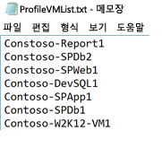

### <a name="start-profiling"></a>프로파일링 시작
프로파일링할 VM 목록이 있으면 프로파일링 모드에서 도구를 실행할 수 있습니다. 다음은 프로파일링 모드에서 실행할 도구의 필수 및 선택적 매개 변수의 목록입니다.

ASRDeploymentPlanner.exe -Operation StartProfiling /?

| 매개 변수 이름 | 설명 |
|---|---|
| -Operation | StartProfiling |
| -Server | VM을 프로파일링할 vCenter 서버/vSphere ESXi 호스트의 정규화된 도메인 이름 또는 IP 주소입니다.|
| -User | vCenter 서버/vSphere ESXi 호스트에 연결할 사용자 이름입니다. 사용자는 적어도 읽기 전용 액세스 권한을 가지고 있어야 합니다.|
| -VMListFile |    프로파일링할 VM의 목록을 포함하고 있는 파일입니다. 파일 경로는 절대 경로 또는 상대 경로일 수 있습니다. 이 파일에는 VM 이름/IP 주소가 한 줄에 하나씩 있어야 합니다. 파일에 지정된 가상 컴퓨터 이름은 vCenter 서버/vSphere ESXi 호스트의 VM 이름과 동일해야 합니다.<br>예를 들어 VMList.txt 파일에는 다음과 같은 VM이 포함되어 있습니다.<ul><li>virtual_machine_A</li><li>10.150.29.110</li><li>virtual_machine_B</li><ul> |
| -NoOfDaysToProfile | 프로파일링을 실행할 일 수입니다. 15일 이상 프로파일링을 실행하여 지정된 기간 동안 사용자 환경에서 워크로드 패턴을 관찰하고 정확한 권장 사항을 제공하는 데 사용하도록 하는 것이 좋습니다. |
| -Directory | (선택 사항) 프로파일링 중에 생성된 프로파일링 데이터를 저장하기 위한 범용 명명 규칙(UNC) 또는 로컬 디렉터리 경로입니다. 디렉터리 이름을 지정하지 않으면 현재 경로 아래에 'ProfiledData'라는 디렉터리가 기본 디렉터리로 사용됩니다. |
| -Password | (선택 사항) vCenter server/vSphere ESXi 호스트에 연결하는 데 사용하는 암호입니다. 지금 지정하지 않으면 나중에 명령을 실행할 때 지정하도록 요구하는 메시지가 표시됩니다.|
| -StorageAccountName | (선택 사항) 온-프레미스 환경에서 Azure로의 데이터 복제에서 달성할 수 있는 처리량을 확인하기 위해 사용되는 저장소 계정 이름입니다. 도구에서 이 저장소 계정에 테스트 데이터를 업로드하여 처리량을 계산합니다.|
| -StorageAccountKey | (선택 사항) 저장소 계정에 액세스하는 데 사용되는 저장소 계정 키입니다. Azure Portal > 저장소 계정 > <*저장소 계정 이름*> > 설정 > 선택키 > Key1(또는 클래식 저장소 계정의 기본 선택키)로 차례로 이동합니다. |

최소 15-30일 동안 VM을 프로파일링하는 것이 좋습니다. ASRDeploymentPlanner.exe는 프로파일링 기간 동안 계속 실행됩니다. 도구에서는 프로파일링 시간을 일 단위로 입력합니다. 도구의 빠른 테스트를 위해 몇 시간 또는 몇 분 동안 프로파일링하려면 공개 미리 보기에서 시간을 동등한 측정 일 수로 변환해야 합니다. 예를 들어 30분 동안 프로파일링하려면 입력은 30/(60 * 24) = 0.021일이어야 합니다. 허용되는 최소 프로파일링 시간은 30분입니다.

프로파일링 중에 구성 서버 또는 프로세스 서버에서 Azure로 복제할 때 Site Recovery에서 달성할 수 있는 처리량을 확인하기 위해 저장소 계정 이름과 키를 선택적으로 전달할 수 있습니다. 저장소 계정 이름과 키가 프로파일링 중에 전달되지 않으면 도구에서 달성할 수 있는 처리량을 계산하지 않습니다.

여러 VM 집합에 대해서는 도구의 여러 인스턴스를 실행할 수 있습니다. VM 이름이 프로파일링 집합에서 반복되지 않도록 합니다. 예를 들어 10개의 VM(VM1 - VM10)을 프로파일링하고 며칠 후에 다른 5개의 VM(VM11 - VM15)을 프로파일링하려는 경우, 두 번째 VM 집합(VM11 - VM15)에 대한 다른 명령줄 콘솔에서 도구를 실행할 수 있습니다. 그러나 두 번째 VM 집합에 첫 번째 프로파일링 인스턴스의 VM 이름이 없어야 하거나 두 번째 실행을 위해 다른 출력 디렉터리를 사용해야 합니다. 도구의 두 인스턴스가 동일한 VM을 프로파일링하고 동일한 출력 디렉터리를 사용하는 경우 생성된 보고서는 올바르지 않습니다.

VM 구성은 프로파일링 작업을 시작할 때 한 번 캡처되어 VMDetailList.xml이라는 파일에 저장됩니다. 이 정보는 보고서를 생성할 때 사용 됩니다. 프로파일링을 시작할 때부터 종료할 때까지 VM 구성의 변경 내용(예를 들어 코어, 디스크 또는 NIC 수 증가)은 캡처되지 않습니다. 공개 미리 보기에서 프로파일링 과정 중에 프로파일링된 VM 구성이 변경된 경우 보고서를 생성할 때 최신 VM 세부 정보를 가져오기 위한 해결 방법은 다음과 같습니다.

* VMdetailList.xml을 백업하고 현재 위치에서 파일을 삭제합니다.
* 보고서를 생성할 때 -User 및 -Password 인수를 전달합니다.

프로파일링 명령은 프로파일링 디렉터리에 몇 개의 파일을 생성합니다. 파일을 삭제하면 보고서 생성에 영향을 주므로 파일을 삭제하지 마십시오.

#### <a name="example-1-profile-vms-for-30-days-and-find-the-throughput-from-on-premises-to-azure"></a>예제 1: 30일 동안 VM 프로파일링 및 온-프레미스에서 Azure로의 처리량 확인하기
```
ASRDeploymentPlanner.exe -Operation StartProfiling -Directory “E:\vCenter1_ProfiledData” -Server vCenter1.contoso.com -VMListFile “E:\vCenter1_ProfiledData\ProfileVMList1.txt”  -NoOfDaysToProfile  30  -User vCenterUser1 -StorageAccountName  asrspfarm1 -StorageAccountKey Eby8vdM02xNOcqFlqUwJPLlmEtlCDXJ1OUzFT50uSRZ6IFsuFq2UVErCz4I6tq/K1SZFPTOtr/KBHBeksoGMGw==
```

#### <a name="example-2-profile-vms-for-15-days"></a>예제 2: 15일 동안 프로파일링

```
ASRDeploymentPlanner.exe -Operation StartProfiling -Directory “E:\vCenter1_ProfiledData” -Server vCenter1.contoso.com -VMListFile “E:\vCenter1_ProfiledData\ProfileVMList1.txt”  -NoOfDaysToProfile  15  -User vCenterUser1
```

#### <a name="example-3-profile-vms-for-1-hour-for-a-quick-test-of-the-tool"></a>예제 3: 도구를 빠르게 테스트하기 위해 1시간 동안 VM 프로파일링
```
ASRDeploymentPlanner.exe -Operation StartProfiling -Directory “E:\vCenter1_ProfiledData” -Server vCenter1.contoso.com -VMListFile “E:\vCenter1_ProfiledData\ProfileVMList1.txt”  -NoOfDaysToProfile  0.04  -User vCenterUser1
```

>[!NOTE]
>
>* 도구가 실행 중인 서버를 다시 부팅하거나 충돌이 발생하는 경우 또는 Ctrl + C를 사용하여 도구를 닫는 경우 프로파일링된 데이터가 유지됩니다. 그러나 프로파일링된 데이터의 마지막 15분이 누락되는 경우가 있습니다. 그러한 경우 서버를 다시 시작한 후에 프로파일링 모드에서 도구를 다시 실행합니다.
>* 저장소 계정 이름과 키가 전달되면 도구는 프로파일링의 마지막 단계에서 처리량을 측정합니다. 프로파일링을 완료하기 전에 도구가 닫히면 처리량이 계산되지 않습니다. 보고서를 생성하기 전에 처리량을 확인하려면 명령줄 콘솔에서GetThroughput 작업을 실행할 수 있습니다. 그렇지 않은 경우 생성된 보고서에 처리량 정보가 포함되지 않습니다.


## <a name="generate-a-report"></a>보고서 생성
이 도구는 배포의 모든 권장 사항을 요약하는 보고서 출력으로 매크로가 사용하도록 설정된 Microsoft Excel 파일(XLSM 파일)을 생성합니다. 이 보고서는 DeploymentPlannerReport_<*고유 숫자 식별자*>.xlsm으로 명명되어 지정된 디렉터리에 배치됩니다.

프로파일링이 완료되면 보고서 생성 모드에서 도구를 실행할 수 있습니다. 다음 표는 보고서 생성 모드에서 실행할 필수 및 선택적 도구 매개 변수의 목록을 포함하고 있습니다.

`ASRDeploymentPlanner.exe -Operation GenerateReport /?`

|매개 변수 이름 | 설명 |
|-|-|
| -Operation | GenerateReport |
| -Server |  보고서가 생성될 프로파일링된 VM이 있는 vCenter/vSphere 서버 정규화된 도메인 이름 또는 IP 주소(프로파일링할 때 사용한 것과 동일한 이름 또는 IP 주소 사용)입니다. 프로파일링할 때 vCenter 서버를 사용한 경우 보고서 생성에 vSphere 서버를 사용할 수 없으며, 그 반대의 경우도 마찬가지입니다.|
| -VMListFile | 그에 대한 보고서가 생성될 프로파일링된 VM의 목록을 포함하고 있는 파일입니다. 파일 경로는 절대 경로 또는 상대 경로일 수 있습니다. 이 파일에는 VM 이름 또는 IP 주소가 한 줄에 하나씩 있어야 합니다. 파일에 지정된 VM 이름은 vCenter 서버/vSphere ESXi 호스트의 가상 컴퓨터 이름과 동일해야 하며, 프로파일링 중에 사용된 이름과 일치해야 합니다.|
| -Directory | (선택 사항) 프로파일링된 데이터(프로파일링 중에 생성된 파일)가 저장되는 UNC 또는 로컬 디렉터리 경로입니다. 이 데이터는 보고서를 생성하는 데 필요합니다. 이름을 지정하지 않으면 'ProfiledData' 디렉터리가 사용됩니다. |
| -GoalToCompleteIR | (선택 사항) 프로파일링된 VM의 초기 복제를 완료해야 하는 시간의 수입니다. 생성된 보고서는 지정된 시간 내에 초기 복제를 완료할 수 있는 VM의 수를 제공합니다. 기본값은 72시간입니다. |
| -User | (선택 사항) vCenter/vSphere 서버에 연결하는 데 사용하는 사용자 이름입니다. 이 이름은 보고서에 사용할 디스크 수, 코어 수, NIC 수 등과 같은 VM의 최신 구성 정보를 가져오는 데 사용됩니다. 이름을 제공하지 않으면 프로파일링을 시작할 때 수집되는 구성 정보가 사용됩니다. |
| -Password | (선택 사항) vCenter server/vSphere ESXi 호스트에 연결하는 데 사용하는 암호입니다. 매개 변수로 암호를 지정하지 않으면 나중에 명령을 실행할 때 지정하도록 요구하는 메시지가 표시됩니다. |
| -DesiredRPO | (선택 사항) 원하는 복구 지점 목표(분)입니다. 기본값은 15분입니다.|
| -Bandwidth | 대역폭(Mbps)입니다. 지정된 대역폭에서 달성할 수 있는 RPO를 계산하는 데 사용하는 매개 변수입니다. |
| -StartDate | (선택 사항) MM-DD-YYYY:HH:MM 단위의 시작 날짜 및 시간(24시간 형식)입니다. *StartDate*는 *EndDate*와 함께 지정해야 합니다. StartDate를 지정한 경우 StartDate와 EndDate 사이에 수집한 프로파일링된 데이터에 대한 보고서를 생성합니다. |
| -EndDate | (선택 사항) MM-DD-YYYY:HH:MM 형식(24시간 형식)의 종료 날짜 및 시간입니다. *EndDate*는 *StartDate*와 함께 지정해야 합니다. EndDate를 지정한 경우 StartDate와 EndDate 사이에 수집한 프로파일링된 데이터에 대한 보고서가 생성됩니다. |
| -GrowthFactor | (선택 사항) 백분율로 표시된 증가율입니다. 기본값은 30%입니다. |

#### <a name="example-1-generate-a-report-with-default-values-when-the-profiled-data-is-on-the-local-drive"></a>예제 1: 프로파일링된 데이터가 로컬 드라이브에 있는 경우 기본값으로 보고서 생성
```
ASRDeploymentPlanner.exe -Operation GenerateReport -Server vCenter1.contoso.com -Directory “\\PS1-W2K12R2\vCenter1_ProfiledData” -VMListFile “\\PS1-W2K12R2\vCenter1_ProfiledData\ProfileVMList1.txt”
```

#### <a name="example-2-generate-a-report-when-the-profiled-data-is-on-a-remote-server"></a>예제 2: 프로파일링된 데이터가 원격 서버에 있는 경우 보고서 생성
사용자는 원격 디렉터리에서 읽기/쓰기 액세스 권한을 가지고 있어야 합니다.
```
ASRDeploymentPlanner.exe -Operation GenerateReport -Server vCenter1.contoso.com -Directory “\\PS1-W2K12R2\vCenter1_ProfiledData” -VMListFile “\\PS1-W2K12R2\vCenter1_ProfiledData\ProfileVMList1.txt”
```

#### <a name="example-3-generate-a-report-with-a-specific-bandwidth-and-goal-to-complete-ir-within-specified-time"></a>예제 3: 지정된 시간 내에 IR을 완료하기 위한 특정 대역폭 및 목표로 보고서 생성
```
ASRDeploymentPlanner.exe -Operation GenerateReport -Server vCenter1.contoso.com -Directory “E:\vCenter1_ProfiledData” -VMListFile “E:\vCenter1_ProfiledData\ProfileVMList1.txt” -Bandwidth 100 -GoalToCompleteIR 24
```

#### <a name="example-4-generate-a-report-with-a-5-percent-growth-factor-instead-of-the-default-30-percent"></a>예제 4: 기본값 30% 대신 5% 증가율로 보고서 생성
```
ASRDeploymentPlanner.exe -Operation GenerateReport -Server vCenter1.contoso.com -Directory “E:\vCenter1_ProfiledData” -VMListFile “E:\vCenter1_ProfiledData\ProfileVMList1.txt” -GrowthFactor 5
```

#### <a name="example-5-generate-a-report-with-a-subset-of-profiled-data"></a>예제 5: 프로파일링된 데이터의 하위 집합으로 보고서 생성
예를 들어 30일 동안 프로파일링된 데이터가 있지만 20일 동안만의 보고서를 생성하려고 합니다.
```
ASRDeploymentPlanner.exe -Operation GenerateReport -Server vCenter1.contoso.com -Directory “E:\vCenter1_ProfiledData” -VMListFile “E:\vCenter1_ProfiledData\ProfileVMList1.txt” -StartDate  01-10-2017:12:30 -EndDate 01-19-2017:12:30
```

#### <a name="example-6-generate-a-report-for-5-minute-rpo"></a>예제 6: 5분 동안의 RPO 보고서 생성
```
ASRDeploymentPlanner.exe -Operation GenerateReport -Server vCenter1.contoso.com -Directory “E:\vCenter1_ProfiledData” -VMListFile “E:\vCenter1_ProfiledData\ProfileVMList1.txt”  -DesiredRPO 5
```

## <a name="percentile-value-used-for-the-calculation"></a>계산에 사용된 백분위 수 값
**도구가 보고서를 생성할 때 사용하는 프로파일링 중에 수집된 성능 메트릭의 기본 백분위수 값은 얼마인가요?**

도구에서는 모든 VM을 프로파일링하는 동안 수집된 읽기/쓰기 IOPS, 쓰기 IOPS 및 데이터 변동의 95번째 백분위수 값을 기본적으로 사용합니다. 이 메트릭은 사용자의 VM이 일시적 이벤트 때문에 볼 수 있는 100번째 백분위수 급증을 대상 저장소 계정 및 원본 대역폭 요구 사항을 결정하는 데 사용되지 않도록 합니다.
 예를 들어 일시적 이벤트는 하루에 한 번 실행하는 백업 작업, 주기적 데이터베이스 인덱싱 또는 분석 보고서 생성 작업 또는 기타 유사한 단기적 시점 이벤트일 수 있습니다.

95번째 백분위수 값을 사용하면 실제 워크로드 특성을 정확히 보여 주며, Azure에서 워크로드를 실행할 때 최상의 성능을 제공합니다. 당사는 사용자가 이 숫자를 변경해야 한다고 예상하지 않습니다. 값을 변경(예를 들어 90번째 백분위수로)하지 않은 경우 기본 폴더의 구성 파일 *ASRDeploymentPlanner.exe.config*를 업데이트하고 
기존 프로파일링된 데이터에 대한 새 보고서를 생성하기 위해 저장할 수 있습니다.
```
<add key="WriteIOPSPercentile" value="95" />      
<add key="ReadWriteIOPSPercentile" value="95" />      
<add key="DataChurnPercentile" value="95" />
```

## <a name="growth-factor-considerations"></a>증가율 고려 사항
**배포를 계획할 때 증가율을 왜 고려해야 하나요?**

시간이 지남에 따라 잠재적 사용량이 증가할 것으로 가정할 때 워크로드 특성의 증가를 고려하는 것이 중요합니다. 보호가 설정된 후 워크로드 특성이 변경되는 경우 보호를 해제하고 다시 사용하도록 설정하지 않고는 다른 저장소 계정으로 전환하여 보호할 수 없기 때문입니다.

예를 들어 현재 VM이 표준 저장소 복제 계정에 적합하다고 가정해 보겠습니다. 다음 3개월 동안 몇 가지 변경 사항이 발생할 가능성이 있습니다.

* VM에서 실행되는 응용 프로그램의 사용자 수가 증가합니다.
* 그 결과 VM에서 변동이 증가하므로 Site Recovery 복제가 일어날 수 있도록 VM을 프리미엄 저장소로 이동해야 합니다.
* 따라서 프리미엄 저장소 계정에 대한 보호를 해제하고 다시 사용하도록 설정해야 합니다.

배포 계획 중에 그리고 기본값이 30%인 동안 증가에 대해 계획할 것을 적극 권장합니다. 사용자는 응용 프로그램 사용 패턴과 증가 예측에 대한 전문가이며 보고서를 생성하는 동안 이 숫자를 해당 계획에 따라 변경할 수 있습니다. 또한 사용자는 여러 증가율 및 동일한 프로파일링된 데이터가 포함된 여러 보고서를 생성하고 가장 적합한 대상 저장소 및 원본 대역폭 권장 사항을 결정할 수 있습니다.

생성된 Microsoft Excel 보고서에는 다음과 같은 정보가 포함되어 있습니다.

* [입력](site-recovery-deployment-planner.md#input)
* [권장 사항](site-recovery-deployment-planner.md#recommendations-with-desired-rpo-as-input)
* [권장 사항-대역폭 입력](site-recovery-deployment-planner.md#recommendations-with-available-bandwidth-as-input)
* [VM<->저장소 배치](site-recovery-deployment-planner.md#vm-storage-placement)
* [호환되는 VM](site-recovery-deployment-planner.md#compatible-vms)
* [호환되지 않는 VM](site-recovery-deployment-planner.md#incompatible-vms)


## <a name="get-throughput"></a>처리량 가져오기

Site Recovery에서 복제 중에 온-프레미스 환경에서 Azure로 달성할 수 있는 처리량을 추정하려면 GetThroughput 모드에서 도구를 실행합니다. 도구에서 도구가 실행 중인 서버에서 처리량을 계산합니다. 이 서버는 구성 서버 크기 조정 가이드를 기반으로 합니다. Site Recovery 인프라 구성 요소를 온-프레미스에 이미 배포한 경우 구성 서버에서 도구를 실행합니다.

명령줄 콘솔을 열고 Site Recovery 배포 계획 도구 폴더로 이동합니다. 다음 매개 변수를 사용하여 ASRDeploymentPlanner.exe를 실행합니다.

`ASRDeploymentPlanner.exe -Operation GetThroughput /?`

|매개 변수 이름 | 설명 |
|-|-|
| -operation | GetThroughput |
| -Directory | (선택 사항) 프로파일링된 데이터(프로파일링 중에 생성된 파일)가 저장되는 UNC 또는 로컬 디렉터리 경로입니다. 이 데이터는 보고서를 생성하는 데 필요합니다. 디렉터리 이름을 지정하지 않으면 'ProfiledData' 디렉터리가 사용됩니다. |
| -StorageAccountName | 온-프레미스 환경에서 Azure로의 데이터 복제에서 사용되는 대역폭을 확인하기 위해 사용하는 저장소 계정 이름입니다. 도구에서 이 저장소 계정에 테스트 데이터를 업로드하여 사용되는 대역폭을 찾습니다. |
| -StorageAccountKey | 저장소 계정에 액세스하는 데 사용되는 저장소 계정 키입니다. Azure Portal > 저장소 계정 > <*저장소 계정 이름*> > 설정 > 선택키 > Key1(또는 클래식 저장소 계정의 기본 선택키)로 차례로 이동합니다. |
| -VMListFile | 사용되는 대역폭을 계산하기 위해 프로파일링할 VM의 목록을 포함하고 있는 파일입니다. 파일 경로는 절대 경로 또는 상대 경로일 수 있습니다. 이 파일에는 VM 이름/IP 주소가 한 줄에 하나씩 있어야 합니다. 파일에 지정된 VM 이름은 vCenter 서버/vSphere ESXi 호스트의 VM 이름과 동일해야 합니다.<br>예를 들어 VMList.txt 파일에는 다음과 같은 VM이 포함되어 있습니다.<ul><li>VM_A</li><li>10.150.29.110</li><li>VM_B</li></ul>|

이 도구는 지정된 디렉터리에 여러 개의 asrvhdfile<#>.vhd(여기서 #은 파일 수) 64MB 파일을 만듭니다. 도구에서 처리량을 확인하기 위해 저장소 계정에 파일을 업로드합니다. 처리량이 측정된 후 저장소 계정과 로컬 서버에서 이러한 파일을 모두 삭제합니다. 도구가 처리량을 계산하는 동안 어떤 이유로든 종료되는 경우 저장소 또는 로컬 서버에서 파일을 삭제하지 않습니다. 따라서 직접 삭제해야 합니다.

처리량은 특정 시점에서 측정되며, 다른 모든 요소가 동일하게 유지된다는 조건 하에 복제 중에 Site Recovery에서 달성할 수 있는 최대 처리량입니다. 예를 들어 응용 프로그램이 동일한 네트워크에서 더 많은 대역폭을 사용하기 시작하면 복제 중에 실제 처리량이 달라집니다. 구성 서버에서 GetThroughput 명령을 실행하는 경우 이 도구는 보호된 VM과 진행 중인 복제를 인식하지 못합니다. VM에 높은 데이터 변동이 있을 때 GetThroughput 작업이 실행되는 경우 측정된 처리량의 결과가 다릅니다. 프로파일링 중에 여러 시점에서 도구를 실행하여 다양한 시간에서 어떤 처리량 수준을 달성할 수 있는지 이해하는 것이 좋습니다. 보고서에는 도구에서 마지막으로 측정한 처리량이 표시됩니다.

### <a name="example"></a>예
```
ASRDeploymentPlanner.exe -Operation GetThroughput -Directory  E:\vCenter1_ProfiledData -VMListFile E:\vCenter1_ProfiledData\ProfileVMList1.txt  -StorageAccountName  asrspfarm1 -StorageAccountKey by8vdM02xNOcqFlqUwJPLlmEtlCDXJ1OUzFT50uSRZ6IFsuFq2UVErCz4I6tq/K1SZFPTOtr/KBHBeksoGMGw==
```

>[!NOTE]
>
> 구성 서버와 동일한 저장소 및 CPU 특성을 포함한 서버에서 도구를 실행합니다.
>
> 복제의 경우 RPO 시간 100%를 충족하기 위해 권장되는 대역폭을 설정합니다. 올바른 대역폭을 설정한 후 도구에서 보고한 달성된 처리량이 증가하지 않으면 다음을 수행합니다.
>
>  1. Site Recovery 처리량을 제한하고 있는 네트워크 QoS(서비스 품질)가 있는지 확인합니다.
>
>  2. 네트워크 대기 시간을 최소화하기 위해 Site Recovery 자격 증명 모음이 물리적으로 지원되는 가장 가까운 Microsoft Azure 지역에 있는지 확인합니다.
>
>  3. 로컬 저장소 특성을 확인하여 하드웨어(예를 들어 SSD HDD)를 향상시킬 수 있는지 여부를 결정합니다.
>
>  4. 프로세스 서버의 Site Recovery 설정을 변경하여 [복제에 사용되는 네트워크 대역폭의 양을 증가](./site-recovery-plan-capacity-vmware.md#control-network-bandwidth)시킵니다.

## <a name="recommendations-with-desired-rpo-as-input"></a>입력으로 원하는 RPO를 사용하는 권장 사항

### <a name="profiled-data"></a>프로파일링된 데이터


**프로파일링된 데이터 기간**: 프로파일링이 실행된 기간입니다. 기본적으로 보고서 생성 중에 StartDate 및 EndDate 옵션을 사용하여 특정 기간 동안 보고서를 생성하지 않는 한 도구에서는 프로파일링된 모든 데이터를 계산에 포함합니다.

**서버 이름**: VM의 보고서가 생성된 VMware vCenter 또는 ESXi 호스트의 이름 또는 IP 주소입니다.

**원하는 RPO**: 배포를 위한 복구 지점 목표입니다. 기본적으로 필요한 네트워크 대역폭은 15, 30 및 60분의 RPO 값에 대해 계산됩니다. 선택에 따라 영향을 받은 값이 시트에서 업데이트됩니다. 보고서를 생성하는 동안 *DesiredRPOinMin* 매개 변수를 사용한 경우 이 값은 원하는 RPO 결과에 표시됩니다.

### <a name="profiling-overview"></a>프로파일링 개요

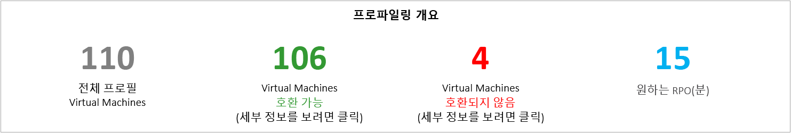

**총 프로파일링된 가상 컴퓨터 수**는 프로파일링된 데이터를 사용할 수 있는 VM의 총 수입니다. VMListFile에 프로파일링되지 않은 VM의 이름이 있는 경우 해당 VM은 보고서 생성에서 고려되지 않고 프로파일링된 VM의 총 수에서 제외됩니다.

**호환되는 가상 컴퓨터 수**는 Site Recovery를 사용하여 Azure로 보호할 수 있는 가상 컴퓨터의 수입니다. 필요한 네트워크 대역폭, 저장소 계정 수, Azure 코어 수, 구성 서버 수 및 추가 프로세스 서버 수를 계산하는 데 호환되는 가상 컴퓨터의 총 수입니다. 모든 호환되는 VM의 세부 정보는 "호환 VM" 섹션에서 사용할 수 있습니다.

**호환되지 않는 가상 컴퓨터 수**는 Site Recovery로 보호에 대해 호환되지 않는 프로파일링된 VM의 수입니다. 비호환성에 대한 이유는 "호환되지 않는 VM" 섹션에서 설명하고 있습니다. VMListFile에 프로파일링되지 않는 VM의 이름이 있는 경우 해당 VM은 호환되지 않는 VM 수에서 제외됩니다. 이러한 VM은 "호환되지 않는 VM" 섹션의 끝에 "데이터를 찾을 수 없음"으로 나열됩니다.

**원하는 RPO**: 원하는 복구 지점 목표(분)입니다. 세 개의 RPO 값: 15(기본값), 30 및 60분에 대해 보고서가 생성됩니다. 보고서의 대역폭 권장 사항은 시트의 오른쪽 위에 있는 원하는 RPO 드롭다운 목록의 선택에 따라 변경됩니다. 사용자 지정 값을 포함한 *-DesiredRPO* 매개 변수를 사용하여 보고서를 생성한 경우 이 사용자 지정 값은 원하는 RPO 드롭다운 목록에 기본값으로 표시됩니다.

### <a name="required-network-bandwidth-mbps"></a>필요한 네트워크 대역폭(Mbps)

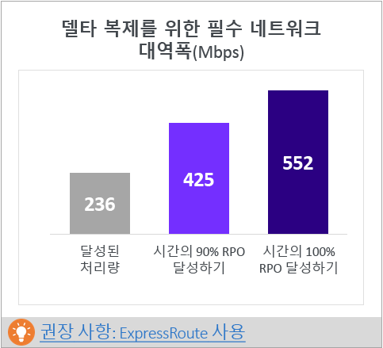

**RPO 시간 100% 충족**: 원하는 RPO 시간을 100% 충족하는 데 할당되는 권장 대역폭(Mbps)입니다. 이 양의 대역폭은 RPO 위반을 방지하는 데 호환되는 모든 VM의 안정적인 상태 델타 복제 전용이어야 합니다.

**RPO 시간 90% 충족**: 광대역 가격 책정 또는 다른 이유로 인해 원하는 RPO 시간 100%를 충족시키는 데 필요한 대역폭을 설정할 수 없는 경우 원하는 RPO 시간 90%를 충족할 수 있는 더 낮은 대역폭을 설정하도록 선택할 수 있습니다. 이 낮은 대역폭을 설정하는 의미를 이해하기 위해 보고서에서 예상되는 RPO 위반 횟수 및 기간에 대한 가상(what-if) 분석을 제공합니다.

**달성된 처리량:** GetThroughput 명령을 실행한 서버에서 저장소 계정이 있는 Microsoft Azure 지역으로의 처리량입니다. 이 처리량 숫자는 구성 서버 또는 프로세스 서버 저장소 및 네트워크 특성이 도구를 실행한 서버의 해당 항목과 동일하게 유지된다는 조건 하에 Site Recovery를 사용하여 호환되는 VM을 보호할 때 달성할 수 있는 예상되는 수준을 나타냅니다.

복제의 경우 RPO 시간 100%를 충족하기 위해 권장되는 대역폭을 설정해야 합니다. 대역폭을 설정한 후 도구에서 보고한 달성된 처리량이 증가하지 않으면 다음을 수행합니다.

1. Site Recovery 처리량을 제한하고 있는 네트워크 QoS(서비스 품질)가 있는지 확인합니다.

2. 네트워크 대기 시간을 최소화하기 위해 Site Recovery 자격 증명 모음이 물리적으로 지원되는 가장 가까운 Microsoft Azure 지역에 있는지 확인합니다.

3. 로컬 저장소 특성을 확인하여 하드웨어(예를 들어 SSD HDD)를 향상시킬 수 있는지 여부를 결정합니다.

4. 프로세스 서버의 Site Recovery 설정을 변경하여 [복제에 사용되는 네트워크 대역폭의 양을 증가](./site-recovery-plan-capacity-vmware.md#control-network-bandwidth)시킵니다.

이미 VM을 보호한 구성 서버 또는 프로세스 서버에서 이 도구를 실행하는 경우 도구를 몇 번 실행합니다. 달성된 처리량 숫자는 해당 시점에 처리 중인 변동의 양에 따라 변화합니다.

모든 엔터프라이즈 Site Recovery 배포의 경우 [ExpressRoute](https://aka.ms/expressroute)를 사용하는 것이 좋습니다.

### <a name="required-storage-accounts"></a>필요한 저장소 계정
다음 차트에서는 호환되는 모든 VM을 보호하는 데 필요한 저장소 계정(표준 및 프리미엄)의 총 수를 보여 줍니다. 각 VM에 사용할 저장소 계정에 대해 알아보려면 "VM 저장소 배치" 섹션을 참조하세요.


### <a name="required-number-of-azure-cores"></a>필요한 Azure 코어 수
이 결과는 호환되는 모든 VM의 장애 조치 또는 테스트 장애 조치 전에 설정할 코어의 총 수입니다. 구독에서 사용할 수 있는 코어 수가 너무 적은 경우 Site Recovery에서 테스트 장애 조치 또는 장애 조치 시 VM을 만들지 못합니다.


### <a name="required-on-premises-infrastructure"></a>필요한 온-프레미스 인프라
이 숫자는 호환되는 모든 VM을 보호하기에 충분하도록 구성해야 할 구성 서버 및 추가 프로세스 서버의 총 수입니다. 지원되는 [구성 서버에 대한 크기 권장 사항](https://aka.ms/asr-v2a-on-prem-components)에 따라 도구가 추가 서버를 권장할 수 있습니다. 권장 사항은 구성 서버 또는 추가 프로세스 서버 중 어느 것에서 먼저 적중되든지 간에 일일 변동량 또는 보호되는 VM의 최대 수(가상 컴퓨터당 평균 3개의 디스크를 가정) 중 더 큰 수를 기반으로 합니다. 일일 총 변동량 및 보호된 디스크의 총 수에 대한 세부 정보는 "입력" 섹션에 있습니다.


### <a name="what-if-analysis"></a>가상 분석
이 분석은 원하는 RPO 시간 90%만 충족하도록 낮은 대역폭을 설정할 때 프로파일링 기간 동안 발생할 수 있는 위반의 수를 설명합니다. 지정한 날짜에 하나 이상의 RPO 위반이 발생할 수 있습니다. 그래프는 해당 날짜의 최대 RPO를 보여줍니다.
이 분석에 따라 일일 RPO 위반 횟수와 일일 RPO 최고 적중 횟수를 지정된 낮은 대역폭으로 허용할 수 있는지 결정할 수 있습니다. 허용되는 경우 복제를 위해 더 낮은 대역폭을 할당할 수 있으며, 그렇지 않고 원하는 RPO 시간 100%를 충족하려면 제안된 대로 더 높은 대역폭을 할당합니다.

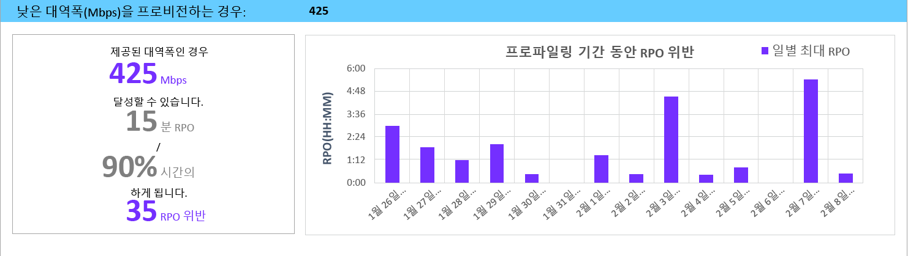

### <a name="recommended-vm-batch-size-for-initial-replication"></a>초기 복제에 권장되는 VM 일괄 처리 크기
이 섹션에서는 설정하는 RPO 시간 100%를 충족하기 위해 권장되는 대역폭을 사용하여 72시간 이내에 초기 복제를 완료하기 위해 병렬로 보호할 수 있는 VM 수를 권장합니다. 이 값은 구성 가능한 값입니다. 보고서 생성 시 변경하려면 *GoalToCompleteIR* 매개 변수를 사용합니다.

여기서 그래프는 호환되는 모든 VM에서 검색된 평균적인 VM 크기에 따라 72시간 내에 초기 복제를 완료하기 위한 대역폭 값 범위와 계산된 VM 일괄 처리 크기를 보여 줍니다.

공개 미리 보기에서 보고서는 일괄 처리에 포함되어야 하는 VM을 지정하지 않습니다. "호환되는 VM" 섹션에 표시된 디스크 크기를 사용하여 각 VM의 크기를 찾거나 일괄 처리를 위한 VM을 선택하거나 알려진 워크로드 특성을 기반으로 하여 VM을 선택할 수 있습니다. 초기 복제 완료 시간은 실제 VM 디스크 크기, 사용된 디스크 공간 및 사용 가능한 네트워크 처리량에 따라 비례적으로 변경됩니다.

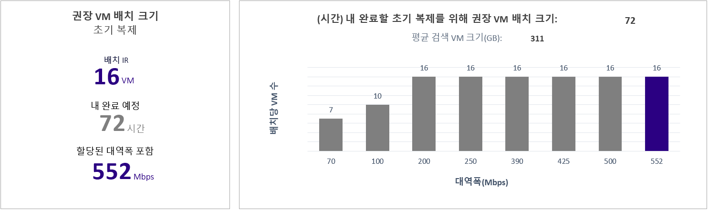

### <a name="growth-factor-and-percentile-values-used"></a>사용된 증가율 및 백분위 수 값
시트 아래쪽의 이 섹션에는 프로파일링된 VM의 모든 성능 카운터에 사용된 백분위수 값(기본값: 95번째 백분위수)과 모든 계산에 사용된 증가율(기본값: 30%)이 표시됩니다.

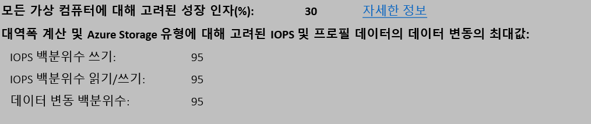

## <a name="recommendations-with-available-bandwidth-as-input"></a>입력으로 사용 가능한 대역폭을 사용하는 권장 사항

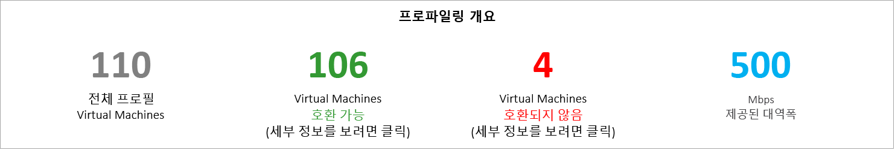

Site Recovery 복제를 위해 x Mbps 이상의 대역폭을 설정할 수 없다는 것을 알고 있는 상황이 있을 수 있습니다. 이 도구를 사용하면 사용 가능한 대역폭을 입력하고(보고서 생성 중에 -Bandwidth 매개 변수 사용), 달성 가능한 RPO(분)를 가져올 수 있습니다. 이처럼 달성 가능한 RPO 값을 사용하여 추가 대역폭을 설정해야 하는지 또는 이 RPO로 재해 복구 솔루션을 사용하는 것이 좋은지 여부를 결정할 수 있습니다.

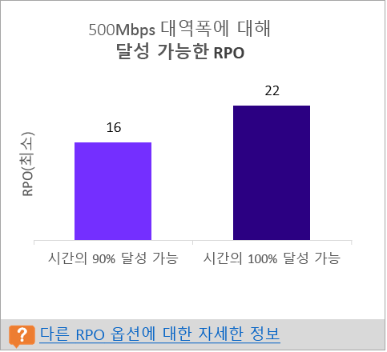

## <a name="input"></a>입력
입력 워크시트에서는 프로파일링된 VMware 환경에 대한 개요를 제공합니다.

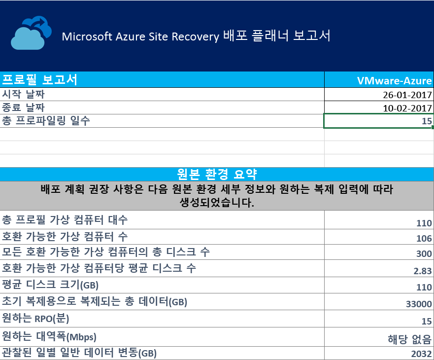

**시작 날짜** 및 **종료 날짜**: 보고서를 생성하도록 고려된 데이터 프로파일링의 시작 날짜와 종료 날짜입니다. 기본적으로 시작 날짜는 프로파일링을 시작한 날짜이고, 종료 날짜는 프로파일링을 중지한 날짜입니다. 'StartDate' 및 'EndDate' 매개 변수를 사용하여 보고서를 생성하는 경우 이는 해당 매개 변수의 값일 수 있습니다.

**총 프로파일링 일 수**: 보고서를 생성한 시작 날짜와 종료 날짜 사이에 프로파일링한 총 날짜 수입니다.

**호환되는 가상 컴퓨터 수**: 필요한 네트워크 대역폭, 필요한 수의 저장소 계정, Microsoft Azure 코어, 구성 서버 및 추가 프로세스 서버를 계산하는 데 호환되는 VM의 총 수입니다.

**모든 호환되는 가상 컴퓨터의 총 디스크 수**: 배포에서 사용되는 구성 서버 및 추가 프로세스 서버의 수를 결정하기 위한 입력 중 하나로 사용되는 숫자입니다.

**호환되는 가상 컴퓨터당 평균 디스크 수**: 호환되는 모든 VM에서 계산된 평균 디스크 수입니다.

**평균 디스크 크기(GB)**: 호환되는 모든 VM에서 계산된 평균 디스크 크기입니다.

**원하는 RPO(분)**: 기본 복구 지점 목표이거나 필요한 대역폭을 추정하기 위해 보고서 생성 시 'DesiredRPO' 매개 변수에 전달한 값입니다.

**원하는 대역폭(Mbps)**: 달성 가능한 RPO를 추정하기 위해 보고서 생성 시 'Bandwidth' 매개 변수에 대해 전달한 값입니다.

**관찰된 일반적 일일 데이터 변동량(GB)**: 모든 프로파일링 일 수 동안 관찰된 평균 데이터 변동량입니다. 이 숫자는 배포에서 사용되는 구성 서버 및 추가 프로세스 서버의 수를 결정하기 위한 입력 중 하나로 사용됩니다.


## <a name="vm-storage-placement"></a>VM-저장소 배치

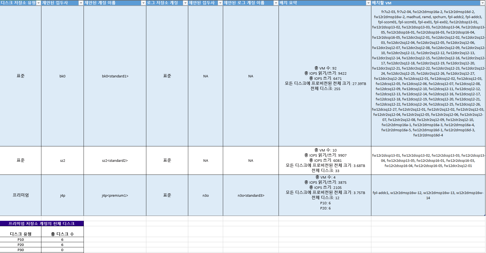

**디스크 저장소 유형**: **배치할 VM** 열에 언급된 해당 가상 컴퓨터를 모두 복제하는 데 사용되는 표준 또는 프리미엄 저장소 계정입니다.

**제안된 접두사**: 저장소 계정 이름을 지정하는 데 사용할 수 있는 3자로 구성된 접두사입니다. 고유한 접두사를 사용할 수 있지만 도구의 제안은 [저장소 계정에 대 한 파티션 명명 규칙](https://aka.ms/storage-performance-checklist)을 따릅니다.

**제안된 계정 이름**: 제안된 접두사를 포함한 후 저장소 계정 이름입니다. 꺾쇠 괄호(< 및 >) 안의 이름을 사용자 지정 입력으로 바꿉니다.

**로그 저장소 계정**: 모든 복제 로그는 표준 저장소 계정에 저장됩니다. 프리미엄 저장소 계정에 복제하는 VM의 경우 로그 저장소에 대한 추가 표준 저장소 계정을 설정합니다. 여러 프리미엄 복제 저장소 계정에서 단일 표준 로그 저장소 계정을 사용할 수 있습니다. 표준 저장소 계정에 복제된 VM은 로그에 대해 동일한 저장소 계정을 사용합니다.

**제안된 로그 계정 이름**: 제안된 접두사를 포함한 후 저장소 로그 계정 이름입니다. 꺾쇠 괄호(< 및 >) 안의 이름을 사용자 지정 입력으로 바꿉니다.

**배치 요약**: 복제 및 테스트 장애 조치 또는 장애 조치 시 저장소 계정의 총 VM 부하에 대한 요약입니다. 저장소 계정에 매핑된 총 VM 수, 이 저장소 계정에 배치되는 모든 VM의 총 읽기/쓰기 IOPS, 총 쓰기(복제) IOPS, 모든 디스크에 설정된 총 크기 및 총 디스크 수를 포함합니다.

**배치할 가상 컴퓨터**: 최적의 성능과 사용을 위해 지정된 저장소 계정에 배치해야 하는 VM을 모두 나열합니다.

## <a name="compatible-vms"></a>호환되는 VM
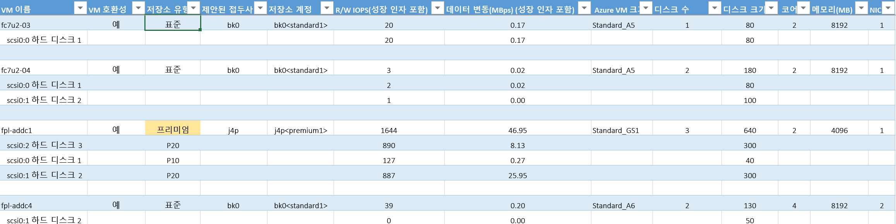

**VM 이름**: 보고서가 생성될 때 VMListFile에 사용되는 VM 이름 또는 IP 주소입니다. 또한 이 열은 VM에 연결된 디스크(VMDK)를 나열합니다. 중복 이름 또는 IP 주소와 vCenter VM을 구분하기 위해 이름에 ESXi 호스트 이름을 포함합니다. 나열된 ESXi 호스트는 도구가 프로 파일링 기간 중에 발견한 VM을 배치하는 호스트입니다.

**VM 호환성**: 값은 **예** 및 **예**\*입니다. **예**\*는 VM이 [Azure 프리미엄 저장소](https://aka.ms/premium-storage-workload)에 적합한 인스턴스에 대한 값입니다. 여기서 프로파일링된 높은 변동량 또는 IOPS 디스크는 P20 또는 P30 범주에 적합하지만 디스크의 크기 때문에 P10 또는 P20에 낮게 매핑됩니다. 저장소 계정 크기에 따라 디스크를 매핑할 프리미엄 저장소 디스크 유형이 결정됩니다. 예:
* 128GB 미만은 P10입니다.
* 128GB 이상 512GB 미만은 P20입니다.
* 512GB 이상 1023GB 미만은 P30입니다.

디스크의 워크로드 특성이 P20 또는 P30 범주에 속하지만 크기가 더 낮은 프리미엄 저장소 디스크 유형에 낮게 매핑되는 경우 도구에서 해당 VM을 **예**\*로 표시합니다. 또한 도구에서는 원본 디스크 크기를 권장 프리미엄 저장소 디스크 유형에 맞게 변경하거나 대상 디스크 유형 사후 장애 조치를 변경할 것을 권장합니다.

**저장소 유형**: 표준 또는 프리미엄입니다.

**제안된 접두사**: 3자로 구성된 저장소 계정 접두사입니다.

**저장소 계정**: 제안된 저장소 계정 접두사를 사용하는 이름입니다.

**읽기/쓰기 IOPS(증가율 포함)**: 향후 증가율(기본값: 30%)을 포함한 디스크의 최고 워크로드 읽기/쓰기 IOPS(기본값: 95번째 백분위수)입니다. 참고로 VM의 최고 읽기/쓰기 IOPS는 프로파일링 기간의 매분마다 개별 디스크의 읽기/쓰기 IOPS를 합친 최고값이기 때문에 VM의 총 읽기/쓰기 IOPS가 항상 VM에 속한 개별 디스크의 읽기/쓰기 IOPS 합계가 되는 것은 아닙니다.

**데이터 변동률(Mbps)(증가율 포함)**: 향후 증가율(기본값: 30%)을 포함한 디스크의 최고 변동률(기본값: 95번째 백분위수)입니다. VM의 총 데이터 변동은 프로파일링 기간의 매분마다 개별 디스크 변동 합계의 최고값이기 때문에 VM의 총 데이터 변동이 항상 VM에 속한 개별 디스크의 데이터 변동 합계가 되는 것은 아닙니다.

**Azure VM 크기**: 이 온-프레미스 VM에 대해 이상적으로 매핑된 Azure Cloud Services 가상 컴퓨터 크기입니다. 매핑은 온-프레미스 VM의 메모리, 디스크/코어/NIC 수 및 읽기/쓰기 IOPS를 기반으로 합니다. 항상 모든 온-프레미스 VM 특성과 일치하는 가장 낮은 Azure VM 크기를 권장합니다.

**디스크 수**: VM의 총 가상 컴퓨터 디스크 수(VMDK)입니다.

**디스크 크기 (GB)**: VM에 속한 모든 디스크의 총 설정 크기입니다. 또한 도구에서는 VM의 개별 디스크에 대한 디스크 크기도 보여 줍니다.

**코어 수**: VM의 CPU 코어 수입니다.

**메모리(MB)**: VM의 RAM 크기입니다.

**NIC 수**: VM의 NIC 수입니다.

## <a name="incompatible-vms"></a>호환되지 않는 VM

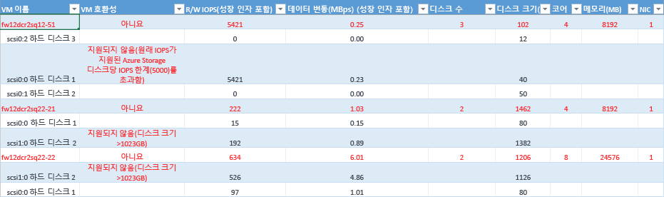

**VM 이름**: 보고서가 생성될 때 VMListFile에 사용되는 VM 이름 또는 IP 주소입니다. 또한 이 열은 VM에 연결된 VMDK를 나열합니다. 중복 이름 또는 IP 주소와 vCenter VM을 구분하기 위해 이름에 ESXi 호스트 이름을 포함합니다. 나열된 ESXi 호스트는 도구가 프로 파일링 기간 중에 발견한 VM을 배치하는 호스트입니다.

**VM 호환성**: 지정된 VM을 Site Recovery에서 사용할 수 없는 이유를 나타냅니다. 이유는 게시된 [저장소 한도](https://aka.ms/azure-storage-scalbility-performance)를 기반으로 VM의 각 호환되지 않는 디스크에 대해 설명되며 다음 중 하나일 수 있습니다.

* 디스크 크기가 1023GB보다 큽니다. Azure Storage는 현재 1TB보다 큰 디스크 크기를 지원하지 않습니다.

* 총 VM 크기(복제 + TFO)가 지원되는 저장소 계정 크기 한도(35TB)를 초과합니다. 이러한 비호환성은 일반적으로 VM의 단일 디스크가 표준 저장소에 대해 지원되는 최대 Azure 또는 Site Recovery 한도를 초과하는 성능 특성을 가지고 있는 경우에 발생합니다. 이러한 인스턴스는 VM을 프리미엄 저장소 영역에 푸시합니다. 그러나 프리미엄 저장소 계정의 최대 지원 크기는 35TB이며, 보호된 단일 VM을 여러 저장소 계정에서 보호할 수 없습니다. 또한 보호되는 VM에 대해 테스트 장애 조치를 실행하면 복제가 진행 중인 저장소 계정과 동일한 계정에서 실행된다는 점에 유의해야 합니다. 이 인스턴스에서 복제 진행과 테스트 장애 조치를 동시에 성공하려면 디스크 크기를 2배로 설정합니다.
* 원본 IOPS가 디스크당 지원되는 저장소 IOPS 한도(5000)를 초과합니다.
* 원본 IOPS가 VM당 지원되는 저장소 IOPS 한도(80,000)를 초과합니다.
* 평균 데이터 변동률이 디스크의 평균 IO 크기에 대해 지원되는 Site Recovery 데이터 변동률 한도(10Mbps)를 초과합니다.
* VM의 모든 디스크의 총 데이터 변동률이 지원되는 최대 Site Recovery 데이터 변동률 한도(54Mbps)를 초과합니다.
* 평균 유효 쓰기 IOPS가 디스크에 대해 지원되는 Site Recovery IOPS 한도(840)를 초과합니다.
* 계산된 스냅숏 저장소가 지원되는 스냅숏 저장소 한도(10TB)를 초과합니다.

**읽기/쓰기 IOPS(증가율 포함)**: 향후 증가율(기본값: 30%)을 포함한 디스크의 최고 워크로드 IOPS(기본값: 95번째 백분위수)입니다. 참고로 VM의 최고 읽기/쓰기 IOPS는 프로파일링 기간의 매분마다 개별 디스크의 읽기/쓰기 IOPS를 합친 최고값이기 때문에 VM의 총 읽기/쓰기 IOPS가 항상 VM에 속한 개별 디스크의 읽기/쓰기 IOPS 합계가 되는 것은 아닙니다.

**데이터 변동률(Mbps)(증가율 포함)**: 향후 증가율(기본값: 30%)을 포함한 디스크의 최고 변동률(기본값: 95번째 백분위 수)입니다. VM의 총 데이터 변동은 프로파일링 기간의 매분마다 개별 디스크 변동 합계의 최고값이기 때문에 VM의 총 데이터 변동이 항상 VM에 속한 개별 디스크의 데이터 변동 합계가 되는 것은 아닙니다.

**디스크 수**: VM의 총 VMDK 수입니다.

**디스크 크기 (GB)**: VM에 속한 모든 디스크의 총 설정 크기입니다. 또한 도구에서는 VM의 개별 디스크에 대한 디스크 크기도 보여 줍니다.

**코어 수**: VM의 CPU 코어 수입니다.

**메모리(MB)**: VM의 RAM 양입니다.

**NIC 수**: VM의 NIC 수입니다.


## <a name="site-recovery-limits"></a>사이트 복구 제한

**복제 저장소 대상** | **평균 원본 디스크 I/O 크기** |**평균 원본 디스크 데이터 변동** | **일일 총 원본 디스크 데이터 변동**
---|---|---|---
Standard Storage | 8KB    | 2MBps | 디스크당 168GB
프리미엄 P10 디스크 | 8KB    | 2MBps | 디스크당 168GB
프리미엄 P10 디스크 | 16KB | 4MBps |    디스크당 336GB
프리미엄 P10 디스크 | 32KB 이상 | 8MBps | 디스크당 672GB
프리미엄 P20 또는 P30 디스크 | 8KB    | 5MBps | 디스크당 421GB
프리미엄 P20 또는 P30 디스크 | 16KB 이상 |10MBps | 디스크당 842GB

여기서는 I/O가 30% 겹치고 있다고 가정하는 평균 숫자입니다. Site Recovery는 중첩 비율, 더 큰 쓰기 크기 및 실제 워크로드 I/O 동작에 따라 더 높은 처리량을 다룰 수 있습니다. 앞의 숫자는 약 5분의 일반적인 백로그가 있다고 가정합니다. 즉, 데이터를 업로드한 후에 처리되며 5분 내에 복구 지점이 생성됩니다.

이러한 한도는 테스트를 기반으로 하지만 모든 가능한 응용 프로그램 I/O 조합을 다룰 수는 없습니다. 실제 결과는 응용 프로그램 I/O 조합에 따라 달라질 수 있습니다. 최상의 결과를 얻으려면 배포를 계획한 후에도 항상 테스트 장애 조치를 통해 광범위한 응용 프로그램 테스트를 수행하여 진정한 성능 상황을 이해하는 것이 좋습니다.

## <a name="updating-the-deployment-planner"></a>Deployment Planner 업데이트
Deployment Planner를 업데이트하려면 다음을 수행합니다.

1. 최신 버전의 [Azure Site Recovery Deployment Planner](https://aka.ms/asr-deployment-planner)를 다운로드합니다.

2. 실행할 서버에 .zip 폴더를 복사합니다.

3. .zip 폴더의 압축을 풉니다.

4. 다음 중 하나를 수행합니다.
 * 최신 버전에 프로파일링 수정 프로그램이 없고 현재 버전의 Planner에서 프로파일링을 이미 진행 중인 경우 프로파일링을 계속합니다.
 * 최신 버전에 프로파일링 수정 프로그램이 있는 경우 현재 버전에서 프로파일링을 중지하고 새 버전으로 프로파일링을 다시 시작하는 것이 좋습니다.

  >[!NOTE]
  >
  >새 버전으로 프로파일링을 시작하는 경우 도구가 기존 파일의 프로파일 데이터를 추가하도록 동일한 출력 디렉터리 경로를 전달합니다. 프로파일링된 데이터의 전체 집합을 사용하여 보고서가 생성됩니다. 다른 출력 디렉터리를 전달하는 경우 새 파일이 생성되고 이전의 프로파일링된 데이터는 보고서 생성 시 사용되지 않습니다.
  >
  >각 새 Deployment Planner는 .zip 파일의 누적 업데이트입니다. 최신 파일을 이전 폴더로 복사할 필요가 없습니다. 새 폴더를 만들어 사용할 수 있습니다.


## <a name="version-history"></a>버전 기록
### <a name="11"></a>1.1
업데이트: 2017년 3월 9일

다음 문제가 수정됨:

* 여러 ESXi 호스트에서 동일한 이름 또는 IP 주소를 가진 둘 이상의 VM이 vCenter에 있는 경우 도구에서 VM을 프로파일링할 수 없습니다.
* 호환되는 VM 및 호환되지 않는 VM 워크시트에서 복사 및 검색을 사용할 수 없습니다.

### <a name="10"></a>1.0
업데이트: 2017년 2월 23일

Azure Site Recovery Deployment Planner 공개 미리 보기 1.0에는 다음과 같은 알려진 문제가 있습니다(향후 업데이트에서 해결할 예정).

* 도구는 Hyper-V에서 Azure로의 배포가 아닌 VMware에서 Azure로의 시나리오에 대해서만 작동합니다. Hyper-V에서 Azure로의 시나리오에 대해서는 [Hyper-V Capacity Planner 도구](./site-recovery-capacity-planning-for-hyper-v-replication.md)를 사용합니다.
* 미국 정부 및 중국 Microsoft Azure 지역에서는 GetThroughput 작업이 지원되지 않습니다.
* 여러 ESXi 호스트에서 동일한 이름 또는 IP 주소를 가진 둘 이상의 VM이 vCenter 서버에 있는 경우 도구에서 VM을 프로파일링할 수 없습니다. 이 버전에서 도구는 VMListFile에서 중복된 VM 이름 또는 IP 주소에 대한 프로파일링을 건너뜁니다. 해결 방법은 VCenter 서버 대신 ESXi 호스트를 사용하여 VM을 프로파일링하는 것입니다. 각 ESXi 호스트에 대해 인스턴스 하나만 실행해야 합니다.

