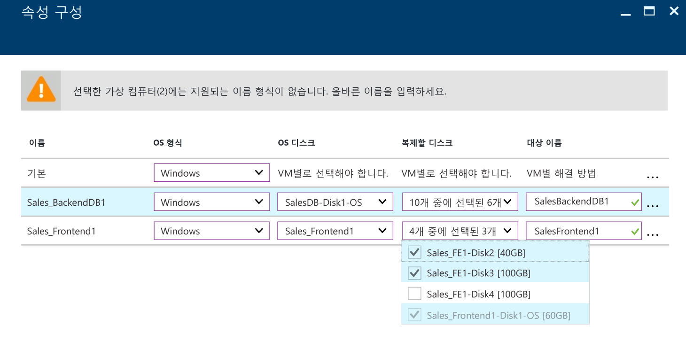
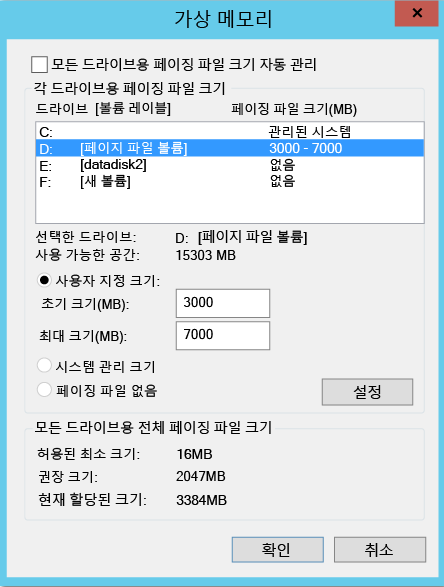
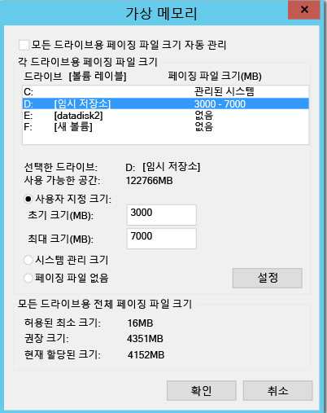
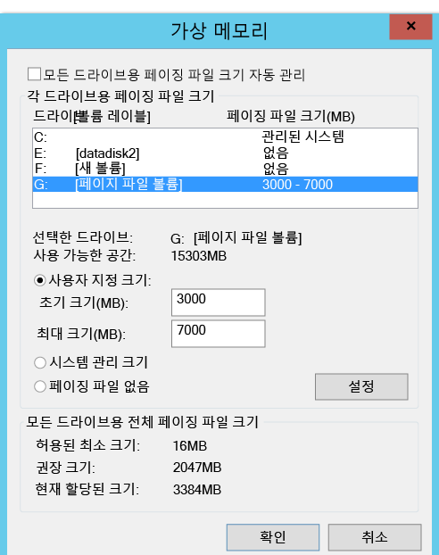
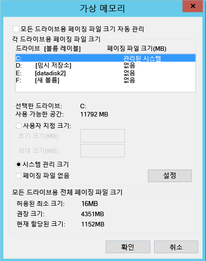

#복제에서 디스크 제외
이 문서에서는 복제에서 디스크를 제외하여 소비되는 복제 대역폭을 최적화하거나 이러한 디스크에서 사용하는 대상 쪽 리소스를 최적화하는 방법에 대해 설명합니다. 이 기능은 VMware에서 Azure 및 Hyper-V Azure로의 시나리오를 위해 지원됩니다.

##필수 조건

기본적으로 컴퓨터의 모든 디스크는 복제됩니다. **VMware에서 Azure로** 복제하는 경우 복제에서 디스크를 제외하려면 복제를 사용하도록 설정하기 전에 컴퓨터에 모바일 서비스를 수동으로 설치해야 합니다.

## 복제에서 디스크를 제외하는 이유는?
다음과 같은 이유로 복제에서 디스크를 제외해야 하는 경우가 자주 있습니다.

1. 제외되는 디스크에서 변동된 데이터는 중요하지 않거나 복제할 필요가 없습니다.

2. 저장소 및 네트워크 리소스는 이 변동을 복제하지 않고도 저장할 수 있습니다.

##일반적인 시나리오는?
쉽게 식별할 수 있고 제외를 위한 훌륭한 후보가 되는 데이터 변동의 몇 가지 구체적인 예가 있습니다. 예를 들어 모든 페이지 파일 쓰기, Microsoft SQL 서버 tempdb 쓰기 등이 있습니다. 워크로드 및 저장소 하위 시스템에 따라 페이지 파일이 상당한 양의 변동을 등록할 수 있습니다. 그러나 이 데이터를 기본 사이트에서 Azure로 복제하면 리소스가 많이 소모됩니다. 따라서 OS 및 페이지 파일을 모두 가지고 있는 단일 가상 디스크를 사용하여 VM을 복제하는 경우 다음과 같이 최적화할 수 있습니다.

1. 단일 가상 디스크를 두 개의 가상 디스크로 분할 - 하나는 OS, 다른 하나는 페이지 파일을 포함
2. 복제에서 페이지 파일 디스크 제외

마찬가지로 동일한 디스크에 tempdb 및 시스템 데이터베이스 파일이 있는 Microsoft SQL Server의 경우 다음과 같이 최적화할 수 있습니다.

1. 별도의 두 디스크에 tempdb와 시스템 데이터베이스 유지
2. 복제에서 tempdb 디스크 제외

##복제에서 디스크를 제외하는 방법은?

###VMware에서 Azure로
[복제 사용](site-recovery-vmware-to-azure.md#enable-replication) 워크플로에 따라 Azure Site Recovery 포털에서 VM을 보호합니다. 복제 사용의 네 번째 단계에는 복제에서 디스크를 제외하는 데 사용할 수 있는 **복제할 디스크** 열이 있습니다. 기본적으로 모든 디스크가 선택됩니다. 복제에서 제외하려는 디스크의 선택을 취소하고 복제를 사용하도록 설정하는 단계를 수행합니다. 

    
    
>[!NOTE]
> 
> * 이미 모바일 서비스가 설치된 디스크만 제외할 수 있습니다. 모바일 서비스는 복제를 사용하도록 설정된 후 푸시 메커니즘만 사용하여 설치되기 때문에 모바일 서비스를 수동으로 설치해야 합니다.
> * 기본 디스크만 복제에서 제외할 수 있습니다. OS 또는 동적 디스크를 제외할 수 없습니다.
> * 복제를 사용하도록 설정한 후 복제에 대해 디스크를 추가 또는 제거할 수 없습니다. 디스크를 추가하거나 제외하려는 경우 컴퓨터에 대한 보호를 해제한 다음 다시 사용하도록 설정해야 합니다.
> * 응용 프로그램 작동하는 데 필요한 디스크를 제외하면 Azure로 장애 조치한 후 복제된 응용 프로그램이 실행될 수 있도록 Azure에서 디스크를 수동으로 만들어야 합니다. 또는 Azure 자동화를 복구 계획에 통합하여 컴퓨터의 장애 조치(failover) 동안 디스크를 만들 수 있습니다.
> * Window VM: Azure에서 수동으로 만드는 디스크는 장애 복구되지 않습니다. 예를 들어&3;개 디스크를 장애 조치하고 Azure VM에서&2;개 디스크를 직접 만들면 장애 조치된&3;개 디스크만 장애 복구됩니다. 온-프레미스에서 Azure로 장애 복구 또는 다시 보호에서 수동으로 만든 디스크는 포함할 수 없습니다.
> * Linux VM: Azure에서 수동으로 만드는 디스크는 장애 복구됩니다. 예를 들어&3;개의 디스크를 장애 조치(failover)하고 Azure에서 직접&2;개를 만든 경우&5;개 모두 장애 복구(failback)됩니다. 수동으로 만든 디스크는 장애 복구(failback)에서 제외할 수 없습니다.
> 

###Hyper-V에서 Azure로
[복제 사용](site-recovery-hyper-v-site-to-azure.md#step-6-enable-replication) 워크플로에 따라 Azure Site Recovery 포털에서 VM을 보호합니다. 복제 사용의 네 번째 단계에는 복제에서 디스크를 제외하는 데 사용할 수 있는 **복제할 디스크** 열이 있습니다. 기본적으로 모든 디스크가 복제를 위해 선택됩니다. 복제에서 제외하려는 디스크의 선택을 취소하고 복제를 사용하도록 설정하는 단계를 수행합니다. 

    
>[!NOTE]
> 
> * 기본 디스크만 복제에서 제외할 수 있습니다. OS 디스크는 제외할 수 없으며, 동적 디스크는 제외하지 않는 것이 좋습니다. ASR는 어떤 VHD 디스크가 게스트 VM 내에서 기본 또는 동적 디스크인지 식별할 수 없습니다.  모든 종속적인 동적 볼륨 디스크가 제외되지 않으면, 보호된 동적 디스크가 장애 조치 VM에서 실패한 디스크로 나타나며 해당 디스크의 데이터에 액세스할 수 없습니다.    
> * 복제를 사용하도록 설정한 후 복제에 대해 디스크를 추가 또는 제거할 수 없습니다. 디스크를 추가하거나 제외하려는 경우 VM에 대한 보호를 해제한 다음 다시 사용하도록 설정해야 합니다.
> * 응용 프로그램 작동에 필요한 디스크를 제외하면 Azure로 장애 조치(failover) 후 복제된 응용 프로그램이 실행될 수 있도록 디스크를 Azure에 수동으로 만들어야 합니다. 또는 Azure 자동화를 복구 계획에 통합하여 컴퓨터의 장애 조치(failover) 동안 디스크를 만들 수 있습니다.
> * Azure에서 수동으로 만드는 디스크는 장애 복구되지 않습니다. 예를 들어 디스크&3;장을 장애 조치하고&2;장을 직접 Azure VM에서 만든다면 장애 조치된&3;장의 디스크만이 Azure에서 다시 Hyper-V로 장애 복구됩니다. 장애 복구 또는 Hyper-V에서 Azure로 역방향 복제에서 수동으로 만든 디스크를 포함할 수 없습니다.
 

##디스크 제외의 종단 간 시나리오
디스크 제외 기능을 더 잘 이해할 수 있는 두 가지 시나리오를 살펴보겠습니다.

1. SQL Server tempdb 디스크
2. 페이지 파일 디스크

###SQL Server tempdb 디스크 제외
제외할 수 있는 tempdb가 있는 SQL Server 가상 컴퓨터를 살펴보겠습니다.

원본 VM에 있는 SalesDB(VM 이름) 디스크:

**디스크 이름** | **게스트 OS 디스크 #** | **드라이브 문자** | **디스크 데이터 형식**
--- | --- | --- | ---
DB-Disk0-OS | DISK0 | C:\ | OS 디스크
DB-Disk1| Disk1 | D:\ | SQL 시스템 데이터베이스 및 사용자 데이터베이스&1;
DB-Disk2(보호에서 제외된 디스크) | Disk2 | E:\ | 임시 파일
DB-Disk3(보호에서 제외된 디스크) | Disk3 | F:\ | SQL tempdb 데이터베이스(폴더 경로(F:\MSSQL\Data\) --> 장애 조치 전에 폴더 경로를 적어둡니다.
DB-Disk4 | Disk4 |G:\ |사용자 데이터베이스&2;

VM의 두 디스크에 대한 데이터 변동은 본질적으로 일시적이므로 SalesDB VM을 보호하면서 복제에서 'Disk2' 및 'Disk3'을 제외합니다. Azure Site Recovery에서 해당 디스크를 복제하지 않으며, 장애 조치 시 해당 디스크는 Azure의 장애 조치 VM에 존재하지 않습니다.

장애 조치 후 Azure VM의 디스크:

**게스트 OS 디스크 #** | **드라이브 문자** | **디스크 데이터 형식**
--- | --- | ---
DISK0 |    C:\ | OS 디스크
Disk1 |    E:\ | 임시 저장소[Azure에서 이 디스크를 추가하고 사용 가능한 첫 번째 드라이브 문자를 할당합니다.]
Disk2 | D:\ | SQL 시스템 데이터베이스 및 사용자 데이터베이스&1;
Disk3 | G:\ | 사용자 데이터베이스&2;

Disk2와 Disk3은 SalesDB VM에서 제외되었으므로 E:가 사용 가능한 목록의 첫 번째 드라이브 문자입니다. Azure에서 E:를 임시 저장소 볼륨에 할당합니다. 복제된 모든 디스크의 경우 드라이브 문자는 동일하게 유지됩니다.

SQL tempdb 디스크(tempdb 폴더 경로(F:\MSSQL\Data\))이고 복제에서 제외된 Disk3은 장애 조치 VM에서 사용할 수 없습니다. 결과적으로 SQL 서비스는 중지된 상태이며 F:\MSSQL\Data 경로가 필요합니다.

이 경로를 만들 수 있는 두 가지 방법이 있습니다.

1. 새 디스크를 추가하고 tempdb 폴더 경로를 할당합니다. 또는
2. tempdb 폴더 경로에 기존 임시 저장소 디스크를 사용합니다.

####새 디스크 추가:

1. 장애 조치 전에 SQL tempdb.mdf 및 tempdb.ldf 경로를 적어둡니다.
2. Azure Portal에서 원본 SQL tempdb 디스크(Disk3)와 크기가 같거나 더 큰 장애 조치 VM에 새 디스크를 추가합니다.
3. Azure VM에 로그인합니다. 디스크 관리(diskmgmt.msc) 콘솔에서 새로 추가한 디스크를 초기화하고 포맷합니다.
4. SQL tempdb 디스크(F:)에서 사용한 것과 동일한 드라이브 문자를 할당합니다.
5. F: 볼륨(F:\MSSQL\Data)에 tempdb 폴더를 만듭니다.
6. 서비스 콘솔에서 SQL 서비스를 시작합니다.

####SQL tempdb 폴더 경로에 기존 임시 저장소 디스크 사용:

1. 명령줄 콘솔을 엽니다.
2. 명령줄 콘솔에서 SQL Server를 복구 모드에서 실행합니다.

        Net start MSSQLSERVER /f / T3608

3. 다음 sqlcmd를 실행하여 tempdb 경로를 새 경로로 바꿉니다.

        sqlcmd -A -S SalesDB        **Use your SQL DBname**
        USE master;        
        GO        
        ALTER DATABASE tempdb        
        MODIFY FILE (NAME = tempdev, FILENAME = 'E:\MSSQL\tempdata\tempdb.mdf');
        GO        
        ALTER DATABASE tempdb        
        MODIFY FILE (NAME = templog, FILENAME = 'E:\MSSQL\tempdata\templog.ldf');        
        GO

4. Microsoft SQL 서버 서비스를 중지합니다.

        Net stop MSSQLSERVER
5. Microsoft SQL 서버 서비스를 시작합니다.

        Net start MSSQLSERVER

임시 저장소 디스크에 대해 다음 Azure 지침을 참조하세요.

* Azure VM에서 SSD를 사용하여 SQL Server TempDB 및 버퍼 풀 확장 저장
* Azure 가상 컴퓨터의 SQL Server에 대한 성능 모범 사례

###장애 복구(Azure에서 온-프레미스로)
이제 Azure에서 온-프레미스 VMware 또는 Hyper-V 호스트로 장애 조치를 수행할 때 모든 디스크를 복제하는 것에 대해 살펴보겠습니다. Azure에서 수동으로 만드는 디스크는 복제되지 않습니다. 예를 들어 디스크&3;장을 장애 조치하고&2;장을 직접 Azure VM에서 만든다면 장애 조치된&3;장의 디스크만이 다시 장애 복구됩니다. 온-프레미스에서 Azure로 장애 복구 또는 다시 보호에서 수동으로 만든 디스크는 포함할 수 없습니다. 또한 임시 저장소 디스크도 온-프레미스로 복제하지 않습니다.

####OLR(원래 위치 복구)로 장애 복구

위의 예에서 Azure VM 디스크 구성은 다음과 같습니다.

**게스트 OS 디스크 #** | **드라이브 문자** | **디스크 데이터 형식** 
--- | --- | --- 
DISK0 | C:\ | OS 디스크
Disk1 |    E:\ | 임시 저장소[Azure에서 이 디스크를 추가하고 사용 가능한 첫 번째 드라이브 문자를 할당합니다.]
Disk2 |    D:\ | SQL 시스템 데이터베이스 및 사용자 데이터베이스&1;
Disk3 |    G:\ | 사용자 데이터베이스&2;

####VMware에서 Azure로
원래 위치로 장애 복구가 수행되면 장애 복구 VM 디스크 구성에는 제외된 디스크가 없습니다. 즉 VMware에서 Azure로 제외된 디스크는 장애 복구 VM에서 사용할 수 없습니다. 

Azure에서 온-프레미스 VMware로 계획된 장애 조치 후 VMWare VM(원래 위치)의 디스크:

**게스트 OS 디스크 #** | **드라이브 문자** | **디스크 데이터 형식** 
--- | --- | --- 
DISK0 | C:\ | OS 디스크
Disk1 |    D:\ | SQL 시스템 데이터베이스 및 사용자 데이터베이스&1;
Disk2 |    G:\ | 사용자 데이터베이스&2;

####Hyper-V에서 Azure로
원래 위치로 장애 복구가 수행되면 장애 복구 VM 디스크 구성은 Hyper-V의 원래 VM 디스크 구성과 동일하게 유지됩니다. 즉 Hyper-V 사이트에서 Azure로 제외된 디스크가 장애 복구 VM에서 사용할 수 있습니다.

Azure에서 온-프레미스 Hyper-V로 계획된 장애 조치 후 Hyper-V VM(원래 위치)의 디스크:

**디스크 이름** | **게스트 OS 디스크 #** | **드라이브 문자** | **디스크 데이터 형식**
--- | --- | --- | ---
DB-Disk0-OS | DISK0 |    C:\ | OS 디스크
DB-Disk1 | Disk1 | D:\ | SQL 시스템 데이터베이스 및 사용자 데이터베이스&1;
DB-Disk2(제외된 디스크) | Disk2 | E:\ | 임시 파일
DB-Disk3(제외된 디스크) | Disk3 | F:\ | SQL tempdb 데이터베이스(폴더 경로(F:\MSSQL\Data\))
DB-Disk4 | Disk4 | G:\ | 사용자 데이터베이스&2;

####페이징 파일 디스크 제외

제외할 수 있는 페이지 파일 디스크가 있는 가상 컴퓨터를 살펴보겠습니다.
다음 두 가지 경우가 있습니다.

####사례 1: 페이지 파일이 D: 드라이브에 구성됨
디스크 구성:

**디스크 이름** | **게스트 OS 디스크 #** | **드라이브 문자** | **디스크 데이터 형식**
--- | --- | --- | ---
DB-Disk0-OS | DISK0 | C:\ | OS 디스크
DB-Disk1(보호에서 제외된 디스크) | Disk1 | D:\ | pagefile.sys
DB-Disk2 | Disk2 | E:\ | 사용자 데이터 1
DB-Disk3 | Disk3 | F:\ | 사용자 데이터 2

원본 VM에서 페이지 파일 설정:

    

VMware에서 Azure로 또는 Hyper-V에서 Azure로 VM 장애 조치 후 Azure VM의 디스크:
**디스크 이름** | **게스트 OS 디스크 #** | **드라이브 문자** | **디스크 데이터 형식**
--- | --- | --- | ---
DB-Disk0-OS | DISK0 | C:\ | OS 디스크
DB-Disk1 | Disk1 | D:\ | 임시 저장소 -> pagefile.sys
DB-Disk2 | Disk2 | E:\ | 사용자 데이터 1
DB-Disk3 | Disk3 | F:\ | 사용자 데이터 2

Disk1(D:)이 제외되었으므로 D:가 사용 가능한 목록의 첫 번째 드라이브 문자이고, Azure에서 D: 문자를 임시 저장소 볼륨에 할당합니다.  Azure VM에서 D:를 사용할 수 있으므로 VM의 페이지 파일 설정은 동일하게 유지됩니다.

Azure VM에서 페이지 파일 설정:

####사례 2: 페이지 파일이 다른 드라이브(D: 드라이브 이외)에 구성됨

원본 VM 디스크 구성:

**디스크 이름** | **게스트 OS 디스크 #** | **드라이브 문자** | **디스크 데이터 형식**
--- | --- | --- | ---
DB-Disk0-OS | DISK0 | C:\ | OS 디스크
DB-Disk1(보호에서 제외된 디스크) | Disk1 | G:\ | pagefile.sys
DB-Disk2 | Disk2 | E:\ | 사용자 데이터 1
DB-Disk3 | Disk3 | F:\ | 사용자 데이터 2

온-프레미스 VM에서 페이지 파일 설정:

VMware/Hyper-V에서 Azure로 VM 장애 조치 후 Azure VM의 디스크:

**디스크 이름**| **게스트 OS 디스크 #**| **드라이브 문자** | **디스크 데이터 형식**
--- | --- | --- | ---
DB-Disk0-OS | DISK0  |C:\ |OS 디스크
DB-Disk1 | Disk1 | D:\ | 임시 저장소 -> pagefile.sys
DB-Disk2 | Disk2 | E:\ | 사용자 데이터 1
DB-Disk3 | Disk3 | F:\ | 사용자 데이터 2

D:가 목록에서 사용 가능한 첫 번째 드라이브 문자이므로 Azure에서 D:를 임시 저장소 볼륨에 할당합니다. 복제된 모든 디스크의 경우 드라이브 문자는 동일하게 유지됩니다. G: 디스크를 사용할 수 없으므로 시스템에서 페이지 파일에 C: 드라이브를 사용합니다.

Azure VM에서 페이지 파일 설정:

## 다음 단계
배포가 설정되고 실행된 후에는 다양한 장애 조치(Failover)에 대해 [자세히 알아보세요](site-recovery-failover.md).

