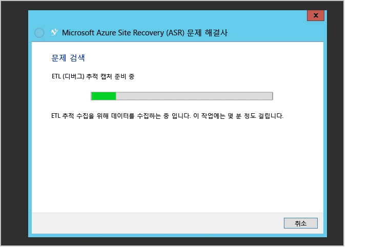

# 가상 컴퓨터 및 물리적 서버를 위한 보호 모니터링 및 문제 해결
이 모니터링 및 문제 해결 가이드를 사용하면 복제 상태를 추적하는 방법 및 Azure Site Recovery에 대한 문제해결 기술에 대해 배울 수 있습니다.

## 구성 요소 이해
### 온-프레미스와 Azure 간 복제를 위한 VMware 가상 컴퓨터 또는 물리적 서버 사이트 배포
온-프레미스 VMware 가상 컴퓨터 또는 물리적 서버와 Azure 간 데이터베이스 복구를 설정하려면 가상 컴퓨터 또는 서버에서 구성 서버, 마스터 대상 서버 및 프로세스 서버 구성 요소를 설정해야 합니다. 원본 서버에 대한 보호를 사용하도록 설정하면 최신 버전이 아직 배포되지 않은 경우 Azure Site Recovery는 선택된 프로세스 서버에서 모바일 서비스를 설치합니다. 온-프레미스 중단이 발생한 후 및 원본 서버가 Azure에 장애 조치된 후 고객들은 Azure 및 마스터 대상 서버 온-프레미스에서 프로세스 서버를 설정하여 원본 서버 온-프레미스를 다시 빌드해야 합니다.

### 온-프레미스 사이트 간 복제를 위한 가상 컴퓨터 관리자 사이트 배포
두 온-프레미스 위치 간에 데이터베이스 복구를 설정하려면 Azure Site Recovery 공급자를 다운로드하고 가상 컴퓨터 관리자 서버에 설치해야 합니다. 공급자에는 Azure Portal에서 트리거되는 모든 작업이 온-프레미스 작업으로 변환되는지 확인하기 위해 인터넷 연결이 필요합니다.

### 온-프레미스 위치와 Azure 간 복제를 위한 가상 컴퓨터 관리자 사이트 배포
온-프레미스 위치 및 Azure 간에 데이터베이스 복구를 설정할 때 Azure Site Recovery 공급자를 다운로드하고 가상 컴퓨터 관리자 서버에 설치해야 합니다. 또한 각 Hyper-V 호스트에 설치해야 하는 Azure Recovery Services 에이전트를 설치해야 합니다. 자세한 내용은 [자세히 알아보기](site-recovery-hyper-v-azure-architecture.md)를 참조하세요.

### 온-프레미스 위치와 Azure 간 복제를 위한 Hyper-V 사이트 배포
이 프로세스는 가상 컴퓨터 관리자 배포와 비슷합니다. Hyper-V 호스트 자체에 Azure Site Recovery 공급자 및 Azure Recovery Services 에이전트가 설치된다는 것이 유일한 차이점입니다. [자세히 알아보기](site-recovery-hyper-v-azure-architecture.md). 등 4가지 유형의 클러스터가 제공됩니다.

## 구성, 보호 및 복구 작업 모니터링
Azure Site Recovery에서 모든 작업이 감사되며 **작업** 탭 아래에서 추적됩니다. 모든 구성, 보호 또는 복구 오류는 **작업** 탭으로 이동하고 오류를 찾아보십시오.

**작업** 탭에서 오류를 찾는 경우 해당 작업을 선택하고 해당 작업에 대한 **오류 세부 정보**를 클릭합니다.

오류 세부 정보는 해당 문제에 대한 가능한 원인 및 권장 사항을 식별해줍니다.

앞의 예제에서 진행 중인 다른 작업이 보호 구성 실패를 일으키는 것 같아 보입니다. 권장 사항에 따라 문제를 해결한 다음, **다시 시작**을 클릭하여 작업을 다시 시작합니다.

**다시 시작** 옵션은 모든 작업에 대해 사용할 수 없습니다. 작업에 **다시 시작** 옵션이 없는 경우 해당 개체로 이동하고 작업을 다시 실행합니다. **취소** 단추를 사용하여 진행 중인 모든 작업을 취소할 수 있습니다.

## 가상 컴퓨터에 대한 복제 상태 모니터링
Azure Portal을 사용하여 보호된 각 엔터티에 대한 Azure Site Recovery 공급자를 원격으로 모니터링할 수 있습니다. **보호된 항목**을 클릭한 다음 **VMM 클라우드** 또는 **보호 그룹**을 클릭합니다. **VMM 클라우드** 탭은 가상 컴퓨터 관리자에 기반하는 배포에만 사용할 수 있습니다. 다른 시나리오의 경우 보호된 엔터티는 **보호 그룹** 탭 아래에 있습니다.

해당 클라우드 또는 보호 그룹 아래의 보호된 엔터티를 클릭하여 아래쪽 창에 표시되는 사용 가능한 모든 작업을 봅니다.

이전 스크린샷에 표시된 것과 같이 가상 컴퓨터 상태는 **위험**입니다. 아래쪽의 **오류 세부 정보** 단추를 클릭하여 오류를 볼 수 있습니다. **가능한 원인** 및 **권장 사항**을 기반으로 하여 문제를 해결합니다.

> [!NOTE]
> 진행 중이거나 실패한 활성 작업이 있는 경우 앞서 언급한 대로 **작업** 보기로 이동하여 특정 작업에 대한 오류를 확인합니다.
>
>

## 온-프레미스 Hyper-V 문제 해결
온-프레미스 Hyper-V 관리자 콘솔에 연결하고 가상 컴퓨터를 선택하고 복제 상태를 확인합니다.

이 경우 **복제 상태**는 **위험**입니다. 가상 컴퓨터를 마우스 오른쪽 단추로 클릭한 다음 **복제** > **복제 상태 보기**를 클릭하여 세부 정보를 표시합니다.

가상 컴퓨터에 대한 복제가 일시 중지하는 경우 가상 컴퓨터를 마우스 오른쪽 단추로 클릭한 다음 **복제** > **복제 다시 시작**을 클릭합니다.

가상 컴퓨터가 클러스터 또는 독립 실행형 컴퓨터 내의 새 Hyper-V 호스트를 마이그레이션하고 Hyper-V 호스트가 Azure Site Recovery를 통해 구성된 경우 가상 컴퓨터에 대한 복제는 영향을 받지 않습니다. 새 Hyper-V 호스트가 모든 요구를 충족하고 Azure Site Recovery를 사용하여 구성되었는지 확인합니다.

### 이벤트 로그
| 이벤트 원본 | 세부 정보 |
| --- |:--- |
| **응용 프로그램 및 서비스 로그/Microsoft/VirtualMachineManager/Server/Admin**(가상 컴퓨터 관리자 서버) |여러 다양한 가상 컴퓨터 관리자 문제를 해결하는 데 유용한 로깅을 제공합니다. |
| **응용 프로그램 및 서비스 로그/MicrosoftAzureRecoveryServices/Replication**(Hyper-V 호스트) |다양한 Microsoft Azure Recovery Services 에이전트 문제를 해결하는 데 유용한 로깅을 제공합니다.    |
| **응용 프로그램 및 서비스 로그/Microsoft/Azure Site Recovery/Provider/Operational**(Hyper-V 호스트) |다양한 Microsoft Azure Site Recovery 서비스 문제를 해결하는 데 유용한 로깅을 제공합니다.    |
| **응용 프로그램 및 서비스 로그/Microsoft/Windows/Hyper-V-VMMS/Admin**(Hyper-V 호스트) |다양한 Hyper-V 가상 컴퓨터 관리 문제를 해결하는 데 유용한 로깅을 제공합니다.    |

### Hyper-V 복제 로깅 옵션
Hyper-V 복제본에 관련된 모든 이벤트는 응용 프로그램 및 서비스 로그\\Microsoft\\Windows에 있는 Hyper-V-VMMS\\Admin에 기록됩니다. 또한 Hyper-V 가상 컴퓨터 관리 서비스에 대한 분석 로그를 사용할 수 있습니다. 이 로그를 사용하려면 먼저 이벤트 뷰어에서 분석 및 디버그 로그를 볼 수 있게 만드세요. 이벤트 뷰어를 연 다음 **보기** > **분석 및 디버그 로그 표시**를 클릭합니다.

분석 로그가 **Hyper-V-VMMS** 아래에 표시됩니다.

**작업** 창에서 **로그 사용**을 클릭합니다. 그러면 **성능 모니터**에서 **데이터 수집기 집합**에 있는 **이벤트 추적 세션**으로 나타납니다.

수집된 정보를 보려면 먼저 로그를 사용하지 않도록 설정하여 추적 세션을 중지합니다. 로그를 저장하고 다시 이벤트 뷰어에서 열거나 다른 도구를 사용하여 원하는 대로 변환합니다.

## Microsoft 지원을 위한 연락
### 로그 수집
가상 컴퓨터 관리자 사이트 보호에 대해서는 [지원 진단 플랫폼(SDP) 도구를 사용한 Azure Site Recovery 로그 수집](http://social.technet.microsoft.com/wiki/contents/articles/28198.asr-data-collection-and-analysis-using-the-vmm-support-diagnostics-platform-sdp-tool.aspx)을 참조하여 필요한 로그를 수집합니다.

Hyper-V 사이트 보호의 경우에는 [도구](https://dcupload.microsoft.com/tools/win7files/DIAG_ASRHyperV_global.DiagCab)를 다운로드하고 Hyper-V 호스트에서 실행하여 로그를 수집합니다.

VMware/물리적 서버 시나리오의 경우에는 [VMware 및 실제 사이트 보호를 위한 Azure Site Recovery 로그 수집](http://social.technet.microsoft.com/wiki/contents/articles/30677.azure-site-recovery-log-collection-for-vmware-and-physical-site-protection.aspx)을 참조하여 필요한 로그를 수집합니다.

도구는 %LocalAppData%\ElevatedDiagnostics의 임의로 이름이 지정된 하위 폴더에 로그를 로컬로 수집합니다.

### 지원 티켓 열기
Azure Site Recovery에 대한 지원 티켓을 모으려면 URL(<http://aka.ms/getazuresupport>)을 사용하여 Azure 지원에 연락하세요.

## 기술 자료 문서
* [장애 조치 또는 Azure로 마이그레이션된 보호된 가상 컴퓨터에 대한 드라이브 문자를 유지하는 방법](http://support.microsoft.com/kb/3031135)
* [Azure 보호 네트워크 대역폭 사용에 대한 온-프레미스 관리 방법](https://support.microsoft.com/kb/3056159)
* [Azure Site Recovery: 가상 컴퓨터에 대한 보호를 사용하도록 설정하려고 할 때 "클러스터 리소스를 찾을 수 없습니다." 오류](http://support.microsoft.com/kb/3010979)
* [Hyper-V 복제 이해 및 문제 해결 가이드](http://social.technet.microsoft.com/wiki/contents/articles/21948.hyper-v-replica-troubleshooting-guide.aspx)

## 일반적인 Azure Site Recovery 오류 및 해결 방법
다음은 일반적 오류 및 해결 방법입니다. 각 오류는 개별 wiki 페이지에 설명되어 있습니다.

### 일반
* 신규 [작업이 실패하고 "작업이 진행 중입니다." 오류가 표시됩니다. 오류 505, 514, 532.](http://social.technet.microsoft.com/wiki/contents/articles/32190.azure-site-recovery-jobs-failing-with-error-an-operation-is-in-progress-error-505-514-532.aspx)
* 신규 [작업이 실패하고 "서버가 인터넷에 연결되어 있지 않습니다." 오류가 표시됩니다. 오류 25018.](http://social.technet.microsoft.com/wiki/contents/articles/32192.azure-site-recovery-jobs-failing-with-error-server-isn-t-connected-to-the-internet-error-25018.aspx)

### 설정
* [내부 오류로 인해 가상 컴퓨터 관리자 서버를 등록할 수 없습니다. 오류에 대한 자세한 내용은 Site Recovery 포털에서 작업 보기를 참조하세요. 다시 설정을 실행하여 서버를 등록합니다.](http://social.technet.microsoft.com/wiki/contents/articles/25570.the-vmm-server-cannot-be-registered-due-to-an-internal-error-please-refer-to-the-jobs-view-in-the-site-recovery-portal-for-more-details-on-the-error-run-setup-again-to-register-the-server.aspx)
* [Hyper-V Recovery Manager 자격 증명 모음에 연결할 수 없습니다. 프록시 설정을 확인하거나 나중에 다시 시도하세요.](http://social.technet.microsoft.com/wiki/contents/articles/25571.a-connection-cant-be-established-to-the-hyper-v-recovery-manager-vault-verify-the-proxy-settings-or-try-again-later.aspx)

### 구성
* [보호 그룹을 만들 수 없습니다. 서버 목록을 검색하는 동안 오류가 발생했습니다.](http://blogs.technet.com/b/somaning/archive/2015/08/12/unable-to-create-the-protection-group-in-azure-site-recovery-portal.aspx)
* [Hyper-V 호스트 클러스터에는 하나 이상의 정적 네트워크 어댑터가 있습니다. 그렇지 않을 경우 연결된 어댑터 중 DHCP를 사용하도록 구성된 어댑터가 없는 것입니다.](http://social.technet.microsoft.com/wiki/contents/articles/25498.hyper-v-host-cluster-contains-at-least-one-static-network-adapter-or-no-connected-adapters-are-configured-to-use-dhcp.aspx)
* [가상 컴퓨터 관리자에는 작업을 완료할 수 있는 권한이 없습니다.](http://social.technet.microsoft.com/wiki/contents/articles/31110.vmm-does-not-have-permissions-to-complete-an-action.aspx)
* [보호를 구성하는 동안 구독 내에서 저장소 계정을 선택할 수 없습니다.](http://social.technet.microsoft.com/wiki/contents/articles/32027.can-t-select-the-storage-account-within-the-subscription-while-configuring-protection.aspx)

### 보호
* 신규 [보호를 사용하도록 설정하지 못했으며 "가상 컴퓨터에 대해 보호를 구성할 수 없습니다." 오류가 표시됩니다. 오류 60007, 40003.](http://social.technet.microsoft.com/wiki/contents/articles/32194.azure-site-recovery-enable-protection-failing-with-error-protection-couldn-t-be-configured-for-the-virtual-machine-error-60007-40003.aspx)
* 신규 [보호를 사용하도록 설정하지 못했으며 "가상 컴퓨터에 대해 보호를 사용하도록 설정할 수 없습니다." 오류가 표시됩니다. 오류 70094.](http://social.technet.microsoft.com/wiki/contents/articles/32195.azure-site-recovery-enable-protection-failing-with-error-protection-couldn-t-be-enabled-for-the-virtual-machine-error-70094.aspx)
* 신규 [실시간 마이그레이션 오류 23848 - 가상 컴퓨터가 실시간 유형을 사용하여 이동됩니다. 가상 컴퓨터의 복구 보호 상태를 손상시킬 수 있습니다.](http://social.technet.microsoft.com/wiki/contents/articles/32021.live-migration-error-23848-the-virtual-machine-is-going-to-be-moved-using-type-live-this-could-break-the-recovery-protection-status-of-the-virtual-machine.aspx)
* [호스트 컴퓨터에 에이전트가 설치되어 있지 않아 보호를 사용하도록 설정하지 못했습니다.](http://social.technet.microsoft.com/wiki/contents/articles/31105.enable-protection-failed-since-agent-not-installed-on-host-machine.aspx)
* [계산 리소스가 부족하여 복제 가상 컴퓨터의 적절한 호스트를 찾을 수 없습니다.](http://social.technet.microsoft.com/wiki/contents/articles/25501.a-suitable-host-for-the-replica-virtual-machine-can-t-be-found-due-to-low-compute-resources.aspx)
* [논리 네트워크가 연결되어 있지 않아 복제 가상 컴퓨터의 적절한 호스트를 찾을 수 없습니다.](http://social.technet.microsoft.com/wiki/contents/articles/25502.a-suitable-host-for-the-replica-virtual-machine-can-t-be-found-due-to-no-logical-network-attached.aspx)
* [복제 호스트 컴퓨터에 연결할 수 없습니다. 연결하지 못했습니다.](http://social.technet.microsoft.com/wiki/contents/articles/31106.cannot-connect-to-the-replica-host-machine-connection-could-not-be-established.aspx)

### 복구
* 가상 컴퓨터 관리자에서 호스트 작업을 완료할 수 없습니다.
  * [가상 컴퓨터에 대해 선택된 복제 지점으로 장애 조치(Failover): 일반 액세스 거부 오류.](http://social.technet.microsoft.com/wiki/contents/articles/25504.fail-over-to-the-selected-recovery-point-for-virtual-machine-general-access-denied-error.aspx)
  * [Hyper-V가 가상 컴퓨터에 대해 선택된 복구 지점으로 장애 조치(failover)하지 못했습니다. 작업이 중단되었습니다.  최근 복구 지점을 사용하세요. (0x80004004).](http://social.technet.microsoft.com/wiki/contents/articles/25503.hyper-v-failed-to-fail-over-to-the-selected-recovery-point-for-virtual-machine-operation-aborted-try-a-more-recent-recovery-point-0x80004004.aspx)
  * 서버와 연결할 수 없습니다(0x00002EFD).
    * [Hyper-V가 가상 컴퓨터에 대한 역방향 복제를 사용하도록 설정하지 못했습니다.](http://social.technet.microsoft.com/wiki/contents/articles/25505.a-connection-with-the-server-could-not-be-established-0x00002efd-hyper-v-failed-to-enable-reverse-replication-for-virtual-machine.aspx)
    * [Hyper-V가 가상 컴퓨터에 대한 복제를 사용하도록 설정하지 못했습니다.](http://social.technet.microsoft.com/wiki/contents/articles/25506.a-connection-with-the-server-could-not-be-established-0x00002efd-hyper-v-failed-to-enable-replication-for-virtual-machine-virtual-machine.aspx)
  * [가상 컴퓨터에 장애 조치를 커밋하지 못했습니다.](http://social.technet.microsoft.com/wiki/contents/articles/25508.could-not-commit-failover-for-virtual-machine.aspx)
* [복구 계획에 계획된 장애 조치를 실행할 수 없는 가상 컴퓨터가 포함되어 있습니다.](http://social.technet.microsoft.com/wiki/contents/articles/25509.the-recovery-plan-contains-virtual-machines-which-are-not-ready-for-planned-failover.aspx)
* [가상 컴퓨터에 계획된 장애 조치(Failover)를 실행할 수 없습니다.](http://social.technet.microsoft.com/wiki/contents/articles/25507.the-virtual-machine-isn-t-ready-for-planned-failover.aspx)
* [가상 컴퓨터가 실행되고 있지 않으며 전원이 꺼져 있습니다.](http://social.technet.microsoft.com/wiki/contents/articles/25510.virtual-machine-is-not-running-and-is-not-powered-off.aspx)
* [가상 컴퓨터에 대역 외 작업이 발생하고 장애 조치(failover)를 커밋하지 못했습니다.](http://social.technet.microsoft.com/wiki/contents/articles/25507.the-virtual-machine-isn-t-ready-for-planned-failover.aspx)
* 테스트 장애 조치(Failover)
  * [테스트 장애 조치(Failover)가 진행 중이므로 장애 조치(Failover)를 시작할 수 없습니다.](http://social.technet.microsoft.com/wiki/contents/articles/31111.failover-could-not-be-initiated-since-test-failover-is-in-progress.aspx)
* 새로 만들기 컴퓨터가 속한 Virtual Machine 또는 서브넷과 연결된 네트워크 보안 그룹의 구성 설정으로 인해 'PreFailoverWorkflow 태스크 WaitForScriptExecutionTaskTimeout'으로 장애 조치의 시간이 초과되었습니다. 자세한 내용은 ['PreFailoverWorkflow 작업 WaitForScriptExecutionTaskTimeout'](https://aka.ms/troubleshoot-nsg-issue-azure-site-recovery)을 참조하세요.

### 구성 서버, 프로세스 서버, 마스터 대상
* [PS/CS가 VM으로 호스팅된 ESXi 호스트가 실패하고 퍼플 스크린이 표시되었습니다.](http://social.technet.microsoft.com/wiki/contents/articles/31107.vmware-esxi-host-experiences-a-purple-screen-of-death.aspx)

### 장애 조치(Failover) 후 원격 데스크톱 문제 해결
* 많은 고객이 Azure에서 장애 조치(Failover)된 가상 컴퓨터에 연결하는 데 문제에 직면합니다. [문제 해결 문서를 사용하여 가상 컴퓨터에 RDP를 연결합니다.](http://social.technet.microsoft.com/wiki/contents/articles/31666.troubleshooting-remote-desktop-connection-after-failover-using-asr.aspx)

#### 리소스 관리자 가상 컴퓨터에 공용 IP 추가
포털에서 **연결** 단추가 흐리게 표시되고 Express 경로 또는 사이트 간 VPN 연결을 통해 Azure에 연결되지 않는 경우 원격 데스크톱/공유 셸을 사용하려면 먼저 공용 IP 주소를 만들고 가상 컴퓨터에 할당해야 합니다. 그런 다음 가상 컴퓨터의 네트워크 인터페이스에 공용 IP를 추가할 수 있습니다.  

