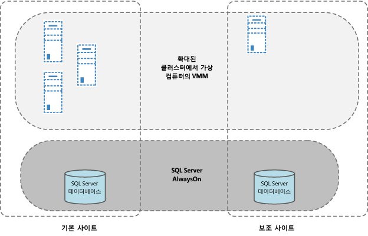
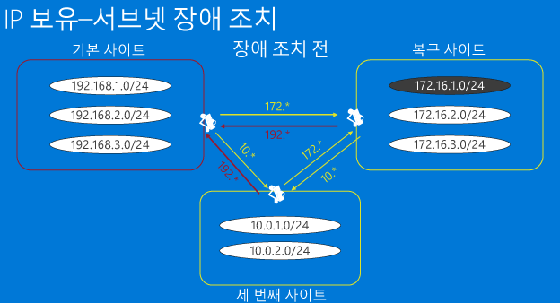
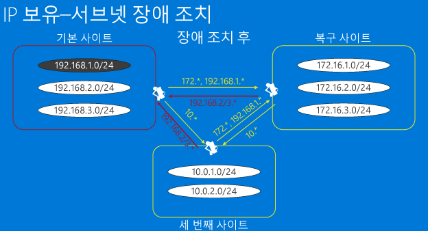
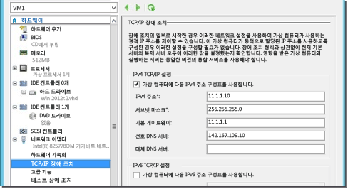
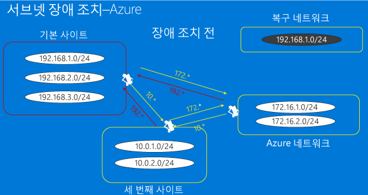
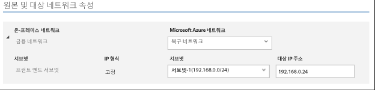
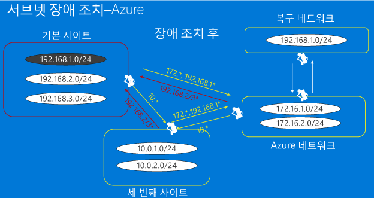
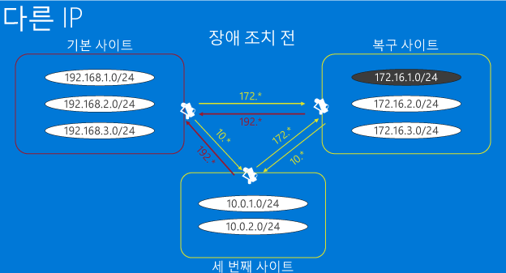
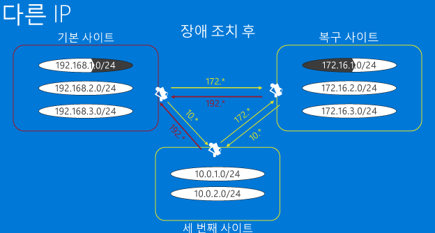

<properties
	pageTitle="Site Recovery를 위한 네트워크 인프라 고려 사항" 
	description="이 문서에서는 Site Recovery를 사용하여 장애 조치(failover)하기 위한 실제 네트워크 디자인 고려 사항을 알아봅니다." 
	services="site-recovery" 
	documentationCenter="" 
	authors="rayne-wiselman" 
	manager="jwhit" 
	editor=""/>

<tags 
	ms.service="site-recovery" 
	ms.devlang="na"
	ms.topic="get-started-article"
	ms.tgt_pltfrm="na"
	ms.workload="storage-backup-recovery" 
	ms.date="08/10/2015" 
	ms.author="raynew"/>

#  Site Recovery를 위한 네트워크 인프라 고려 사항

Azure Site Recovery 서비스는 Azure 또는 보조 온-프레미스 데이터 센터로 복제 및 장애 조치(failover)를 오케스트레이션 및 자동화하여 온-프레미스 물리적 서버 및 가상 컴퓨터를 보호하고 복구함으로써 강력한 BCDR(무중단 업무 방식 및 재해 복구) 솔루션에 기여합니다.

이 문서는 System Center VMM 및 Azure Site Recovery가 포함된 BCDR 솔루션 및 인프라의 설계, 구현 및 지원을 담당하는 가상화 팀을 대상으로 합니다.

## 개요

BCDR 전략의 목적은 비즈니스 응용 프로그램이 계속 실행되도록 하고, 실패한 작업 및 서비스를 복원하여 조직이 신속하게 정상 작업을 재개할 수 있도록 하는 것입니다. 재해 복구 전략 개발이 어려운 이유는 예상치 못한 이벤트를 예측해야 하는 본질적인 어려움과 광범위한 오류에 대해 적절한 보호를 구현하는 데 드는 높은 비용 때문입니다. Azure Site Recovery를 사용하면 처음에 주 데이터를 복사(복제)한 다음 주기적으로 복제본을 새로 고침으로써 보호를 구현하고 주 데이터 센터에서 보조 데이터 센터(또는 Azure)로 장애 조치(failover)할 수 있습니다.

BCDR 계획에서 가능한 빨리(낮은 RTO) 최소한의 데이터 손실(낮은 RPO)로 조직의 데이터를 온라인으로 다시 가져올 수 있도록 RTO(복구 시간 목표)와 RPO(복구 지점 목표)를 정의하는 것이 중요합니다. 조직의 네트워크 디자인은 RTO 및 RPO 목표에 문제가 될 수 있으므로 디자인 계획을 잘 세워야 이러한 문제를 방지할 수 있습니다.

보호 및 장애 조치(failover)를 구현하기 위해 Azure Site Recovery 서비스를 사용하기로 결정한 경우 BCDR을 위한 네트워크 디자인에 다음과 같은 몇 가지 중요한 문제가 있습니다.

- **VMM 디자인**: System Center VMM을 사용하고 있습니다. VMM과 Site Recovery를 통합하기 위해 네트워크 디자인을 어떻게 처리해야 하나요?
- **장애 조치(failover) 후 연결**: Site Recovery를 사용하여 장애 조치(failover)를 실행하고 있습니다. 장애 조치(failover)가 완료된 후 내 응용 프로그램 및 작업이 사용할 수 있고 접근할 수 있는지 어떻게 확신할 수 있나요?

## VMM 디자인

기존 VMM 디자인이 단일 VMM 서버를 사용하는지 또는 다중 VMM 서버를 사용하는지 관계 없이 해당 VMM 디자인 위에 Site Recovery를 계층화할 수 있습니다.

### 독립 실행형 VMM 서버

이 토폴로지에서는 VMM 서버를 주 사이트의 가상 컴퓨터에 배포하고 이 가상 컴퓨터를 Site Recovery 및 Hyper-V 복제본을 사용하여 보조 사이트로 복제합니다. VM은 하나만 인스턴스화되어야 하기 때문에 동일한 가상 컴퓨터에 VMM 서버와 이 서버를 지원하는 SQL Server를 설치해서 가동 중지 시간을 줄이는 것을 고려해 볼 수 있습니다. VMM 서비스가 원격 SQL Server를 사용하는 경우 VMM 서버를 복구하기 전에 SQL Server 인스턴스를 복구해야 합니다.

Hyper-V 복제본을 사용하여 VM에 단일 VMM을 배포하려면:

1. SQL Server가 설치되어 있는 VM에 VMM을 설치합니다.
2. 관리할 호스트를 이 VMM 서버의 클라우드에 추가합니다.
3. Azure 포털에 로그인한 다음 보호하도록 클라우드를 구성합니다.
4. VMM 서버로 보호해야 할 모든 VM에 대해 복제를 사용하도록 설정합니다.
5. Hyper-V 관리 콘솔로 이동하고 Hyper-V 복제본을 선택한 다음 VMM VM에서 복제를 사용하도록 설정합니다.
6. Hyper-V 복제 설정이 ASR에 의해 재정의되지 않도록 VMM VM이 ASR 서비스로 보호되는 클라우드에 추가되지 않도록 합니다.

재해가 발생할 경우 다음과 같이 작업을 복구할 수 있습니다.

1. Hyper-V 관리자를 사용하여 복제본 VMM VM 을 복구 사이트에 장애 조치(failover)합니다.
2. VMM VM이 복구된 후 사용자는 보조 사이트에서 Hyper-V 복구 관리자에 로그인할 수 있습니다.
3. 계획되지 않은 장애 조치(failover)가 완료된 후 사용자는 주 사이트의 모든 리소스에 액세스할 수 있습니다.
4. 작업을 장애 조치(failover)하려면 먼저 VMM VM을 수동으로 보조 사이트에 장애 조치(failover)해야 합니다. 

### 클러스터된 VMM 서버

[클러스터에 VMM을 배포](https://technet.microsoft.com/ko-KR/library/gg610675.aspx)하면 하드웨어 장애 조치(failover)에 대해 고가용성 및 보호를 제공합니다. Site Recovery를 사용하여 VMM 클러스터를 배포하는 경우 다음 사항에 유의합니다.

지리적으로 떨어져 있는 사이트에서는 VMM 서버가 늘어난(stretched) 클러스터에 배포되어야 합니다. VMM에서 사용하는 SQL Server 데이터베이스는 보조 사이트에서 복제를 통해 SQL Server AlwaysOn 가용성 그룹과 함께 보호되어야 합니다. 재해가 VMM 서버에서 발생하는 경우 그에 해당하는 SQL Server가 자동으로 복구 사이트에 장애 조치(failover)됩니다. 그런 다음 Site Recovery를 사용하여 작업을 장애 조치(failover)할 수 있습니다.

## 장애 조치(failover) 후 연결

최신 응용 프로그램은 거의 항상 어느 정도 네트워킹에 종속되어 있으므로 한 사이트에서 다른 사이트로 물리적으로 서비스를 이동하면 장애 조치(failover) 이후 응용 프로그램 및 작업에 접근할 수 있는지에 대한 네트워킹 문제가 발생합니다. 이 문제에 대한 두 가지 주요 솔루션이 있습니다.

- **고정 IP 주소**: 첫 번째 방법은 고정 IP 주소를 유지 관리하는 것입니다. 비록 서로 다른 물리적 위치에서 서비스가 이동하고 호스팅 서버가 존재하기는 하지만 응용 프로그램이 IP 주소 구성을 새 위치로 함께 가지고 갑니다.
- **수정된 IP 주소**: 두 번째 방법을 사용하려면 복구된 사이트로 전환하는 동안 IP 주소를 변경해야 합니다. 

### 옵션 1: 고정 IP 주소

재해 복구 관점에서는 고정 IP 주소를 사용하는 것이 가장 쉽게 구현할 수 있는 방법으로 보입니다. 그러나 많은 잠재적인 문제점 때문에 실제로는 가장 인기 없는 방법입니다. Azure Site Recovery는 모든 시나리오에서 IP 주소를 유지하는 기능을 제공합니다. 이 방법을 사용하기 전에 주요 시나리오(늘어난 서브넷 및 서브넷 장애 조치(failover))를 위한 고려 사항을 먼저 살펴보겠습니다.

#### 늘어난 서브넷

늘어난 서브넷에서 서브넷을 주 위치와 대상 위치 두 곳에서 동시에 사용할 수 있습니다. 간단히 말해 서버와 해당 IP(계층 3) 구성을 보조 사이트로 이동할 수 있고 네트워크가 트래픽을 자동으로 새 위치에 라우팅한다는 것입니다. 서버 관점에서는 이것을 간단히 처리할 수 있지만 실제로는 많은 문제점이 있습니다.

- 계층 2(데이터 링크 계층) 관점에서 이를 수행하려면, 현재 널리 사용되고 있기는 하지만 늘어난 VLAN을 관리할 수 있는 네트워킹 장비가 필요합니다.
- 두 번째로 더 어려운 문제는 VLAN을 늘림으로써 잠재적 장애 도메인이 이 두 사이트에 확장되어 본질적으로 단일 오류 지점이 된다는 것입니다. 가능성이 별로 없기는 하지만 브로드캐스트 스톰이 시작해서 격리되지 못할 수도 있습니다. 이 문제의 경우 성공적인 구현부터 “절대 불가”까지 의견이 분분합니다.
- DR 사이트인 Azure에 장애 조치(failover)하는 경우 늘어난 서브넷이 가능하지 않습니다.

#### 서브넷 장애 조치(failover)

실제로 서브넷을 늘리지 않고 늘어난 서브넷의 이점을 얻기 위해 서브넷 장애 조치(failover)를 구현할 수 있습니다. 이 구성에서, 지정된 서브넷은 사이트 1 또는 사이트 2에 있으며 두 사이트에 동시에 존재하지는 않습니다. 장애 조치(failover) 시 IP 주소 공간을 유지 관리하기 위해 라우터 인프라에 대해 프로그래밍 방식으로 정렬하여 한 사이트에서 다른 사이트로 서브넷을 이동할 수 있습니다. 장애 조치(failover) 시나리오에서 서브넷은 연결되어 있는 보호된 VM과 함께 이동합니다. 이 방법의 주요 단점은 오류 발생 시 전체 서브넷을 이동해야 하는 것으로, 이는 합리적인 솔루션일 수 있지만 장애 조치(failover)의 세부적인 고려 사항에 영향을 미칠 수 있습니다.

가상의 기업(Contoso)이 전체 서브넷을 장애 조치(failover)하면서 해당 VM을 복구 위치에 복제할 수 있는 방법을 살펴보겠습니다. 두 개의 온-프레미스 위치 사이에 VM을 복제하는 동안 Contoso가 해당 서브넷을 관리할 수 있는 방법을 살펴보고 Azure가 재해 복구 사이트로 사용될 때 서브넷 장애 조치(failover)가 작동하는 방식을 설명하겠습니다.

##### 예 - 기업에서 서브넷 장애 조치(failover)
 
- 주 사이트에 서브넷 192.168.1.0/24에서 실행되는 응용 프로그램이 있습니다.
- 전체 서브넷이 장애 조치(failover)되고, 서브넷의 모든 가상 컴퓨터가 복구 사이트로 장애 조치(failover)되어 해당 IP 주소를 유지합니다.
- 아래 다이어그램에 나와 있는 것처럼 주 사이트와 복구 사이트 간, 세 번째 사이트와 주 사이트 간, 세 번째 사이트와 복구 사이트 간의 라우팅이 서브넷 192.168.1.0/24에 속한 모든 가상 컴퓨터가 복구 사이트로 이동되었다는 사실을 반영하도록 적절히 수정되어야 합니다.
- 이 다이어그램은 다음을 가정합니다.
	-  VMM의 자체 인스턴스에서 각 데이터 센터를 서비스합니다. 데이터 센터 간에는 System Center VMM 데이터베이스의 복제가 없습니다.
	-  각 데이터 센터는 가상 컴퓨터의 고정 IP 주소를 사용합니다.
	-  데이터 센터 간의 연결은 인터넷을 통한 VPN 연결이 아닌 전용 회로를 통해 이루어집니다.

**장애 조치(failover) 전**

**장애 조치(failover) 후**

특정 가상 컴퓨터에 대한 보호를 사용하도록 설정하는 경우 Site Recovery가 다음과 같이 네트워킹 리소스를 할당합니다.

1. Site Recovery가 각 VMM 인스턴스에 대한 관련 네트워크에 정의된 고정 IP 주소 풀에서 가상 컴퓨터의 각 네트워크 인터페이스에 대한 IP 주소를 할당합니다.
2. 관리자가 복구 사이트의 네트워크에 대해 주 사이트에서 사용한 것과 동일한 IP 주소 풀을 정의하면 Site Recovery가 주 가상 컴퓨터에 할당된 주소와 동일한 IP 주소를 복제 가상 컴퓨터에 할당합니다. IP 주소가 VMM에서 예약되기는 하지만 장애 조치(failover) IP 주소로 설정되지는 않습니다. 장애 조치(failover) IP 주소는 장애 조치(failover)하기 직전에 설정됩니다. 이 스크린샷은 Hyper-V 콘솔에서 복제 가상 컴퓨터에 대한 장애 조치(failover) TCP/IP 설정을 보여 줍니다. 이러한 설정은 가상 컴퓨터에 대한 장애 조치(failover)가 시작되기 직전에 복제됩니다.

	

3. 동일한 IP 주소를 사용할 수 없는 경우 Site Recovery가 풀에서 다른 주소를 할당합니다.
4. 보호를 위해 가상 컴퓨터를 사용하도록 설정한 후 다음 샘플 스크립트를 사용하여 가상 컴퓨터에 할당된 IP 주소를 확인할 수 있습니다. 동일한 IP 주소가 장애 조치(failover) IP 주소로 설정되고 장애 조치(failover) 시 VM에 할당됩니다.

    $vm = Get-SCVirtualMachine -Name $na = $vm[0].VirtualNetworkAdapters $ip = Get-SCIPAddress -GrantToObjectID $na[0].id $ip.address

가상 컴퓨터가 DHCP를 사용하는 경우 Site Recovery에서 IP 주소 관리를 처리하지 않습니다. 복구 사이트에서 IP 주소를 할당하는 DHCP 서버가 주 사이트의 범위와 동일한 범위에서 주소를 할당할 수 있도록 해야 합니다.

##### 예 - Azure로 서브넷 장애 조치(failover)

Azure에 장애 조치(failover)하는 경우 몇 가지 제약 조건이 있습니다. 온-프레미스 인프라가 해당 사업 분야 응용 프로그램을 호스트하고 Azure가 해당 모바일 응용 프로그램을 호스트하는 가상의 회사(Woodgrove Bank)를 살펴보겠습니다.

- Azure와 온-프레미스 서버에서 Woodgrove Bank VM 간의 연결은 Azure의 가상 네트워크와 Woodgrove Bank의 온-프레미스 네트워크의 확장을 보여 주는 사이트 간 VPN을 통해 이루어집니다. 
- Woodgrove는 Site Recovery를 사용하여 해당 온-프레미스 작업을 Azure에 복제하려고 합니다. 
- Woodgrove는 하드 코드된 IP 주소에 종속된 응용 프로그램 및 구성을 다루어야 하므로 Azure로 장애 조치(failover)한 이후 해당 응용 프로그램의 IP 주소를 유지해야 합니다.
- Woodgrove의 온-프레미스 인프라는 VMM 2012 R2 서버에서 관리됩니다.
- VMM 서버에 만들어진 VLAN 기반 논리 네트워크(응용 프로그램 네트워크)가 있습니다.
- 논리 네트워크를 사용하여 VM 네트워크(응용 프로그램 VM 네트워크)가 만들어졌습니다. 
- 응용 프로그램의 모든 가상 컴퓨터는 고정 IP 주소를 사용하므로 고정 IP 풀도 논리 네트워크에 대해 정의되었습니다. 
- Woodgrove는 IP 주소 범위(172.16.1.0/24, 172.16.2.0/24)의 IP 주소를 Azure에서 실행 중인 해당 리소스에 할당합니다.

Woodgrove가 복제를 배포하고 IP 주소를 유지 관리하려면 다음이 필요합니다.

- 응용 프로그램이 원활하게 장애 조치(failover)할 수 있도록 온-프레미스 네트워크의 확장인 Azure 가상 컴퓨터
- Azure에서 사이트 간 연결을 설정하는 경우 Azure가 늘어난 서브넷을 지원하지 않기 때문에 IP 주소의 범위가 온-프레미스 IP 주소 범위와 다른 경우에만 Azure 네트워크를 통해 온-프레미스 위치(Azure에서는 로컬 네트워크라고 함)에 트래픽을 라우팅할 수 있습니다. 이는 온-프레미스에 서브넷 192.168.1.0/24가 있는 경우 Azure 네트워크에 로컬 네트워크 192.168.1.0/24를 추가할 수 없다는 것입니다. 이렇게 예측하는 이유는 Azure가 서브넷에 활성 VM이 없고 해당 서브넷이 DR 용도로만 만들어진다는 것을 모르기 때문입니다. Azure 네트워크 외부에서 제대로 네트워크 트래픽을 라우팅할 수 있으려면 네트워크 및 로컬 네트워크의 서브넷이 충돌하지 않아야 합니다. 
- 장애 조치(failover)된 VM이 만들어지는 Azure(복구 네트워크)에 추가 네트워크를 만들어야 합니다.

	

- VM에 대한 IP 주소가 유지되도록 하기 위해 Site Recovery의 VM 속성에서 동일한 IP 주소가 사용되도록 지정합니다. 그러면 장애 조치(failover) 후 Site Recovery가 지정된 IP 주소를 VM에 할당합니다. 

- 장애 조치(failover)가 트리거되고 VM이 필요한 IP 주소로 복구 네트워크에 만들어지면 이를 사용하여 VM에 대한 연결을 설정할 수 있습니다. 이 작업은 스크립팅할 수 있습니다. 이전 섹션에서 서브넷 장애 조치(failover)에 대해 설명한 것처럼 Azure로 장애 조치(failover)의 경우에도 라우팅이 해당 192.168.1.0/24가 현재 Azure로 이동했다는 것을 반영하도록 적절하게 수정되어야 합니다. 

### 옵션 2: 수정된 IP 주소

이 방법이 가장 일반적으로 보이며 이는 장애 조치(failover)되는 모든 VM의 IP 주소가 변경된다는 것입니다. 이 방법의 주요 단점은 네트워크 인프라가 IP 주소가 변경되었다는 점을 알아야 하고 DNS 항목이 네트워크 전체에서 변경되고 플러시되어야 하고 네트워크 테이블의 캐시된 항목도 변경되고 플러시되어야 한다는 점입니다. 이로 인해 DNS 인프라가 설정된 방법에 따라 가동 중지 시간이 발생할 수 있습니다. 이러한 문제는 인트라넷 응용 프로그램의 경우 낮은 TTL 값을 사용하고, 인터넷 기반 응용 프로그램의 경우 [Site Recovery와 함께 Azure 트래픽 관리자](http://azure.microsoft.com/blog/2015/03/03/reduce-rto-by-using-azure-traffic-manager-with-azure-site-recovery/)를 사용하면 완화할 수 있습니다.

#### 예 - 수정된 IP 주소

주 또는 복구 사이트에 호스트된 응용 프로그램이 액세스할 수 있는 세 번째 사이트가 있는 예를 사용하여 이 시나리오를 살펴보겠습니다.

- 일부 응용 프로그램이 주 사이트의 192.168.1.0/24 서브넷에 호스트되고 장애 조치(failover) 후 서브넷 172.16.1.0/24의 복구 사이트에서 실행되도록 구성되었습니다.
- 세 사이트 모두 서로 액세스할 수 있도록 VPN 연결/네트워크 라우팅이 적절하게 구성되었습니다. 
- 하나 이상의 응용 프로그램을 장애 조치(failover)한 후 해당 응용 프로그램이 복구 서브넷에서 복원됩니다. 이 경우 동시에 전체 서브넷을 장애 조치(failover)할 필요가 없으며 VPN 또는 네트워크 라우팅을 재구성하기 위해 변경할 사항이 없습니다.
- 장애 조치(failover) 및 일부 DNS 업데이트를 실행해도 응용 프로그램에 계속 액세스할 수 있습니다. DNS 서버가 동적 업데이트를 허용하도록 구성된 경우 장애 조치(failover) 후 가상 컴퓨터가 시작되면 새 IP 주소를 사용하여 자체적으로 등록합니다.

	

- 장애 조치(failover) 후 복제 가상 컴퓨터는 주 가상 컴퓨터의 IP 주소와 동일하지 않은 IP 주소를 가질 수 있습니다.
- 가상 컴퓨터가 시작되면 사용 중인 DNS 서버가 업데이트됩니다. DNS 항목은 일반적으로 네트워크 전체에서 변경되거나 플러시되어야 하고, 네트워크 테이블의 캐시된 항목도 업데이트되고 플러시되어야 하므로 이러한 상태가 변경되는 동안 가동 중지 시간이 발생하는 것은 흔한 일입니다. 이는 다음 방법으로 완화할 수 있습니다.

	- 인트라넷 응용 프로그램의 경우 낮은 TTL 값 사용
	- [Site Recovery와 함께 Azure 트래픽 관리자] 사용(http://azure.microsoft.com/blog/2015/03/03/reduce-rto-by-using-azure-traffic-manager-with-azure-site-recovery/ 인터넷 기반 응용 프로그램의 경우)
	- DNS 서버를 업데이트할 때 제 시간에 업데이트되도록 하기 위해 복구 계획 내에서 다음 스크립트 사용(동적 DNS 등록이 구성되지 않은 경우 스크립트가 필요하지 않음)

    [string]$Zone, [string]$name, [string]$IP ) $Record = Get-DnsServerResourceRecord -ZoneName $zone -Name $name $newrecord = $record.clone() $newrecord.RecordData[0].IPv4Address = $IP Set-DnsServerResourceRecord -zonename $zone -OldInputObject $record -NewInputObject $Newrecord

#### 예 - Azure로 장애 조치(failover)

재해 복구 사이트인 Azure에 대한 네트워킹 인프라 설정 [블로그 게시물](http://azure.microsoft.com/blog/2014/09/04/networking-infrastructure-setup-for-microsoft-azure-as-a-disaster-recovery-site/)은 IP 주소 유지가 요구 사항이 아닌 경우 필요한 Azure 네트워킹 인프라를 설정하는 방법을 설명합니다. 응용 프로그램 설명을 시작으로 온-프레미스 및 Azure에서 네트워킹을 설정하는 방법을 살펴봅니다. 마지막으로 테스트 장애 조치(failover) 및 계획된 장애 조치(failover)를 실행하기 위한 지침이 나옵니다.

## 다음 단계

Site Recovery가 원본 및 대상 네트워크를 매핑하는 방법을 [알아봅니다.](site-recovery-network-mapping.md)

<!---HONumber=Oct15_HO3-->