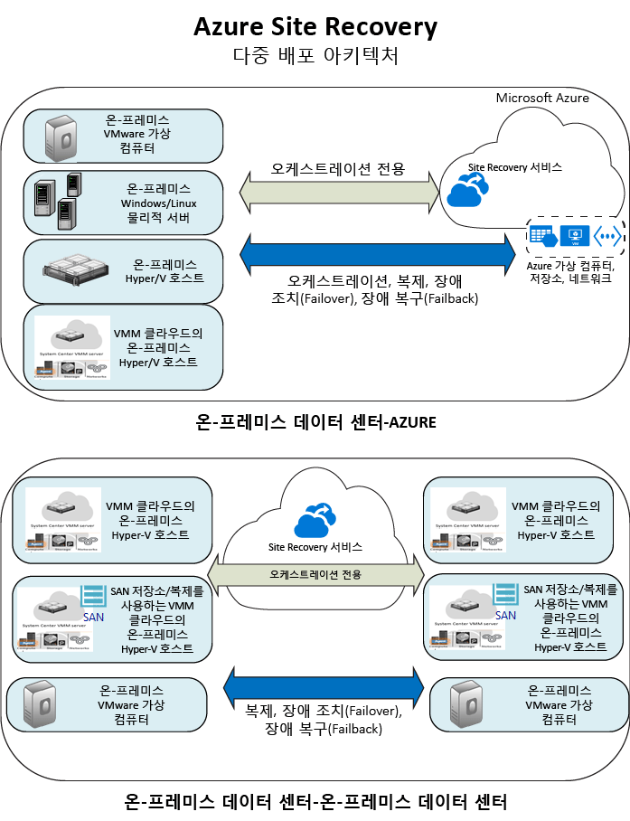

<properties
	pageTitle="사이트 복구란? | Microsoft Azure" 
	description="Azure Site Recovery 서비스의 개요를 제공하고 서비스를 배포할 수 방법을 설명합니다." 
	services="site-recovery" 
	documentationCenter="" 
	authors="rayne-wiselman" 
	manager="jwhit" 
	editor=""/>

<tags 
	ms.service="site-recovery" 
	ms.devlang="na"
	ms.topic="get-started-article"
	ms.tgt_pltfrm="na"
	ms.workload="storage-backup-recovery" 
	ms.date="02/22/2016" 
	ms.author="raynew"/>

#  사이트 복구란?

Azure Site Recovery를 시작합니다. 이 문서를 시작하여 사이트 복구 서비스의 빠른 개요 및 비즈니스 연속성 및 재해 복구(BCDR) 전략에 사용할 수 있는 방법을 확인합니다.

Azure에는 리소스를 만들고 작업하기 위한 두 가지 다양한 배포 모델이 있습니다. [리소스 관리자 및 클래식](../resource-manager-deployment-model.md) 이 문서는 두 모델 모두에 적용됩니다. 새로운 배포는 대부분 리소스 관리자 모델을 사용하는 것이 좋습니다.

## 개요

계획되거나 계획되지 않은 중단 상태가 발생하는 경우, 조직 BCDR 전략의 중요한 부분은 회사 워크로드 및 앱을 실행하도록 유지하는 방법을 알아내는 것입니다.

사이트 복구는 기본 위치가 중단되는 경우 보조 위치에서 사용할 수 있도록 워크로드 및 앱의 복제, 장애 조치 및 복구를 오케스트레이션하여 해당 작업을 수행합니다.

## 사이트 복구를 사용하는 이유는? 

비즈니스를 위해 수행할 수 있는 사이트 복구는 다음과 같습니다.

- **BCDR 전략 간소화**—사이트 복구를 사용하면 단일 위치에서 여러 비즈니스 워크로드 및 앱의 복제, 장애 조치 및 복구를 쉽게 처리할 수 있습니다. 사이트 복구는 복제 및 장애 조치를 오케스트레이션하지만 응용 프로그램 데이터를 가로채거나 이에 대한 정보를 포함하지 않습니다.
- **유연한 복제 제공**—사이트 복구를 사용하여 Hyper-V 가상 컴퓨터, VMware 가상 컴퓨터 및 Windows/Linux 물리적 서버에서 실행 중인 워크로드를 복제할 수 있습니다. 
- **쉬운 장애 조치 및 복구**—사이트 복구는 프로덕션 환경에 영향을 주지 않고 재해 복구 훈련을 지원하는 테스트 장애 조치를 제공합니다. 또한 예상된 중단에 대한 데이터 손실을 제거하고 계획된 장애 조치를 실행하거나 예기치 않은 재해에 대한 데이터 손상(복제 빈도에 따라 다름)을 최소화하고 계획되지 않은 장애 조치를 실행할 수 있습니다. 장애 조치 후에 기본 사이트를 장애 복구할 수 있습니다. 사이트 복구는 다중 계층 응용 프로그램의 장애 조치 및 복구를 사용자 지정할 수 있도록 스크립트와 Azure 자동화 통합 문서를 포함할 수 있는 복구 계획을 제공합니다. 
- **보조 데이터 센터 제거**—보조 온-프레미스 사이트 또는 Azure에 복제할 수 있습니다. 재해 복구에 대한 대상으로 Azure를 사용하면 제공하는 모든 복원력으로 보조 사이트를 유지 관리하는 비용 및 복잡성을 제거하고 복제된 데이터를 Azure 저장소에 저장합니다.
- **기존 BCDR 기술과 통합**—사이트 복구는 다른 응용 프로그램 BCDR 기능과 협력합니다. 예를 들어 사이트 복구를 사용하여 가용성 그룹의 장애 조치를 관리하는 AlwaysOn에 대한 SQL Server의 기본 지원을 비롯한 회사 워크로드의 SQL Server 백 엔드를 보호할 수 있습니다. 

## 무엇을 복제할 수 있습니까?

다음은 사이트 복구가 복제할 수 있는 항목의 요약입니다.

**복제** | **다음으로 복제** | **다음에 복제** | **문서**
---|---|---|---
VMware VM에서 실행 중인 워크로드 | 온-프레미스 VMware 서버 | Azure 저장소 | [배포](site-recovery-vmware-to-azure-classic.md)
VMware VM에서 실행 중인 워크로드 | 온-프레미스 VMware 서버 | 보조 VMware 사이트 | [배포](site-recovery-vmware-to-vmware.md) 
Hyper-V VM에서 실행 중인 워크로드 | VMM 클라우드의 온-프레미스 Hyper-V 호스트 서버 | Azure 저장소 | [배포](site-recovery-vmm-to-azure.md)
Hyper-V VM에서 실행 중인 워크로드 | VMM 클라우드의 온-프레미스 Hyper-V 호스트 서버 | 보조 VMM 사이트 | [배포](site-recovery-vmm-to-vmm.md)
Hyper-V VM에서 실행 중인 워크로드 | SAN 저장소를 사용한 VMM 클라우드의 온-프레미스 Hyper-V 호스트 서버| SAN 저장소가 있는 보조 VMM 사이트 | [배포](site-recovery-vmm-san.md)
Hyper-V VM에서 실행 중인 워크로드 | 온-프레미스 Hyper-V 사이트(VMM 없음) | Azure 저장소 | [배포](site-recovery-hyper-v-site-to-azure.md)
물리적 Windows/Linux 서버에서 실행 중인 워크로드 | 온-프레미스 실제 서버 | Azure 저장소 | [배포](site-recovery-vmware-to-azure-classic.md)
물리적 Windows/Linux 서버에서 실행 중인 워크로드 | 온-프레미스 실제 서버 | 보조 데이터센터 | [배포](site-recovery-vmware-to-vmware.md) 

## 어떤 워크로드를 보호할 수 있습니까?

사이트 복구는 중단이 발생한 경우 워크로드 및 앱이 일관된 방식으로 계속 작동하도록 응용 프로그램 인식 BCDR을 지원할 수 있습니다. 사이트 복구는 다음을 제공합니다.

- **응용 프로그램 일관성 스냅숏**—단일 또는 N 계층 앱에 대한 응용 프로그램 일관성 스냅숏을 사용하는 복제입니다. **근거리 동기 복제**—Hyper-V에 대한 30초의 낮은 복제 빈도 및 VMware에 대한 연속 복제입니다. **SQL Server AlwaysOn과 통합**—사이트 복구 복구 계획에서 가용성 그룹의 장애 조치를 관리할 수 있습니다. 
- **유연한 복구 계획**—한 번의 클릭으로 전체 응용 프로그램 스택을 복구할 수 있도록 하는 외부 스크립트, 수동 작업 및 Azure 자동화 Runbookx가 있는 복구 계획을 만들고 사용자 지정할 수 있습니다.
- **자동화 라이브러리**—다양한 Azure 자동화 라이브러리는 다운로드하고 사이트 복구와 통합할 수 있는 프로덕션 준비된 응용 프로그램 특정 스크립트를 제공합니다.-** 간단한 네트워크 관리**—사이트 복구 및 Azure의 고급 네트워크 관리는 효율적인 네트워크 전환을 위해 IP 주소 예약, 부하 분산 장치 구성 또는 Azure 트래픽 관리자의 통합을 포함하는 응용 프로그램 네트워크 요구 사항을 단순화합니다.

## 다음 단계

- 자세한 내용은 [어떤 워크로드가 사이트 복구 보호할 수 있습니까?](site-recovery-workload.md)를 읽습니다.
- 사이트 복구 아키텍처에 대한 자세한 내용은 [사이트 복구 작동 방식](site-recovery-components.md)을 참조하세요.
 

<!---HONumber=AcomDC_0316_2016-->