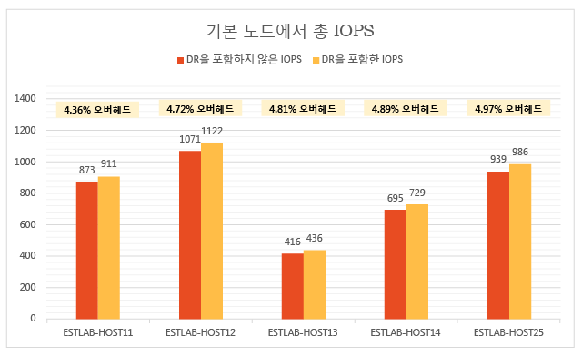
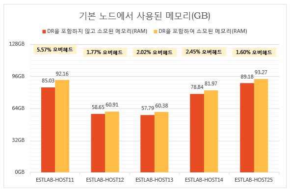
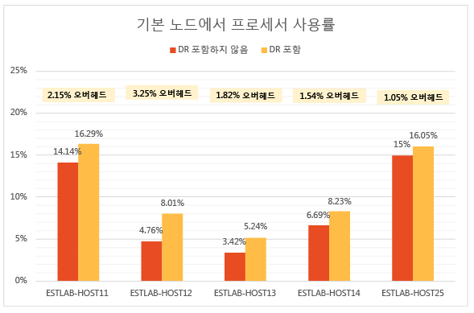
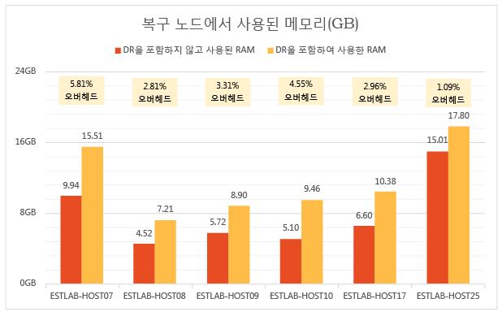
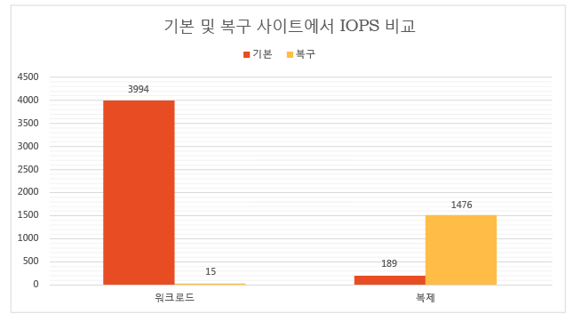
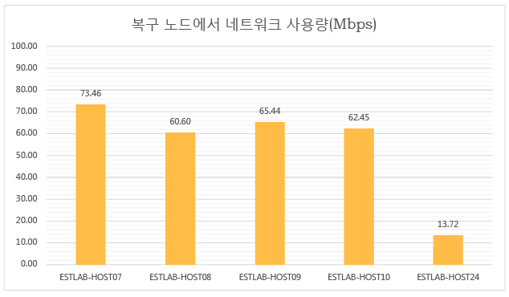
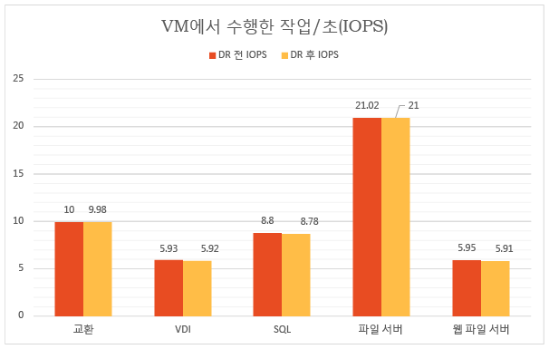
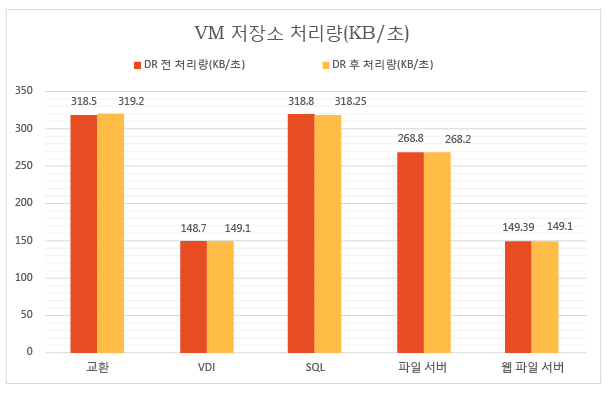
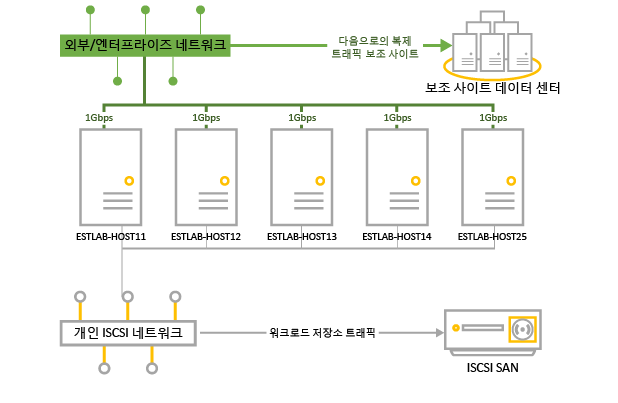
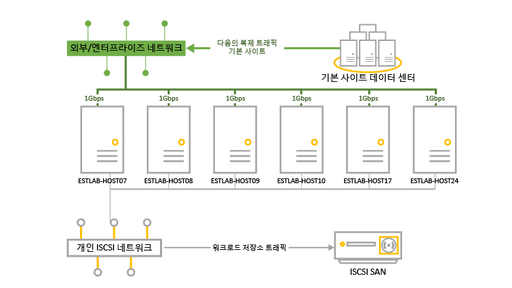

<properties
	pageTitle="Site Recovery를 사용하여 온-프레미스 간 Hyper-V 복제에 대한 성능 테스트 및 확장 결과 | Microsoft Azure"
	description="이 문서에서는 Azure Site Recovery를 사용하여 온-프레미스 복제에 온-프레미스에 대한 성능 테스트에 대하여 정보를 제공합니다."
	services="site-recovery"
	documentationCenter=""
	authors="rayne-wiselman"
	manager="jwhit"
	editor="tysonn"/>

<tags
	ms.service="site-recovery"
	ms.devlang="na"
	ms.topic="article"
	ms.tgt_pltfrm="na"
	ms.workload="storage-backup-recovery"
	ms.date="07/06/2016"
	ms.author="raynew"/>

# Site Recovery를 사용하여 온-프레미스 간 Hyper-V 복제에 대한 성능 테스트 및 확장 결과

Microsoft Azure Site Recovery를 사용하여 가상 컴퓨터 및 물리적 서버의 복제를 Azure 또는 보조 데이터 센터에 오케스트레이션하고 관리합니다. 이 문서는 두 개의 온-프레미스 데이터 센터 사이에 Hyper-v 가상 컴퓨터를 복제할 때 수행한 성능 테스트의 결과를 제공합니다.

## 개요

테스트의 목표는 안정적인 상태로 복제하는 동안 Azure Site Recovery가 수행하는 방법에 대해 검사하는 것입니다. 안정적 상태 복제는 가상 컴퓨터가 초기 복제를 완료하고 델타 변경 내용을 동기화하는 경우에 발생합니다. 안정적 상태를 사용하여 성능을 측정하는 것은 예상치 못한 중단이 발생하지 않는 한 대부분의 가상 컴퓨터에서의 상태가 안정적 상태이기 때문에 중요합니다.

테스트 배포는 각 사이트에서 VMM 서버를 사용하는 두 개의 온-프레미스 사이트로 구성됩니다. 이 테스트 배포는 기본 사이트 역할을 하는 본사 및 보조 또는 복구 사이트 역할을 하는 지점을 포함하여 일반적으로 본사/지점 배포를 대표합니다.

### 수행한 내용

테스트 통과에서 한 내용은 다음과 같습니다.

1. VMM 템플릿을 사용하여 가상 컴퓨터 생성.

1. 가상 컴퓨터 시작 및 12시간 동안 기준 성능 메트릭 캡처.

1. 기본 및 복구 VMM 서버에 클라우드 생성.

1. 원본 및 복구 클라우드의 매핑을 비롯하여 Azure Site Recovery에서 클라우드 보호 구성.

1. 가상 컴퓨터에 대한 보호 설정 및 초기 복제 완료 허용.

1. 시스템에 안정화될 때까지 대기.

1. 12시간 동안 예상된 복제 상태로 모든 가상 컴퓨터가 유지되는지 확인하기 위해 12시간 동안 성능 메트릭 캡처.

1. 기본 성능 메트릭과 복제 성능 메트릭 간의 델타 측정.

## 테스트 배포 결과

### 기본 서버 성능

- Hyper-V 복제본은 주 서버의 최소 저장소 오버헤드로 로그 파일에 변경 내용을 비동기적으로 추적합니다.

- Hyper-V 복제본은 추적을 위해 IOPS 오버헤드를 최소화하도록 자체 관리되는 메모리 캐시를 활용합니다. 메모리에서 VHDX에 쓰기를 저장하고 복구 사이트로 로그를 보내기 전에 해당 로그 파일에 이를 플러시합니다. 쓰기가 미리 결정된 제한에 도달하는 경우에도 디스크 플러시가 발생합니다.

- 아래 Graph는 복제에 대한 안정적인 상태 IOPS 오버헤드를 보여줍니다. 복제로 인한 IOPS 오버헤드는 약 5%로 상당히 낮음을 볼 수 있습니다.

Hyper-V 복제본은 디스크 성능을 최적화하기 위해 기본 서버의 메모리를 사용합니다. 다음 Graph에서 볼 수 있듯이 기본 클러스터에서 모든 서버의 메모리 오버헤드는 한계입니다. 표시되는 메모리 오버헤드는 Hyper-V 서버에서 설치된 총 메모리에 비해 복제를 통해 사용되는 메모리의 비율입니다.

Hyper-V 복제본에는 최소 CPU 오버헤드가 있습니다. Graph에서 볼 수 있듯이 복제 오버헤드는 2~3% 범위 이내입니다.

### 보조(복구) 서버 성능

Hyper-V 복제본은 복구 서버에 적은 양의 메모리를 사용하여 저장소 작업의 수를 최적화합니다. Graph는 복구 서버에서 메모리 사용량을 요약합니다. 표시되는 메모리 오버헤드는 Hyper-V 서버에서 설치된 총 메모리에 비해 복제를 통해 사용되는 메모리의 비율입니다.

복구 사이트에서 I/O 작업 양은 기본 사이트에서 쓰기 작업의 수에 따라 다릅니다. 기본 사이트에서 총 I/O 작업 및 쓰기 작업과 비교하여 복구 사이트에서 총 I/O 작업을 살펴 보겠습니다. Graph는 복구 사이트에서 총 IOPS를 보여줍니다.

- 기본에서 쓰기 IOPS의 약 1.5배입니다.

- 기본 사이트에서 총 IOPS의 약 37%입니다.

### 네트워크 사용률에 미치는 복제 효과

기존 대역폭은 초당 5GB인데 반해 기본 및 보조 노드(압축 사용 시) 간에 네트워크 대역폭은 초당 평균 275MB가 사용됩니다.

### 가상 컴퓨터 성능에 미치는 복제 효과

중요한 고려 사항은 가상 컴퓨터에서 실행되는 프로덕션 워크로드에서 복제에 미치는 영향입니다. 기본 사이트가 복제에 대해 적절하게 프로비전되면 워크로드에 아무런 영향이 없습니다. Hyper-V 복제본의 간단한 추적 메커니즘을 사용하면 가상 컴퓨터에서 실행되는 워크로드가 안정적 상태 복제 동안 영향을 받지 않습니다. 이 내용은 다음 Graph에서 설명됩니다.

이 Graph는 복제를 사용하기 전과 후에 다른 워크로드를 실행하는 가상 컴퓨터를 통해 수행되는 IOPS를 보여줍니다. 둘 사이에 차이가 없음을 확인할 수 있습니다.

다음 Graph는 복제를 사용하기 전과 후에 다른 워크로드를 실행하는 가상 컴퓨터의 처리량을 보여줍니다. 해당 복제에 심각한 영향이 없음을 확인할 수 있습니다.

### 결론

결과는 Hyper-V 복제본과 관련하여 Azure Site Recovery가 대량 클러스터에 대해 최소한의 오버헤드로 확장 가능함을 명백하게 보여줍니다. Azure Site Recovery는 간단한 배포, 복제, 관리 및 모니터링을 제공합니다. Hyper-V 복제본은 성공적인 복제 크기 조정에 대해 필요한 인프라를 제공합니다. 최적의 배포 계획을 위해 [Hyper-V Replica Capacity Planner](https://www.microsoft.com/download/details.aspx?id=39057)를 다운로드하는 것이 좋습니다.

## 테스트 환경 세부 정보

### 기본 사이트

- 기본 사이트에는 470 개의 가상 컴퓨터를 실행하는 5개의 Hyper-V 서버를 포함하는 클러스터가 있습니다.

- 가상 컴퓨터는 다른 작업을 수행하며 모두 Azure Site Recovery 보호가 설정되어 있습니다.

- 클러스터 노드에 대한 저장소는 iSCSI SAN을 통해 제공됩니다. 모델 – Hitachi HUS130.

- 각 클러스터는 서버의 각각 1Gbps인 네트워크 카드(NIC)가 4개 있습니다.

- 네트워크 카드 중 2개는 iSCSI 개인 네트워크에 연결되며 다른 2개는 외부 엔터프라이즈 네트워크에 연결됩니다. 외부 네트워크 중 하나는 클러스터 통신 전용으로 예약됩니다.

|서버|RAM|모델|프로세서|프로세서 수|NIC|소프트웨어|
|---|---|---|---|---|---|---|
|클러스터의 Hyper-V 서버:  ESTLAB-HOST11 ESTLAB-HOST12 ESTLAB-HOST13 ESTLAB-HOST14 ESTLAB-HOST25|128ESTLAB-HOST25는 256|Dell ™ PowerEdge ™ R820|Intel(R) Xeon(R) CPU E5-4620 0 @ 2.20GHz|4|IGbps 4개|Windows Server Datacenter 2012 R2 (x64) + Hyper-V role|
|VMM 서버|2|||2|1Gbps|Windows Server Database 2012 R2 (x64) + VMM 2012 R2|

### 보조(복구) 사이트

- 보조 사이트는 6개의 노드 장애 조치 클러스터가 있습니다.

- 클러스터 노드에 대한 저장소는 iSCSI SAN을 통해 제공됩니다. 모델 – Hitachi HUS130.

|서버|RAM|모델|프로세서|프로세서 수|NIC|소프트웨어|
|---|---|---|---|---|---|---|
|클러스터의 Hyper-V 서버:  ESTLAB-HOST07 ESTLAB-HOST08 ESTLAB-HOST09 ESTLAB-HOST10|96|Dell ™ PowerEdge ™ R720|Intel(R) Xeon(R) CPU E5-2630 0 @ 2.30GHz|2|IGbps 4개|Windows Server Datacenter 2012 R2 (x64) + Hyper-V role|
|ESTLAB-HOST17|128|Dell ™ PowerEdge ™ R820|Intel(R) Xeon(R) CPU E5-4620 0 @ 2.20GHz|4||Windows Server Datacenter 2012 R2 (x64) + Hyper-V role|
|ESTLAB-HOST24|256|Dell ™ PowerEdge ™ R820|Intel(R) Xeon(R) CPU E5-4620 0 @ 2.20GHz|2||Windows Server Datacenter 2012 R2 (x64) + Hyper-V role|
|VMM 서버|2|||2|1Gbps|Windows Server Database 2012 R2 (x64) + VMM 2012 R2|

### 서버 작업

- 테스트를 위해 엔터프라이즈 고객 시나리오에서 일반적으로 사용되는 작업을 선택했습니다.

- 시뮬레이션을 위해 표에 요약된 워크로드 특성과 함께 [IOMeter](http://www.iometer.org)를 사용합니다.

- 모든 IOMeter 프로파일은 작업에 대한 최악의 쓰기 패턴을 시뮬레이션하기 위해 임의의 바이트를 쓰도록 설정됩니다.

|워크로드|I/O 크기(KB)|액세스 %|쓰기 %|미해결 I/O|I/O 패턴|
|---|---|---|---|---|---|
|파일 서버|48163264|60%20%5%5%10%|80%80%80%80%80%|88888|모두 100% 임의|
|SQL Server(볼륨 1) SQL Server(볼륨 2)|864|100%100%|70%0%|88|100% 임의 100% 순차|
|Exchange|32|100%|67%|8|100% 임의|
|워크스테이션/VDI|464|66%34%|70%95%|11|둘 다 100% 임의|
|웹 파일 서버|4864|33%34%33%|95%95%95%|888|모두 75% 임의|

### 가상 컴퓨터 구성

- 기본 클러스터의 470개의 가상 컴퓨터입니다.

- VHDX 디스크에 있는 모든 가상 컴퓨터입니다.

- 표에 요약된 작업을 실행하는 가상 컴퓨터입니다. 모두 VMM 템플릿으로 생성되었습니다.

|워크로드|VM 수|최소 RAM(GB)|최대 RAM(GB)|VM당 논리 디스크 크기(GB)|최대 IOPS|
|---|---|---|---|---|---|
|SQL Server|51|1|4|167|10|
|Exchange Server|71|1|4|552|10|
|파일 서버|50|1|2|552|22|
|VDI|149|.5|1|80|6|
|웹 서버|149|.5|1|80|6|
|전체|470|||96\.83TB|4108|

### Azure Site Recovery 설정

- Azure Site Recovery는 온-프레미스 간 보호로 구성됨

- VMM 서버에는 Hyper-V 클러스터 서버 및 해당 가상 컴퓨터를 비롯하여 4개의 클라우드로 구성됩니다.

|기본 VMM 클라우드|클라우드에서 보호된 가상 컴퓨터|복제 빈도|추가 복구 지점|
|---|---|---|---|
|PrimaryCloudRpo15m|142|15분|없음|
|PrimaryCloudRpo30s|47|30초|없음|
|PrimaryCloudRpo30sArp1|47|30초|1|
|PrimaryCloudRpo5m|235|5분|없음|

### 성능 메트릭

이 표는 배포 시 측정된 성능 메트릭 및 카운터를 요약합니다.

|메트릭|카운터|
|---|---|
|CPU|\\Processor(\_Total)\\% 프로세서 시간|
|사용 가능한 메모리|\\Memory\\사용 가능한 MB|
|IOPS|\\PhysicalDisk(\_Total)\\디스크 전송/초|
|VM 읽기(IOPS) 작업/초|\\Hyper-V 가상 저장소 장치(<VHD>)\\읽기 작업/초|
|VM 쓰기(IOPS) 작업/초|\\Hyper-V 가상 저장소 장치(<VHD>)\\쓰기 작업/초|
|VM 읽기 처리량|\\Hyper-V 가상 저장소 장치(<VHD>)\\읽기 바이트/초|
|VM 쓰기 처리량|\\Hyper-V 가상 저장소 장치(<VHD>)\\쓰기 바이트/초|

## 다음 단계

- [2개의 온-프레미스 VMM 사이트 간 보호 설정](site-recovery-vmm-to-vmm.md)

<!---HONumber=AcomDC_0706_2016-->