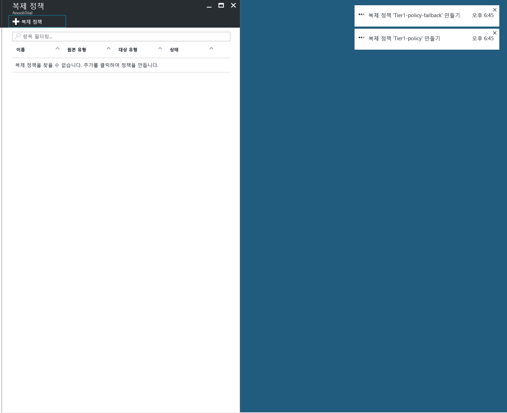
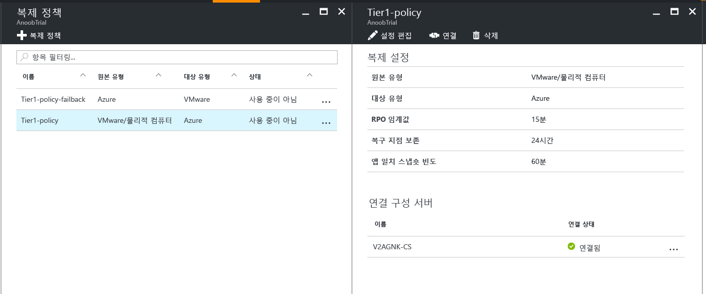
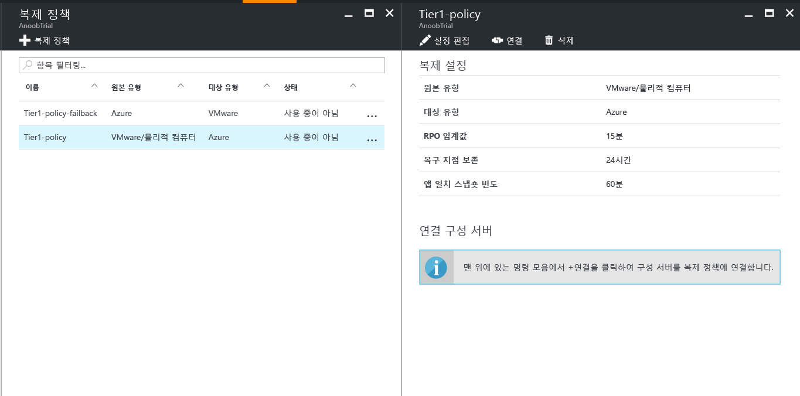
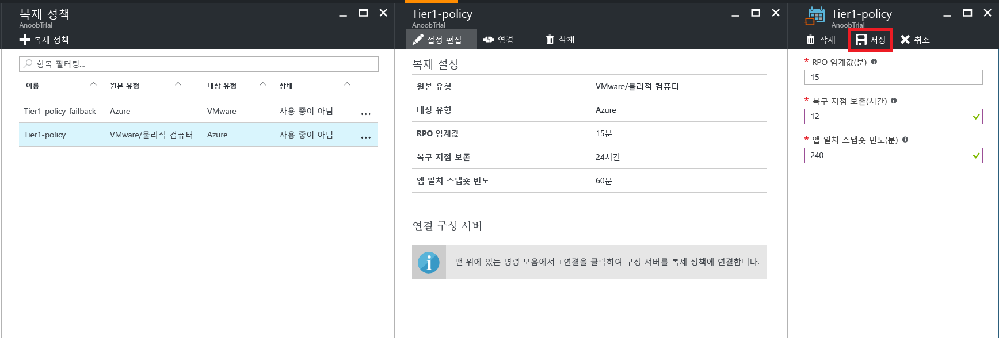

# Azure에 대한 VMware의 복제 정책 관리

## 복제 정책 만들기

1. **관리** > **Site Recovery 인프라**를 선택합니다.
2. **VMware 및 실제 컴퓨터의 경우** 아래에서 **복제 정책**을 선택합니다.
3. **+ 복제 정책**을 선택합니다.

    

4. 정책 이름을 입력합니다.

5. **RPO 임계값**에서 RPO 제한을 지정합니다. 연속 복제가 이 제한을 초과하면 경고가 생성됩니다.
6. **복구 지점 보존**에서 각 복구 지점의 보존 기간을 시간 단위로 지정합니다. 보호된 컴퓨터는 보존 기간 내의 모든 지점으로 복구할 수 있습니다.

    > [!NOTE]
    > 프리미엄 저장소에 복제된 컴퓨터의 경우 최대 24시간 동안 보존하도록 지원됩니다. 표준 저장소에 복제된 컴퓨터의 경우 최대 72시간 동안 보존하도록 지원됩니다.

    > [!NOTE]
    > 장애 복구에 대한 복제 정책은 자동으로 생성됩니다.

7. **앱 일치 스냅숏 빈도**에서 응용 프로그램 일치 스냅숏이 포함된 복구 지점을 만드는 빈도(분)를 지정합니다.

8. **확인**을 클릭합니다. 정책은 30~60초 내에 만들어야 합니다.

## 복제 정책과 구성 서버 연결
1. 구성 서버를 연결하려는 복제 정책을 선택합니다.
2. **연결**을 클릭합니다.

3. 서버 목록에서 구성 서버를 선택합니다.
4. **확인**을 클릭합니다. 구성 서버는 1~2분 내에 연결해야 합니다.

## 복제 정책 편집
1. 복제 설정을 편집하려는 복제 정책을 선택합니다.

2. **설정 편집**을 클릭합니다.

3. 필요에 따라 설정을 변경합니다.
4. **저장**을 클릭합니다. 정책은 해당 복제 정책을 사용하는 VM 개수에 따라 2~5분 내에 저장해야 합니다.

## 복제 정책에서 구성 서버 분리
1. 구성 서버를 연결하려는 복제 정책을 선택합니다.
2. **분리**를 클릭합니다.
3. 서버 목록에서 구성 서버를 선택합니다.
4. **확인**을 클릭합니다. 구성 서버는 1~2분 내에 분리해야 합니다.

    > [!NOTE]
    > 정책을 사용하는 복제된 항목이 하나 이상 있는 경우 구성 서버를 분리할 수 없습니다. 구성 서버를 분리하기 전에 정책을 사용하는 복제된 항목이 있는지 확인합니다.

## 복제 정책 삭제

1. 삭제하려는 복제 정책을 선택합니다.
2. **삭제**를 클릭합니다. 정책은 30~60초 내에 삭제해야 합니다.

    > [!NOTE]
    > 구성 서버가 하나 이상 연결되어 있는 경우 복제 정책을 삭제할 수 없습니다. 정책을 사용하는 복제된 항목이 없는지 확인하고 정책을 삭제하기 전에 연결된 구성 서버를 모두 삭제합니다.
