# Azure에 VMM 클라우드의 Hyper-V 가상 컴퓨터 복제
> [!div class="op_single_selector"]
> * [Azure Portal](site-recovery-vmm-to-azure.md)
> * [PowerShell - Resource Manager](site-recovery-vmm-to-azure-powershell-resource-manager.md)
> * [클래식 포털](site-recovery-vmm-to-azure-classic.md)
> * [PowerShell - 클래식](site-recovery-deploy-with-powershell.md)
>
>

Azure Site Recovery 서비스는 가상 컴퓨터와 물리적 서버의 복제, 장애 조치(Failover) 및 복구를 오케스트레이션하여 BCDR(비즈니스 연속성 및 재해 복구) 전략에 기여합니다. 컴퓨터는 Azure 또는 보조 온-프레미스 데이터 센터로 복제할 수 있습니다. 빠른 개요를 알아보려면 [Azure Site Recovery란?](site-recovery-overview.md)

## 개요
이 문서에서는 사이트 복구를 배포하여 VMM 사설 클라우드에 있는 Hyper-V 호스트 서버의 Hyper-V 가상 컴퓨터를 Azure에 복제하는 방법을 설명합니다.

문서에는 시나리오에 대한 필수 조건이 포함되어 있으며, 사이트 복구 자격 증명 모음을 설정하고, 원본 VMM 서버에 설치된 Azure Site Recovery 공급자를 가져오고, 서버를 자격 증명 모음에 등록하고, Azure 저장소 계정을 추가하고, Hyper-V 호스트 서버에 Azure 복구 서비스 에이전트를 설치하고, 보호된 모든 가상 컴퓨터에 적용되는 VMM 클라우드에 대한 보호 설정을 구성하고, 해당 가상 컴퓨터에 대해 보호를 사용하도록 설정하는 방법을 설명합니다. 끝으로, 장애 조치(Failover)를 테스트하여 모두 예상대로 작동하는지 확인합니다.

이 문서의 하단 또는 [Azure 복구 서비스 포럼](https://social.msdn.microsoft.com/forums/azure/home?forum=hypervrecovmgr)에서 의견이나 질문을 게시합니다.

## 아키텍처
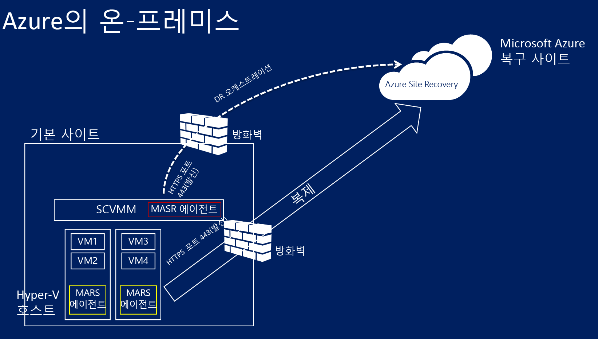

* Azure 사이트 복구 공급자는 사이트 복구를 배포하는 동안 VMM에 설치되고 사이트 복구 자격 증명 모음에서 VMM 서버가 등록됩니다. 공급자는 복제 오케스트레이션을 처리하는 사이트 복구와 통신합니다.
* 사이트 복구 배포 중에 Azure 복구 서비스 에이전트는 Hyper-V 호스트 서버에 설치됩니다. Azure 저장소에 데이터 복제를 처리합니다.

## Azure 필수 조건
Azure에서 다음 항목이 필요합니다.

| **필수 요소** | **세부 정보** |
| --- | --- |
| **Azure 계정** |[Microsoft Azure](https://azure.microsoft.com/) 계정이 있어야 합니다. [무료 평가판](https://azure.microsoft.com/pricing/free-trial/)으로 시작할 수 있습니다. 사이트 복구 가격 책정에 대해 [자세히 알아보세요](https://azure.microsoft.com/pricing/details/site-recovery/). |
| **Azure 저장소** |복제된 데이터를 저장하려면 Azure 저장소 계정이 있어야 합니다. 복제된 데이터는 Azure 저장소에 저장되고 장애 조치(Failover) 발생 시 Azure VM이 작동합니다.   [표준 지역 중복 저장소 계정](../storage/storage-redundancy.md#geo-redundant-storage)이 필요합니다. 계정은 사이트 복구와 같은 하위 지역에 있고 같은 구독과 연결되어 있어야 합니다. 프리미엄 저장소 계정으로 복제는 현재 지원되지 않으며 사용할 수 없습니다.  [자세히 알아보세요](../storage/storage-introduction.md) . |
| **Azure 네트워크** |장애 조치(Failover) 발생 시 Azure VM에서 연결할 Azure 가상 네트워크가 필요합니다. Azure 가상 네트워크는 사이트 복구 자격 증명 모음과 동일한 지역에 있어야 합니다. |

## 온-프레미스 필수 조건
온-프레미스에서 다음 항목이 필요합니다.

| **필수 요소** | **세부 정보** |
| --- | --- |
| **VMM** |물리적 또는 가상 독립 실행형 서버나 가상 클러스터로 배포된 VMM 서버가 하나 이상 필요합니다.   VMM 서버는 최신 누적 업데이트를 설치한 System Center 2012 R2를 실행해야 합니다.  VMM 서버에는 클라우드가 하나 이상 구성되어 있어야 합니다.  보호할 원본 클라우드에는 VMM 호스트 그룹이 하나 이상 있어야 합니다.  Keith Mayer 블로그의 [연습: System Center 2012 SP1 VMM에서 사설 클라우드 만들기](http://blogs.technet.com/b/keithmayer/archive/2013/04/18/walkthrough-creating-private-clouds-with-system-center-2012-sp1-virtual-machine-manager-build-your-private-cloud-in-a-month.aspx) 에서 VMM 클라우드 설정에 대해 자세히 알아봅니다. |
| **Hyper-V** |VMM 클라우드에 있는 하나 이상의 Hyper-V 호스트 서버 또는 클러스터가 필요합니다. 호스트 서버는 하나 이상의 VM이 있어야 합니다.   Hyper-V 서버는 **Windows Server 2012 R2** 이상(Hyper-V 역할 수행) 또는 **Microsoft Hyper-V Server 2012 R2**를 실행하고 최신 업데이트가 설치되어 있어야 합니다.  보호하려는 VM을 포함하는 Hyper-V 서버는 모두 VMM 클라우드에 위치해야 합니다.  클러스터에서 Hyper-V를 실행하는 경우 고정 IP 주소 기반 클러스터가 있으면 클러스터 브로커가 자동으로 만들어지지 않습니다. 클러스터 브로커를 수동으로 구성해야 합니다. [자세히 알아보세요](https://www.petri.com/use-hyper-v-replica-broker-prepare-host-clusters) . |
| **보호된 컴퓨터** | 보호하려는 VM은 [Azure 요구 사항을](site-recovery-support-matrix-to-azure.md#failed-over-azure-vm-requirements)준수해야 합니다. |

## 네트워크 매핑 필수 조건
Azure 네트워크에서 가상 컴퓨터를 보호하는 경우 매핑은 원본 VMM 서버의 VM 네트워크와 대상 Azure 네트워크 간을 매핑하여 다음을 가능하게 합니다.

* 동일한 네트워크에서 장애 조치(Failover)되는 모든 컴퓨터는 복구 계획이 있는지 여부와 상관 없이 서로 연결할 수 있습니다.
* 네트워크 게이트웨이가 대상 Azure 네트워크에서 설정된 경우 가상 컴퓨터는 다른 온-프레미스 가상 컴퓨터에 연결할 수 있습니다.
* 네트워크 매핑을 구성하지 않으면 동일한 복구 계획에서 장애 조치(Failover)되는 가상 컴퓨터만 Azure로의 장애 조치(Failover) 후에 서로 연결할 수 있습니다.

네트워크 매핑을 배포하려면 다음이 필요합니다.

* 원본 VMM 서버에서 보호할 가상 컴퓨터가 VM 네트워크에 연결되어야 합니다. 해당 네트워크가 클라우드와 연결된 논리 네트워크에 연결되어야 합니다.
* 복제된 가상 컴퓨터가 장애 조치(Failover) 후 연결할 수 있는 Azure 네트워크. 이 네트워크는 장애 조치(Failover) 시 선택합니다. 네트워크는 Azure Site Recovery 구독과 동일한 지역에 있어야 합니다.

VMM에서 네트워크 준비:

   * [논리 네트워크를 설정합니다](https://technet.microsoft.com/library/jj721568.aspx).
   * [VM 네트워크를 설정합니다](https://technet.microsoft.com/library/jj721575.aspx).

## 1단계: 사이트 복구 자격 증명 모음 만들기
1. 등록할 VMM 서버에서 [관리 포털](https://portal.azure.com) 에 로그인합니다.
2. **Data Services** > **Recovery Services** > **Site Recovery 자격 증명 모음**을 차례로 클릭합니다.
3. **새로 만들기** > **빠른 생성**을 클릭합니다.
4. **이름**에 자격 증명 모음을 식별하기 위한 이름을 입력합니다.
5. **지역**에서 자격 증명 모음에 대한 지리적 지역을 선택합니다. 지원되는 하위 지역을 확인하려면 [Azure Site Recovery 가격 정보](https://azure.microsoft.com/pricing/details/site-recovery/)에서 지리적 가용성을 참조하세요.
6. **자격 증명 모음 만들기**를 클릭합니다.

    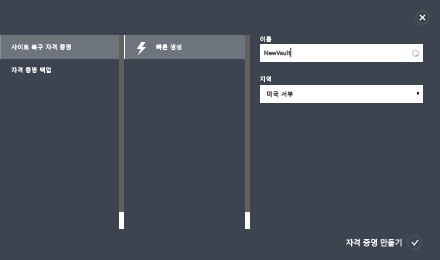

상태 표시줄을 점검하여 자격 증명 모음이 성공적으로 만들어졌는지 확인합니다. 자격 증명 모음은 기본 복구 서비스 페이지에서 **활성** 으로 나열됩니다.

## 2단계: 자격 증명 모음 등록 키 생성
자격 증명 모음에 등록 키를 생성합니다. Azure Site Recovery 공급자를 다운로드하고 VMM 서버에 설치한 후 이 키를 사용하여 VMM 서버를 자격 증명 모음에 등록합니다.

1. **복구 서비스** 페이지에서 자격 증명 모음을 클릭하여 빠른 시작 페이지를 엽니다. 빠른 시작은 언제든지 아이콘을 사용하여 열 수도 있습니다.

    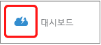
2. 드롭다운 목록에서 **온-프레미스 VMM 사이트와 Microsoft Azure 간**을 선택합니다.
3. **VMM 서버 준비**에서 **등록 키 생성** 파일을 클릭합니다. 키 파일은 자동으로 생성되고 생성된 날부터 5일간 유효합니다. VMM 서버에서 Azure 포털에 액세스하지 않는 경우 이 파일을 서버로 복사해야 합니다.

    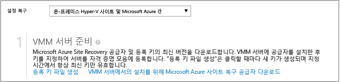

## 3단계: Azure Site Recovery 공급자 설치
1. **빠른 시작** > **VMM 서버 준비**에서 **VMM 서버 설치용 Microsoft Azure Site Recovery Provider 다운로드**를 클릭하여 최신 버전의 공급자 설치 파일을 받습니다.
2. 원본 VMM 서버에서 이 파일을 실행합니다.

   > [!NOTE]
   > VMM이 클러스터에 배포되고 공급자를 처음 설치하는 경우 활성 노드에 설치하고 설치를 완료하여 VMM 서버를 자격 증명 모음에 등록합니다. 그런 후에 다른 노드에 공급자를 설치합니다. 공급자를 업그레이드하는 경우 모두 동일한 공급자 버전을 실행해야 하므로 모든 노드에서 업그레이드해야 합니다.
   >
   >
3. 설치 관리자는 사전 요구 사항 확인을 수행하고 공급자 설정을 시작하기 위해 VMM 서비스를 중지하는 권한을 요청합니다. 설정이 완료되면 VMM 서비스가 자동으로 다시 시작됩니다. VMM 클러스터에 설치하는 경우 클러스터 역할을 중지하라는 메시지가 표시됩니다.
4. **Microsoft 업데이트** 에서 업데이트를 선택할 수 있습니다. 이 설정이 사용되면 공급자가 Microsoft 업데이트 정책에 따라 설치됩니다.

    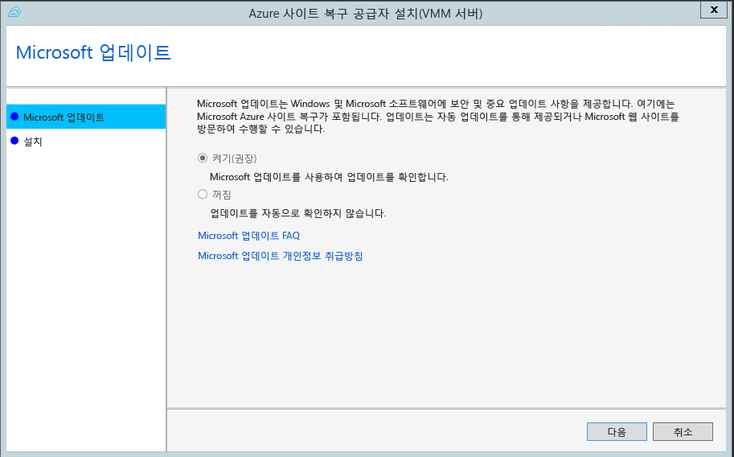
5. 공급자의 설치 위치는 **<SystemDrive>\Program Files\Microsoft System Center 2012 R2\Virtual Machine Manager\bin**으로 설정됩니다. **Install**을 클릭합니다.

   
6. 공급자가 설치된 후 **등록** 을 클릭하여 자격 증명 모음에 서버를 등록합니다.

    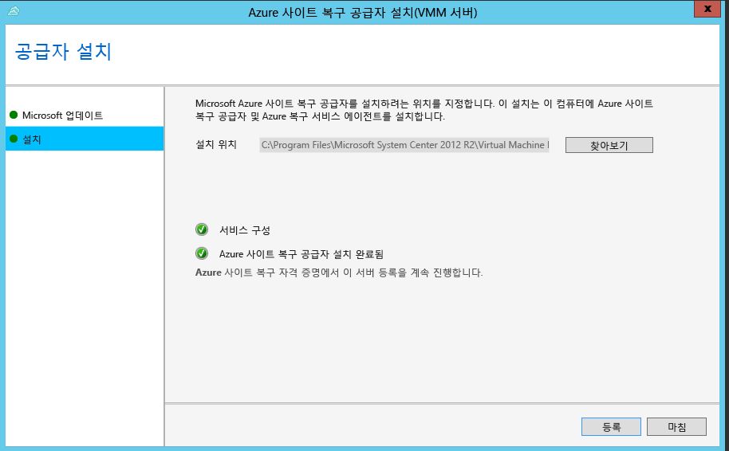
7. **자격 증명 모음 이름**에서 서버를 등록할 자격 증명 모음의 이름을 확인합니다. *다음*을 클릭합니다.

    
8. VMM 서버에서 실행 중인 공급자를 인터넷에 연결하는 방법을 **인터넷 연결** 에서 지정합니다. 서버에 구성되어 있는 기본 인터넷 연결 설정을 사용하려면 **기존 프록시 설정과 연결** 을 선택합니다.

    

   * 사용자 지정 프록시를 사용하려는 경우 공급자를 설치하기 전에 설정해야 합니다. 사용자 지정 프록시 설정을 구성하면 테스트가 실행되어 프록시 연결을 확인합니다.
   * 사용자 지정 프록시를 사용하지 않거나 기본 프록시에 인증이 필요한 경우 프록시 주소와 포트를 비롯한 프록시 정보를 입력해야 합니다.
   * 다음 URL은 VMM 서버 및 Hyper-V 호스트에서 액세스할 수 있어야 합니다.
     * *.hypervrecoverymanager.windowsazure.com
     * *.accesscontrol.windows.net
     * *.backup.windowsazure.com
     * *.blob.core.windows.net
     * *.store.core.windows.net
   * [Azure 데이터센터 IP 범위](https://www.microsoft.com/download/confirmation.aspx?id=41653) 및 HTTPS(443) 프로토콜에 설명된 IP 주소를 허용합니다. 사용하려는 Azure 지역 및 미국 서부의 IP 범위를 허용해야 합니다.
   * 사용자 지정 프록시를 사용하는 경우 지정된 프록시 자격 증명을 사용하여 VMM 실행 계정(DRAProxyAccount)이 자동으로 만들어집니다. 이 계정이 성공적으로 인증될 수 있도록 프록시 서버를 구성합니다. VMM 콘솔에서 VMM 실행 계정 설정을 수정할 수 있습니다. 이렇게 하려면 **설정** 작업 영역을 열고 **보안**을 확장한 다음 **실행 계정**을 클릭하여 DRAProxyAccount의 암호를 수정합니다. 이 설정이 적용되도록 VMM 서비스를 다시 시작해야 합니다.
9. **등록 키**에서 Azure Site Recovery에서 다운로드하고 VMM 서버에 복사한 키를 선택합니다.
10. 암호화 설정은 VMM 클라우드의 Hyper-V VM을 Azure에 복제하는 경우에 사용됩니다. 보조 사이트에 복제하는 경우 사용되지 않습니다.
11. 자격 증명 모음에서 VMM 서버를 식별하기 위한 이름을 **서버 이름**에서 지정합니다. 클러스터 구성에서 VMM 클러스터 역할 이름을 지정합니다.
12. **클라우드 메타데이터 동기화** 에서 VMM 서버에 있는 모든 클라우드의 메타데이터를 자격 증명 모음과 동기화할 것인지를 선택합니다. 이 작업은 각 서버에서 한 번만 수행해야 합니다. 모든 클라우드를 동기화하지 않는 경우 이 설정을 선택 취소된 상태로 두고 VMM 콘솔의 클라우드 속성에서 각 클라우드를 개별적으로 동기화할 수 있습니다.
13. **다음** 을 클릭하여 프로세스를 완료합니다. 등록 후에 VMM 서버의 메타데이터가 Azure Site Recovery에 의해 검색됩니다. 자격 증명 모음의 **서버** 페이지에 있는 **VMM 서버** 탭에 해당 서버가 표시됩니다.

    

등록 후에 VMM 서버의 메타데이터가 Azure Site Recovery에 의해 검색됩니다. 자격 증명 모음의 **서버** 페이지에 있는 **VMM 서버** 탭에 해당 서버가 표시됩니다.

### 명령줄 설치
다음 명령줄을 사용하여 Azure Site Recovery 공급자를 설치할 수도 있습니다. 이 방법은 Windows Server 2012 R2용 Server Core에 대한 공급자를 설치하는 데 사용할 수 있습니다.

1. 공급자 설치 파일 및 등록 키를 폴더로 다운로드합니다. 예: C:\ASR.
2. System Center Virtual Machine Manager 서비스 중지
3. 상승된 명령 프롬프트에서 다음 명령을 사용하여 공급자 설치 관리자를 추출합니다.

        C:\Windows\System32> CD C:\ASR
        C:\ASR> AzureSiteRecoveryProvider.exe /x:. /q
4. 다음과 같이 공급자를 설치합니다.

        C:\ASR> setupdr.exe /i
5. 다음과 같이 공급자를 등록합니다.

        CD C:\Program Files\Microsoft System Center 2012 R2\Virtual Machine Manager\bin
        C:\Program Files\Microsoft System Center 2012 R2\Virtual Machine Manager\bin\> DRConfigurator.exe /r  /Friendlyname <friendly name of the server> /Credentials <path of the credentials file> /EncryptionEnabled <full file name to save the encryption certificate>       

여기에서 매개 변수는 다음과 같습니다.

* **/Credentials** : 등록 키 파일이 있는 위치를 지정하는 필수 매개 변수입니다.  
* **/FriendlyName** : Azure Site Recovery 포털에 나타나는 Hyper-V 호스트 서버의 이름에 대한 필수 매개 변수입니다.
* **/EncryptionEnabled** : Azure(암호화 미사용)에서 가상 컴퓨터를 암호화하려는 경우 지정할 선택적 매개 변수입니다. 파일 이름에는 **.pfx** 확장명이 있어야 합니다.
* **/proxyAddress** : 프록시 서버의 주소를 지정하는 선택적 매개 변수입니다.
* **/proxyport** : 프록시 서버의 포트를 지정하는 선택적 매개 변수입니다.
* **/proxyUsername** : 프록시 사용자 이름을 지정하는 선택적 매개 변수입니다.
* **/proxyPassword** : 프록시 암호를 지정하는 선택적 매개 변수입니다.  

## 4단계: Azure 저장소 계정 만들기
1. Azure Storage 계정이 없으면 **Azure Storage 계정 추가** 를 클릭하여 계정을 만듭니다.
2. 지역에서 복제를 사용하는 계정을 만듭니다. 계정은 Azure Site Recovery 서비스와 같은 하위 지역에 있고 같은 구독과 연결되어야 합니다.

    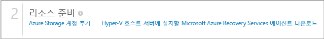

> [!NOTE]
> [저장소 계정 마이그레이션](../azure-resource-manager/resource-group-move-resources.md) 작업은 Site Recovery를 배포하는 데 사용되는 저장소 계정에서 같은 구독 내에 있거나 여러 구독에 있는 리소스 그룹에 대해 수행할 수 없습니다.
>
>

## 5단계: Azure 복구 서비스 에이전트 설치
VMM 클라우드의 각 Hyper-V 호스트 서버에 Azure 복구 서비스 에이전트를 설치합니다.

1. **빠른 시작** > **Azure Site Recovery Services Agent 다운로드 및 호스트에 설치**를 클릭하여 최신 버전의 에이전트 설치 파일을 받습니다.

    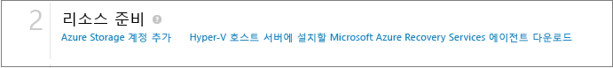
2. 각 Hyper-V 호스트 서버의 설치 파일을 실행합니다.
3. **필수 구성 요소 확인** 페이지에서 **다음**을 클릭합니다. 누락된 필수 구성 요소는 자동으로 설치됩니다.

    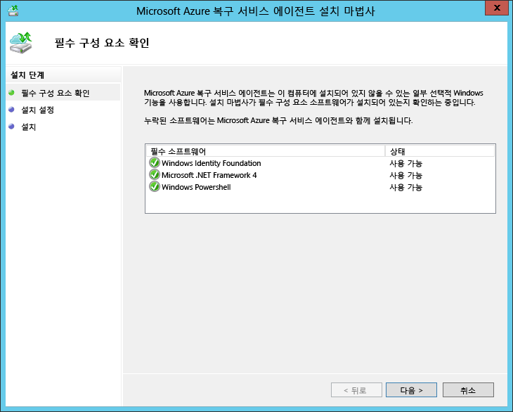
4. **설치 설정** 페이지에서 에이전트를 설치할 위치를 지정하고 백업 메타데이터를 설치할 캐시 위치를 선택합니다. **설치**를 클릭합니다.
5. 설치를 마친 후 **닫기** 를 클릭하여 마법사를 완료합니다.

    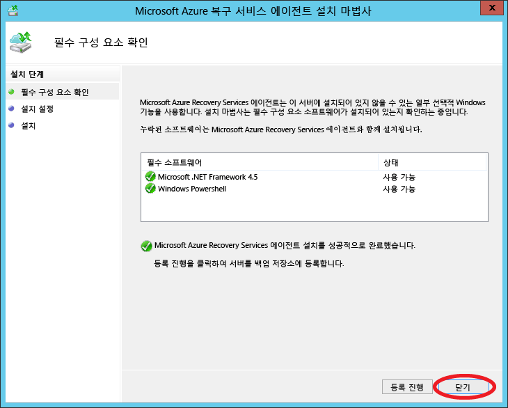

### 명령줄 설치
이 명령을 사용하여 명령줄에서 Microsoft Azure 복구 서비스 에이전트를 설치할 수도 있습니다.

    marsagentinstaller.exe /q /nu

## 6단계: 클라우드 보호 설정 구성
VMM 서버가 등록되면 클라우드 보호 설정을 구성할 수 있습니다. 공급자를 설치할 때 **클라우드 데이터를 자격 증명 모음과 동기화** 옵션을 사용하도록 설정했으므로 자격 증명 모음의 <b>보호된 항목</b> 탭에 VMM 서버에 있는 모든 클라우드가 표시됩니다.

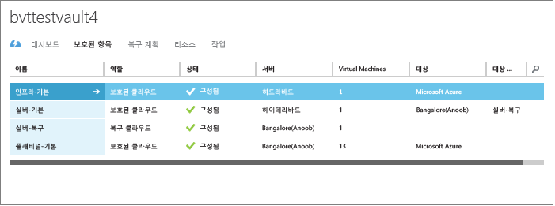

1. 빠른 시작 페이지에서 **VMM 클라우드에 대해 보호 설정**을 클릭합니다.
2. **보호된 항목** 탭에서 구성할 클라우드를 클릭하고 **구성** 탭으로 이동합니다.
3. **대상** select **Azure**을 확인하세요.
4. **저장소 계정** 에서 복제를 위해 사용할 Azure Storage 계정을 선택합니다.
5. **저장된 데이터 암호화**를 **끄기**로 설정합니다. 이 설정은 온-프레미스 사이트와 Azure 간의 복제 중에 데이터를 암호화하도록 지정합니다.
6. **복사 빈도** 에서 기본 설정을 그대로 둡니다. 이 값은 원본 위치와 대상 위치 사이에 데이터를 동기화해야 하는 빈도를 지정합니다.
7. **복구 지점 유지**에서 기본 설정을 그대로 둡니다. 기본값인 0인 경우에는 주 가상 컴퓨터의 가장 최근 복구 지점만 복제본 호스트 서버에 저장됩니다.
8. **응용 프로그램에 일관된 스냅숏의 빈도**에서 기본 설정을 그대로 둡니다. 이 값은 스냅숏을 만드는 빈도를 지정합니다. 스냅숏은 VSS(볼륨 섀도 복사본 서비스)를 사용하여 스냅숏이 만들어질 때 응용 프로그램이 일관된 상태가 되도록 합니다.  값을 설정할 경우 구성할 추가 복구 지점 수보다 적은지 확인하세요.
9. **복제 시작 시간**에서 Azure로 데이터 초기 복제를 시작하는 시간을 지정합니다. Hyper-V 호스트 서버의 시간대가 사용됩니다. 초기 복제는 사용률이 낮은 시간에 예약하는 것이 좋습니다.

    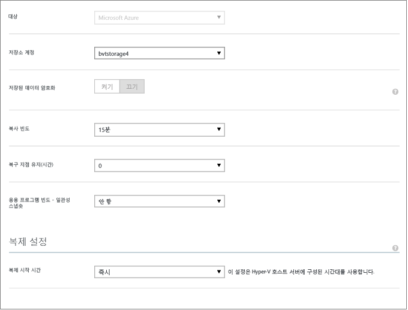

설정을 저장하고 나면 작업이 생성되고 **작업** 탭에서 모니터링할 수 있습니다. VMM 원본의 모든 Hyper-V 호스트 서버가 복제에 대해 구성됩니다.

저장하고 나면 클라우드 설정은 **구성** 탭에서 수정할 수 있습니다. 대상 위치 또는 대상 저장소 계정을 수정하려면 클라우드 구성을 제거한 후 클라우드를 다시 구성해야 합니다. 저장소 계정을 변경하면 변경 내용은 저장소 계정이 수정된 후에 보호하도록 설정된 가상 컴퓨터에만 적용됩니다. 기존 가상 컴퓨터는 새 저장소 계정으로 마이그레이션되지 않습니다.

## 7단계: 네트워크 매핑 구성
네트워크 매핑을 시작하기 전에 원본 VMM 서버의 가상 컴퓨터가 VM 네트워크에 연결되었는지 확인합니다. 또한 Azure 가상 네트워크를 하나 이상 만듭니다. 단일 Azure 네트워크에 여러 개의 VM 네트워크를 매핑할 수 있습니다.

1. 빠른 시작 페이지에서 **네트워크 매핑**을 클릭합니다.
2. **네트워크** 탭의 **원본 위치**에서 원본 VMM 서버를 선택합니다. **대상 위치** 에서 Azure를 선택합니다.
3. **원본** 네트워크에 VMM 서버와 연결된 VM 네트워크 목록이 표시됩니다. **대상** 네트워크에는 구독과 연결된 Azure 네트워크가 표시됩니다.
4. 원본 VM 네트워크를 선택하고 **매핑**을 클릭합니다.
5. **대상 네트워크 선택** 페이지에서 사용할 대상 Azure 네트워크를 선택합니다.
6. 확인 표시를 클릭하여 매핑 프로세스를 완료합니다.

    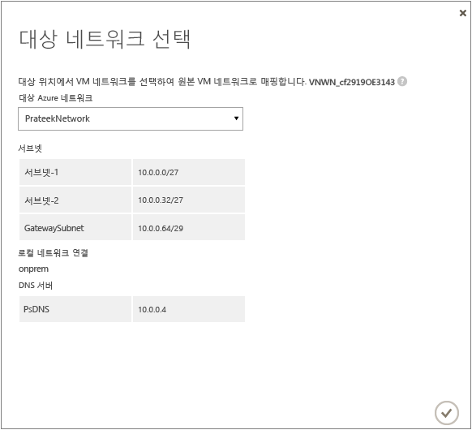

설정을 저장하면 작업이 시작되어 매핑 진행률을 추적하며 작업 탭에서 모니터링할 수 있습니다. 원본 VM 네트워크에 해당하는 기존 복제본 가상 컴퓨터는 모두 대상 Azure 네트워크에 연결됩니다. 원본 VM 네트워크에 연결된 새 가상 컴퓨터는 복제 후 매핑된 Azure 네트워크에 연결됩니다. 새 네트워크로 기존 매핑을 수정하면 복제본 가상 컴퓨터가 새 설정을 사용하여 연결됩니다.

대상 네트워크에 여러 서브넷이 있고 이 서브넷 중 하나의 이름이 원본 가상 컴퓨터가 있는 서브넷과 같으면 복제본 가상 컴퓨터가 장애 조치(Failover) 후에 대상 서브넷에 연결됩니다. 일치하는 이름을 가진 대상 서브넷이 없으면 가상 컴퓨터가 네트워크의 첫 번째 서브넷에 연결됩니다.

> [!NOTE]
> 같은 구독 내에 있거나 여러 구독에 있는 리소스 그룹에 대한 [네트워크의 마이그레이션](../azure-resource-manager/resource-group-move-resources.md)은 Site Recovery를 배포하는 데 사용되는 네트워크에 지원되지 않습니다.
>
>

## 8단계: 가상 컴퓨터의 보호 활성화
서버, 클라우드 및 네트워크가 제대로 구성되었으면 클라우드에서 가상 컴퓨터에 대한 보호를 설정할 수 있습니다. 다음 사항에 유의하세요.

* 가상 컴퓨터는 [Azure 요구 사항](site-recovery-support-matrix-to-azure.md#failed-over-azure-vm-requirements)을 충족해야 합니다.
* 보호를 사용하도록 설정하려면 가상 컴퓨터에 대해 운영 체제 및 운영 체제 디스크 속성을 설정해야 합니다. VMM에서 가상 컴퓨터 템플릿을 사용하여 가상 컴퓨터를 만들 때 속성을 설정할 수 있습니다. 가상 컴퓨터 속성의 **일반** 및 **하드웨어 구성** 탭에서 기존 가상 컴퓨터에 대해 이러한 속성을 설정할 수도 있습니다. 이러한 속성을 VMM에서 설정하지 않는 경우 Azure Site Recovery 포털에서 구성할 수 있습니다.

    

    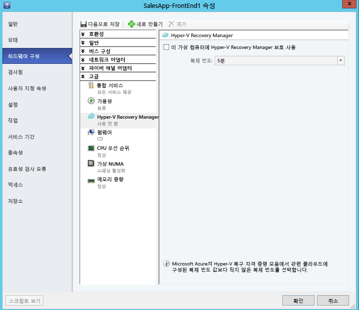

1. 보호를 사용하도록 설정하려면 가상 컴퓨터가 있는 클라우드의 **Virtual Machines** 탭에서 **보호 사용** > **가상 컴퓨터 추가**를 차례로 클릭합니다.
2. 클라우드에 있는 가상 컴퓨터의 목록에서 보호할 가상 컴퓨터를 선택합니다.

    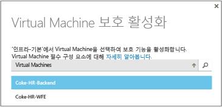

    **작업** 탭에서 초기 복제를 포함하여 **보호 사용** 작업의 진행 상태를 추적합니다. **보호 완료** 작업이 실행된 후에는 가상 컴퓨터가 장애 조치(Failover)를 수행할 준비가 되어 있습니다. 보호를 사용하도록 설정하고 가상 컴퓨터가 복제되고 나면 Azure에서 가상 컴퓨터를 볼 수 있습니다.

    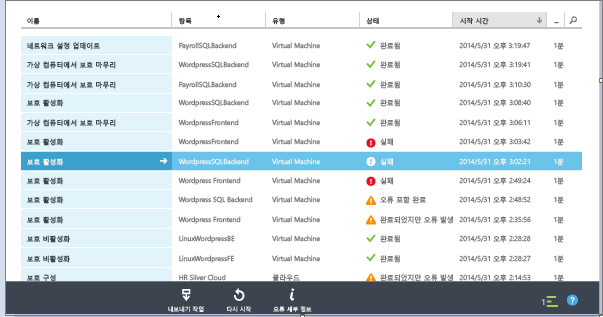

1. 가상 컴퓨터 속성을 확인하고 필요한 대로 수정합니다.

    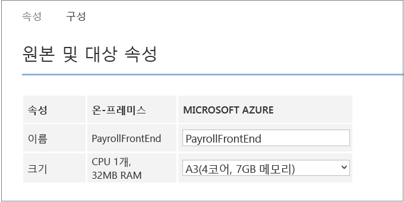
2. 가상 컴퓨터 속성의 **구성** 탭에서 다음 네트워크 속성을 수정할 수 있습니다.

* **대상 가상 컴퓨터의 네트워크 어댑터 수** - 네트워크 어댑터 수는 대상 가상 컴퓨터에 지정하는 크기로 지정됩니다. 가상 컴퓨터 크기로 지원되는 어댑터 수에 대해서는 [가상 컴퓨터 크기 사양](../virtual-machines/linux/sizes.md)을 확인합니다. 가상 컴퓨터의 크기를 수정하고 설정을 저장하면 다음에 **구성** 페이지를 열 때 네트워크 어댑터의 수가 변경됩니다. 대상 가상 컴퓨터의 네트워크 어댑터 수는 원본 가상 컴퓨터의 최소 네트워크 어댑터 수이며 선택한 가상 컴퓨터 크기에서 지원하는 최대 네트워크 어댑터 수입니다. 다음과 같습니다.

  * 원본 컴퓨터의 네트워크 어댑터 수가 대상 컴퓨터 크기에 허용되는 어댑터 수보다 작거나 같은 경우, 대상의 어댑터 수는 소스와 동일해야 합니다.
  * 원본 가상 컴퓨터의 어댑터의 수가 대상 크기에 허용된 수를 초과하면 대상 크기 최대치가 사용됩니다.
  * 예를 들어 원본 컴퓨터에 두 네트워크 어댑터가 있고 대상 컴퓨터 크기가 4를 지원하는 경우, 대상 컴퓨터에는 2개의 어댑터가 있어야 합니다. 원본 컴퓨터에 두 어댑터가 있지만 지원되는 대상 크기가 하나만 지원하는 경우 대상 컴퓨터에는 1개의 어댑터만 있어야 합니다.     
* **대상 가상 컴퓨터의 네트워크** - 가상 컴퓨터가 연결하는 네트워크는 네트워크 원본 가상 컴퓨터의 네트워크 매핑으로 결정됩니다. 원본 가상 컴퓨터에 둘 이상의 네트워크 어댑터가 있고 원본 네트워크가 대상의 다른 네트워크에 매핑된 경우 대상 네트워크 중 하나를 선택해야 합니다.
* **각 네트워크 어댑터의 서브넷** - 사용자는 각 네트워크 어댑터에 대해 장애 조치가 실행된 가상 컴퓨터가 연결할 서브넷을 선택할 수 있습니다.
* **대상 IP 주소** - 원본 가상 컴퓨터의 네트워크 어댑터가 고정 IP 주소를 사용하도록 구성된 경우 대상 가상 컴퓨터의 IP 주소를 입력할 수 있습니다. 이 기능을 사용하여 장애 조치(Failover) 후 원본 가상 컴퓨터의 IP 주소를 유지합니다. 제공된 IP 주소가 없을 경우 장애 조치(Failover) 시 사용 가능한 임의 IP 주소가 네트워크 어댑터로 제공됩니다. 대상 IP 주소가 지정되었지만 Azure에서 실행 중인 다른 가상 컴퓨터가 해당 주소를 이미 사용 중인 경우 장애 조치가 실패합니다.  

    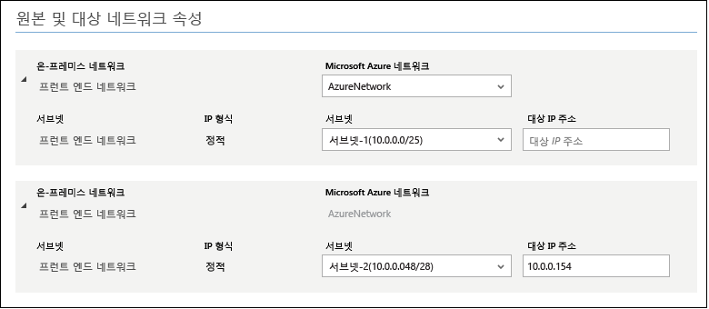

> [!NOTE]
> 고정 IP 주소를 사용하는 Linux 가상 컴퓨터는 지원되지 않습니다.
>
>

## 배포 테스트
배포를 테스트하려면 단일 가상 컴퓨터에 대한 테스트 장애 조치(Failover)를 실행하거나, 여러 개의 가상 컴퓨터로 구성된 복구 계획을 만들고 이 계획에 대한 테스트 장애 조치(Failover)를 실행하면 됩니다.  

테스트 장애 조치(Failover)에서는 격리된 네트워크에서 장애 조치(Failover) 및 복구 메커니즘을 시뮬레이션합니다. 다음 사항에 유의하세요.

* 장애 조치(Failover) 후에 원격 데스크탑을 사용하여 Azure의 가상 컴퓨터에 연결하려면 가상 컴퓨터에서 원격 데스크탑 연결을 사용하도록 설정하고 나서 테스트 장애 조치(Failover)를 실행합니다.
* 장애 조치 후에 공용 IP 주소를 사용하여 원격 데스크톱을 통해 Azure VM에 연결합니다. 이 작업을 하려면 공개 주소를 사용하여 가상 컴퓨터에 연결하지 못하도록 차단하는 도메인 정책이 없어야 합니다.

> [!NOTE]
> Azure에 장애 조치할 때 최상의 성능을 얻으려면 Azure 에이전트를 VM에 설치했는지 확인합니다. 이렇게 하면 부팅이 빨라지고 문제 해결에 도움이 됩니다. [Linux 에이전트](https://github.com/Azure/WALinuxAgent) 또는 [Windows 에이전트](http://go.microsoft.com/fwlink/?LinkID=394789)를 다운로드합니다.
>
>

### 복구 계획 만들기
1. **복구 계획** 탭에서 새 계획을 추가합니다. **원본 유형**에 **VMM**, **원본**에 원본 VMM 서버의 이름을 지정합니다. 대상은 Azure입니다.

    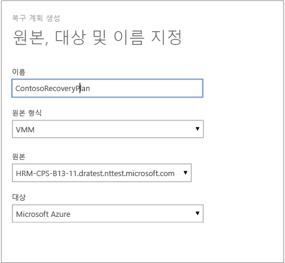
2. **가상 컴퓨터 선택** 페이지에서 복구 계획에 추가할 가상 컴퓨터를 선택합니다. 이러한 가상 컴퓨터는 복구 계획 기본 그룹(그룹 1)에 추가됩니다. 단일 복구 계획에서 최대 100개의 가상 컴퓨터가 테스트되었습니다.

* 가상 컴퓨터 속성을 계획에 추가하기 전에 검증하려면 가상 컴퓨터가 있는 클라우드의 속성 페이지에서 해당 가상 컴퓨터를 클릭합니다. VMM 콘솔에서 가상 컴퓨터 속성을 구성할 수도 있습니다.
* 표시되는 가상 컴퓨터는 모두 보호되도록 설정되었습니다. 목록에는 보호되도록 설정되고 초기 복제가 완료된 가상 컴퓨터 및 보호되도록 설정되고 초기 복제가 보류 중인 가상 컴퓨터가 모두 포함됩니다. 초기 복제가 완료된 가상 컴퓨터만 복구 계획의 일부로 장애 조치(Failover)될 수 있습니다.

    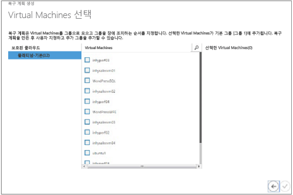

만든 복구 계획은 **복구 계획** 탭에 표시됩니다. 복구 계획에 [Azure 자동화 Runbook](site-recovery-runbook-automation.md) 을 추가하여 장애 조치(Failover) 중 작업을 자동화할 수 있습니다.

### 테스트 장애 조치(Failover) 실행
Azure로의 테스트 장애 조치(Failover)를 실행하는 두 가지 방법이 있습니다.

* **Azure 네트워크를 사용하지 않는 테스트 장애 조치(Failover)**- 이 유형의 테스트 장애 조치는 Azure에서 가상 컴퓨터가 제대로 작동하는지 확인합니다. 장애 조치(Failover) 후에 가상 컴퓨터가 Azure 네트워크에 연결되지 않습니다.
* **Azure 네트워크를 사용하는 장애 조치(Failover) 테스트**- 이 유형의 장애 조치(Failover)는 전체 복제 환경이 예상대로 작동하고 장애 조치(Failover)된 가상 컴퓨터가 지정한 대상 Azure 네트워크에 연결되는지 확인합니다. 테스트 장애 조치(Failover)에 대한 서브넷 처리의 경우 테스트 가상 컴퓨터의 서브넷이 복제본 가상 컴퓨터의 서브넷에 따라 확인됩니다. 이는 복제본 가상 컴퓨터의 서브넷이 원본 가상 컴퓨터의 서브넷을 기반으로 하는 일반 복제의 경우와 다릅니다.

Azure 대상 네트워크를 지정하지 않고 Azure로 보호되도록 설정된 가상 컴퓨터에 대해 테스트 장애 조치(Failover)를 실행하려는 경우 아무 것도 준비할 필요가 없습니다. Azure 대상 네트워크를 사용하여 테스트 장애 조치(Failover)를 실행하려면 Azure 프로덕션 네트워크에서 격리된 새 Azure 네트워크를 만듭니다.(Azure에서 새 네트워크를 만들 때의 기본 동작) 자세한 내용은 [테스트 장애 조치(Failover)를 실행](site-recovery-failover.md)하는 방법을 살펴봅니다.

또한 예상 대로 작동하는 복제된 가상 컴퓨터에 대한 인프라를 설정해야 합니다. 예를 들어, 도메인 컨트롤러 및 DNS와 가상 컴퓨터를 Azure Site Recovery를 사용하여 Azure에 복제할 수 있으며 테스트 장애 조치를 사용하여 테스트 네트워크에서 만들 수 있습니다. 자세한 내용은 [Active Directory의 테스트 장애 조치(failover) 시 고려 사항](site-recovery-active-directory.md#test-failover-considerations) 섹션을 살펴봅니다.

테스트 장애 조치(Failover)를 실행하려면 다음을 수행합니다.

1. **복구 계획** 탭에서 계획을 선택하고 **테스트 장애 조치**를 클릭합니다.
2. **테스트 장애 조치 확인** 페이지에서 **없음** 또는 특정 Azure 네트워크를 선택합니다.  없음을 선택하면 테스트 장애 조치(Failover)에서 가상 컴퓨터가 Azure로 올바로 복제되었는지 확인하지만 복제 네트워크 구성은 확인하지 않습니다.

    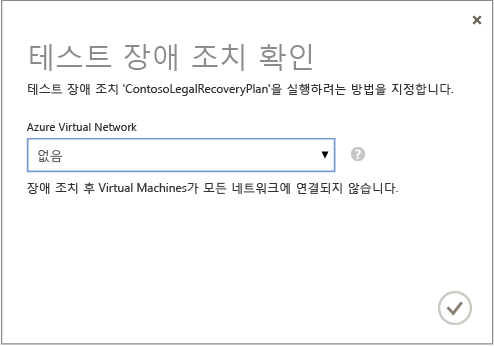
3. 클라우드에 대해 데이터 암호화를 사용하도록 설정된 상태에서 클라우드에 데이터 암호화를 사용하도록 설정하는 옵션을 켤 경우 VMM 서버에 공급자를 설치하는 동안 **암호화 키** 에서 발급된 인증서를 선택합니다.
4. **작업** 탭에서 장애 조치 진행률을 추적할 수 있습니다. 또한 Azure 포털에서 가상 컴퓨터 테스트 복제본을 확인할 수 있어야 합니다. 온-프레미스 네트워크에서 가상 컴퓨터에 액세스할 수 있도록 설정한 경우 가상 컴퓨터에 대한 원격 데스크톱 연결을 시작할 수 있습니다.
5. 장애 조치가 **테스트 완료** 단계에 도달하면 **완료된 테스트**를 클릭하여 장애 조치를 완료합니다. **작업** 탭으로 드릴다운하여 장애 조치 진행률 및 상태를 추적하고 필요한 작업을 수행할 수 있습니다.
6. 장애 조치 후에는 Azure Portal에서 가상 컴퓨터 테스트 복제본을 확인할 수 있습니다. 온-프레미스 네트워크에서 가상 컴퓨터에 액세스할 수 있도록 설정한 경우 가상 컴퓨터에 대한 원격 데스크톱 연결을 시작할 수 있습니다. 다음을 수행합니다.

   1. 가상 컴퓨터가 성공적으로 시작되는지 확인합니다.
   2. 장애 조치(Failover) 후에 원격 데스크탑을 사용하여 Azure의 가상 컴퓨터에 연결하려면 가상 컴퓨터에서 원격 데스크탑 연결을 사용하도록 설정하고 나서 테스트 장애 조치(Failover)를 실행합니다. 또한 가상 컴퓨터에 RDP 끝점도 추가해야 합니다. 이를 위해서 [Azure 자동화 Runbook](site-recovery-runbook-automation.md) 을 활용할 수 있습니다.
   3. 장애 조치(Failover) 후에 원격 데스크톱을 사용하여 Azure에서 가상 컴퓨터에 연결하기 위해 공용 IP 주소를 사용하는 경우, 공용 주소를 사용하여 가상 컴퓨터에 연결하지 않는 도메인 정책이 없어야 합니다.
7. 테스트가 완료되면 다음을 수행합니다.

   * **테스트 장애 조치(Failover)가 완료되었습니다**를 클릭합니다. 테스트 환경을 정리하여 자동으로 테스트 가상 컴퓨터의 전원을 끄고 컴퓨터를 삭제합니다.
   * **참고** 를 클릭하여 테스트 장애 조치(Failover)와 연관된 항목을 기록한 후 저장합니다.

## 다음 단계
[복구 계획 설정](site-recovery-create-recovery-plans.md) 및 [장애 조치(failover)](site-recovery-failover.md)에 대해 알아봅니다.

