<properties
	pageTitle="온-프레미스 VMM 사이트와 Azure 간 보호 설정"
	description="Azure Site Recovery는 온-프레미스 VMM 클라우드에 있는 Hyper-V 가상 컴퓨터와 Azure 간의 복제, 장애 조치(Failover) 및 복구를 조정합니다."
	services="site-recovery"
	documentationCenter=""
	authors="rayne-wiselman"
	manager="jwhit"
	editor="tysonn"/>

<tags
	ms.service="site-recovery"
	ms.workload="backup-recovery"
	ms.tgt_pltfrm="na"
	ms.devlang="na"
	ms.topic="hero-article"
	ms.date="05/07/2015"
	ms.author="raynew"/>

#  온-프레미스 VMM 사이트와 Azure 간 보호 설정

## 개요

Azure Site Recovery는 여러 배포 시나리오에서 가상 컴퓨터의 복제, 장애 조치(Failover) 및 복구를 오케스트레이션하여 BCDR(비즈니스 연속성 및 재해 복구) 전략에 기여합니다. 배포 시나리오의 전체 목록은 [Azure Site Recovery 개요](site-recovery-overview.md)를 참조하세요.

이 시나리오 가이드에서는 사이트 복구를 배포하여 VMM 사설 클라우드에 있는 Hyper-V 호스트 서버의 가상 컴퓨터에서 실행 중인 작업에 대한 보호를 오케이스트레이션 및 자동화하는 방법을 설명합니다. 이 시나리오에서 가상 컴퓨터는 Hyper-V 복제본을 사용하여 기본 VMM 사이트에서 Azure로 복제됩니다.

가이드에는 시나리오에 대한 필수 조건이 포함되어 있으며, 사이트 복구 자격 증명 모음을 설정하고, 원본 VMM 서버에 설치된 Azure Site Recovery 공급자를 가져오고, 서버를 자격 증명 모음에 등록하고, Azure 저장소 계정을 추가하고, Hyper-V 호스트 서버에 Azure 복구 서비스 에이전트를 설치하고, 보호된 모든 가상 컴퓨터에 적용되는 VMM 클라우드에 대한 보호 설정을 구성하고, 해당 가상 컴퓨터에 대해 보호를 사용하도록 설정하는 방법을 설명합니다. 끝으로, 장애 조치(Failover)를 테스트하여 모두 예상대로 작동하는지 확인합니다.

이 시나리오를 설정하는 동안 문제가 발생할 경우 [Azure 복구 서비스 포럼](http://go.microsoft.com/fwlink/?LinkId=313628)에 문의 사항을 게시하세요.

## 시작하기 전에

다음 필수 조건이 충족되었는지 확인합니다.
### Azure 필수 조건

- [Microsoft Azure](http://azure.microsoft.com/) 계정이 있어야 합니다. 없는 경우 [무료 평가판](http://aka.ms/try-azure)으로 시작하세요. 또한 [Azure Site Recovery Manager 가격](http://go.microsoft.com/fwlink/?LinkId=378268)에 대해 알아볼 수 있습니다.
- Azure로 복제된 데이터를 저장하려면 Azure 저장소 계정이 있어야 합니다. 계정의 지역에서 복제 기능을 사용하도록 설정해야 합니다. 계정은 Azure 사이트 복구 서비스와 같은 지역에 있고 같은 구독과 연결되어야 합니다. Azure 저장소에 대한 자세한 내용은 [Microsoft Azure 저장소 소개](http://go.microsoft.com/fwlink/?LinkId=398704)를 참조하세요.
- 보호할 가상 컴퓨터가 Azure 요구 사항을 준수하는지 확인해야 합니다. 자세한 내용은 [가상 컴퓨터 지원](https://msdn.microsoft.com/library/azure/dn469078.aspx#BKMK_E2A)을 참조하세요.

### VMM 필수 구성 요소
- System Center 2012 R2에서 실행되는 VMM 서버가 필요합니다.
- 보호할 가상 컴퓨터를 포함하는 모든 VMM 서버가 Azure Site Recovery 공급자를 실행해야 합니다. 이 공급자는 Azure Site Recovery 배포 중에 설치됩니다.
- 보호할 VMM 서버에 클라우드가 하나 이상 있어야 합니다. 클라우드에는 다음이 포함되어야 합니다.
	- 하나 이상의 VMM 호스트 그룹.
	- 각 호스트 그룹에 있는 하나 이상의 Hyper-V 호스트 서버 또는 클러스터.
	- 원본 Hyper-V 서버에 있는 하나 이상의 가상 컴퓨터. 가상 컴퓨터는 1세대 가상 컴퓨터여야 합니다.
- VMM 클라우드 설정에 대해 자세히 알아봅니다.
	- [System Center 2012 R2 VMM에서 사설 클라우드의 새로운 기능](http://go.microsoft.com/fwlink/?LinkId=324952)과 [VMM 2012 및 클라우드](http://go.microsoft.com/fwlink/?LinkId=324956)에서 사설 VMM 클라우드에 대해 알아봅니다.
	- [VMM 클라우드 패브릭 구성](https://msdn.microsoft.com/library/azure/dn469075.aspx#BKMK_Fabric)에 대해 알아봅니다.
	- 클라우드 패브릭 요소가 구현되면 [VMM에서 사설 클라우드 만들기](http://go.microsoft.com/fwlink/?LinkId=324953) 및 [연습: System Center 2012 SP1 VMM으로 사설 클라우드 만들기](http://go.microsoft.com/fwlink/?LinkId=324954)에 대해 알아보세요.

### Hyper-V 필수 조건

- 호스트 Hyper-V 서버는 Hyper-V 역할로 Windows Server 2012 R2 이상을 실행해야 하며 최신 업데이트가 설치되어 있어야 합니다.
- 클러스터에서 Hyper-V를 실행하는 경우 고정 IP 주소 기반 클러스터가 있으면 클러스터 브로커가 자동으로 만들어지지 않습니다. 클러스터 브로커를 수동으로 구성해야 합니다. 자세한 내용은 [Hyper-V 복제본 브로커 구성](http://go.microsoft.com/fwlink/?LinkId=403937)을 참조하세요.
- 보호를 관리할 Hyper-V 호스트 서버 또는 클러스터가 모두 VMM 클라우드에 포함되어야 합니다.

아래 그림에서는 조정 및 복제를 위해 Azure Site Recovery에서 사용되는 다양한 통신 채널을 보여줍니다.

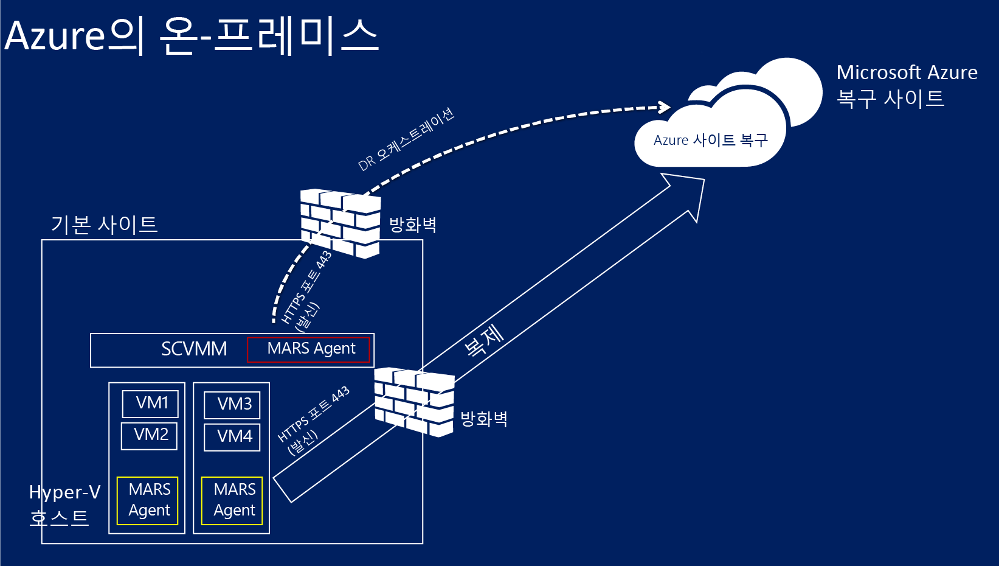

### 네트워크 매핑 필수 조건
Azure 네트워크에서 가상 컴퓨터를 보호하는 경우 매핑은 원본 VMM 서버의 VM 네트워크와 대상 Azure 네트워크 간을 매핑하여 다음을 가능하게 합니다.

- 속해 있는 복구 계획에 관계없이 동일한 네트워크에서 장애 조치(Failover)되는 모든 컴퓨터가 서로 연결할 수 있습니다.
- 네트워크 게이트웨이가 대상 Azure 네트워크에서 설정된 경우 가상 컴퓨터가 다른 온-프레미스 가상 컴퓨터에 연결할 수 있습니다.
- 네트워크 매핑을 구성하지 않으면 동일한 복구 계획에서 장애 조치(Failover)되는 가상 컴퓨터만 Azure로의 장애 조치(Failover) 후에 서로 연결할 수 있습니다.

네트워크 매핑을 배포하려면 다음이 필요합니다.

- 원본 VMM 서버에서 보호할 가상 컴퓨터가 VM 네트워크에 연결되어야 합니다. 해당 네트워크가 클라우드와 연결된 논리 네트워크에 연결되어야 합니다.
- 복제된 가상 컴퓨터가 장애 조치(Failover) 후 연결할 수 있는 Azure 네트워크. 이 네트워크는 장애 조치(Failover) 시 선택합니다. 네트워크가 Azure Site Recovery 구독과 동일한 지역에 있어야 합니다.
- 네트워크 매핑에 대해 자세히 알아봅니다.
	- [VMM에서 논리적 네트워킹 구성](http://go.microsoft.com/fwlink/?LinkId=386307)
	- [VMM에서 VM 네트워크 및 게이트웨이 구성](http://go.microsoft.com/fwlink/?LinkId=386308)
	- [Azure에서 가상 네트워크 구성 및 모니터링](http://go.microsoft.com/fwlink/?LinkId=402555)

## 1단계: 사이트 복구 자격 증명 모음 만들기

1. 등록할 VMM 서버에서 [관리 포털](https://portal.azure.com)에 로그인합니다.

2. 확장
3. *데이터 서비스*, *복구 서비스*를 차례로 확장하고 *사이트 복구 자격 증명 모음*을 클릭합니다.\*
3. *새로 만들기*를 클릭한 다음 *빠른 생성*을 클릭합니다.

4. *이름*에 자격 증명 모음을 식별하기 위한 이름을 입력합니다.

5. *지역*에서 자격 증명 모음에 대한 지리적 지역을 선택합니다. 사용 가능한 지리적 지역에는 동아시아, 서유럽, 미국 서부, 미국 동부, 북유럽, 동남아시아
6. *자격 증명 모음 만들기*를 클릭합니다.

	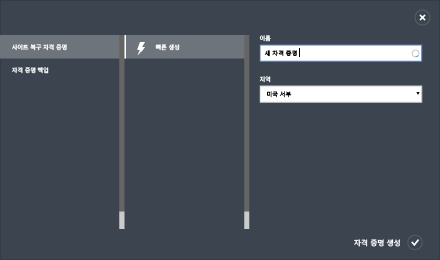

상태 표시줄을 점검하여 자격 증명 모음이 성공적으로 만들어졌는지 확인합니다. 자격 증명 모음은 기본 복구 서비스 페이지에서 *활성*으로 나열됩니다.

## 2단계: 자격 증명 모음 등록 키 생성

자격 증명 모음에 등록 키를 생성합니다. Azure Site Recovery 공급자를 다운로드하고 VMM 서버에 설치한 후 이 키를 사용하여 VMM 서버를 자격 증명 모음에 등록합니다.

1. *복구 서비스* 페이지에서 자격 증명 모음을 클릭하여 빠른 시작 페이지를 엽니다. 빠른 시작은 언제든지 아이콘을 사용하여 열 수도 있습니다.

	

2. 드롭다운 목록에서 **온-프레미스 Hyper-V 사이트와 Microsoft Azure 간**을 선택합니다.
3. **VMM 서버 준비**에서 **등록 키 생성** 파일을 클릭합니다. 키 파일은 자동으로 생성되고 생성된 날부터 5일간 유효합니다. VMM 서버에서 Azure 포털에 액세스하지 않는 경우 이 파일을 서버로 복사해야 합니다.

	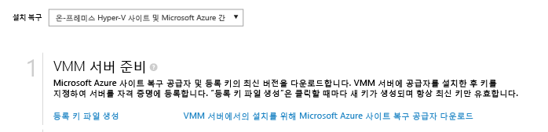

## 3단계: Azure Site Recovery 공급자 설치

4. *빠른 시작* 페이지의 **VMM 서버 준비**에서 *VMM 서버에 설치할 Microsoft Azure 사이트 복구 공급자 다운로드*를 클릭하여 최신 버전의 공급자 설치 파일을 받습니다.

2. 원본 VMM 서버에서 이 파일을 실행합니다. VMM이 클러스터에 배포되고 공급자를 처음 설치하는 경우 활성 노드에 설치하고 설치를 완료하여 VMM 서버를 자격 증명 모음에 등록합니다. 그런 후에 다른 노드에 공급자를 설치합니다. 공급자를 업그레이드하는 경우 모두 동일한 공급자 버전을 실행해야 하므로 모든 노드에서 업그레이드해야 합니다.

3. **사전 요구 사항 확인**에서 공급자 설정을 시작하기 위해 VMM 서비스를 중지하도록 선택합니다. 서비스가 중지되고 설정이 완료될 때 자동으로 다시 시작됩니다. VMM 클러스터에 설치하는 경우 클러스터 역할을 중지하라는 메시지가 표시됩니다.

	

4. **Microsoft 업데이트**에서 업데이트를 선택할 수 있습니다. 이 설정이 사용되면 공급자가 Microsoft 업데이트 정책에 따라 설치됩니다.

	

공급자가 설치된 후에는 설정을 계속 진행하여 자격 증명 모음에 서버를 등록합니다.

5. VMM 서버에서 실행 중인 공급자를 인터넷에 연결하는 방법을 **인터넷 연결**에서 지정합니다. 서버에 구성되어 있는 기본 인터넷 연결 설정을 사용하려면 *기본 시스템 프록시 설정 사용*을 선택합니다.

	 - 사용자 지정 프록시를 사용하려는 경우 공급자를 설치하기 전에 설정해야 합니다. 사용자 지정 프록시 설정을 구성하는 경우 프록시 연결 상태를 확인하기 위한 테스트가 실행됩니다. - 사용자 지정 프록시를 사용하거나 기본 프록시에 인증이 필요할 경우 프록시 주소와 포트를 포함한 프록시 상세 정보를 입력해야 합니다. - 다음 URL은 VMM 서버 및 Hyper-v 호스트에서 액세스할 수 있어야 합니다. - *.hypervrecoverymanager.windowsazure.com - *.accesscontrol.windows.net - *.backup.windowsazure.com - *.blob.core.windows.net - *.store.core.windows.net - [Azure 데이터 센터 IP 범위](http://go.microsoft.com/fwlink/?LinkId=511094) 및 HTTPS(443) 프로토콜에 설명된 IP 주소를 허용하십시오. 사용하려는 Azure 지역 및 미국 서부의 IP 범위를 허용해야 합니다.

	- 사용자 지정 프록시를 사용하는 경우 지정된 프록시 자격 증명을 사용하여 VMM 실행 계정(DRAProxyAccount)이 자동으로 만들어집니다. 이 계정이 성공적으로 인증될 수 있도록 프록시 서버를 구성합니다. VMM 콘솔에서 VMM 실행 계정 설정을 수정할 수 있습니다. 이렇게 하려면 설정 작업 영역을 열고 보안을 확장한 다음 실행 계정을 클릭하고 DRAProxyAccount의 암호를 수정합니다. 이 설정이 적용되도록 VMM 서비스를 다시 시작해야 합니다.

6. **등록 키**에서 Azure 사이트 복구를 다운로드하고 VMM 서버에 복사했다는 것을 선택합니다.
7. **자격 증명 모음 이름**에서 서버를 등록할 자격 증명 모음의 이름을 확인합니다.
8. 자격 증명 모음에서 VMM 서버를 식별하기 위한 이름을 **서버 이름**에서 지정합니다. 클러스터 구성에서 VMM 클러스터 역할 이름을 지정합니다.

	

8. **초기 클라우드 메타데이터** 동기화에서 VMM 서버에 있는 모든 클라우드의 메타데이터를 자격 증명 모음과 동기화할 것인지 여부를 선택합니다. 이 작업은 각 서버에서 한 번만 수행해야 합니다. 모든 클라우드를 동기화하지 않는 경우 이 설정을 선택 취소된 상태로 두고 VMM 콘솔의 클라우드 속성에서 각 클라우드를 개별적으로 동기화할 수 있습니다.

9. **데이터 암호화**에서는 데이터 암호화를 위해 자동으로 생성되는 SSL 인증서를 저장할 위치를 지정합니다. 이 인증서는 Azure 사이트 복구 포털에서 Azure가 보호하는 클라우드에 대해 데이터 암호화를 사용하도록 설정하는 경우 사용되므로 안전하게 보관해야 합니다. Azure로 장애 조치(Failover)를 실행할 때 암호화된 데이터를 암호 해독하기 위해 이 인증서를 선택해야 합니다.

	

8. *등록*을 클릭하여 프로세스를 완료합니다. 등록 후에 VMM 서버의 메타데이터가 Azure Site Recovery에 의해 검색됩니다. 서버가 자격 증명 모음에 있는 *서버* 페이지의 **리소스** 탭 끝에 표시됩니다.

## 4단계: Azure 저장소 계정 만들기

Azure 저장소 계정이 없을 경우 **Azure 저장소 계정 추가**를 클릭합니다. 계정의 지역에서 복제 기능을 사용하도록 설정해야 합니다. 계정은 Azure Site Recovery 서비스와 같은 하위 지역에 있고 같은 구독과 연결되어야 합니다.

## 5단계: Azure 복구 서비스 에이전트 설치

보호할 VMM 클라우드에 있는 각 Hyper-V 호스트 서버에 Azure 복구 서비스 에이전트를 설치합니다.

1. 빠른 시작 페이지에서 <b>Azure Site Recovery 서비스 에이전트 다운로드 및 호스트에 설치</b>를 클릭하여 최신 버전의 에이전트 설치 파일을 받습니다.

	

2. 보호할 VMM 클라우드에 있는 각 Hyper-V 호스트 서버에서 설치 파일을 실행합니다.
3. **필수 조건 확인** 페이지에서 <b>다음</b>을 클릭합니다. 누락된 필수 구성 요소는 자동으로 설치됩니다.

	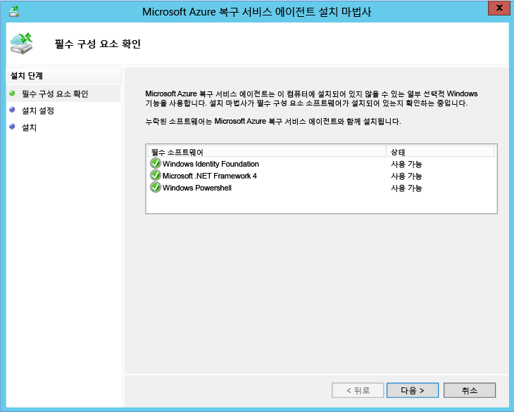

4. **설치 설정** 페이지에서 에이전트를 설치할 위치를 지정하고 백업 메타데이터를 설치할 캐시 위치를 선택합니다. <b>설치</b>를 클릭합니다.

## 6단계: 클라우드 보호 설정 구성

VMM 서버가 등록되면 클라우드 보호 설정을 구성할 수 있습니다. 공급자를 설치할 때 **클라우드 데이터를 자격 증명 모음과 동기화** 옵션을 설정했으므로 VMM 서버에 있는 모든 클라우드가 자격 증명 모음에서 <b>보호되는 항목</b> 탭에 표시됩니다.

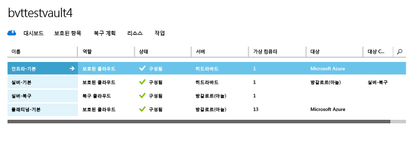

1. 빠른 시작 페이지에서 **VMM 클라우드에 대해 보호 설정**을 클릭합니다.
2. **보호된 항목** 탭에서 구성할 클라우드를 클릭하고 **구성** 탭으로 이동합니다.
3. <b>대상</b>에서 <b>Microsoft Azure</b>를 선택합니다.
4. <b>저장소 계정</b>에서 Azure 가상 컴퓨터 복제 대상으로 사용할 Azure 저장소 계정을 선택합니다.
5. <b>저장된 데이터 암호화</b>를 <b>끄기</b>로 설정합니다. 이 설정은 온-프레미스 사이트와 Azure 간에 복제된 데이터를 암호화하도록 지정합니다.
6. <b>복사 빈도</b>에서 기본 설정을 그대로 둡니다. 이 값은 원본 위치와 대상 위치 사이에 데이터를 동기화해야 하는 빈도를 지정합니다.
7. <b>복구 지점 유지</b>에서 기본 설정을 그대로 둡니다. 기본값인 0인 경우에는 주 가상 컴퓨터의 가장 최근 복구 지점만 복제본 호스트 서버에 저장됩니다.
8. <b>응용 프로그램에 일관된 스냅숏의 빈도</b>에서 기본 설정을 그대로 둡니다. 이 값은 스냅숏을 만드는 빈도를 지정합니다. 스냅숏은 VSS(볼륨 섀도 복사본 서비스)를 사용하여 스냅숏이 만들어질 때 응용 프로그램이 일관된 상태가 되도록 합니다. 값을 설정할 경우 구성할 추가 복구 지점 수보다 적은지 확인하세요.
9. <b>복제 시작 시간</b>에서 Azure로 데이터 초기 복제를 시작하는 시간을 지정합니다. Hyper-V 호스트 서버의 시간대가 사용됩니다. 초기 복제는 사용률이 낮은 시간에 예약하는 것이 좋습니다.

	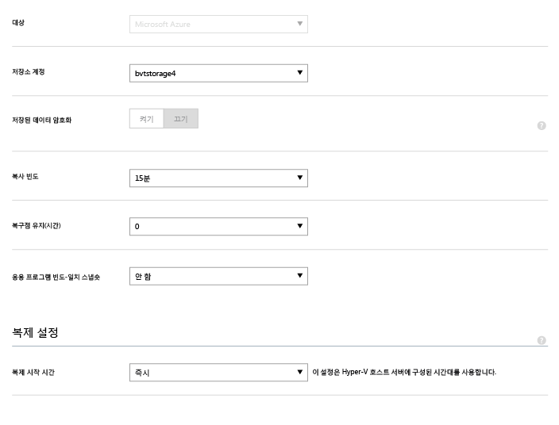

설정을 저장하고 나면 작업이 생성되고 <b>작업</b> 탭에서 모니터링할 수 있습니다. VMM 원본 클라우드에 있는 모든 Hyper-V 호스트 서버가 복제 대상으로 구성됩니다.

저장하고 나면 <b>구성</b> 탭에서 클라우드 설정을 수정할 수 있습니다. 대상 위치 또는 대상 저장소 계정을 수정하려면 클라우드 구성을 제거한 후 클라우드를 다시 구성해야 합니다. 저장소 계정을 변경하면 변경 내용은 저장소 계정이 수정된 후에 보호하도록 설정된 가상 컴퓨터에만 적용됩니다. 기존 가상 컴퓨터는 새 저장소 계정으로 마이그레이션되지 않습니다.

## 7단계: 네트워크 매핑 구성
네트워크 매핑을 시작하기 전에 원본 VMM 서버의 가상 컴퓨터가 VM 네트워크에 연결되었는지 확인합니다. 또한 Azure 가상 네트워크를 하나 이상 만듭니다. 단일 Azure 네트워크에 여러 개의 VM 네트워크를 매핑할 수 있습니다.

1. 퀵스타트 페이지에서 **네트워크 매핑**을 클릭합니다.
2. **네트워크** 탭의 **원본 위치**에서 원본 VMM 서버를 선택합니다. **대상 위치**에서 Azure를 선택합니다.
3. **원본** 네트워크에 VMM 서버와 연결된 VM 네트워크 목록이 표시됩니다. **대상** 네트워크에는 구독과 연결된 Azure 네트워크가 표시됩니다.
4. 원본 VM 네트워크를 선택하고 **매핑**을 클릭합니다.
5. **대상 네트워크 선택** 페이지에서 사용할 대상 Azure 네트워크를 선택합니다.
6. 확인 표시를 클릭하여 매핑 프로세스를 완료합니다.

	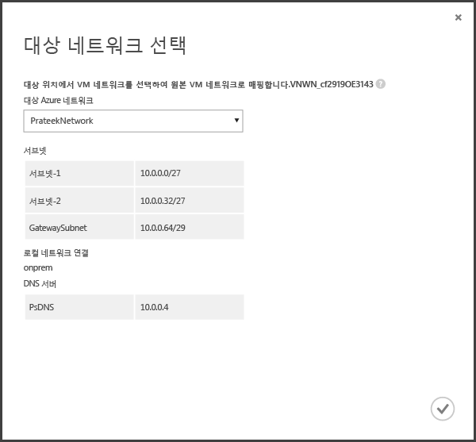

설정을 저장하면 작업이 시작되어 매핑 진행률을 추적하며 작업 탭에서 모니터링할 수 있습니다. 원본 VM 네트워크에 해당하는 기존 복제본 가상 컴퓨터는 모두 대상 Azure 네트워크에 연결됩니다. 원본 VM 네트워크에 연결된 새 가상 컴퓨터는 복제 후 매핑된 Azure 네트워크에 연결됩니다. 새 네트워크로 기존 매핑을 수정하면 복제본 가상 컴퓨터가 새 설정을 사용하여 연결됩니다.

대상 네트워크에 여러 서브넷이 있고 이 서브넷 중 하나의 이름이 원본 가상 컴퓨터가 있는 서브넷과 같으면 복제본 가상 컴퓨터가 장애 조치(Failover) 후에 대상 서브넷에 연결됩니다. 일치하는 이름을 가진 대상 서브넷이 없으면 가상 컴퓨터가 네트워크의 첫 번째 서브넷에 연결됩니다.

## 8단계: 가상 컴퓨터의 보호 활성화

서버, 클라우드 및 네트워크가 제대로 구성되었으면 클라우드에서 가상 컴퓨터에 대한 보호를 설정할 수 있습니다. 다음 사항에 유의하십시오.

- 가상 컴퓨터는 Azure 요구 사항을 충족해야 합니다. 계획 가이드의 <a href="http://go.microsoft.com/fwlink/?LinkId=402602">필수 조건 및 지원</a>에서 해당 요구 사항을 확인하세요.
- 보호를 사용하도록 설정하려면 가상 컴퓨터에 대해 운영 체제 및 운영 체제 디스크 속성을 설정해야 합니다. VMM에서 가상 컴퓨터 템플릿을 사용하여 가상 컴퓨터를 만들 때 속성을 설정할 수 있습니다. 가상 컴퓨터 속성의 **일반** 및 **하드웨어 구성** 탭에서 기존 가상 컴퓨터에 대해 이러한 속성을 설정할 수도 있습니다. 이러한 속성을 VMM에서 설정하지 않는 경우 Azure Site Recovery 포털에서 구성할 수 있습니다.

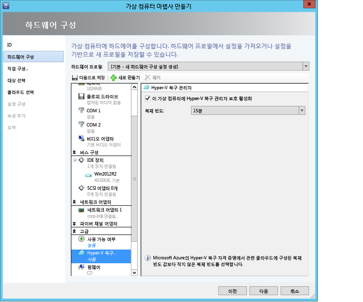

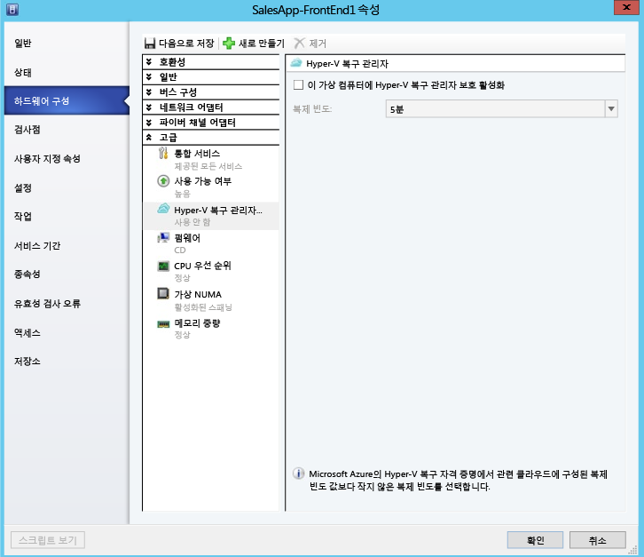

1. 보호를 사용하도록 설정하려면 <b>가상 컴퓨터</b>가 있는 클라우드의 가상 컴퓨터 탭에서 <b>보호 사용</b>을 클릭하고 <b>가상 컴퓨터 추가</b>를 선택합니다.
2. 클라우드에 있는 가상 컴퓨터의 목록에서 보호할 가상 컴퓨터를 선택합니다.

	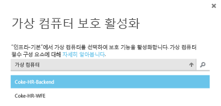

	**작업** 탭에서 초기 복제를 비롯하여 보호 사용 작업의 진행 상태를 추적합니다. 보호 완료 작업이 실행된 후에는 가상 컴퓨터가 장애 조치(Failover)를 수행할 준비가 되어 있습니다. 보호를 사용하도록 설정하고 가상 컴퓨터가 복제되고 나면 Azure에서 가상 컴퓨터를 볼 수 있습니다.

	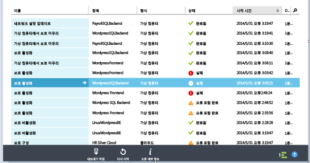

3. 가상 컴퓨터 속성을 확인하고 필요한 대로 수정합니다.

	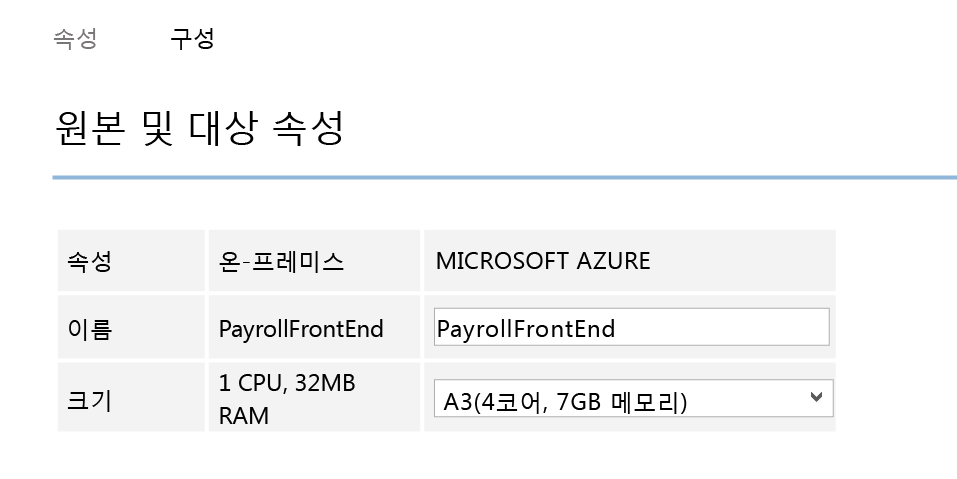

4. 가상 컴퓨터 속성의 구성 탭에서 다음 네트워크 속성을 수정해야 합니다.

    1. 대상 가상 컴퓨터의 네트워크 어댑터 수 - 대상 가상 컴퓨터의 네트워크 어댑터 수는 선택한 가상 컴퓨터의 크기에 다라 달라집니다. 대상 가상 컴퓨터의 네트워크 어댑터 수는 원본 가상 컴퓨터의 네트워크 어댑터 수 이상이어야 하며 선택한 가상 머신 크기에서 지원하는 네트워크 어댑터 수 이하여야 합니다.  

	1. 대상 가상 컴퓨터의 네트워크 - 가상 컴퓨터가 연결하는 네트워크는 네트워크 원본 가상 컴퓨터의 네트워크 매핑으로 결정됩니다. 원본 가상 컴퓨터에 둘 이상의 네트워크 어댑터가 있고 원본 네트워크가 대상의 다른 네트워크에 매핑된 경우 사용자는 대상 네트워크 중 하나를 선택해야 합니다.

	1. 각 네트워크 어댑터의 서브넷 - 사용자는 각 네트워크 어댑터에 대해 장애 조치가 실행된 가상 컴퓨터가 연결할 서브넷을 선택할 수 있습니다.

	1. 대상 IP - 원본 가상 컴퓨터의 네트워크 어댑터가 정적 IP를 사용하도록 구성된 경우 사용자는 대상 가상 컴퓨터의 IP를 입력할 수 있습니다. 사용자는 이 기능을 사용하여 장애 조치(Failover) 후 원본 가상 컴퓨터의 IP를 유지할 수 있습니다. 제공된 IP가 없을 경우 장애 조치(Failover) 시 사용 가능한 임의 IP가 네트워크 어댑터로 제공됩니다. 사용자가 입력한 대상 IP를 이미 Azure에서 실행 중인 다른 가상 컴퓨터에서 사용하고 있을 경우 장애 조치(Failover)가 실패합니다.

		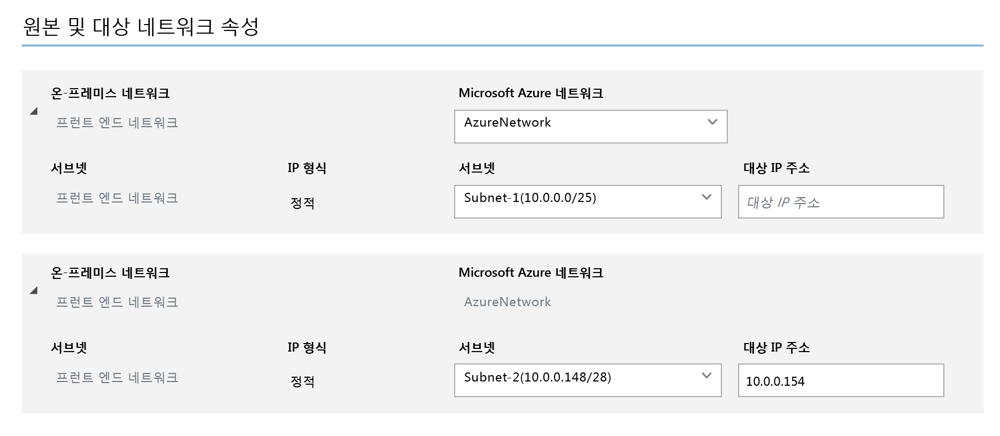

## 배포 테스트
배포를 테스트하려면 단일 가상 컴퓨터에 대한 테스트 장애 조치(Failover)를 실행하거나, 여러 개의 가상 컴퓨터로 구성된 복구 계획을 만들고 이 계획에 대한 테스트 장애 조치(Failover)를 실행하면 됩니다. 테스트 장애 조치(Failover)에서는 격리된 네트워크에서 장애 조치(Failover) 및 복구 메커니즘을 시뮬레이션합니다. 다음 사항에 유의하세요.

- 장애 조치(Failover) 후에 원격 데스크탑을 사용하여 Azure의 가상 컴퓨터에 연결하려면 가상 컴퓨터에서 원격 데스크탑 연결을 사용하도록 설정하고 나서 테스트 장애 조치(Failover)를 실행합니다.
- 장애 조치(Failover) 후에 공개 IP 주소를 사용하여 원격 데스크탑을 통해 Azure의 가상 컴퓨터에 연결합니다. 이 작업을 하려면 공개 주소를 사용하여 가상 컴퓨터에 연결하지 못하도록 차단하는 도메인 정책이 없어야 합니다.

### 복구 계획 만들기

1. **복구 계획** 탭에서 새 계획을 추가합니다. 이름을 지정하고 **원본 유형**에 **VMM**, **원본**에 원본 VMM 서버를 지정합니다. 대상은 Azure입니다.

	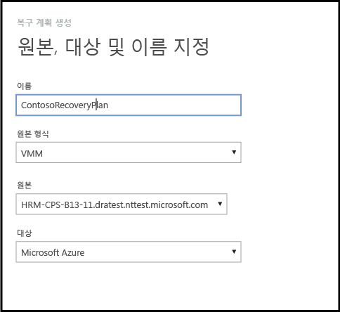

2. **가상 컴퓨터 선택** 페이지에서 복구 계획에 추가할 가상 컴퓨터를 선택합니다. 이러한 가상 컴퓨터는 복구 계획 기본 그룹(그룹 1)에 추가됩니다. 단일 복구 계획에서 최대 100개의 가상 컴퓨터가 테스트되었습니다.

	- 가상 컴퓨터 속성을 계획에 추가하기 전에 검증하려면 가상 컴퓨터가 있는 클라우드의 속성 페이지에서 해당 가상 컴퓨터를 클릭합니다. VMM 콘솔에서 가상 컴퓨터 속성을 구성할 수도 있습니다.
	- 표시되는 가상 컴퓨터는 모두 보호되도록 설정되었습니다. 목록에는 보호되도록 설정되고 초기 복제가 완료된 가상 컴퓨터 및 보호되도록 설정되고 초기 복제가 보류 중인 가상 컴퓨터가 모두 포함됩니다. 초기 복제가 완료된 가상 컴퓨터만 복구 계획의 일부로 장애 조치(Failover)될 수 있습니다. 따라서 복구 계획 장애 조치(Failover)를 시작하기 전에 계획에 포함된 가상 컴퓨터의 초기 복제 상태를 확인합니다.

	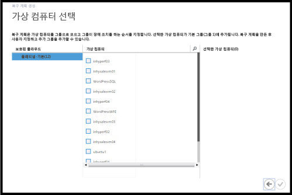

만든 복구 계획은 **복구 계획** 탭에 표시됩니다. 복구 계획에 [Azure 자동화 Runbook](site-recovery-runbook-automation.md)을 추가하여 장애 조치(Failover) 시간 작업을 자동화할 수 있습니다.

### 테스트 장애 조치(Failover) 실행

Azure로의 테스트 장애 조치(Failover)를 실행하는 두 가지 방법이 있습니다.

- Azure 네트워크를 사용하지 않는 테스트 장애 조치(Failover) - 이 유형의 테스트 장애 조치(Failover)는 Azure에서 가상 컴퓨터가 제대로 작동하는지 확인합니다. 장애 조치(Failover) 후에 가상 컴퓨터가 Azure 네트워크에 연결되지 않습니다.
- Azure 네트워크를 사용하는 테스트 장애 조치(Failover) - 이 유형의 테스트 장애 조치(Failover)는 전체 복제 환경이 예상대로 작동하고 장애 조치(Failover)된 가상 컴퓨터가 지정한 대상 Azure 네트워크에 연결되는지 확인합니다. 테스트 장애 조치(Failover)에 대한 서브넷 처리의 경우 테스트 가상 컴퓨터의 서브넷이 복제본 가상 컴퓨터의 서브넷에 따라 확인됩니다. 이는 복제본 가상 컴퓨터의 서브넷이 원본 가상 컴퓨터의 서브넷을 기반으로 하는 일반 복제의 경우와 다릅니다.

Azure 대상 네트워크를 지정하지 않고 Azure로 보호되도록 설정된 가상 컴퓨터에 대해 테스트 장애 조치(Failover)를 실행하려는 경우 아무 것도 준비할 필요가 없습니다. Azure 대상 네트워크를 사용하여 테스트 장애 조치(Failover)를 실행하려면 Azure 프로덕션 네트워크에서 격리된 새 Azure 네트워크를 만들고(Azure에서 새 네트워크를 만들 때의 기본 동작) 복제된 가상 컴퓨터가 예상대로 작동하도록 인프라를 설정해야 합니다. 예를 들어, 도메인 컨트롤러 및 DNS와 가상 컴퓨터를 Azure Site Recovery를 사용하여 Azure에 복제할 수 있으며 테스트 장애 조치를 사용하여 테스트 네트워크에서 만들 수 있습니다. 장애 조치 테스트를 실행하려면 다음 단계를 수행합니다.

1. 온-프레미스 가상 컴퓨터의 실제 장애 조치 테스트에 사용할 것과 동일한 네트워크에서 도메인 컨트롤러 및 DNS와 가상 컴퓨터의 장애 조치 테스트를 수행합니다.
2. 장애 조치된 DNS 가상 컴퓨터에 할당된 IP 주소를 적어 둡니다.
3. 장애 조치에 사용할 Azure 가상 네트워크에서 IP 주소를 DNS 서버의 IP 주소로 추가합니다.
4. Azure 테스트 네트워크를 지정하여 원본 온-프레미스 가상 컴퓨터의 테스트 장애 조치를 실행합니다.
5. 테스트 장애 조치가 예상대로 작동했는지 확인한 후 차례로 복구 계획에 대해 테스트 장애 조치를 완료된 것으로 표시하고, 도메인 컨트롤러 및 DNS 가상 컴퓨터에 대해 테스트 장애 조치를 완료된 것으로 표시합니다.

테스트 장애 조치(Failover)를 실행하려면 다음을 수행합니다.

1. **복구 계획** 탭에서 계획을 선택하고 **테스트 장애 조치**를 클릭합니다.
1. **테스트 장애 조치 확인** 페이지에서 **없음** 또는 특정 Azure 네트워크를 선택합니다. 없음을 선택하면 테스트 장애 조치(Failover)에서 가상 컴퓨터가 Azure로 올바로 복제되었는지 확인하지만 복제 네트워크 구성은 확인하지 않습니다.

	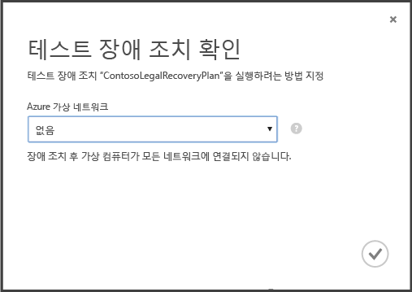

1. 클라우드에 대해 데이터 암호화가 사용하도록 설정된 상태에서 클라우드에 데이터 암호화를 사용하도록 설정하는 옵션을 켤 경우 VMM 서버에 공급자를 설치하는 동안 **암호화 키**에서 발급된 인증서를 선택합니다.
1. **작업** 탭에서 장애 조치 진행률을 추적할 수 있습니다. 또한 Azure 포털에서 가상 컴퓨터 테스트 복제본을 확인할 수 있어야 합니다. 온-프레미스 네트워크에서 가상 컴퓨터에 액세스할 수 있도록 설정한 경우 가상 컴퓨터에 대한 원격 데스크톱 연결을 시작할 수 있습니다.
1. 장애 조치가 **테스트 완료** 단계에 도달하면 **테스트 완료**를 클릭하여 테스트 장애 조치를 완료합니다. **작업** 탭으로 드릴다운하여 장애 조치 진행률 및 상태를 추적하고 필요한 작업을 수행할 수 있습니다.
1. 장애 조치(Failover) 후에는 Azure 포털에서 가상 컴퓨터 테스트 복제본을 확인할 수 있습니다. 온-프레미스 네트워크에서 가상 컴퓨터에 액세스할 수 있도록 설정한 경우 가상 컴퓨터에 대한 원격 데스크톱 연결을 시작할 수 있습니다. 다음 사항에 유의하세요.

    1. 가상 컴퓨터가 성공적으로 시작되는지 확인합니다.
    1. 장애 조치(Failover) 후에 원격 데스크탑을 사용하여 Azure의 가상 컴퓨터에 연결하려면 가상 컴퓨터에서 원격 데스크탑 연결을 사용하도록 설정하고 나서 테스트 장애 조치(Failover)를 실행합니다. 가상 컴퓨터에서 RDP 끝점을 추가해야 합니다. 이를 위해서 [Azure 자동화 Runbook](site-recovery-runbook-automation.md)을 활용할 수 있습니다.
    1. 장애 조치(Failover)는 원격 데스크톱을 사용하여 Azure에서 가상 컴퓨터에 연결하기 위해 공용 IP 주소를 사용하는 경우, 공용 주소를 사용하여 가상 컴퓨터에 연결하지 않는 도메인 정책이 없어야 합니다.

1.  테스트가 완료되면 다음을 수행합니다.
	- **테스트 장애 조치(Failover)가 완료되었습니다**를 클릭합니다. 테스트 환경을 정리하여 자동으로 테스트 가상 컴퓨터의 전원을 끄고 컴퓨터를 삭제합니다.
	- **참고**를 클릭하여 테스트 장애 조치(Failover)와 연관된 항목을 기록한 후 저장합니다.

## 작업 모니터

*작업* 및 *대시보드* 탭을 사용하여 Azure 사이트 복구 자격 증명 모음에서 수행한 주 작업을 보고 모니터링할 수 있습니다. 이러한 작업에는 클라우드에 대한 보호 구성, 가상 컴퓨터의 보호 설정 및 해제, 장애 조치(Failover) 실행(계획됨, 계획되지 않음 또는 테스트), 계획되지 않은 장애 조치(Failover) 커밋이 포함됩니다.

*작업* 탭에서 작업을 보고, 작업 세부 정보 및 오류를 드릴다운하고, 쿼리 작업을 실행하여 특정 조건과 일치하는 작업을 검색하고, 작업을 Excel로 내보내고, 실패한 작업을 다시 시작합니다.

*대시보드*에서는 최신 버전의 공급자 및 에이전트 설치 파일을 다운로드하고, 자격 증명 모음에 대한 구성 정보를 가져오고, 자격 증명 모음에서 보호를 관리하는 가상 컴퓨터의 수를 확인하고, 최근 작업을 보고, 자격 증명 모음 인증서를 관리하고, 가상 컴퓨터를 재동기화할 수 있습니다.

작업 및 대시보드와의 상호 작용에 대한 자세한 내용은 <a href="http://go.microsoft.com/fwlink/?LinkId=398534">작업 및 모니터링 가이드</a>를 참조하십시오.

##다음 단계
<UL>
<LI>정식 프로덕션 환경에서 Azure Site Recovery를 계획하고 배포하려면 <a href="http://go.microsoft.com/fwlink/?LinkId=321294">Azure Site Recovery용 계획 가이드</a> 및 <a href="http://go.microsoft.com/fwlink/?LinkId=321295">Azure Site Recovery용 배포 가이드</a>를 참조하세요.</LI>

<LI>궁금한 사항은 <a href="http://go.microsoft.com/fwlink/?LinkId=313628">Azure 복구 서비스 포럼</a>을 참조하세요.</LI> </UL>
 

<!---HONumber=July15_HO5-->