<properties
	pageTitle="Azure 포털을 통해 Site Recovery를 사용하여 VMM 클라우드의 Hyper-V 가상 컴퓨터를 Azure에 복제 | Microsoft Azure"
	description="Azure Site Recovery를 배포하고 Azure 포털을 사용하여 VMM 클라우드의 Hyper-V VM을 Azure에 복제, 장애 조치(Failover) 및 복구하는 작업을 어떻게 조정해야 하는지 설명합니다."
	services="site-recovery"
	documentationCenter=""
	authors="rayne-wiselman"
	manager="jwhit"
	editor="tysonn"/>

<tags
	ms.service="site-recovery"
	ms.workload="backup-recovery"
	ms.tgt_pltfrm="na"
	ms.devlang="na"
	ms.topic="hero-article"
	ms.date="09/16/2016"
	ms.author="raynew"/>

# Azure 포털을 통해 Azure Site Recovery를 사용하여 VMM 클라우드의 Hyper-V 가상 컴퓨터를 Azure에 복제 | Microsoft Azure

> [AZURE.SELECTOR]
- [Azure 포털](site-recovery-vmm-to-azure.md)
- [Azure 클래식](site-recovery-vmm-to-azure-classic.md)
- [PowerShell Resource Manager](site-recovery-vmm-to-azure-powershell-resource-manager.md)
- [PowerShell 클래식](site-recovery-deploy-with-powershell.md)

Azure Site Recovery에 오신 것을 환영합니다! Azure 포털을 통해 Azure Site Recovery를 사용하여 System Center VMM(Virtual Machine Manager) 클라우드에서 관리되는 온-프레미스 Hyper-V 가상 컴퓨터를 Azure에 복제하려는 경우 이 문서를 사용하세요.

> [AZURE.NOTE] Azure에는 리소스를 만들고 작업하기 위한 두 가지 [배포 모델](../resource-manager-deployment-model)인 Azure Resource Manager 모델과 클래식 모델이 있습니다. 또한 Azure에는 두 가지 포털이 있는데, 하나는 클래식 배포 모델을 지원하는 Azure 클래식 포털이고 다른 하나는 두 가지 배포 모델을 모두 지원하는 Azure 포털입니다.

Azure 포털의 Azure Site Recovery는 여러 새 기능을 제공합니다.

- Azure 포털에는 Azure 백업 및 Azure Site Recovery 서비스가 단일 복구 서비스 자격 증명 모음으로 결합되어 있어서 단일 위치에서 BCDR(비즈니스 연속성 및 재해 복구)을 설정하고 관리할 수 있습니다. 통합 대시보드를 통해 온-프레미스 사이트와 Azure 공용 클라우드의 작업을 모니터링하고 관리할 수 있습니다.
- CSP(클라우드 솔루션 공급자) 프로그램이 포함된 Azure 구독이 있는 사용자는 이제 Azure 포털에서 사이트 복구 작업을 관리할 수 있습니다.
- Azure 포털의 Site Recovery는 Azure Resource Manager 저장소 계정에 컴퓨터를 복제할 수 있습니다. 장애 조치(Failover) 시 Site Recovery는 Azure에 Resource Manager 기반 VM을 만듭니다.
- Site Recovery는 클래식 저장소 계정에 복제하는 작업을 계속해서 지원합니다. 장애 조치(Failover) 시 Site Recovery는 클래식 모델을 사용하여 VM을 만듭니다.

이 문서를 읽은 후 하단의 Disqus 의견에 의견을 남겨 주세요. 기술 관련 문의 사항은 [Azure 복구 서비스 포럼](https://social.msdn.microsoft.com/forums/azure/home?forum=hypervrecovmgr)에 문의하세요.

## 개요

조직에서는 계획된 중단 또는 불의의 중지 시간에 앱, 워크로드 및 데이터를 실행 중이고 가용 상태로 유지하고 가능한 신속히 정상적인 작업 상태로 복귀하기 위한 BCDR 전략이 필요합니다. BCDR 전략은 재해가 발생했을 때 비즈니스 데이터를 안전하고 복구 가능하게 유지하고 워크로드를 지속적으로 가용 상태로 유지해야 합니다.

사이트 복구는 온-프레미스 물리적 서버와 가상 컴퓨터를 클라우드(Azure) 또는 보조 데이터센터에 복제하는 것을 오케스트레이션하여 BCDR(비즈니스 연속성 및 재해 복구) 전략에 기여하는 Azure 서비스입니다. 기본 위치에서 중단이 발생하면 보조 위치로 장애 조치하여 앱과 워크로드를 가용 상태로 유지합니다. 기본 위치가 정상 작업 상태로 돌아오면 다시 기본 위치로 돌아갑니다. [Azure Site Recovery란?](site-recovery-overview.md)에서 자세한 내용을 확인해 보세요.

이 문서에서는 VMM 클라우드의 온-프레미스 Hyper-V VM을 Azure에 복제하는 데 필요한 모든 정보를 제공합니다. Azure, 온-프레미스 서버, 복제 설정 및 용량 계획을 구성하기 위한 아키텍처 개요, 계획 정보 및 배포 단계가 포함되어 있습니다. 인프라를 설정한 후에는 보호하려는 컴퓨터에서 복제를 활성화하고 장애 조치(Failover)가 작동하는지 확인할 수 있습니다.

## 비즈니스 이점

- Site Recovery는 Hyper-V VM에서 실행되는 비즈니스 워크로드 및 응용 프로그램에 오프사이트 보호를 제공합니다.
- 복구 서비스 포털은 복제, 장애 조치(Failover) 및 복구를 설정, 관리 및 모니터링하는 단일 위치를 제공합니다.
- 간편하게 온-프레미스 인프라에서 Azure로 장애 조치(Failover)를 실행하고 Azure에서 온-프레미스 사이트의 Hyper-V 서버로 장애 복구(failback)(복원)를 수행할 수 있습니다.
- 계층화된 응용 프로그램 워크로드가 함께 장애 조치(Failover)되도록 여러 컴퓨터로 복구 계획을 구성할 수 있습니다.

## 시나리오 아키텍처

다음은 시나리오 구성 요소입니다.

- **VMM 서버**: 하나 이상의 클라우드가 있는 온-프레미스 VMM 서버.
- **Hyper-V 호스트 또는 클러스터**: VMM 클라우드에서 관리되는 Hyper-V 호스트 서버 또는 클러스터.
- **Azure Site Recovery 공급자 및 복구 서비스 에이전트**: 배포 중에 Azure Site Recovery 공급자를 VMM 서버에, Microsoft Azure 복구 서비스 에이전트를 Hyper-V 호스트 서버에 설치합니다. VMM 서버의 공급자는 HTTPS 443을 통해 Site Recovery와 통신하여 오케스트레이션을 복제합니다. Hyper-V 호스트 서버의 에이전트는 기본적으로 HTTPS 443을 통해 Azure 저장소로 데이터를 복제합니다.
- **Azure**: Azure 구독, 복제된 데이터를 저장할 Azure Storage 계정, 장애 조치(Failover) 후에 Azure VM이 네트워크에 연결되도록 할 Azure 가상 네트워크가 필요합니다.

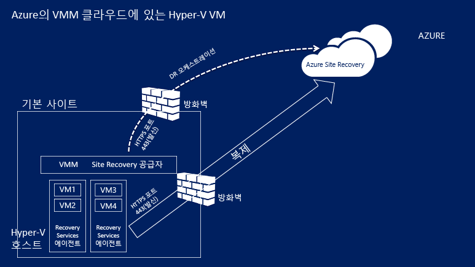

## Azure 필수 조건

이 시나리오를 배포하려면 Azure에서 다음이 필요합니다.

**필수 요소** | **세부 정보**
--- | ---
**Azure 계정**| [Microsoft Azure](http://azure.microsoft.com/) 계정이 있어야 합니다. [무료 평가판](https://azure.microsoft.com/pricing/free-trial/)으로 시작할 수 있습니다. 사이트 복구 가격 책정에 대해 [자세히 알아보세요](https://azure.microsoft.com/pricing/details/site-recovery/).
**Azure 저장소** | 복제된 데이터를 저장하려면 표준 Azure Storage 계정이 있어야 합니다. LRS 또는 GRS 저장소 계정을 사용할 수 있습니다. 지역 정전이 발생하거나 주 지역을 복구할 수 없는 경우에 데이터를 복원할 수 있도록 GRS를 사용하는 것이 좋습니다. [자세히 알아봅니다](../storage/storage-redundancy.md). 계정이 복구 서비스 자격 증명 모음과 동일한 지역에 있어야 합니다.  프리미엄 저장소는 지원되지 않습니다.   복제된 데이터는 Azure 저장소에 저장되고 장애 조치(Failover) 발생 시 Azure VM이 생성됩니다.    Azure 저장소 계정에 대해 [알아보세요](../storage/storage-introduction.md).
**Azure 네트워크** | 장애 조치(Failover) 발생 시 Azure VM에서 연결할 Azure 가상 네트워크가 필요합니다. 네트워크는 복구 서비스 자격 증명 모음과 동일한 지역에 있어야 합니다.

## 온-프레미스 필수 조건

온-프레미스에서 다음 항목이 필요합니다.

**필수 요소** | **세부 정보**
--- | ---
**VMM**| System Center 2012 R2에서 실행되는 VMM 서버가 하나 이상 필요합니다. 각 VMM 서버에 하나 이상의 클라우드가 구성되어 있어야 합니다. 클라우드에    하나 이상의 VMM 호스트 그룹이 있어야 합니다.   각 호스트 그룹에 하나 이상의 Hyper-V 호스트 서버 또는 클러스터가 있어야 합니다.  VMM 클라우드 설정에 대해 [알아보세요](http://www.server-log.com/blog/2011/8/26/vmm-2012-and-the-clouds.html).
**Hyper-V** | Hyper-V 호스트 서버는 Hyper-V 역할로 Windows Server 2012 R2 이상을 실행해야 하며 최신 업데이트가 설치되어 있어야 합니다.   Hyper-V 서버에 VM이 하나 이상 있어야 합니다.   복제하려는 VM이 들어 있는 Hyper-V 호스트 서버 또는 클러스터는 VMM 클라우드에서 관리해야 합니다.  Hyper-V 서버는 인터넷에 직접 또는 프록시를 통해 인터넷에 연결되어야 합니다.  [2961977](https://support.microsoft.com/kb/2961977) 문서에서 언급한 픽스가 Hyper-V서버에 설치되어 있어야 합니다.  Azure에 데이터를 복제하려면 Hyper-V 호스트 서버가 인터넷에 액세스할 수 있어야 합니다.
**공급자 및 에이전트** | Azure Site Recovery를 배포하는 동안 VMM 서버에 Azure Site Recovery 공급자를, Hyper-V 호스트에 복구 서비스 에이전트를 설치하게 됩니다. 공급자 및 에이전트는 인터넷에 직접 또는 프록시를 통해 인터넷에 연결되어야 합니다. HTTPS 기반 프록시는 지원되지 않습니다. VMM 서버의 프록시 서버와 Hyper-V 호스트가 다음에 대한 액세스를 허용해야 합니다.    *.hypervrecoverymanager.windowsazure.com    *.accesscontrol.windows.net    *.backup.windowsazure.com    *.blob.core.windows.net    *.store.core.windows.net  VMM에 IP 주소 기반 방화벽 규칙이 있는 경우 해당 규칙이 Azure와의 통신을 허용하는지 확인해야 합니다. [Azure 데이터 센터 IP 범위](https://www.microsoft.com/download/confirmation.aspx?id=41653) 및 HTTPS(443) 포트를 허용해야 합니다.  구독의 Azure 지역 및 미국 서부에 대한 IP 주소 범위를 허용하세요.  뿐만 아니라 VMM 서버의 프록시 서버가 https://www.msftncsi.com/ncsi.txt에 액세스할 수 있어야 합니다.

## 보호된 컴퓨터 필수 조건

**필수 요소** | **세부 정보**
--- | ---
**보호되는 VM** | VM을 장애 조치(Failover)하려면 Azure VM에 할당될 이름이 [Azure 필수 조건](site-recovery-best-practices.md#azure-virtual-machine-requirements)을 준수하는지 확인해야 합니다. VM에 대한 복제를 활성화한 후 이름을 수정할 수 있습니다.    보호되는 컴퓨터의 개별 디스크 용량이 1023GB 이하여야 합니다. VM은 최대 64개의 디스크(따라서 최대 64TB)를 포함할 수 있습니다.   공유 디스크 게스트 클러스터는 지원되지 않습니다.   UEFI(Unified Extensible Firmware Interface)/EFI(Extensible Firmware Interface) 부팅은 지원되지 않습니다.   원본 VM에 있으면 NIC 팀이 있으면 Azure에 장애 조치(Failover)된 후 단일 NIC로 변환됩니다.  고정 IP 주소를 사용하여 Linux를 실행하는 VM 보호는 지원되지 않습니다.

## 배포 준비

배포를 준비하기 위해 다음을 수행해야 합니다.

1. 장애 조치(failover) 후 Azure VM이 배치될 [Azure 네트워크를 설정](#set-up-an-azure-network)합니다.
2. 복제 데이터를 저장할 [Azure 저장소 계정을 설정](#set-up-an-azure-storage-account)합니다.
4. Site Recovery를 배포할 [VMM 서버를 준비](#prepare-the-vmm-server)합니다.
5. [네트워크 매핑을 준비](#prepare-for-network-mapping)합니다. Site Recovery를 배포하는 동안 네트워크 매핑을 구성할 수 있도록 네트워크를 설정합니다.

### Azure 네트워크 설정

장애 조치(Failover) 후 생성된 Azure VM이 연결될 수 있도록 Azure 네트워크가 필요합니다.

- 이 네트워크는 복구 서비스 자격 증명 모음을 배포할 지역과 동일한 지역에 있어야 합니다.
- 장애 조치(failover)된 Azure VM에 사용하려는 리소스 모델에 따라 [Resource Manager 모드](../virtual-network/virtual-networks-create-vnet-arm-pportal.md) 또는 [클래식 모드](../virtual-network/virtual-networks-create-vnet-classic-pportal.md)에서 Azure 네트워크를 설정합니다.
- 시작하기 전에 네트워크를 설정하는 것이 좋습니다. 그렇지 않으면 Site Recovery를 배포하는 동안 설정해야 합니다.

> [AZURE.NOTE] 동일한 구독 내 또는 구독 간의 리소스 그룹 간에 [Migration of networks](../resource-group-move-resources.md)는 Site Recovery를 배포하는 데 사용되는 네트워크에 대해 지원되지 않습니다.

### Azure 저장소 계정 설정

- Azure로 복제된 데이터를 저장하려면 표준 Azure 저장소 계정이 있어야 합니다. 계정은 복구 서비스 자격 증명 모음과 동일한 지역에 있어야 합니다.
- 장애 조치(failover)된 Azure VM에 사용하려는 리소스 모델에 따라 [Resource Manager 모드](../storage/storage-create-storage-account.md) 또는 [클래식 모드](../storage/storage-create-storage-account-classic-portal.md)에서 계정을 설정합니다.
- 시작하기 전에 계정을 설정하는 것이 좋습니다. 그렇지 않으면 Site Recovery를 배포하는 동안 설정해야 합니다.

> [AZURE.NOTE] 동일한 구독 내 또는 구독 간의 리소스 그룹 간에 [Migration of storage accounts](../resource-group-move-resources.md)는 Site Recovery를 배포하는 데 사용되는 저장소 계정에 대해 지원되지 않습니다.

### VMM 서버 준비

- VMM 서버가 [필수 조건](#on-premises-prerequisites)을 준수하는지 확인합니다.
- Site Recovery를 배포하는 동안 VMM 서버의 모든 클라우드를 Azure 포털에서 사용할 수 있도록 지정할 수 있습니다. 특정 클라우드만 포털에 표시되도록 하려면 VMM 관리 콘솔에서 특정 클라우드에만 해당 설정을 활성화하면 됩니다.

### 네트워크 매핑 준비

Site Recovery를 배포하는 동안 네트워크 매핑을 설정해야 합니다. 네트워크 매핑은 원본 VMM VM 네트워크와 대상 Azure 네트워크 사이를 매핑하여 다음과 같은 것을 가능하게 합니다.

- 동일한 네트워크에서 장애 조치(Failover)되는 컴퓨터는 동일한 방식으로 또는 동일한 복구 계획을 통해 장애 조치(Failover)되지 않더라도 서로 연결할 수 있습니다.
- 네트워크 게이트웨이가 대상 Azure 네트워크에서 설정된 경우 Azure 가상 컴퓨터가 온-프레미스 가상 컴퓨터에 연결할 수 있습니다.
- 네트워크 매핑을 설정하려면 다음 사항을 준비해야 합니다.

	- 원본 Hyper-V 호스트 서버의 VM이 VMM VM 네트워크에 연결되어야 합니다. 해당 네트워크가 클라우드와 연결된 논리 네트워크에 연결되어야 합니다.
	- [위의](#set-up-an-azure-network) 설명대로 설정된 Azure 네트워크

- 네트워크 매핑의 작동 원리에 대해 [알아보세요](site-recovery-network-mapping.md).

## 복구 서비스 자격 증명 모음 만들기

1. [Azure 포털](https://portal.azure.com)에 로그인합니다.
2. **새로 만들기** > **관리** > **복구 서비스**를 클릭합니다. 또는 **찾아보기** > **복구 서비스** 자격 증명 모음 > **추가**를 클릭합니다.

	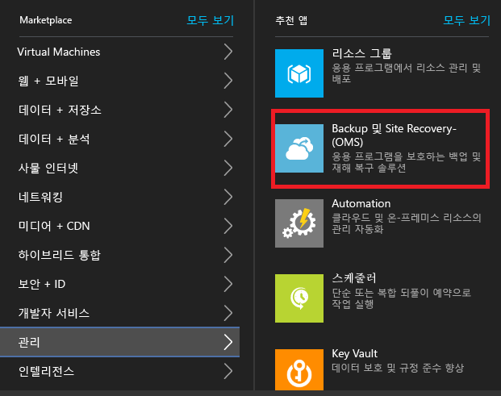

3. **이름**에 자격 증명 모음을 식별하기 위한 이름을 지정합니다. 구독이 두 개 이상인 경우 그중에서 하나를 선택합니다.
4. [리소스 그룹을 만들거나](../resource-group-template-deploy-portal.md) 기존 그룹을 선택합니다. Azure 지역을 지정합니다. 이 지역에 컴퓨터가 복제됩니다. 지원되는 지역을 확인하려면 [Azure 사이트 복구 가격 정보](https://azure.microsoft.com/pricing/details/site-recovery/)에서 지리적 가용성을 참조하십시오.
4. 대시보드에서 자격 증명 모음에 빠르게 액세스하려면 **대시보드에 고정** > **자격 증명 모음 만들기**를 클릭합니다.

	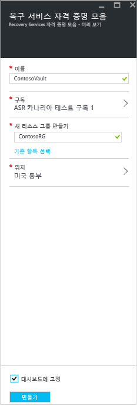

**대시보드** > **모든 리소스**와 주 **복구 서비스 자격 증명 모음** 블레이드에 새 자격 증명 모음이 표시될 것입니다.

## 시작

Site Recovery는 신속한 배포를 도와주는 시작 환경을 제공합니다. 시작은 필수 조건을 확인하고 Site Recovery 배포 단계를 올바른 순서대로 안내합니다.

시작에서 복제할 컴퓨터 유형과 복제할 위치를 선택합니다. 온-프레미스 서버, Azure 저장소 계정 및 네트워크를 설정합니다. 복제 정책을 만들고 용량 계획을 수행합니다. 인프라를 설정한 후 VM에 대한 복제를 활성화합니다. 특정 컴퓨터에 대해 장애 조치(Failover)를 실행하거나 여러 컴퓨터를 장애 조치(Failover)하는 복구 계획을 만들 수 있습니다.

Site Recovery 배포 방법을 선택하여 시작 환경을 시작합니다. 복제 요구 사항에 따라 시작 환경의 흐름이 약간 달라질 수 있습니다.

## 1단계: 보호 목표 선택

복제할 대상과 복제할 위치를 선택합니다.

1. **복구 서비스 자격 증명 모음** 블레이드에서 자격 증명 모음을 선택하고 **설정**을 클릭합니다.
2. **시작**에서 **Site Recovery** > **1단계: 인프라 준비** > **보호 목표**를 클릭합니다.

	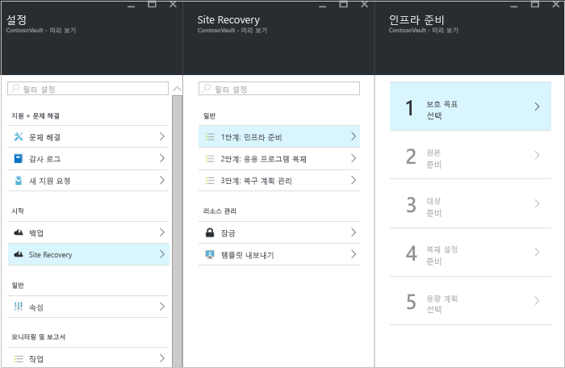

3. **보호 목표**에서 **Azure**를 선택하고 **예, Hyper-V 사용**을 선택합니다. **예**를 선택하여 VMM을 사용하여 Hyper-V 호스트 및 복구 사이트를 관리하기로 확인합니다. 그런 후 **OK**를 클릭합니다.

	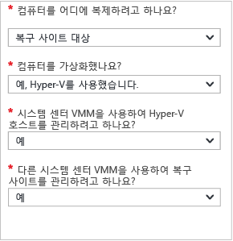

## 2단계: 소스 환경 설정

VMM 서버에 Azure Site Recovery 공급자를 설치하고 자격 증명 모음에 서버를 등록합니다. Hyper-V 호스트에 Azure 복구 서비스 에이전트를 설치합니다.

1. **2단계: 인프라 준비** > **소스**를 클릭합니다.

	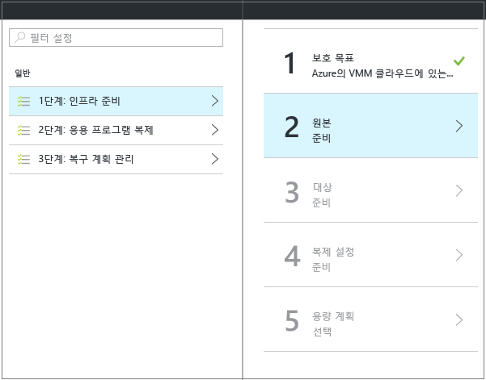

2. **원본 준비**에서 **+VMM**을 클릭하여 VMM 서버를 추가합니다.

	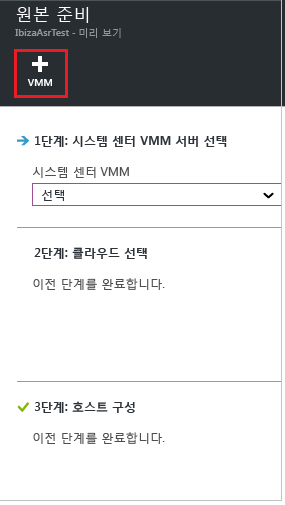

3. **서버 추가** 블레이드에서 **System Center VMM 서버**가 **서버 형식**에 표시되고 VMM 서버가 [필수 조건 및 URL 요구 사항](#on-premises-prerequisites)을 만족하는지 확인합니다.
4. Azure Site Recovery 공급자 설치 파일을 다운로드합니다.
5. 등록 키를 다운로드합니다. 설정을 실행할 때 이 키가 필요합니다. 이 키는 생성된 날로부터 5일간 유효합니다.

	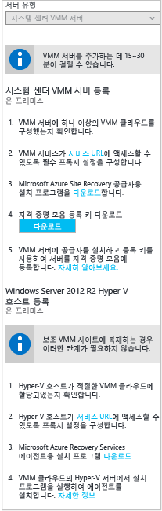

6. VMM 서버에 Azure Site Recovery 공급자를 설치합니다.

### Azure Site Recovery 공급자 설치

1.	공급자 설치 파일을 실행합니다.
2. Microsoft Update 정책에 따라 공급자 업데이트가 설치되도록 **Microsoft Update**에서 업데이트를 선택할 수 있습니다.
3. **설치**에서 기본 공급자 설치 위치를 수락하거나 수정하고 **설치**를 클릭합니다.

	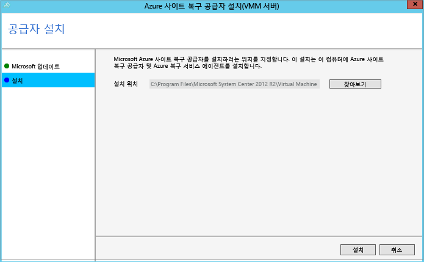

4. 설치가 완료되면 **등록**을 클릭하여 자격 증명 모음에 VMM 서버를 등록합니다.
5. **자격 증명 모음 설정** 페이지에서 **찾아보기**를 클릭하고 자격 증명 모음 키 파일을 선택합니다. Azure Site Recovery 구독 및 자격 증명 모음 이름을 지정합니다.

	

6. VMM 서버에서 실행 중인 공급자가 인터넷을 통해 Site Recovery에 연결하는 방법을 **인터넷 연결**에서 지정합니다.

	- 공급자를 직접 연결하려면 **프록시 없이 Azure Site Recovery에 직접 연결**을 선택합니다.
	- 기존 프록시에 인증이 필요하거나 사용자 지정 프록시를 사용하려면 **프록시 서버를 사용하여 Azure Site Recovery에 연결**을 선택합니다.
	- 사용자 지정 프록시를 사용하는 경우 주소, 포트 및 자격 증명을 지정합니다.
	- 프록시를 사용하는 경우 [필수 조건](#on-premises-prerequisites)에 설명된 URL을 이미 허용했어야 합니다.
	- 사용자 지정 프록시를 사용하는 경우 지정된 프록시 자격 증명을 사용하여 VMM 실행 계정(DRAProxyAccount)이 자동으로 만들어집니다. 이 계정이 성공적으로 인증될 수 있도록 프록시 서버를 구성합니다. VMM 콘솔에서 VMM 실행 계정 설정을 수정할 수 있습니다. **설정**에서 **보안** > **실행 계정**을 확장한 다음 DRAProxyAccount의 암호를 수정합니다. 이 설정이 적용되도록 VMM 서비스를 다시 시작해야 합니다.

	

7. 데이터 암호화를 위해 자동으로 생성되는 SSL 인증서를 저장할 위치를 수락하거나 지정합니다. 이 인증서는 Azure 사이트 복구 포털에서 Azure가 보호하는 클라우드에 대해 데이터 암호화를 사용하도록 설정하는 경우 사용되므로 안전하게 보관해야 합니다. 데이터 암호화가 활성화된 경우 Azure에 장애 조치(Failover)를 실행할 때 암호 해독에 이 인증서가 필요합니다.

8. 자격 증명 모음에서 VMM 서버를 식별하기 위한 이름을 **서버 이름**에서 지정합니다. 클러스터 구성에서 VMM 클러스터 역할 이름을 지정합니다.
9. VMM 서버에 있는 모든 클라우드의 메타데이터를 자격 증명 모음과 동기화하려면 **클라우드 메타데이터 동기화**를 활성화합니다. 이 작업은 각 서버에서 한 번만 수행해야 합니다. 모든 클라우드를 동기화하지 않는 경우 이 설정을 선택 취소된 상태로 두고 VMM 콘솔의 클라우드 속성에서 각 클라우드를 개별적으로 동기화할 수 있습니다. **등록**을 클릭하여 프로세스를 완료합니다.

	

10. 등록이 시작됩니다. 등록이 완료되면 자격 증명 모음의 **설정** > **서버** 블레이드에 서버가 표시됩니다.

#### 명령줄로 Azure Site Recovery 공급자 설치

다음 명령줄에서 Azure Site Recovery 공급자를 설치할 수 있습니다. 이 방법은 Windows Server 2012 R2용 Server Core에 공급자를 설치하는 데 사용할 수 있습니다.

1. 공급자 설치 파일 및 등록 키를 폴더로 다운로드합니다. 예: C:\\ASR.
2. 상승된 명령 프롬프트에서 다음 명령을 실행하여 공급자 설치 관리자를 추출합니다.

	    	C:\Windows\System32> CD C:\ASR
	    	C:\ASR> AzureSiteRecoveryProvider.exe /x:. /q
3. 다음 명령을 실행하여 구성 요소를 설치합니다.

			C:\ASR> setupdr.exe /i

4. 그런 후 다음 이 명령을 실행하여 서버를 자격 증명 모음에 등록합니다.

    	CD C:\Program Files\Microsoft System Center 2012 R2\Virtual Machine Manager\bin
    	C:\Program Files\Microsoft System Center 2012 R2\Virtual Machine Manager\bin> DRConfigurator.exe /r  /Friendlyname <friendly name of the server> /Credentials <path of the credentials file> /EncryptionEnabled <full file name to save the encryption certificate>       

여기서,

- **/Credentials**: 등록 키 파일이 있는 위치를 지정하는 필수 매개 변수입니다.
- **/FriendlyName**: Azure Site Recovery 포털에 나타나는 Hyper-V 호스트 서버의 이름에 대한 필수 매개 변수입니다.
- - **/EncryptionEnabled**: VMM 클라우드의 Hyper-V VM을 Azure에 복제하는 경우에 사용되는 선택적 매개 변수입니다. Azure(암호화 미사용)에서 가상 컴퓨터를 암호화할 것인지 여부를 지정합니다. 파일의 이름에 **.pfx** 확장자가 있는지 확인합니다. 암호화는 기본적으로 꺼져 있습니다.
- **/proxyAddress** : 프록시 서버의 주소를 지정하는 선택적 매개 변수입니다.
- **/proxyport** : 프록시 서버의 포트를 지정하는 선택적 매개 변수입니다.
- **/proxyUsername**: (프록시가 인증을 필요로 하는 경우) 프록시 사용자 이름을 지정하는 선택적 매개 변수입니다.
- **/proxyPassword**: (프록시가 인증을 필요로 하는 경우) 프록시 서버를 인증하기 위한 암호를 지정하는 선택적 매개 변수입니다.

### Hyper-V 호스트에 Azure 복구 서비스 에이전트 설치

1. 공급자를 설치한 후에는 Azure 복구 서비스 에이전트 설치 파일을 다운로드해야 합니다. VMM 클라우드의 각 Hyper-V 서버에서 설치 프로그램을 실행합니다.

	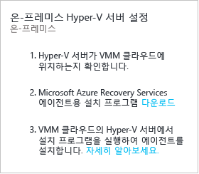

2. **필수 구성 요소 확인** 페이지에서 **다음**을 클릭합니다. 누락된 필수 구성 요소는 자동으로 설치됩니다.

	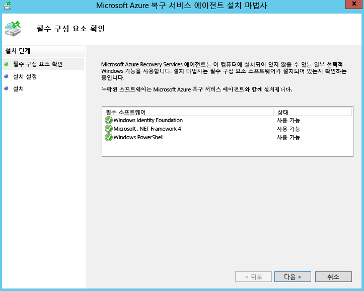

3. **설치 설정** 페이지에서 설치 위치 및 캐시 위치를 수락하거나 수정합니다. 최소 5GB의 저장 공간이 있는 드라이브에 캐시를 구성할 수 있지만 600GB 이상의 여유 공간이 있는 캐시 드라이브에 구성하는 것이 좋습니다. **설치**를 클릭합니다.
4. 설치가 완료되면 **닫기**를 클릭하여 완료합니다.

	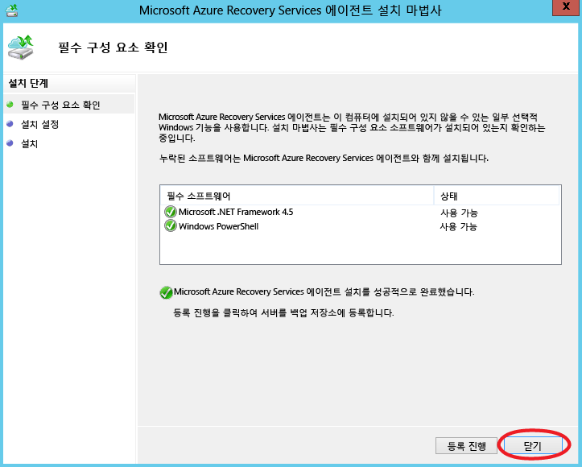

#### 명령줄로 Azure 사이트 복구 서비스 에이전트 설치

다음 명령을 사용하여 명령줄에서 Microsoft Azure 복구 서비스 에이전트를 설치할 수 있습니다.

     marsagentinstaller.exe /q /nu

#### Hyper-V 호스트에서 사이트 복구에 대한 인터넷 프록시 액세스를 설정합니다.

VM을 복제하려면 Hyper-V 호스트에서 실행되는 복구 서비스 에이전트가 인터넷을 통해 Azure에 액세스할 수 있어야 합니다. 프록시를 통해 인터넷에 액세스하는 경우 다음과 같이 프록시를 설정합니다.

1. Hyper-V 호스트에서 Microsoft Azure 백업 MMC 스냅인을 엽니다. 기본적으로 Microsoft Azure 백업에 대한 바로 가기가 바탕 화면 또는 C:\\Program Files\\Microsoft Azure Recovery Services Agent\\bin\\wabadmin에 있습니다.
2. 스냅인에서 **속성 변경**을 클릭합니다.
3. **프록시 구성** 탭에서 프록시 서버 정보를 지정합니다.

	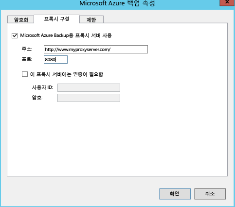

4. 에이전트가 [필수 조건](#on-premises-prerequisites)에 설명된 URL에 연결할 수 있는지 확인합니다.

## 3단계: 대상 환경 설정

복제에 사용될 Azure 저장소 계정과 장애 조치(failover) 후 Azure VM이 연결될 Azure 네트워크를 지정합니다.

1.	**인프라 준비** > **대상**을 클릭하고 사용하려는 Azure 구독을 선택합니다.
2.	장애 조치(failover) 후 VM에 사용하려는 배포 모델을 지정합니다.
3.	Site Recovery가 호환되는 Azure 저장소 계정 및 네트워크가 하나 이상 있는지 확인합니다.

	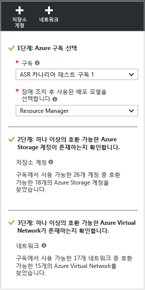

4.	아직 저장소 계정을 만들지 않았으며 Resource Manager를 사용하여 계정을 만들려면 **+저장소 계정**을 클릭하여 인라인에서 계정을 만듭니다. **저장소 계정 만들기** 블레이드에서 계정 이름, 형식, 구독 및 위치를 지정합니다. 계정이 복구 서비스 자격 증명 모음과 같은 위치에 있어야 합니다.

	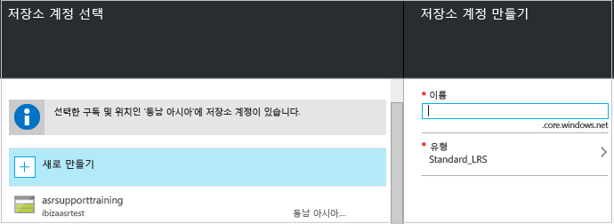

	다음 사항에 유의하세요.

	- 클래식 모델을 사용하여 저장소 계정을 만들려면 Azure 포털에서 만들면 됩니다. [자세히 알아보기](../storage/storage-create-storage-account-classic-portal.md)
	- 복제된 데이터에 프리미엄 저장소 계정을 사용하는 경우 온-프레미스 데이터에 지속적인 변화를 캡처하는 복제 로그를 저장하는 추가 표준 저장소 계정을 설정해야 합니다.

4.	아직 Azure 네트워크를 만들지 않았으며 Resource Manager를 사용하여 네트워크를 만들려면 **+네트워크**를 클릭하여 인라인에서 네트워크를 만듭니다. **가상 네트워크 만들기** 블레이드에서 네트워크 이름, 주소 범위, 서브넷 세부 정보, 구독 및 위치를 지정합니다. 네트워크가 복구 서비스 자격 증명 모음과 같은 위치에 있어야 합니다.

	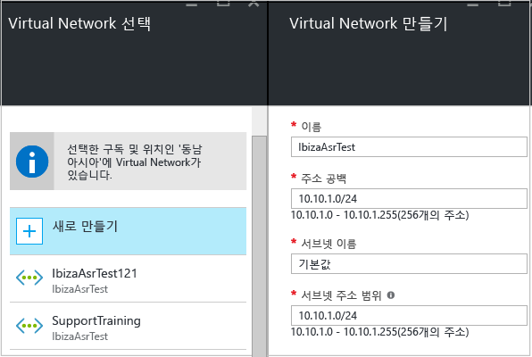

	클래식 모델을 사용하여 네트워크를 만들려면 Azure 포털에서 만들면 됩니다. [자세히 알아봅니다](../virtual-network/virtual-networks-create-vnet-classic-pportal.md).

### 네트워크 매핑 구성

- 네트워크 매핑의 역할에 대한 빠른 개요를 [읽어보세요](#prepare-for-network-mapping). 자세한 설명은 [이 문서를 읽어보세요](site-recovery-network-mapping.md).
- VMM 서버의 가상 컴퓨터가 VM 네트워크에 연결되었으며 Azure 가상 네트워크를 하나 이상 만들었는지 확인합니다. 단일 Azure 네트워크에 여러 개의 VM 네트워크를 매핑할 수 있습니다.

다음과 같이 매핑을 구성합니다.

1. **설정** > **Site Recovery 인프라** > **네트워크 매핑** > **네트워크 매핑**에서 **+네트워크 매핑** 아이콘을 클릭합니다.

	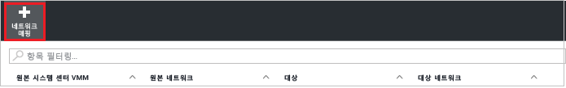

2. **네트워크 매핑 추가**에서 원본 VMM 서버를 선택하고, 대상으로 **Azure**를 선택합니다.
3. 장애 조치(failover) 후 구독과 배포 모델을 확인합니다.
4. **원본 네트워크**에서 VMM 서버에 연결된 목록에서 매핑하려는 원본 온-프레미스 VM 네트워크를 선택합니다.
5. **대상 네트워크**에서 Azure 네트워크를 만들 때 배치될 Azure VM 복제본을 선택합니다. 그런 후 **OK**를 클릭합니다.

	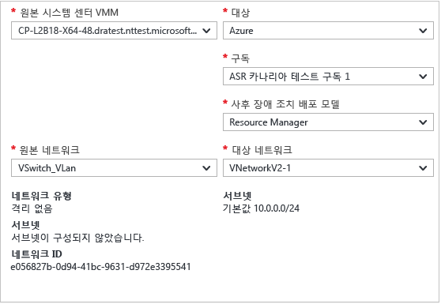

네트워크 매핑이 시작되면 다음과 같은 동작이 발생합니다.

- 원본 VM 네트워크에 있는 기존 VM은 매핑이 시작될 때 대상 네트워크에 연결됩니다. 원본 VM 네트워크에 연결된 새 VM은 복제된 후에 매핑된 Azure 네트워크에 연결됩니다.
- 기존 네트워크 매핑을 수정하면 복제본 가상 컴퓨터가 새 설정을 사용하여 연결됩니다.
- 대상 네트워크에 여러 서브넷이 있고 이 서브넷 중 하나의 이름이 원본 가상 컴퓨터가 있는 서브넷과 같으면 복제본 가상 컴퓨터가 장애 조치(Failover) 후에 대상 서브넷에 연결됩니다.
- 일치하는 이름을 가진 대상 서브넷이 없으면 가상 컴퓨터가 네트워크의 첫 번째 서브넷에 연결됩니다.

## 4단계: 복제 설정 지정

1. 새 복제 정책을 만들려면 **인프라 준비** > **복제 설정** > **+만들기 및 연결**을 클릭합니다.

	

2. **만들기 및 연결 정책**에서 정책 이름을 지정합니다.
3. **복사 빈도**에서 초기 복제 후 델타 데이터를 복제할 빈도(30초마다, 5분마다 또는 15분마다)를 지정합니다.
4. **복구 지점 보존**에서 각 복구 지점에 대해 지속될 보존 시간을 시간 단위로 지정합니다. 보호된 컴퓨터를 이 기간 내의 모든 지점으로 복구할 수 있습니다.
6. **앱 일치 스냅숏 빈도**에서 응용 프로그램 일치 스냅숏이 포함된 복구 지점을 만드는 빈도(1~12시간)를 지정합니다. Hyper-V는 두 가지 유형의 스냅숏, 즉 전체 가상 컴퓨터의 증분 스냅숏을 제공하는 표준 스냅숏과 가상 컴퓨터 내 응용 프로그램 데이터의 지정 시간 스냅숏을 만드는 응용 프로그램 일치 스냅숏을 사용합니다. 응용 프로그램 일치 스냅숏은 VSS(볼륨 섀도 복사본 서비스)를 사용하여 스냅숏을 만들 때 응용 프로그램이 일관된 상태가 되도록 합니다. 응용 프로그램 일치 스냅숏을 사용하도록 설정하면 원본 가상 컴퓨터에서 실행되는 응용 프로그램의 성능에 영향을 줍니다. 구성하는 추가 복구 지점 수보다 작은 값을 설정해야 합니다.
3. **초기 복제 시작 시간**에서 초기 복제를 시작하는 시간을 나타냅니다. 복제는 인터넷 대역폭을 통해 발생하므로 바쁜 시간을 피해서 복제 일정을 예약할 수 있습니다.
5. **Azure에 저장된 데이터 암호화**에서 Azure Storage의 미사용 데이터를 암호화할지 여부를 지정합니다. 그런 후 **OK**를 클릭합니다.

	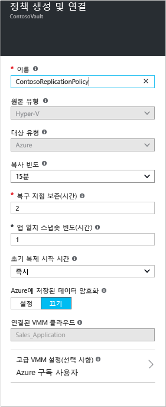

6. 새 정책을 만들면 새 정책이 자동으로 VMM 클라우드에 연결됩니다. **확인**을 클릭합니다. **설정** > **복제** > 정책 이름 > **VMM 클라우드 연결**에서 추가 VMM 클라우드(및 그 안에 포함된 VM)를 이 복제 정책과 연결할 수 있습니다.

	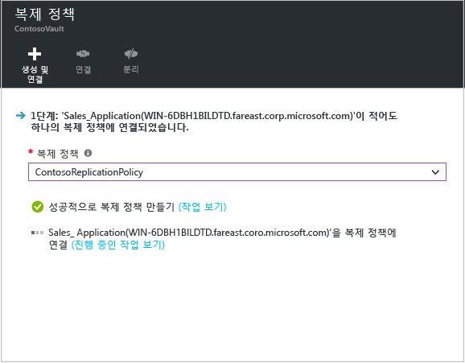

## 5단계: 용량 계획

기본 인프라를 설치했으니 용량 계획에 대해 생각해 보고 추가 리소스가 필요한지 파악할 수 있습니다.

Site Recovery는 원본 환경, 사이트 복구 구성 요소, 네트워킹 및 저장소에 적절한 리소스를 할당할 수 있도록 도와주는 Capacity Planner를 제공합니다. 평균 VM, 디스크 및 저장소 수를 기반으로 예측하는 빠른 모드 또는 워크로드 수준에서 숫자를 입력하는 세부 모드에서 플래너를 실행할 수 있습니다. 시작하기 전에 다음을 수행해야 합니다.

- VM, VM당 디스크, 디스크당 저장소를 포함하여 복제 환경에 대한 정보를 수집합니다.
- 복제된 데이터에 대한 일일 변경(이탈)률을 예측합니다. [Hyper-V 복제본용 Capacity Planner](https://www.microsoft.com/download/details.aspx?id=39057)를 사용하면 이 작업을 간편하게 수행할 수 있습니다.

1.	**다운로드**를 클릭하여 도구를 다운로드한 후 실행하세요. 도구와 함께 제공되는 [문서를 읽어보세요](site-recovery-capacity-planner.md).
2.	작업을 마쳤으면 **Capacity Planner를 실행하셨습니까**?에서 **예**를 선택합니다.

	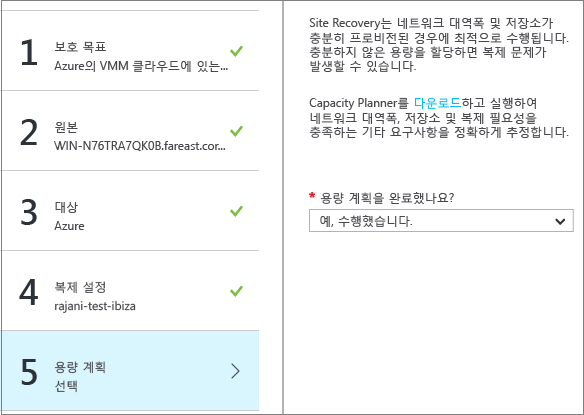

### 네트워크 대역폭 고려 사항

Capacity Planner 도구를 사용하여 복제(초기 복제 그 후에 델타)에 필요한 대역폭을 계산할 수 있습니다. 복제에 사용되는 대역폭 사용량을 제어하는 몇 가지 옵션이 있습니다.

- **대역폭 제한**: 보조 사이트에 복제되는 Hyper-V 트래픽이 특정 Hyper-V 호스트를 통과합니다. 호스트 서버의 대역폭을 제한할 수 있습니다.
- **대역폭 조정**: 몇 가지 레지스트리 키를 사용하면 복제에 사용되는 대역폭에 영향을 줄 수 있습니다.

#### 대역폭 제한

1. Hyper-V 호스트 서버에서 Microsoft Azure 백업 MMC 스냅인을 엽니다. 기본적으로 Microsoft Azure 백업에 대한 바로 가기가 바탕 화면 또는 C:\\Program Files\\Microsoft Azure Recovery Services Agent\\bin\\wabadmin에 있습니다.
2. 스냅인에서 **속성 변경**을 클릭합니다.
3. **제한** 탭에서 **백업 작업에 인터넷 대역폭 사용 제한 사용**을 선택하고 근무 시간 및 근무 외 시간에 대한 한도를 설정합니다. 유효 범위는 초당 512Kbps~102Mbp입니다.

	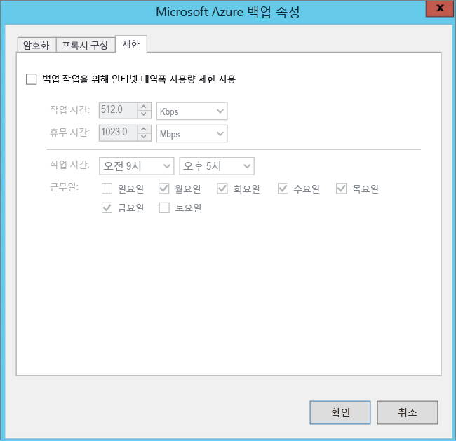

[Set-OBMachineSetting](https://technet.microsoft.com/library/hh770409.aspx) cmdlet를 사용하여 제한을 설정할 수도 있습니다. 다음은 샘플입니다.

    $mon = [System.DayOfWeek]::Monday
    $tue = [System.DayOfWeek]::Tuesday
    Set-OBMachineSetting -WorkDay $mon, $tue -StartWorkHour "9:00:00" -EndWorkHour "18:00:00" -WorkHourBandwidth  (512*1024) -NonWorkHourBandwidth (2048*1024)

**Set-OBMachineSetting -NoThrottle**은 제한이 필요 없다는 뜻입니다.

#### 네트워크 대역폭에 영향

**UploadThreadsPerVM** 레지스트리 값은 디스크의 데이터 전송(초기 또는 델타 복제)에 사용되는 스레드 수를 제어합니다. 값이 높을수록 복제에 사용되는 네트워크 대역폭이 증가합니다. **DownloadThreadsPerVM** 레지스트리 값은 장애 복구를 수행하는 동안 데이터 전송에 사용되는 스레드 수를 지정합니다.

1. 레지스트리에서 **HKEY\_LOCAL\_MACHINE\\SOFTWARE\\Microsoft\\Windows Azure Backup\\Replication**으로 이동합니다.

	- **UploadThreadsPerVM** 값을 수정하여(또는 해당 키가 없는 경우 키를 만들어서) 디스크 복제에 사용되는 스레드를 제어합니다.
	- **DownloadThreadsPerVM** 값을 수정하여(또는 해당 키가 없는 경우 키를 만들어서) Azure의 장애 복구 트래픽에 사용되는 스레드를 제어합니다.
2. 기본값은 4입니다. "과도하게 프로비전된" 네트워크에서는 이러한 레지스트리 키를 기본값에서 변경해야 합니다. 최대값은 32입니다. 트래픽을 모니터링하여 값을 최적화합니다.

## 6단계: 복제 활성화

이제 다음과 같이 복제를 활성화합니다.

1. **2단계: 응용 프로그램 복제** > **소스**를 클릭합니다. 처음으로 복제를 활성화한 후 자격 증명 모음에서 **+복제**를 클릭하여 추가 컴퓨터에 대해 복제를 활성화합니다.

	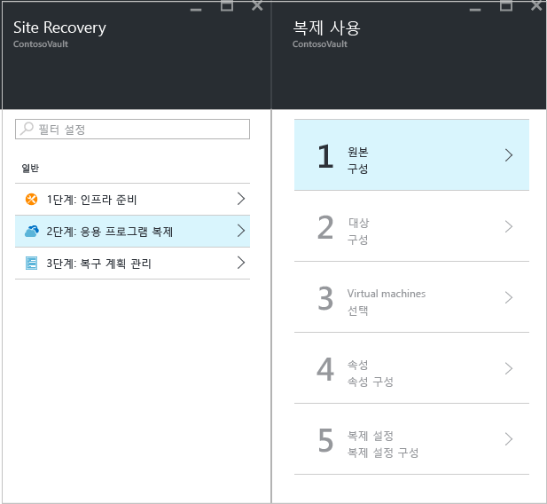

2. **원본** 블레이드에서 Hyper-V 호스트가 배치된 VMM 서버 및 클라우드를 선택합니다. 그런 후 **OK**를 클릭합니다.

	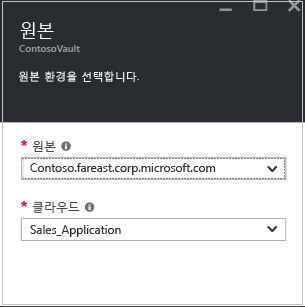

3. **대상**에서 구독, 장애 조치(Failover) 후 배포 모델 및 복제된 데이터에 사용 중인 저장소 계정을 선택합니다.

	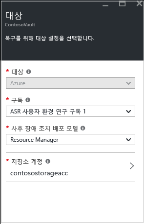

4. 사용하려는 저장소 계정을 선택합니다. 갖고 있는 저장소 계정 말고 다른 저장소 계정을 사용하려면 [새로 만듭니다](#set-up-an-azure-storage-account). Resource Manager 모델을 사용하여 저장소 계정을 만들려면 **새로 만들기**를 클릭합니다. 클래식 모델을 사용하여 저장소 계정을 만들려면 [Azure 포털에서](../storage/storage-create-storage-account-classic-portal.md) 만들면 됩니다. 그런 후 **OK**를 클릭합니다.
5. 장애 조치(Failover) 후 Azure VM이 회전하면 연결될 Azure 네트워크 및 서브넷을 선택합니다 보호를 위해 선택한 모든 컴퓨터에 네트워크 설정을 적용하려면 **선택한 컴퓨터에 대해 지금 구성**을 선택합니다. 컴퓨터마다 Azure 네트워크를 선택하려면 **나중에 구성**을 선택합니다. 갖고 있는 네트워크 말고 다른 네트워크를 사용하려면 [새로 만듭니다](#set-up-an-azure-network). Resource Manager 모델을 사용하여 네트워크를 만들려면 **새로 만들기**를 클릭합니다. 클래식 모델을 사용하여 [Azure 포털](../virtual-network/virtual-networks-create-vnet-classic-pportal.md)에서 네트워크를 만들 수 있습니다. 해당하는 경우 서브넷을 선택합니다. 그런 후 **OK**를 클릭합니다.
6. **가상 컴퓨터** > **가상 컴퓨터 선택**에서 복제하려는 각 컴퓨터를 클릭하여 선택합니다. 복제를 활성화할 수 있는 컴퓨터만 선택할 수 있습니다. 그런 후 **OK**를 클릭합니다.

	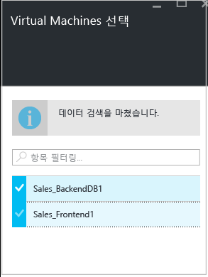

5. **속성** > **속성 구성**에서 선택한 VM의 운영 체제 및 OS 디스크를 선택합니다. 그런 후 **OK**를 클릭합니다. 나중에 추가 속성을 설정할 수 있습니다.

	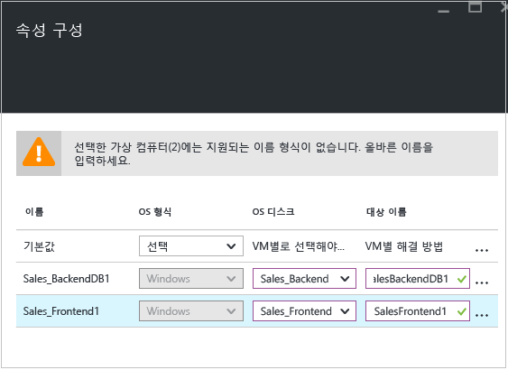

12. **복제 설정** > **복제 설정 구성**에서 보호되는 VM에 적용할 복제 정책을 선택합니다. 그런 후 **OK**를 클릭합니다. **설정** > **복제 정책** > 정책 이름 > **설정 편집**에서 복제 정책을 수정할 수 있습니다. 적용하는 변경 사항은 이미 복제 중인 컴퓨터와 새 컴퓨터에 사용됩니다.

	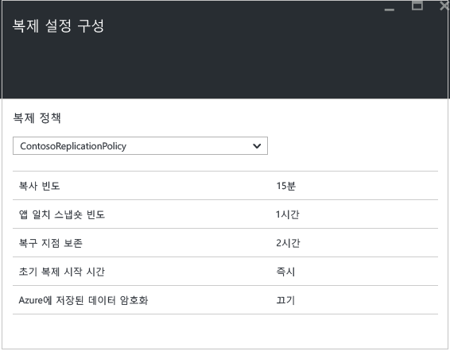

**설정** > **작업** > **사이트 복구 작업**에서 **보호 사용** 작업의 진행률을 추적할 수 있습니다. **보호 완료** 작업이 실행된 후에는 컴퓨터가 장애 조치(failover)를 수행할 준비가 되어 있습니다.

### VM 속성 보기 및 관리

원본 컴퓨터의 속성을 확인하는 것이 좋습니다. Azure VM 이름이 [Azure 가상 컴퓨터 요구 사항](site-recovery-best-practices.md#azure-virtual-machine-requirements)에 맞아야 합니다.

1. **설정** > **보호된 항목** > **복제된 항목**을 클릭하고 세부 정보를 보고 싶은 컴퓨터를 선택합니다.

	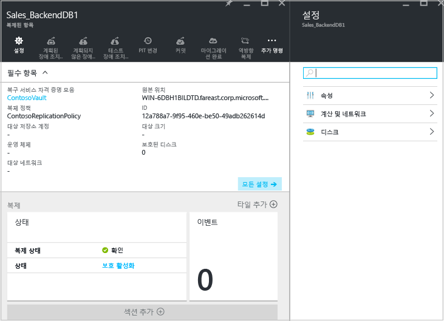

2. **속성**에서 해당 VM에 대한 복제 및 장애 조치(failover) 정보를 볼 수 있습니다.

	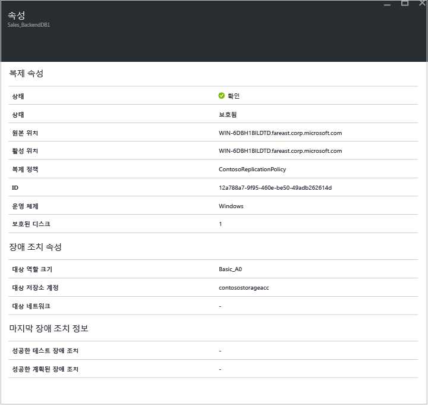

3. **계산 및 네트워크** > **계산 속성**에서 Azure VM 이름 및 대상 크기를 지정할 수 있습니다. 필요한 경우 [Azure 요구 사항](site-recovery-best-practices.md#azure-virtual-machine-requirements)을 준수하도록 이름을 수정합니다. 또한 대상 네트워크, 서브넷 및 Azure VM에 할당될 IP 주소에 대한 정보를 보고 수정할 수 있습니다. 다음 사항에 유의하세요.

	- 대상 IP 주소를 설정할 수 있습니다. 주소를 입력하지 않으면 장애 조치(Failover)된 컴퓨터가 DHCP를 사용합니다. 장애 조치(Failover) 시 사용할 수 없는 주소를 설정하면 장애 조치(Failover)가 실패합니다. 주소를 테스트 장애 조치(Failover) 네트워크에서 사용할 수 있는 경우 테스트 장애 조치(Failover)에 동일한 대상 IP 주소를 사용해도 됩니다.
	- 네트워크 어댑터 수는 다음과 같이 대상 가상 컴퓨터에 대해 지정하는 크기에 따라 결정됩니다.

		- 원본 컴퓨터의 네트워크 어댑터 수가 대상 컴퓨터 크기에 허용되는 어댑터 수보다 작거나 같은 경우, 대상의 어댑터 수는 소스와 동일해야 합니다.
		- 원본 가상 컴퓨터의 어댑터의 수가 대상 크기에 허용된 수를 초과하면 대상 크기 최대치가 사용됩니다.
		- 예를 들어 원본 컴퓨터에 두 네트워크 어댑터가 있고 대상 컴퓨터 크기가 4를 지원하는 경우, 대상 컴퓨터에는 2개의 어댑터가 있어야 합니다. 원본 컴퓨터에 두 어댑터가 있지만 지원되는 대상 크기가 하나만 지원하는 경우 대상 컴퓨터에는 1개의 어댑터만 있어야 합니다.
		- VM에 네트워크 어댑터가 여러 개 있으면 모두 동일한 네트워크에 연결됩니다.

	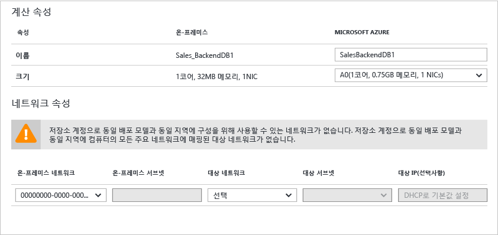

5.	**디스크**에서 복제될 VM의 운영 체제 및 데이터 디스크를 볼 수 있습니다.

## 7단계: 배포 테스트

배포를 테스트하기 위해 단일 가상 컴퓨터에 대한 테스트 장애 조치(Failover)를 실행하거나 하나 이상의 가상 컴퓨터를 포함한 복구 계획을 실행할 수 있습니다.

### 장애 조치(Failover) 준비

- 테스트 장애 조치(Failover)를 실행하려면 Azure 프로덕션 네트워크에서 격리된 새 Azure 네트워크를 만드는 것이 좋습니다(Azure에서 새 네트워크를 만들 때의 기본 동작). 테스트 장애 조치(failover)에 대해 [자세히 알아보세요](site-recovery-failover.md#run-a-test-failover).
- Azure에 장애 조치(failover)를 수행할 때 최상의 성능을 얻으려면 보호된 컴퓨터에 Azure 에이전트를 설치해야 합니다. 부팅 속도가 빨라지고 문제 해결에 도움이 됩니다. [Linux](https://github.com/Azure/WALinuxAgent) 또는 [Windows](http://go.microsoft.com/fwlink/?LinkID=394789) 에이전트를 설치합니다.
- 배포를 완전하게 테스트하려면 복제된 컴퓨터가 예상대로 작동할 수 있는 인프라가 필요합니다. Active Directory 및 DNS를 테스트하려면 DNS를 사용하여 도메인 컨트롤러로 가상 컴퓨터를 만들고 Azure Site Recovery를 사용하여 이 가상 컴퓨터를 Azure에 복제합니다. [Active Directory에 대한 테스트 장애 조치(failover) 고려 사항](site-recovery-active-directory.md#considerations-for-test-failover)에 대해 자세히 알아보세요.
- 테스트 장애 조치(Failover) 대신 계획되지 않은 장애 조치(Failover)를 실행하려면 다음 사항에 주의하세요.

	- 가능한 경우 계획되지 않은 장애 조치를 실행하기 전에 주 컴퓨터를 종료해야 합니다. 이렇게 하면 원본 및 복제본 컴퓨터가 동시에 실행되지 않아도 됩니다.
	- 계획되지 않은 장애 조치를 실행하면 주 컴퓨터에서 데이터 복제를 중지하므로 계획되지 않은 장애 조치가 시작된 후 모든 데이터 델타가 전송되지 않습니다. 또한 복구 계획에서 계획되지 않은 장애 조치(Failover)를 실행하면 오류가 발생하더라도 완료될 때까지 실행됩니다.

### 장애 조치(Failover) 후 Azure VM에 연결할 준비

장애 조치(Failover) 후 RDP를 사용하여 Azure VM에 연결하려면 다음을 수행해야 합니다.

**장애 조치(failover) 전에 온-프레미스 컴퓨터에서**:

- 인터넷 지원 RDP를 통해 액세스하려면 TCP 및 UDP 규칙을 **공용**에 추가하고, 모든 프로필의 **Windows 방화벽** -> **허용되는 앱 및 기능**에서 RDP를 허용해야 합니다.
- 사이트 간 연결을 통해 액세스하려면 컴퓨터에서 RDP를 활성화하고, **도메인** 및 **개인** 네트워크의 **Windows 방화벽** -> **허용되는 앱 및 기능**에서 RDP를 허용해야 합니다.
- 온-프레미스 컴퓨터에 [Azure VM 에이전트](http://go.microsoft.com/fwlink/?LinkID=394789&clcid=0x409)를 설치합니다.
- 운영 체제의 SAN 정책이 OnlineAll로 설정되어 있는지 확인합니다. [자세히 알아보기](https://support.microsoft.com/kb/3031135)
- 장애 조치(Failover)를 실행하기 전에 IPSec 서비스를 끕니다.

**장애 조치(failover) 후 Azure VM에서**:

- RDP 프로토콜(포트 3389)에 대한 공용 끝점을 추가하고 로그인 자격 증명을 지정합니다.
- 공개 주소를 사용하여 가상 컴퓨터에 연결하지 못하도록 차단하는 도메인 정책이 없는지 확인합니다.
- 연결을 시도합니다. 연결할 수 없으면 VM이 실행 중인지 확인합니다. 자세한 문제 해결 팁은 이 [문서](http://social.technet.microsoft.com/wiki/contents/articles/31666.troubleshooting-remote-desktop-connection-after-failover-using-asr.aspx)를 참조하세요.

ssh(보안 셸 클라이언트)를 사용하여 장애 조치(Failover) 후 Linux를 실행하는 Azure VM에 액세스하려면 다음 작업을 수행합니다.

**장애 조치(failover) 전에 온-프레미스 컴퓨터에서**:

- Azure VM의 보안 셸 서비스가 시스템 부팅 시 자동으로 시작되도록 설정되어 있는지 확인합니다.
- 방화벽 규칙이 SSH 연결을 허용하는지 확인합니다.

**장애 조치(failover) 후 Azure VM에서**:

- 장애 조치(Failover)된 VM 그리고 해당 VM이 연결된 Azure 서브넷의 네트워크 보안 그룹 규칙이 SSH 포트로 들어오는 연결을 허용해야 합니다.
- SSH 포트(기본적으로 TCP 포트 22)로 들어오는 연결을 허용하려면 공용 끝점을 만들어야 합니다.
- VPN 연결(Express 경로 또는 사이트 간 VPN)을 통해 VM에 액세스하는 경우 클라이언트를 사용하여 SSH를 통해 VM에 직접 연결할 수 있습니다.

### 테스트 장애 조치(Failover) 실행

테스트 장애 조치를 실행하려면 다음을 수행합니다.

1. 단일 VM을 장애 조치(Failover)하려면 **설정** > **복제된 항목**에서 VM > **+테스트 장애 조치(Failover)**를 클릭합니다.
2. 복구 계획을 장애 조치(Failover)하려면 **설정** > **복구 계획**에서 계획을 마우스 오른쪽 버튼으로 클릭하고 **테스트 장애 조치(Failover)**를 클릭합니다. 복구 계획을 만들려면 [다음 지침을 따릅니다](site-recovery-create-recovery-plans.md).

3. **테스트 장애 조치(Failover)**에서 장애 조치(Failover)가 발생한 후에 Azure VM이 연결될 Azure 네트워크를 선택합니다.
4. **확인**을 클릭하여 장애 조치(Failover)를 시작합니다. VM을 클릭하고 속성을 열거나 **설정** > **Site Recovery 작업**의 **테스트 장애 조치(Failover)** 작업에서 진행률을 추적할 수 있습니다.
5. 장애 조치(Failover)가 **테스트 완료** 단계에 도달하면 다음 작업을 수행합니다.

	1. Azure 포털에서 복제본 가상 컴퓨터를 봅니다. 가상 컴퓨터가 성공적으로 시작되는지 확인합니다.
	2. 온-프레미스 네트워크에서 가상 컴퓨터에 액세스할 수 있도록 설정한 경우 가상 컴퓨터에 대한 원격 데스크톱 연결을 시작할 수 있습니다.
	3. **테스트 완료**를 클릭하여 테스트를 마칩니다.
	4. **참고**를 클릭하여 테스트 장애 조치(Failover)와 연관된 항목을 기록한 후 저장합니다.
	5. **테스트 장애 조치(Failover)가 완료되었습니다**를 클릭합니다. 테스트 환경을 정리하여 자동으로 테스트 가상 컴퓨터의 전원을 끄고 컴퓨터를 삭제합니다.
	6. 이 단계에서는 테스트 장애 조치(Failover) 중에 자동으로 생성된 모든 요소 또는 VM이 삭제됩니다. 테스트 장애 조치(Failover)를 위해 만든 모든 추가 요소는 삭제되지 않습니다.

	> [AZURE.NOTE] 테스트 장애 조치(Failover)가 2주 이상 지속되면 강제로 완료됩니다.

6. 또한 장애 조치(failover)가 완료된 후 Azure 포털 > **가상 컴퓨터**에 Azure 컴퓨터 복제본이 나타나는 것을 확인할 수 있습니다. VM의 크기가 적당하고, 올바른 네트워크에 연결되었고, 실행 중인지 확인해야 합니다.
7. [장애 조치(failover) 후 연결을 준비](#prepare-to-connect-to-Azure-VMs-after-failover)하는 경우 Azure VM에 연결할 수 있어야 합니다.

## 배포 모니터링

다음과 같이 Site Recovery 배포의 구성 설정 및 상태를 모니터링할 수 있습니다.

1. 자격 증명 모음 이름을 클릭하여 **Essentials** 대시보드에 액세스합니다. 이 대시보드에서 Site Recovery 작업, 복제 상태, 복구 계획, 서버 상태 및 이벤트를 모니터링할 수 있습니다. 다른 Site Recovery 및 백업 자격 증명 모음의 상태를 포함하여 가장 유용한 타일과 레이아웃을 표시하도록 Essentials를 사용자 지정할 수 있습니다.

	

2. **상태** 타일에서 문제가 있는 사이트 서버(VMM 또는 구성 서버)와 지난 24시간 동안 사이트 복구에 의해 발생한 이벤트를 모니터링할 수 있습니다.
3. **복제된 항목**, **복구 계획** 및 **사이트 복구 작업** 타일에서 복제를 관리 및 모니터링할 수 있습니다. **설정** -> **작업** -> **사이트 복구 작업**에서 작업을 자세히 살펴볼 수 있습니다.

## 다음 단계

배포가 설정되고 실행된 후에는 다양한 형식의 장애 조치(Failover)에 대해 [자세히 알아보세요](site-recovery-failover.md).

<!---HONumber=AcomDC_0928_2016-->