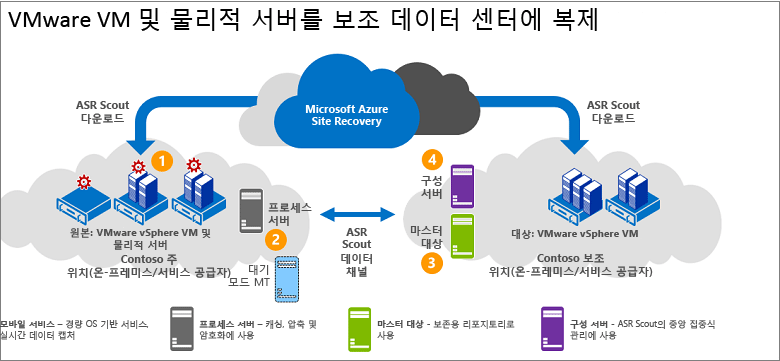

# VMware용 아키텍처/보조 온-프레미스 사이트에 물리적 서버 복제

이 문서에서는 [Azure Site Recovery](site-recovery-overview.md)를 사용하여 온-프레미스 VMware VM(가상 머신) 또는 실제 Windows/Linux 서버를 보조 VMware 사이트로 재해 복구 복제, 장애 조치(failover) 및 복구를 설정할 때 사용되는 아키텍처와 프로세스에 대해 설명합니다.

## 아키텍처 구성 요소

**영역** | **구성 요소** | **세부 정보**
--- | --- | ---
**Azure** | InMage Scout를 사용하여 이 시나리오를 배포합니다. | InMage Scout를 얻으려면 Azure 구독이 필요합니다.   Recovery Services 자격 증명 모음을 만든 후에 InMage Scout를 다운로드하고 최신 업데이트를 설치하여 배포를 설정합니다.
**프로세스 서버** | 기본 사이트에 있음 | 프로세스 서버를 배포하여 캐시, 압축 및 데이터 최적화를 처리합니다.   또한 보호하려는 컴퓨터에 대해 통합 에이전트의 푸시 설치를 처리합니다.
**구성 서버** | 보조 사이트에 있음 | 구성 서버는 관리 웹 사이트나 vContinuum 콘솔을 사용하여 배포를 관리, 구성 및 모니터링합니다.
**vContinuum 서버** | 선택 사항입니다. 구성 서버와 동일한 위치에 설치됩니다. | 보호되는 환경을 관리 및 모니터링하기 위한 콘솔을 제공합니다.
**마스터 대상 서버** | 보조 사이트에 있음 | 마스터 대상 서버는 복제된 데이터를 보유합니다. 프로세스 서버로부터 데이터를 수신하고 보조 사이트에 복제본 컴퓨터를 만들며 데이터 보존 지점을 유지합니다.   필요한 마스터 대상 서버의 수는 보호하는 컴퓨터의 수에 따라 다릅니다.   기본 사이트로 다시 장애 복구할 경우 해당 기본 사이트에도 마스터 대상 서버가 필요합니다. 통합 에이전트는 이 서버에 설치됩니다.
**VMware ESX/ESXi 및 vCenter 서버** |  ESX/ESXi 호스트에서 호스트되는 VM. vCenter 서버로 관리되는 호스트. | VMware VM을 복제하려면 VMware 인프라가 필요합니다.
**VM/물리적 서버** |  복제하려는 VMware VM 또는 물리적 서버에 설치되는 통합 에이전트. | 에이전트는 모든 구성 요소 간의 통신 공급자 역할을 합니다.

## 복제 프로세스

1. 각 사이트(구성, 프로세스, 마스터 대상)에 구성 요소 서버를 설정하고 복제할 컴퓨터에 통합 에이전트를 설치합니다.
2. 초기 복제 후 각 컴퓨터에서 에이전트는 델타 복제 변경을 프로세스 서버로 보냅니다.
3. 프로세스 서버가 데이터를 최적화하고 보조 사이트의 마스터 대상 서버로 보냅니다. 구성 서버는 복제 프로세스를 관리합니다.

**그림 6: VMware에서 VMware로 복제**

## 다음 단계

VMware VM 및 물리적 서버를 보조 사이트로 재해 복구하도록 [설정](vmware-physical-secondary-disaster-recovery.md)합니다.
