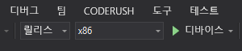

# 빠른 시작: C++/WinRT 및 DirectX로 Azure Spatial Anchors를 사용하여 HoloLens 앱 만들기

이 빠른 시작에서는 C++/WinRT 및 DirectX로 [Azure Spatial Anchors](../overview.md)를 사용하여 HoloLens 앱을 만드는 방법을 다룹니다. Azure Spatial Anchors는 시간이 지남에 따라 디바이스에서 위치를 유지하는 개체를 사용하여 혼합 현실 환경을 만들 수 있는 플랫폼 간 개발자 서비스입니다. 완료되면, HoloLens 앱이 있어 공간 앵커를 저장하고 회수할 수 있습니다.

이 문서에서 배울 내용은 다음과 같습니다.

> [!div class="checklist"]
> * Spatial Anchors 계정 만들기
> * Spatial Anchors 계정 식별자 및 계정 키 구성
> * HoloLens 디바이스에서 배포 및 실행

[!INCLUDE [quickstarts-free-trial-note](../../../includes/quickstarts-free-trial-note.md)]

## 필수 조건

이 빠른 시작을 완료하려면 다음 항목이 있어야 합니다.

- **유니버설 Windows 플랫폼 개발** 워크로드 및 **Windows 10 SDK(10.0.17763.0 이상)** 구성 요소와 함께 <a href="https://www.visualstudio.com/downloads/" target="_blank">Visual Studio 2017 이상</a>이 설치된 Windows 머신 및 <a href="https://git-scm.com/download/win" target="_blank">Windows용 Git</a>.
- Visual Studio용 [C++/WinRT Visual Studio 확장(VSIX)](https://aka.ms/cppwinrt/vsix)은 [Visual Studio Marketplace](https://marketplace.visualstudio.com/)에서 설치합니다.
- [개발자 모드](https://docs.microsoft.com/windows/mixed-reality/using-visual-studio)가 설정된 HoloLens 디바이스. 이 문서에는 [Windows 10 2018년 10월 업데이트](https://docs.microsoft.com/windows/mixed-reality/release-notes-october-2018 )(RS5라고도 함)가 있는 HoloLens 디바이스가 필요합니다. HoloLens의 최신 릴리스로 업데이트하려면 **설정** 앱을 열고 **업데이트 및 보안**으로 이동한 다음, **업데이트 확인** 단추를 선택합니다.
- 앱에서 해당 AppX 매니페스트에 **spatialPerception** 기능을 설정해야 합니다.

[!INCLUDE [Create Spatial Anchors resource](../../../includes/spatial-anchors-get-started-create-resource.md)]

## 샘플 프로젝트 열기

[!INCLUDE [Clone Sample Repo](../../../includes/spatial-anchors-clone-sample-repository.md)]

Visual Studio에서 `HoloLens\DirectX\SampleHoloLens.sln`을 엽니다.

## 계정 식별자 및 키 구성

다음 단계는 계정 식별자 및 계정 키를 사용하도록 앱을 구성하는 것입니다. [Spatial Anchors 리소스 설정](#create-a-spatial-anchors-resource) 시 텍스트 편집기에 복사했습니다.

`HoloLens\DirectX\SampleHoloLens\ViewController.cpp`를 엽니다.

`SpatialAnchorsAccountKey` 필드를 찾아 `Set me`를 계정 키로 바꿉니다.

`SpatialAnchorsAccountId` 필드를 찾아 `Set me`를 계정 식별자로 바꿉니다.

## HoloLens에 앱 배포

**솔루션 구성**을 **릴리스**로 변경하고 **솔루션 플랫폼**을 **x86**로 변경하고 배포 대상 옵션에서 **디바이스**를 선택합니다.

HoloLens 2를 사용하는 경우 **x86** 대신 **ARM**을 **솔루션 플랫폼**으로 사용합니다.

HoloLens 디바이스의 전원을 켜고, 로그인하고, USB 케이블을 사용해 PC에 연결합니다.

**디버그** > **디버깅 시작**을 선택하여 앱을 배포하고 디버깅을 시작합니다.

앱의 지침에 따라 앵커를 배치하고 회수합니다.

Visual Studio에서 **디버깅 중지**를 선택하거나 **Shift + F5** 키를 눌러 앱을 중지합니다.

[!INCLUDE [Clean-up section](../../../includes/clean-up-section-portal.md)]

[!INCLUDE [Next steps](../../../includes/spatial-anchors-quickstarts-nextsteps.md)]

> [!div class="nextstepaction"]
> [자습서: 여러 디바이스에서 Spatial Anchors 공유](../tutorials/tutorial-share-anchors-across-devices.md)
