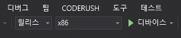

# 빠른 시작: Azure Spatial Anchors를 사용하는 HoloLens Unity 앱 만들기

이 빠른 시작에서는 [Azure Spatial Anchors](../overview.md)를 사용하는 HoloLens Unity 앱을 만듭니다. Spatial Anchors는 시간이 지나도 위치를 유지하는 개체를 사용하여 혼합 현실 환경을 만들 수 있는 플랫폼 간 개발자 서비스입니다. 완료되면, Unity 지원 HoloLens 앱이 있어 공간 앵커를 저장하고 회수할 수 있습니다.

이 문서에서 배울 내용은 다음과 같습니다.

- Spatial Anchors 계정 만들기
- Unity 빌드 설정 준비
- Spatial Anchors 계정 식별자 및 계정 키 구성
- HoloLens Visual Studio 프로젝트 내보내기
- HoloLens 디바이스에 앱을 배포하고 실행

[!INCLUDE [quickstarts-free-trial-note](../../../includes/quickstarts-free-trial-note.md)]

## 필수 조건

이 빠른 시작을 완료하려면 다음이 필요합니다.

- Windows 컴퓨터에 <a href="https://unity3d.com/get-unity/download" target="_blank">Unity 2018.3</a> 이상 및 <a href="https://www.visualstudio.com/downloads/" target="_blank">Visual Studio 2017</a> 이상이 설치되어 있어야 합니다. 설치된 Visual Studio에 **유니버설 Windows 플랫폼 개발** 워크로드가 포함되어 있어야 합니다. <a href="https://git-scm.com/download/win" target="_blank">Windows용 Git</a>도 설치해야 합니다.
- [개발자 모드](https://docs.microsoft.com/windows/mixed-reality/using-visual-studio)가 설정된 HoloLens 디바이스가 필요합니다. 디바이스에 [Windows 10 2018년 10월 업데이트](https://docs.microsoft.com/windows/mixed-reality/release-notes-october-2018)(RS5라고도 함)가 설치되어 있어야 합니다. HoloLens의 최신 릴리스로 업데이트하려면 **설정** 앱을 열고 **업데이트 및 보안**으로 이동한 다음, **업데이트 확인**을 선택합니다.
- 앱에서 **SpatialPerception** 기능을 사용하도록 설정해야 합니다. 이 설정은 **빌드 설정** > **플레이어 설정** > **게시 설정** > **기능**에 있습니다.
- 앱에서 **Windows Mixed Reality SDK**의 **Virtual Reality Supported**(가상 현실 지원)를 사용하도록 설정해야 합니다. 이 설정은 **빌드 설정** > **플레이어 설정** > **XR 설정**에 있습니다.

[!INCLUDE [Create Spatial Anchors resource](../../../includes/spatial-anchors-get-started-create-resource.md)]

## Unity에서 샘플 프로젝트 열기

[!INCLUDE [Clone Sample Repo](../../../includes/spatial-anchors-clone-sample-repository.md)]

Unity에서 Unity 폴더의 프로젝트를 엽니다.

**파일** > **빌드 설정**을 선택하여 **빌드 설정**을 엽니다.

**플랫폼** 섹션에서 **유니버설 Windows 플랫폼**을 선택합니다. **대상 디바이스**를 **HoloLens**로 변경합니다.

**플랫폼 전환**을 선택하여 플랫폼을 **유니버설 Windows 플랫폼**으로 변경합니다. UWP 지원 구성 요소가 누락된 경우 Unity가 이러한 구성 요소를 설치하라고 요청할 수 있습니다.

   

**빌드 설정** 창을 닫습니다.

## 계정 식별자 및 키 구성

**프로젝트** 창에서 `Assets/AzureSpatialAnchorsPlugin/Examples`로 이동하여 `AzureSpatialAnchorsBasicDemo.unity` 장면 파일을 엽니다.

[!INCLUDE [Configure Unity Scene](../../../includes/spatial-anchors-unity-configure-scene.md)]

**파일** > **저장**을 선택하여 장면을 저장합니다.

## HoloLens Visual Studio 프로젝트 내보내기

[!INCLUDE [Export Unity Project](../../../includes/spatial-anchors-unity-export-project-snip.md)]

**빌드**를 선택합니다. 대화 상자에서 HoloLens Visual Studio 프로젝트를 내보낼 폴더를 선택합니다.

내보내기가 완료되면 내보낸 HoloLens 프로젝트가 포함된 폴더가 표시됩니다.

## HoloLens 애플리케이션 배포

이 폴더의 **HelloAR U3D.sln** 파일을 두 번 클릭하여 Visual Studio에서 프로젝트를 엽니다.

**솔루션 구성**을 **릴리스**로 변경하고, **솔루션 플랫폼**을 **x86**으로 변경하고, 배포 대상 옵션에서 **디바이스**를 선택합니다.

   

HoloLens 디바이스를 켜고, 로그인하고, USB 케이블을 사용하여 디바이스를 PC에 연결합니다.

**디버그** > **디버깅 시작**을 선택하여 앱을 배포하고 디버깅을 시작합니다.

앱의 지침에 따라 앵커를 배치하고 회수합니다.

Visual Studio에서 **디버깅 중지**를 선택하거나 Shift+F5 키를 눌러 앱을 중지합니다.

[!INCLUDE [Clean-up section](../../../includes/clean-up-section-portal.md)]

[!INCLUDE [Next steps](../../../includes/spatial-anchors-quickstarts-nextsteps.md)]

> [!div class="nextstepaction"]
> [자습서: 여러 디바이스 간에 공간 앵커 공유](../tutorials/tutorial-share-anchors-across-devices.md)
