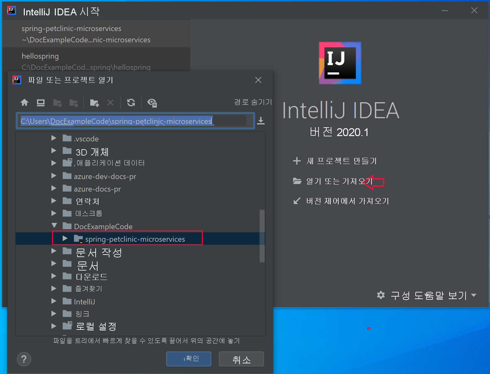
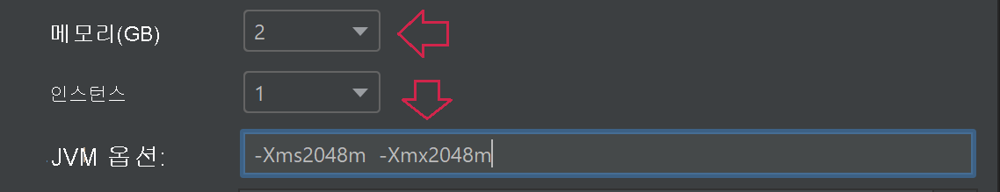
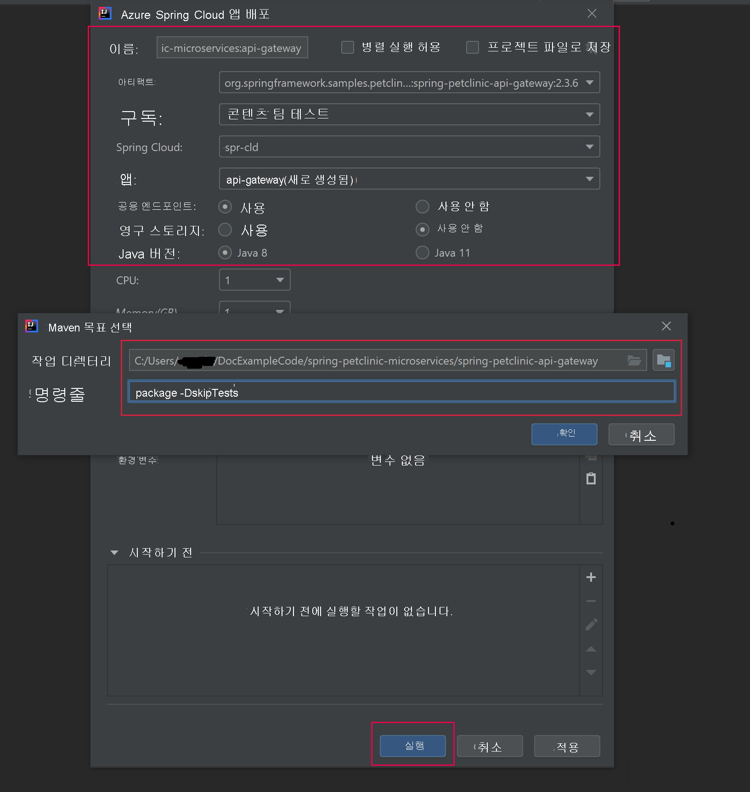

# <a name="quickstart-build-and-deploy-apps-to-azure-spring-cloud"></a>빠른 시작: Azure Spring Cloud에 앱 빌드 및 배포

::: zone pivot="programming-language-csharp"
이 빠른 시작에서는 Azure CLI를 사용하여 마이크로서비스 애플리케이션을 빌드하고 Azure Spring Cloud에 배포합니다.

## <a name="prerequisites"></a>사전 요구 사항

* 이 시리즈의 이전 빠른 시작을 완료합니다.

  * [Azure Spring Cloud 서비스 프로비저닝](./quickstart-provision-service-instance.md)
  * [Azure Spring Cloud 구성 서버 설정](./quickstart-setup-config-server.md)

## <a name="download-the-sample-app"></a>샘플 앱 다운로드

이 시점까지 Azure Cloud Shell을 사용한 경우 다음 단계를 위해 로컬 명령 프롬프트로 전환합니다.

1. 새 폴더를 만들고 샘플 앱 리포지토리를 복제합니다.

   ```console
   mkdir source-code
   ```

   ```console
   cd source-code
   ```

   ```console
   git clone https://github.com/Azure-Samples/Azure-Spring-Cloud-Samples
   ```

1. 리포지토리 디렉터리로 이동합니다.

   ```console
   cd Azure-Spring-Cloud-Samples
   ```

## <a name="deploy-planetweatherprovider"></a>PlanetWeatherProvider 배포

1. Azure Spring Cloud 인스턴스에서 PlanetWeatherProvider 프로젝트에 대한 앱을 만듭니다.

   ```azurecli
   az spring-cloud app create --name planet-weather-provider --runtime-version NetCore_31
   ```

   자동 서비스 등록을 사용하도록 설정하려면 프로젝트의 *appsettings.json* 파일에서 `spring.application.name` 값과 동일한 이름을 앱에 지정해야 합니다.

   ```json
   "spring": {
     "application": {
       "name": "planet-weather-provider"
     }
   }
   ```

   이 명령을 실행하는 데 몇 분 정도 걸릴 수 있습니다.

1. 디렉터리를 `PlanetWeatherProvider` 프로젝트 폴더로 변경합니다.

   ```console
   cd steeltoe-sample/src/planet-weather-provider
   ```

1. 배포할 이진 파일 및 *.zip* 파일을 만듭니다.

   ```console
   dotnet publish -c release -o ./publish
   ```

   > [!TIP]
   > 프로젝트 파일에는 이진 파일을 *./publish* 폴더에 쓴 후 *.zip* 파일의 이진 파일을 패키징하는 다음 XML이 포함되어 있습니다.
   >
   > ```xml
   > <Target Name="Publish-Zip" AfterTargets="Publish">
   >   <ZipDirectory SourceDirectory="$(PublishDir)" DestinationFile="$(MSBuildProjectDirectory)/publish-deploy-planet.zip" Overwrite="true" />
   > </Target>
   > ```

1. Azure에 배포합니다.

   다음 명령을 실행하기 전에 명령 프롬프트가 프로젝트 폴더에 있는지 확인합니다.

   ```console
   az spring-cloud app deploy -n planet-weather-provider --runtime-version NetCore_31 --main-entry Microsoft.Azure.SpringCloud.Sample.PlanetWeatherProvider.dll --artifact-path ./publish-deploy-planet.zip
   ```

   `--main-entry` 옵션은 *.zip* 파일의 루트 폴더에서 애플리케이션의 진입점을 포함하는 *.dll* 파일에 대한 상대 경로를 지정합니다. 서비스에서 *.zip* 파일이 업로드되면 모든 파일과 폴더를 추출하고, 지정한 *.dll* 파일의 진입점을 실행하려고 시도합니다.

   이 명령을 실행하는 데 몇 분 정도 걸릴 수 있습니다.

## <a name="deploy-solarsystemweather"></a>SolarSystemWeather 배포

1. 이번에는 SolarSystemWeather 프로젝트에 대해 Azure Spring Cloud 인스턴스에서 다른 앱을 만듭니다.

   ```azurecli
   az spring-cloud app create --name solar-system-weather --runtime-version NetCore_31
   ```

   `solar-system-weather`는 `SolarSystemWeather` 프로젝트의 *appsettings.json* 파일에 지정된 이름입니다.

   이 명령을 실행하는 데 몇 분 정도 걸릴 수 있습니다.

1. 디렉터리를 `SolarSystemWeather` 프로젝트로 변경합니다.

   ```console
   cd ../solar-system-weather
   ```

1. 배포할 이진 파일 및 *.zip* 파일을 만듭니다.

   ```console
   dotnet publish -c release -o ./publish
   ```

1. Azure에 배포합니다.

   ```console
   az spring-cloud app deploy -n solar-system-weather --runtime-version NetCore_31 --main-entry Microsoft.Azure.SpringCloud.Sample.SolarSystemWeather.dll --artifact-path ./publish-deploy-solar.zip
   ```
   
   이 명령을 실행하는 데 몇 분 정도 걸릴 수 있습니다.

## <a name="assign-public-endpoint"></a>퍼블릭 엔드포인트 할당

애플리케이션을 테스트하려면 브라우저에서 `solar-system-weather` 애플리케이션으로 HTTP GET 요청을 보냅니다.  이렇게 하려면 요청에 대한 퍼블릭 엔드포인트가 필요합니다.

1. 엔드포인트를 할당하려면 다음 명령을 실행합니다.

   ```azurecli
   az spring-cloud app update -n solar-system-weather --assign-endpoint true
   ```

1. 엔드포인트의 URL을 가져오려면 다음 명령을 실행합니다.

   Windows:

   ```azurecli
   az spring-cloud app show -n solar-system-weather -o table
   ```

   Linux:

   ```azurecli
   az spring-cloud app show --name solar-system-weather | grep url
   ```

## <a name="test-the-application"></a>애플리케이션 테스트

`solar-system-weather` 앱에 GET 요청을 보냅니다. 브라우저에서 끝에 추가된 `/weatherforecast`를 사용하여 공용 URL로 이동합니다. 다음은 그 예입니다. 

```
https://servicename-solar-system-weather.azuremicroservices.io/weatherforecast
```

출력은 JSON입니다.

```json
[{"Key":"Mercury","Value":"very warm"},{"Key":"Venus","Value":"quite unpleasant"},{"Key":"Mars","Value":"very cool"},{"Key":"Saturn","Value":"a little bit sandy"}]
```

이 응답은 두 마이크로서비스 앱이 작동하고 있음을 보여 줍니다. `SolarSystemWeather` 앱은 `PlanetWeatherProvider` 앱에서 검색된 데이터를 반환합니다.
::: zone-end
---
::: zone pivot="programming-language-java"
이 문서에서는 다음을 사용하여 마이크로서비스 애플리케이션을 빌드하고 Azure Spring Cloud에 배포하는 방법을 설명합니다.
* Azure CLI
* Maven 플러그 인
* Intellij

Azure CLI 또는 Maven을 사용하여 배포하기 전에 [Azure Spring Cloud의 인스턴스를 프로비저닝](./quickstart-provision-service-instance.md)하고 [구성 서버를 설정](./quickstart-setup-config-server.md)하는 예제를 완료합니다.

## <a name="prerequisites"></a>사전 요구 사항

* [JDK 8 설치](/java/azure/jdk/)
* [Azure 구독에 가입](https://azure.microsoft.com/free/)
* (선택 사항) [Azure CLI 버전 2.0.67 이상을 설치](/cli/azure/install-azure-cli)하고 `az extension add --name spring-cloud` 명령을 사용하여 Azure Spring Cloud 확장을 설치합니다.
* (선택 사항) [Azure Toolkit for IntelliJ를 설치](https://plugins.jetbrains.com/plugin/8053-azure-toolkit-for-intellij/)하고 [로그인](/azure/developer/java/toolkit-for-intellij/create-hello-world-web-app#installation-and-sign-in)합니다.

## <a name="deployment-procedures"></a>배포 절차

#### <a name="cli"></a>[CLI](#tab/Azure-CLI)

## <a name="build-the-microservices-applications-locally"></a>로컬에서 마이크로서비스 애플리케이션 빌드

1. 샘플 앱 리포지토리를 Azure Cloud 계정에 복제합니다.  디렉터리를 변경하고 프로젝트를 빌드합니다. 

    ```azurecli
    git clone https://github.com/azure-samples/spring-petclinic-microservices
    cd spring-petclinic-microservices
    mvn clean package -DskipTests -Denv=cloud
    ```
프로젝트를 컴파일하는 데 5~10분이 걸립니다. 완료되면 각 서비스에 대한 개별 JAR 파일이 해당 폴더에 포함되어야 합니다.

## <a name="create-and-deploy-apps-on-azure-spring-cloud"></a>Azure Spring Cloud에서 앱 생성 및 배포

1. PetClinic을 위한 2개의 코어 마이크로 서비스(API 게이트웨이 및 고객 서비스)를 만듭니다.

    ```azurecli
    az spring-cloud app create --name api-gateway --instance-count 1 --memory 2 --assign-endpoint
    az spring-cloud app create --name customers-service --instance-count 1 --memory 2
    ```

1. 이전 단계에서 빌드된 JAR 파일을 배포합니다.

    ```azurecli
    az spring-cloud app deploy --name api-gateway --jar-path spring-petclinic-api-gateway/target/spring-petclinic-api-gateway-2.3.6.jar --jvm-options="-Xms2048m -Xmx2048m"
    az spring-cloud app deploy --name customers-service --jar-path spring-petclinic-customers-service/target/spring-petclinic-customers-service-2.3.6.jar --jvm-options="-Xms2048m -Xmx2048m"
    ```

1. 다음 명령을 사용하여 배포 후 앱 상태를 쿼리합니다.

    ```azurecli
    az spring-cloud app list -o table
    ```

    ```txt
        Name               Location    ResourceGroup    Production Deployment    Public Url                                           Provisioning Status    CPU    Memory    Running Instance    Registered Instance    Persistent Storage
    -----------------  ----------  ---------------  -----------------------  ---------------------------------------------------  ---------------------  -----  --------  ------------------  ---------------------  --------------------
    api-gateway        eastus      xxxxxx-sp         default                  https://<service name>-api-gateway.azuremicroservices.io   Succeeded              1      2         1/1                 1/1                    -     
    customers-service  eastus      <service name>         default                                                                       Succeeded              1      2         1/1                 1/1                    -     
    ```

## <a name="verify-the-services"></a>서비스 확인

위에 표시된 "https://<service name>-api-gateway.azuremicroservices.io" 형식의 **공용 URL** 을 사용하여 브라우저에서 앱 게이트웨이 및 고객 서비스에 액세스합니다.


> [!TIP]
> 배포 문제를 해결하려면 다음 명령을 사용하여 앱이 `az spring-cloud app logs --name <app name> -f`를 실행할 때마다 로그 스트리밍을 실시간으로 가져올 수 있습니다.

## <a name="deploy-extra-apps"></a>추가 앱 배포

PetClinic 앱이 관리 서버, 방문 및 수의사 같은 모든 기능과 함께 작동하도록 하려면 다음 명령을 사용하여 다른 앱을 배포하면 됩니다.

```azurecli
az spring-cloud app create --name admin-server --instance-count 1 --memory 2 --assign-endpoint
az spring-cloud app create --name vets-service --instance-count 1 --memory 2
az spring-cloud app create --name visits-service --instance-count 1 --memory 2
az spring-cloud app deploy --name admin-server --jar-path spring-petclinic-admin-server/target/spring-petclinic-admin-server-2.3.6.jar --jvm-options="-Xms2048m -Xmx2048m"
az spring-cloud app deploy --name vets-service --jar-path spring-petclinic-vets-service/target/spring-petclinic-vets-service-2.3.6.jar --jvm-options="-Xms2048m -Xmx2048m"
az spring-cloud app deploy --name visits-service --jar-path spring-petclinic-visits-service/target/spring-petclinic-visits-service-2.3.6.jar --jvm-options="-Xms2048m -Xmx2048m"
```
#### <a name="maven"></a>[Maven](#tab/Maven)

## <a name="build-the-microservices-applications-locally"></a>로컬에서 마이크로서비스 애플리케이션 빌드

1. 샘플 앱 리포지토리를 Azure Cloud 계정에 복제합니다.  디렉터리를 변경하고 프로젝트를 빌드합니다. 

    ```azurecli
    git clone https://github.com/azure-samples/spring-petclinic-microservices
    cd spring-petclinic-microservices
    mvn clean package -DskipTests -Denv=cloud
    ```
프로젝트를 컴파일하는 데 5~10분이 걸립니다. 완료되면 각 서비스에 대한 개별 JAR 파일이 해당 폴더에 포함되어야 합니다.

## <a name="generate-configurations-and-deploy-to-the-azure-spring-cloud"></a>구성 생성 및 Azure Spring Cloud에 배포

1. 부모 POM을 포함하는 Pet Clinic의 루트 폴더에서 다음 명령을 실행하여 구성을 생성합니다. Azure CLI를 사용하여 이미 로그인한 경우 이 명령은 자격 증명을 자동으로 선택합니다. 그렇지 않으면 프롬프트 명령을 사용하여 로그인합니다. 자세한 내용은 [wiki 페이지](https://github.com/microsoft/azure-maven-plugins/wiki/Authentication)를 참조하세요.

    ```azurecli
    mvn com.microsoft.azure:azure-spring-cloud-maven-plugin:1.3.0:config
    ```
    
    다음 중 선택하라는 메시지가 표시됩니다.
    * **모듈:** `api-gateway` 및 `customers-service`를 선택합니다.
    * **구독:** Azure Spring Cloud 인스턴스를 만드는 데 사용되는 구독입니다.
    * **서비스 인스턴스:** Azure Spring Cloud 인스턴스의 이름입니다.
    * **퍼블릭 엔드포인트:** 제공된 프로젝트 목록에서 `api-gateway`에 해당하는 숫자를 입력합니다.  공용 액세스 권한을 부여합니다.

1. POM 파일의 `appName` 요소가 올바른지 확인합니다.
    ```xml
    <build>
        <plugins>
            <plugin>
                <groupId>com.microsoft.azure</groupId>
                <artifactId>azure-spring-cloud-maven-plugin</artifactId>
                <version>1.3.0</version>
                <configuration>
                    <subscriptionId>xxxxxxxxx-xxxx-xxxx-xxxxxxxxxxxx</subscriptionId>
                    <clusterName>v-spr-cld</clusterName>
                    <appName>customers-service</appName>
    
    ```
    `appName` 텍스트가 다음과 일치하는지 확인하고 필요한 경우 접두사를 제거하고 파일을 저장합니다.
    * api-gateway
    * customers-service

1. 이제 POM에는 플러그 인 종속성 및 구성이 포함됩니다. 다음 명령을 사용하여 앱을 배포합니다. 

    ```azurecli
    mvn azure-spring-cloud:deploy
    ```
    
## <a name="verify-the-services"></a>서비스 확인

배포 명령이 성공하면 "https://<service name>-spring-petclinic-api-gateway.azuremicroservices.io" 형식의 URL이 반환됩니다.  이를 사용하여 실행 중인 서비스로 이동합니다.


Azure Portal로 이동하여 URL을 찾을 수도 있습니다. 
1. 서비스로 이동
2. **앱** 선택
3. **api-gateway** 선택 
4. **api-gateway | 개요** 페이지에서 URL 찾기

## <a name="deploy-extra-apps"></a>추가 앱 배포

PetClinic 앱이 관리 서버, 방문 및 수의사 같은 모든 기능과 함께 작동하도록 하려면 다른 마이크로 서비스 앱을 배포하면 됩니다. 구성 명령을 다시 실행하고 다음 마이크로 서비스를 선택합니다.
* admin-server
* vets-service
* visits-service

각 `pom.xml`에서 위의 모듈에 대한 앱 이름을 수정한 다음 `deploy` 명령을 다시 실행합니다.

#### <a name="intellij"></a>[IntelliJ](#tab/IntelliJ)

## <a name="import-sample-project-in-intellij"></a>IntelliJ에서 샘플 프로젝트 가져오기

1. 이 자습서의 원본 리포지토리를 다운로드하여 압축을 풀거나 Git: `git clone https://github.com/azure-samples/spring-petclinic-microservices`를 사용하여 복제합니다. 

1. IntelliJ **시작** 대화 상자를 열고 **프로젝트 가져오기** 를 선택하여 가져오기 마법사를 엽니다.

1. `spring-petclinic-microservices` 폴더를 선택합니다.

    

### <a name="deploy-api-gateway-app-to-azure-spring-cloud"></a>Azure Spring Cloud에 api-gateway 앱 배포
Azure에 배포하려면 Azure Toolkit for IntelliJ를 사용하여 Azure 계정으로 로그인하고 구독을 선택해야 합니다. 로그인 세부 정보는 [설치 및 로그인](https://docs.microsoft.com/azure/developer/java/toolkit-for-intellij/create-hello-world-web-app#installation-and-sign-in)을 참조하세요.

1. IntelliJ 프로젝트 탐색기에서 프로젝트를 마우스 오른쪽 단추로 클릭하고 **Azure** -> **Azure Spring Cloud에 배포** 를 선택합니다.

    

1. **이름** 필드에서 *:api-gateway* 를 기존 **이름** 에 추가합니다.
1. **아티팩트** 텍스트 상자에서 *spring-petclinic-api-gateway-2.3.6* 을 선택합니다.
1. **구독** 텍스트 상자에서 구독을 확인합니다.
1. **Spring Cloud** 텍스트 상자에서 [Azure Spring Cloud 인스턴스 프로비저닝](./quickstart-provision-service-instance.md)에서 만든 Azure Spring Cloud의 인스턴스를 선택합니다.
1. **퍼블릭 엔드포인트** 를 *사용* 으로 설정합니다.
1. **App:** 텍스트 상자에서 **앱 만들기...** 를 선택합니다.
1. *api-gateway* 를 입력한 다음, **확인** 을 클릭합니다.
1. 메모리를 2GB로 지정하고 JVM 옵션을 `-Xms2048m -Xmx2048m`으로 지정합니다.

     

1. 대화 상자의 **시작하기 전에** 섹션에서 *Maven 목표 실행* 을 두 번 클릭합니다.
1. **작업 디렉터리** 텍스트 상자에서 *spring-petclinic-microservices/gateway* 폴더로 이동합니다.
1. **명령줄** 텍스트 상자에 *package -DskipTests* 를 입력합니다. **확인** 을 클릭합니다.

    

1. **Azure Spring Cloud 앱 배포** 대화 상자 아래쪽에 있는 **실행** 단추를 클릭하여 배포를 시작합니다. 플러그 인은 `api-gateway` 앱에서 `mvn package` 명령을 실행하고 `package` 명령으로 생성된 jar을 배포합니다.

### <a name="deploy-customers-service-and-other-apps-to-azure-spring-cloud"></a>Azure Spring Cloud에 customers-service 및 기타 앱 배포
위의 단계를 반복하여 `customers-service` 및 기타 Pet Clinic 앱을 Azure Spring Cloud에 배포합니다.

1. **이름** 및 **아티팩트** 를 수정하여 `customers-service` 앱을 식별합니다.
1. **App:** 텍스트 상자에서 **앱 만들기...** 를 선택하여 `customers-service` 앱을 만듭니다.
1. **퍼블릭 엔드포인트** 옵션이 *사용 안 함* 으로 설정되어 있는지 확인합니다.
1. 대화 상자의 **시작하기 전에** 섹션에서 **작업 디렉터리** 를 *petclinic/customers-service* 폴더로 전환합니다.
1. **Azure Spring Cloud 앱 배포** 대화 상자 아래쪽에 있는 **실행** 단추를 클릭하여 배포를 시작합니다. 

## <a name="verify-the-services"></a>서비스 확인

`https://<service name>-spring-petclinic-api-gateway.azuremicroservices.io` 형식의 URL로 이동합니다.


Azure Portal로 이동하여 URL을 찾을 수도 있습니다. 
1. 서비스로 이동
2. **앱** 선택
3. **api-gateway** 선택 
4. **api-gateway | 개요** 페이지에서 URL 찾기

## <a name="deploy-extra-apps"></a>추가 앱 배포
이 샘플에 포함된 다른 마이크로 서비스를 비슷한 방식으로 배포할 수 있습니다. 
* admin-server
* vets-service
* visits-service

::: zone-end

## <a name="next-steps"></a>다음 단계

이 빠른 시작에서는 구독에 남아있는 경우 요금이 계속 청구되는 Azure 리소스를 만들었습니다. 다음 빠른 시작을 계속 진행하지 않으려는 경우 [리소스 정리](./quickstart-logs-metrics-tracing.md#clean-up-resources)를 참조하세요. 그렇지 않으면 다음 빠른 시작으로 이동하세요.

> [!div class="nextstepaction"]
> [로그, 메트릭 및 추적](./quickstart-logs-metrics-tracing.md)
