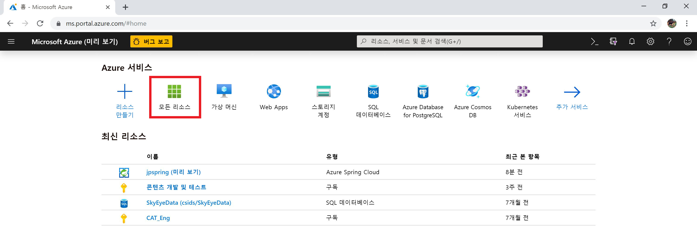
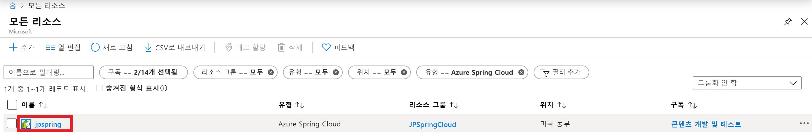
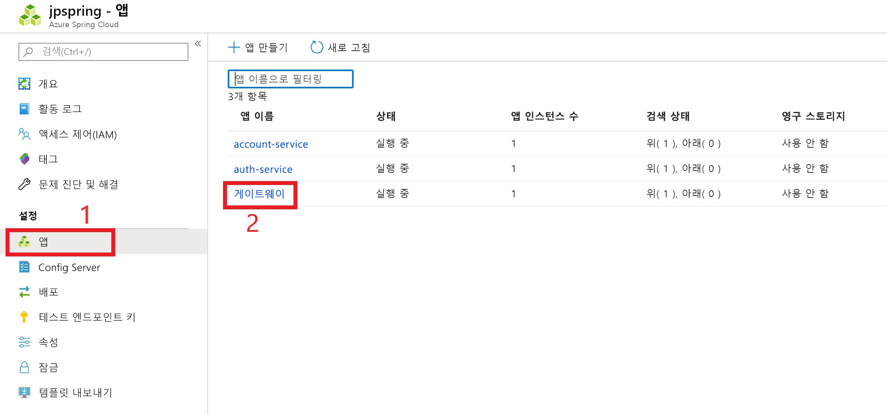
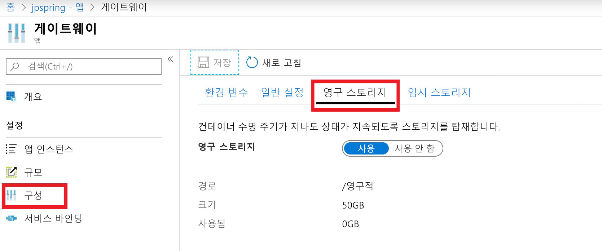

# <a name="use-persistent-storage-in-azure-spring-cloud"></a>Azure Spring Cloud에서 영구 스토리지 사용

Azure 스프링 클라우드는 응용 프로그램에 영구 및 임시의 두 가지 저장소 유형을 제공 합니다.

기본적으로 Azure 스프링 클라우드는 각 응용 프로그램 인스턴스에 대 한 임시 저장소를 제공 합니다. 임시 저장소는/tmp. 기본 탑재 경로를 사용 하는 인스턴스별 5gb로 제한 됩니다.

> [!WARNING]
> 응용 프로그램 인스턴스를 다시 시작 하면 연결 된 임시 저장소가 영구적으로 삭제 됩니다.

영구 저장소는 Azure에서 관리 되는 파일 공유 컨테이너 이며 응용 프로그램당 할당 됩니다. 영구적 저장소에 저장 된 데이터는 응용 프로그램의 모든 인스턴스에서 공유 됩니다. Azure 스프링 클라우드 인스턴스는 영구 저장소를 사용 하는 응용 프로그램을 최대 10 개까지 포함할 수 있습니다. 각 응용 프로그램에는 50 GB의 영구 저장소가 할당 됩니다. 영구 저장소에 대 한 기본 탑재 경로는/persistent.

> [!WARNING]
> 응용 프로그램의 영구 저장소를 사용 하지 않도록 설정 하면 모든 저장소의 할당이 취소 되 고 저장 된 모든 데이터가 손실 됩니다.

## <a name="use-the-azure-portal-to-enable-persistent-storage"></a>Azure Portal를 사용 하 여 영구 저장소 사용

1. Azure Portal **홈** 페이지에서 **모든 리소스**를 선택 합니다.

    >

1. 영구 저장소를 필요로 하는 Azure 스프링 클라우드 리소스를 선택 합니다. 이 예제에서는 선택한 응용 프로그램을 **upspring**이라고 합니다.

    > 

1. **설정** 제목 아래에서 **앱**을 선택 합니다.

1. Azure 스프링 클라우드 서비스는 테이블에 표시 됩니다.  영구 저장소를 추가 하려는 서비스를 선택 합니다. 이 예제에서는 **게이트웨이** 서비스를 선택 합니다.

    > 

1. 서비스의 구성 페이지에서 **구성** 을 선택 합니다.

1. **영구 저장소** 탭을 선택 하 고 **사용**을 선택 합니다.

    > 

영구 저장소를 사용 하도록 설정 하면 크기와 경로가 구성 페이지에 표시 됩니다.

## <a name="use-the-azure-cli-to-modify-persistent-storage"></a>Azure CLI를 사용 하 여 영구 저장소 수정

필요한 경우 Azure CLI에 대 한 스프링 클라우드 확장을 설치 합니다.

```azurecli
az extension add --name spring-cloud
```
기타 작업:

* 영구 저장소를 사용 하는 앱을 만들려면:

    ```azurecli
    az spring-cloud app create -n <app> -g <resource-group> -s <service-name> --enable-persistent-storage true
    ```

* 기존 앱에 대해 영구 저장소를 사용 하도록 설정 하려면:

    ```azurecli
    az spring-cloud app update -n <app> -g <resource-group> -s <service-name> --enable-persistent-storage true
    ```

* 기존 앱에서 영구 저장소를 사용 하지 않도록 설정 하려면:

    ```azurecli
    az spring-cloud app update -n <app> -g <resource-group> -s <service-name> --enable-persistent-storage false
    ```

    > [!WARNING]
    > 응용 프로그램의 영구 저장소를 사용 하지 않도록 설정 하면 모든 저장소의 할당이 취소 되 고 저장 된 모든 데이터가 영구적으로 손실 됩니다.

## <a name="next-steps"></a>다음 단계

* [응용 프로그램 및 서비스 할당량](spring-cloud-quotas.md)에 대해 알아봅니다.
* [응용 프로그램의 크기를 수동으로 조정](spring-cloud-tutorial-scale-manual.md)하는 방법을 알아봅니다.
