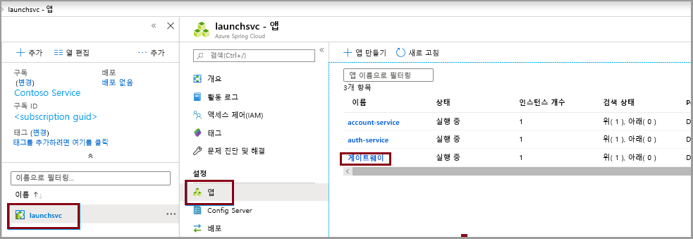
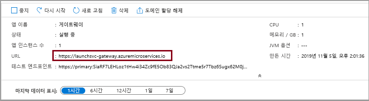

# <a name="quickstart-launch-a-java-spring-application-using-the-azure-cli"></a>빠른 시작: Azure CLI를 사용하여 Java Spring 애플리케이션 시작

Azure Spring Cloud를 사용하면 Azure에서 Spring Boot 기반 마이크로서비스 애플리케이션을 쉽게 실행할 수 있습니다.

이 빠른 시작에서는 Azure에 기존 Java Spring Cloud 애플리케이션을 배포하는 방법을 보여 줍니다. 완료되면 Azure CLI를 통해 애플리케이션을 계속 관리하거나 Azure Portal을 사용하도록 전환할 수 있습니다.

이 빠른 시작을 통해 다음을 수행하는 방법을 알아봅니다.

> [!div class="checklist"]
> * 서비스 인스턴스 프로비저닝
> * 인스턴스에 대한 구성 서버 설정
> * 로컬에서 마이크로서비스 애플리케이션 빌드
> * 각 마이크로서비스 배포
> * 애플리케이션에 대한 공용 엔드포인트 할당

## <a name="prerequisites"></a>사전 요구 사항

>[!Note]
> Azure Spring Cloud는 현재 퍼블릭 미리 보기로 제공됩니다. 퍼블릭 미리 보기 제품을 통해 고객은 공식 릴리스 전에 새로운 기능을 시험해 볼 수 있습니다.  퍼블릭 미리 보기 기능 및 서비스는 프로덕션 용도로 사용되지 않습니다.  미리 보기 동안 제공되는 지원에 대한 자세한 내용은 [FAQ](https://azure.microsoft.com/support/faq/)를 검토하거나 [지원 요청](https://docs.microsoft.com/azure/azure-portal/supportability/how-to-create-azure-support-request)을 참조하여 자세히 알아보세요.

>[!TIP]
> Azure Cloud Shell은 이 항목의 단계를 실행하는 데 무료로 사용할 수 있는 대화형 셸입니다.  최신 버전의 Git, JDK, Maven 및 Azure CLI를 포함하는 일반적인 Azure 도구가 미리 설치되어 있습니다. Azure 구독에 로그인한 경우 shell.azure.com에서 [Azure Cloud Shell](https://shell.azure.com)을 시작합니다.  Azure Cloud Shell에 대한 자세한 내용은 [설명서를 참조하세요](../cloud-shell/overview.md).

이 빠른 시작을 완료하려면 다음이 필요합니다.

1. [Git 설치](https://git-scm.com/)
2. [JDK 8 설치](https://docs.microsoft.com/java/azure/jdk/?view=azure-java-stable)
3. [Maven 3.0 이상 설치](https://maven.apache.org/download.cgi)
4. [Azure CLI 버전 2.0.67 이상 설치](https://docs.microsoft.com/cli/azure/install-azure-cli?view=azure-cli-latest)
5. [Azure 구독에 가입](https://azure.microsoft.com/free/)

## <a name="install-the-azure-cli-extension"></a>Azure CLI 확장 설치

다음 명령을 사용하여 Azure CLI용 Azure Spring Cloud 확장 설치

```azurecli
az extension add --name spring-cloud
```

## <a name="provision-a-service-instance-on-the-azure-cli"></a>Azure CLI에서 서비스 인스턴스 프로비저닝

1. Azure CLI에 로그인하고 활성 구독을 선택합니다. Azure Spring Cloud의 허용 목록에 추가된 활성 구독을 선택해야 합니다.

    ```azurecli
        az login
        az account list -o table
        az account set --subscription <Name or ID of subscription from the last step>
    ```

2. Azure Spring Cloud 서비스의 이름을 준비합니다.  이름은 4-32자 사이여야 하며, 소문자, 숫자 및 하이픈(-) 문자만 포함할 수 있습니다.  서비스 이름의 첫 글자는 문자여야 하며 마지막 문자는 문자 또는 숫자여야 합니다.

3. Azure Spring Cloud 서비스를 포함할 리소스 그룹을 만듭니다.

    ```azurecli
        az group create --location eastus --name <resource group name>
    ```
    [Azure 리소스 그룹](../azure-resource-manager/management/overview.md)에 대해 자세히 알아봅니다.

4. Azure CLI 창을 열고 다음 명령을 실행하여 Azure Spring Cloud의 인스턴스를 프로비저닝합니다.

    ```azurecli
        az spring-cloud create -n <service name> -g <resource group name>
    ```

    서비스 인스턴스를 배포하는 데 약 5분이 걸립니다.

5. 다음 명령을 사용하여 기본 리소스 그룹 이름 및 클러스터 이름을 설정합니다.

    ```azurecli
        az configure --defaults group=<service group name>
        az configure --defaults spring-cloud=<service instance name>
    ```

> [!div class="nextstepaction"]
> [문제가 발생했습니다.](https://www.research.net/r/javae2e?tutorial=asc-cli-quickstart&step=provision)

## <a name="setup-your-configuration-server"></a>구성 서버 설정

프로젝트의 git 리포지토리 위치로 구성 서버를 업데이트합니다.

```git
az spring-cloud config-server git set -n <your-service-name> --uri https://github.com/Azure-Samples/piggymetrics-config
```

> [!div class="nextstepaction"]
> [문제가 발생했습니다.](https://www.research.net/r/javae2e?tutorial=asc-cli-quickstart&step=config-server)

## <a name="build-the-microservices-applications-locally"></a>로컬에서 마이크로서비스 애플리케이션 빌드

1. 새 폴더를 만들고 샘플 앱 리포지토리를 Azure Cloud 계정에 복제합니다.  

    ```azurecli
        mkdir source-code
        git clone https://github.com/Azure-Samples/piggymetrics
    ```

2. 디렉터리를 변경하고 프로젝트를 빌드합니다.

    ```azurecli
        cd piggymetrics
        mvn clean package -D skipTests
    ```

프로젝트를 컴파일하는 데는 약 5분이 걸립니다.  완료되면 각 서비스에 대한 개별 JAR 파일이 해당 폴더에 포함되어야 합니다.

## <a name="create-the-microservices"></a>마이크로서비스 만들기

이전 단계에서 빌드된 JAR 파일을 사용하여 Spring Cloud 마이크로서비스를 만듭니다. **gateway**, **auth-service** 및 **account-service**라는 3개의 마이크로서비스를 만들게 됩니다.

```azurecli
az spring-cloud app create --name gateway
az spring-cloud app create --name auth-service
az spring-cloud app create --name account-service
```

## <a name="deploy-applications-and-set-environment-variables"></a>애플리케이션 배포 및 환경 변수 설정

실제로 애플리케이션을 Azure에 배포해야 합니다. 다음 명령을 사용하여 3개 애플리케이션을 모두 배포합니다.

```azurecli
az spring-cloud app deploy -n gateway --jar-path ./gateway/target/gateway.jar
az spring-cloud app deploy -n account-service --jar-path ./account-service/target/account-service.jar
az spring-cloud app deploy -n auth-service --jar-path ./auth-service/target/auth-service.jar
```

> [!div class="nextstepaction"]
> [문제가 발생했습니다.](https://www.research.net/r/javae2e?tutorial=asc-cli-quickstart&step=deploy)

## <a name="assign-public-endpoint-to-gateway"></a>게이트웨이에 공용 엔드포인트 할당

웹 브라우저를 통해 애플리케이션에 액세스할 방법이 필요합니다. 게이트웨이 애플리케이션에는 공용 엔드포인트가 필요합니다.

1. 다음 명령을 사용하여 엔드포인트를 할당합니다.

```azurecli
az spring-cloud app update -n gateway --is-public true
```
2. 애플리케이션이 실행 중인지 확인할 수 있도록 **게이트웨이** 애플리케이션에 공용 IP를 쿼리합니다.

Linux:
```azurecli
az spring-cloud app show --name gateway | grep url
```
Windows:
```azurecli
az spring-cloud app show --name gateway | findstr url
```
3. 이전 명령에서 제공하는 URL로 이동하여 PiggyMetrics 애플리케이션을 실행합니다.
    

Azure Portal로 이동하여 URL을 찾을 수도 있습니다. 
1. 서비스로 이동
2. **앱** 선택
3. **게이트웨이** 선택

    
    
4. **게이트웨이 개요** 페이지 에서 URL 찾기

> [!div class="nextstepaction"]
> [문제가 발생했습니다.](https://www.research.net/r/javae2e?tutorial=asc-cli-quickstart&step=public-endpoint)

## <a name="next-steps"></a>다음 단계

이 빠른 시작에서는 Azure CLI에서 Spring Cloud 애플리케이션을 배포했습니다.  Azure Spring Cloud에 대해 자세히 알아보려면 배포용 앱 준비에 대한 자습서를 계속 진행하세요.

> [!div class="nextstepaction"]
> [배포용 Azure Spring Cloud 애플리케이션 준비](spring-cloud-tutorial-prepare-app-deployment.md)

GitHub에서 더 많은 샘플을 사용할 수 있습니다. [Azure Spring Cloud 샘플](https://github.com/Azure-Samples/Azure-Spring-Cloud-Samples/tree/master/service-binding-cosmosdb-sql).
