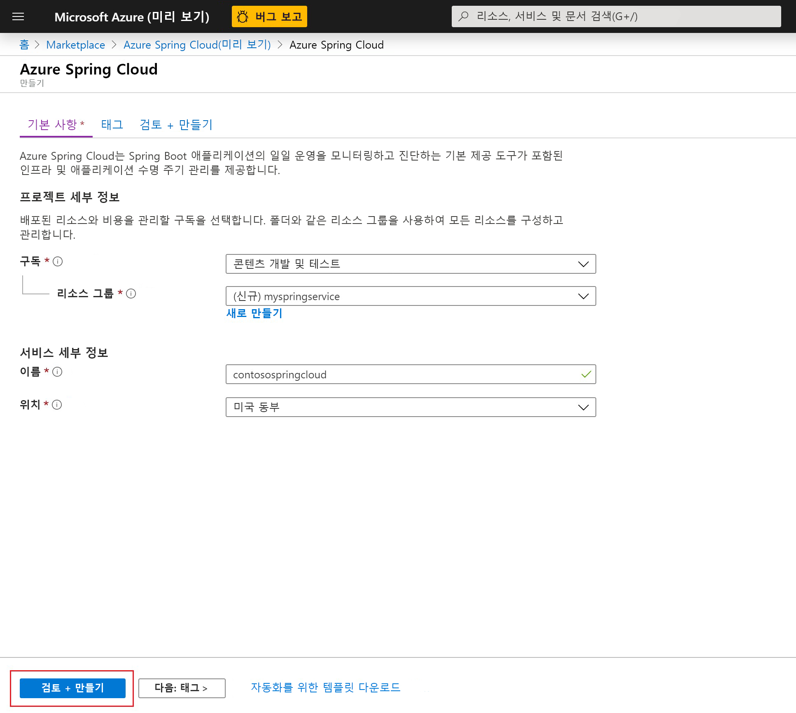
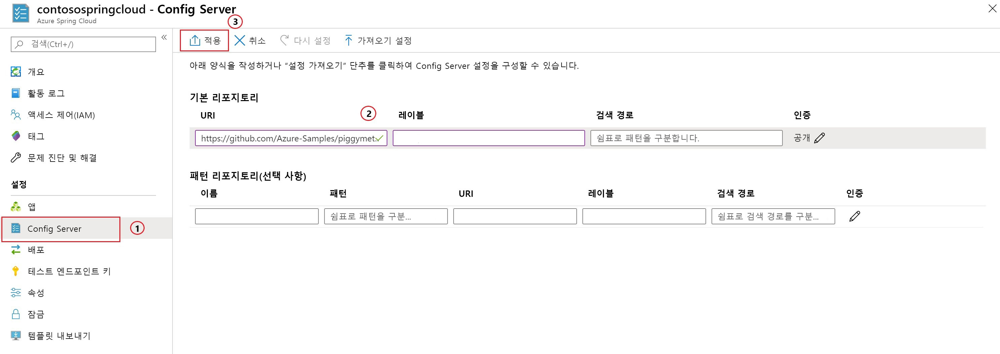

# <a name="quickstart-launch-an-azure-spring-cloud-app-using-the-maven-plug-in"></a>빠른 시작: Maven 플러그 인을 사용하여 Azure Spring Cloud 앱 시작

Azure Spring Cloud Maven 플러그 인을 사용하면 Azure Spring Cloud 애플리케이션을 쉽게 만들고 업데이트할 수 있습니다. 구성을 미리 정의하여 기존 Azure Spring Cloud 서비스에 애플리케이션을 배포할 수 있습니다. 이 문서에서는 PiggyMetrics라는 샘플 애플리케이션을 사용하여 이 기능을 보여줍니다.

이 빠른 시작을 통해 다음을 수행하는 방법을 알아봅니다.

> [!div class="checklist"]
> * 서비스 인스턴스 프로비저닝
> * 인스턴스에 대한 구성 서버 설정
> * 로컬에서 마이크로서비스 애플리케이션 복제 및 빌드
> * 각 마이크로서비스 배포
> * 애플리케이션에 대한 퍼블릭 엔드포인트 할당

>[!Note]
> Azure Spring Cloud는 현재 퍼블릭 미리 보기로 제공됩니다. 퍼블릭 미리 보기 제품을 통해 고객은 공식 릴리스 전에 새로운 기능을 시험해 볼 수 있습니다.  퍼블릭 미리 보기 기능 및 서비스는 프로덕션 용도로 사용되지 않습니다.  미리 보기 동안 제공되는 지원에 대한 자세한 내용은 [FAQ](https://azure.microsoft.com/support/faq/)를 검토하거나 [지원 요청](https://docs.microsoft.com/azure/azure-supportability/how-to-create-azure-support-request)을 참조하여 자세히 알아보세요.


>[!TIP]
> Azure Cloud Shell은 이 문서의 명령을 실행하는 데 사용할 수 있는 무료 대화형 셸입니다. 최신 버전의 Git, JDK(Java Development Kit), Maven 및 Azure CLI를 비롯한 일반적인 Azure 도구가 미리 설치되어 있습니다. Azure 구독에 로그인되어 있으면 [Azure Cloud Shell](https://shell.azure.com)을 시작하세요. 자세한 내용은 [Azure Cloud Shell 개요](../cloud-shell/overview.md)를 참조하세요.

이 빠른 시작을 완료하려면 다음이 필요합니다.

1. [Git를 설치](https://git-scm.com/)합니다.
2. [JDK 8을 설치합니다](https://docs.microsoft.com/java/azure/jdk/?view=azure-java-stable).
3. [Maven 3.0 이상을 설치합니다](https://maven.apache.org/download.cgi).
4. [Azure 평가판 구독에 가입합니다](https://azure.microsoft.com/free/).

## <a name="provision-a-service-instance-on-the-azure-portal"></a>Azure Portal에서 서비스 인스턴스 프로비저닝

1. 웹 브라우저에서 [Azure Portal의 Azure Spring Cloud에 대한 이 링크](https://ms.portal.azure.com/#create/Microsoft.AppPlatform)를 열고 계정으로 로그인합니다.

1. 다음과 같이 예제 애플리케이션의 **프로젝트 세부 정보**를 제공합니다.

    1. 애플리케이션과 연결되는 **구독**을 선택합니다.
    1. 애플리케이션에 대한 리소스 그룹을 선택하거나 만듭니다. 새 리소스 그룹을 만드는 것이 좋습니다.  아래 예제에서는 `myspringservice`이라는 새 리소스 그룹을 보여 줍니다.
    1. 새 Azure Spring Cloud 서비스의 이름을 제공합니다.  이름은 4-32자 사이여야 하며, 소문자, 숫자 및 하이픈(-) 문자만 포함할 수 있습니다. 서비스 이름의 첫 글자는 문자여야 하며 마지막 문자는 문자 또는 숫자여야 합니다.  아래 예제의 서비스는 이름이 `contosospringcloud`입니다.
    1. 제공된 옵션에서 애플리케이션의 위치를 선택합니다.  이 예제에서는 `East US`를 선택합니다.
    1. **검토 + 만들기**를 선택하여 새 서비스의 요약을 검토합니다.  모든 항목이 올바르면 **만들기**를 선택합니다.

    > [!div class="mx-imgBorder"]
    > 

서비스를 배포하는 데 약 5분이 걸립니다. 서비스가 배포되면 서비스 인스턴스에 대한 **리소스로 이동** 및 **개요** 페이지가 나타납니다.

## <a name="set-up-your-configuration-server"></a>구성 서버 설정

1. 서비스 **개요** 페이지에서 **구성 서버**를 선택합니다.
1. **기본 리포지토리** 섹션에서 **URI**를 **https://github.com/Azure-Samples/piggymetrics** 로 설정하고, **레이블**을 **config**로 설정하고, **적용**을 선택하여 변경 내용을 저장합니다.

    > [!div class="mx-imgBorder"]
    > 

## <a name="clone-and-build-the-sample-application-repository"></a>샘플 애플리케이션 리포지토리 복제 및 빌드

1. [Azure Cloud Shell](https://shell.azure.com)을 시작합니다.

1. 다음 명령을 실행하여 Git 리포지토리를 복제합니다.

    ```azurecli
    git clone https://github.com/Azure-Samples/PiggyMetrics
    ```
  
1. 다음 명령을 실행하여 디렉터리를 변경하고 프로젝트를 빌드합니다.

    ```azurecli
    cd piggymetrics
    mvn clean package -DskipTests
    ```

## <a name="generate-configurations-and-deploy-to-the-azure-spring-cloud"></a>구성 생성 및 Azure Spring Cloud에 배포

1. 부모 POM을 포함하는 PiggyMetrics의 루트 폴더에서 다음 명령을 실행하여 구성을 생성합니다.

    ```azurecli
    mvn com.microsoft.azure:azure-spring-cloud-maven-plugin:1.0.0:config
    ```

    a. `gateway`,`auth-service` 및 `account-service` 모듈을 선택합니다.

    b. 구독 및 Azure Spring Cloud 서비스 클러스터를 선택합니다.

    다. 제공된 프로젝트 목록에서 `gateway`에 해당하는 숫자를 입력하여 공용 액세스 권한을 부여합니다.
    
    d. 구성을 확인합니다.

1. 이제 POM에는 플러그 인 종속성 및 구성이 포함됩니다. 다음 명령을 사용하여 앱을 배포합니다.

   ```azurecli
   mvn azure-spring-cloud:deploy
   ```

1. 배포가 완료된 후에는 이전 명령의 출력에 제공된 URL을 사용하여 PiggyMetrics에 액세스할 수 있습니다.

## <a name="next-steps"></a>다음 단계

이 빠른 시작에서는 Maven 리포지토리에서 Spring Cloud 애플리케이션을 배포했습니다. Azure Spring Cloud에 대해 자세히 알아보려면 배포용 앱 준비에 대한 자습서를 계속 진행하세요.

> [!div class="nextstepaction"]
> [배포용 Azure Spring Cloud 애플리케이션 준비](spring-cloud-tutorial-prepare-app-deployment.md)
> [Azure용 Maven 플러그 인에 대해 자세히 알아보기](https://github.com/microsoft/azure-maven-plugin)
