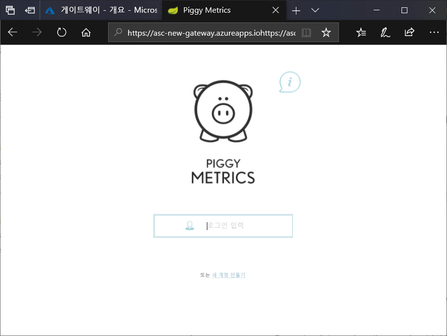

# <a name="quickstart-launch-an-azure-spring-cloud-application-using-the-azure-portal"></a>빠른 시작: Azure Portal을 사용하여 Azure Spring Cloud 애플리케이션 시작

Azure Spring Cloud를 사용하면 Azure에서 Spring Cloud 기반 마이크로서비스 애플리케이션을 쉽게 실행할 수 있습니다.

이 빠른 시작에서는 Azure에 기존 Spring Cloud 애플리케이션을 배포하는 방법을 보여줍니다.  [GitHub 샘플 리포지토리](https://github.com/Azure-Samples/PiggyMetrics)에서 이 자습서에 사용된 샘플 애플리케이션 코드를 찾을 수 있습니다. 자습서를 마치면, 제공된 샘플 애플리케이션에 온라인으로 액세스할 수 있고 Azure Portal을 통해 관리할 준비가 됩니다.

이 빠른 시작을 통해 다음을 수행하는 방법을 알아봅니다.

> [!div class="checklist"]
> * 서비스 인스턴스 프로비저닝
> * 인스턴스에 대한 구성 서버 설정
> * 로컬에서 마이크로서비스 애플리케이션 빌드
> * 각 마이크로서비스 배포
> * 애플리케이션에 대한 공용 엔드포인트 할당

## <a name="prerequisites"></a>필수 조건

>[!Note]
> Azure Spring Cloud는 현재 퍼블릭 미리 보기로 제공됩니다. 퍼블릭 미리 보기 제품을 통해 고객은 공식 릴리스 전에 새로운 기능을 시험해 볼 수 있습니다.  퍼블릭 미리 보기 기능 및 서비스는 프로덕션 용도로 사용되지 않습니다.  미리 보기 동안 제공되는 지원에 대한 자세한 내용은 [FAQ](https://azure.microsoft.com/support/faq/)를 검토하거나 [지원 요청](https://docs.microsoft.com/azure/azure-supportability/how-to-create-azure-support-request)을 참조하여 자세히 알아보세요.

>[!TIP]
> Azure Cloud Shell은 이 항목의 단계를 실행하는 데 무료로 사용할 수 있는 대화형 셸입니다.  최신 버전의 Git, JDK, Maven 및 Azure CLI를 포함하는 일반적인 Azure 도구가 미리 설치되어 있습니다. Azure 구독에 로그인한 경우 shell.azure.com에서 [Azure Cloud Shell](https://shell.azure.com)을 시작합니다.  Azure Cloud Shell에 대한 자세한 내용은 [설명서를 참조하세요](../cloud-shell/overview.md).

이 빠른 시작을 완료하려면 다음이 필요합니다.

1. [Git 설치](https://git-scm.com/)
2. [JDK 8 설치](https://docs.microsoft.com/java/azure/jdk/?view=azure-java-stable)
3. [Maven 3.0 이상 설치](https://maven.apache.org/download.cgi)
4. [Azure CLI 버전 2.0.67 이상 설치](https://docs.microsoft.com/cli/azure/install-azure-cli?view=azure-cli-latest)
5. [Azure 구독에 가입](https://azure.microsoft.com/free/)

## <a name="install-the-azure-cli-extension"></a>Azure CLI 확장 설치

다음 명령을 사용하여 Azure CLI용 Azure Spring Cloud 확장 설치

```Azure CLI
az extension add --name spring-cloud
```

## <a name="provision-a-service-instance-on-the-azure-portal"></a>Azure Portal에서 서비스 인스턴스 프로비저닝

1. 웹 브라우저에서 [Azure Portal의 Azure Spring Cloud에 대한 이 링크](https://ms.portal.azure.com/#create/Microsoft.AppPlatform)를 엽니다.

1. **Azure Spring Cloud**를 선택하여 개요 페이지로 이동합니다. **만들기** 단추를 선택하여 시작합니다.

1. 다음 지침을 고려하여 양식을 작성합니다.
    - 서비스 이름: 서비스 인스턴스의 이름을 지정합니다.  이름은 4-32자 사이여야 하며, 소문자, 숫자 및 하이픈(-) 문자만 포함할 수 있습니다.  서비스 이름의 첫 글자는 문자여야 하며 마지막 문자는 문자 또는 숫자여야 합니다.
    - 구독: 이 리소스 대한 요금이 청구될 구독을 선택합니다.  이 구독이 Azure Spring Cloud의 허용 목록에 추가되었는지 확인합니다.
    - 리소스 그룹: 새 리소스에 대한 리소스 그룹을 새로 만드는 것이 가장 좋습니다.
    - 위치: 서비스 인스턴스에 대한 위치를 선택합니다. 현재 지원되는 위치는 미국 동부, 미국 서부 2, 서유럽 및 동남 아시아입니다.
    
서비스를 배포하는 데 약 5분이 걸립니다.  배포되면 서비스 인스턴스에 대한 **개요** 페이지가 나타납니다.

## <a name="set-up-your-configuration-server"></a>구성 서버 설정

1. 서비스 **개요** 페이지로 이동하여 **구성 서버**를 선택합니다.

1. **기본 리포지토리** 섹션에서 **URI**를 "https\://github.com/Azure-Samples/piggymetrics"로 설정하고 **LABEL**을 "config"로 설정하고 **적용**을 선택하여 변경 내용을 저장합니다.

    

## <a name="build-and-deploy-microservice-applications"></a>마이크로서비스 애플리케이션 빌드 및 배포

1. [Azure Cloudshell](https://shell.azure.com)을 열고 샘플 앱 리포지토리를 로컬 컴퓨터에 복제합니다.  여기서는 먼저 앱을 복제하기 전에 `source-code`라는 임시 디렉터리를 만듭니다.

    ```azurecli
    mkdir source-code
    cd source-code
    git clone https://github.com/Azure-Samples/piggymetrics
    ```

1. 복제된 패키지를 빌드합니다.

    ```azurecli
    cd piggymetrics
    mvn clean package -DskipTests
    ```

1. Azure CLI에 로그인하여 활성 구독을 설정합니다.

    ```azurecli
    # Login to Azure CLI
    az login

    # List all subscriptions
    az account list -o table

    # Set active subscription
    az account set --subscription <target subscription ID>
    ```

1. 리소스 그룹 및 서비스에 이름을 할당합니다. 아래 자리 표시자를 이 자습서의 앞부분에서 프로비저닝한 리소스 그룹 이름과 서비스 이름으로 대체해야 합니다.

    ```azurecli
    az configure --defaults group=<resource group name>
    az configure --defaults spring-cloud=<service instance name>
    ```

1. `gateway` 애플리케이션을 만들고 JAR 파일을 배포합니다.

    ```azurecli
    az spring-cloud app create -n gateway
    az spring-cloud app deploy -n gateway --jar-path ./gateway/target/gateway.jar
    ```

1. 동일한 패턴에 따라 `account-service` 및 `auth-service` 애플리케이션을 생성하고 해당 JAR 파일을 배포합니다.

    ```azurecli
    az spring-cloud app create -n account-service
    az spring-cloud app deploy -n account-service --jar-path ./account-service/target/account-service.jar
    az spring-cloud app create -n auth-service
    az spring-cloud app deploy -n auth-service --jar-path ./auth-service/target/auth-service.jar
    ```

1. 애플리케이션 배포를 완료하는 데 몇 분이 걸립니다. 배포되었는지 확인하려면 Azure Portal의 **앱** 블레이드로 이동합니다. 세 애플리케이션 각각에 대한 줄이 보입니다.

## <a name="assign-a-public-endpoint-to-gateway"></a>게이트웨이에 공용 엔드포인트 할당

1. 왼쪽 메뉴에서 **Apps** 탭을 엽니다.

1. `gateway` 애플리케이션을 선택하여 **개요** 페이지를 표시합니다.

1. **도메인 할당**을 선택하여 게이트웨이에 공용 엔드포인트를 할당합니다. 이 작업은 몇 분 정도 걸릴 수 있습니다.

    

1. 브라우저에 할당된 공용 엔드포인트(레이블이 지정된 **URL**)를 입력하여 실행 중인 애플리케이션을 봅니다.

    


## <a name="next-steps"></a>다음 단계

이 빠른 시작에서는 다음을 수행하는 방법을 알아보았습니다.

> [!div class="checklist"]
> * 서비스 인스턴스 프로비저닝
> * 인스턴스에 대한 구성 서버 설정
> * 로컬에서 마이크로서비스 애플리케이션 빌드
> * 각 마이크로서비스 배포
> * 애플리케이션 게이트웨이에 대한 공용 엔드포인트 할당

> [!div class="nextstepaction"]
> [배포용 Azure Spring Cloud 애플리케이션 준비](spring-cloud-tutorial-prepare-app-deployment.md)
