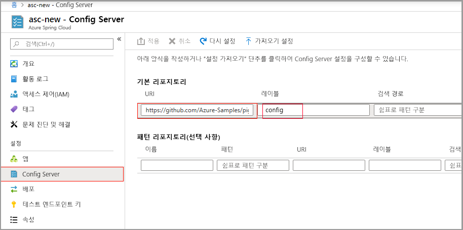

# <a name="quickstart-set-up-azure-spring-cloud-configuration-server"></a>빠른 시작: Azure Spring Cloud 구성 서버 설정

Azure Spring Cloud 구성 서버는 분산 시스템을 위한 중앙 집중식 구성 서비스입니다. 현재 로컬 스토리지, Git 및 Subversion을 지원하는 플러그형 리포지토리 계층을 사용합니다.  마이크로서비스 앱을 Azure Spring Cloud에 배포하도록 구성 서버를 설정합니다.

## <a name="prerequisites"></a>사전 요구 사항

* [JDK 8 설치](https://docs.microsoft.com/java/azure/jdk/?view=azure-java-stable)
* [Azure 구독에 가입](https://azure.microsoft.com/free/)
* (선택 사항) [Azure CLI 버전 2.0.67 이상을 설치](https://docs.microsoft.com/cli/azure/install-azure-cli?view=azure-cli-latest)하고 `az extension add --name spring-cloud` 명령을 사용하여 Azure Spring Cloud 확장을 설치합니다.
* (선택 사항) [Azure Toolkit for IntelliJ를 설치](https://plugins.jetbrains.com/plugin/8053-azure-toolkit-for-intellij/)하고 [로그인](https://docs.microsoft.com/azure/developer/java/toolkit-for-intellij/create-hello-world-web-app#installation-and-sign-in)합니다.

## <a name="azure-spring-cloud-config-server-procedures"></a>Azure Spring Cloud 구성 서버 절차

#### <a name="portal"></a>[포털](#tab/Azure-portal)

다음 절차에서는 Azure Portal을 사용하여 [Piggymetrics 샘플](spring-cloud-quickstart-sample-app-introduction.md)을 배포하는 구성 서버를 설정합니다.

1. 서비스 **개요** 페이지로 이동하여 **구성 서버**를 선택합니다.

2. **기본 리포지토리** 섹션에서 **URI**를 "https://github.com/Azure-Samples/piggymetrics-config"로 설정합니다.

3. **적용**을 선택하여 변경 내용을 저장합니다.

    

#### <a name="cli"></a>[CLI](#tab/Azure-CLI)

다음 절차에서는 Azure CLI를 사용하여 [Piggymetrics 샘플](spring-cloud-quickstart-sample-app-introduction.md)을 배포하도록 구성 서버를 설정합니다.

프로젝트의 git 리포지토리 위치로 구성 서버를 설정합니다.

```azurecli
az spring-cloud config-server git set -n <service instance name> --uri https://github.com/Azure-Samples/piggymetrics-config
```

---

## <a name="next-steps"></a>다음 단계
> [!div class="nextstepaction"]
> [앱 빌드 및 배포](spring-cloud-quickstart-deploy-apps.md)
